# FILSAFAT HUKUM: Catatan Akademis Komprehensif
### *Dari Hukum Kodrat hingga Positivisme, Realisme, dan Neo-Kantianisme*

**Penyusun:** Gratianus Prikasetya | **Tahun:** 2025–2026
**Sumber Utama:** Ratnapala (2009), Hart (1994), Finnis (2011), Fuller (1969), Wacks (2012), Silalahi (2025–2026)

---

> [!ABSTRACT]
> Catatan ini merupakan ekspansi akademis komprehensif dari kuliah Filsafat Hukum yang mencakup aliran-aliran utama teori hukum: (1) Hukum Kodrat (*Natural Law*) dalam varian Aquinas, Finnis, dan Fuller; (2) Positivisme Hukum Klasik melalui Bentham dan Austin; (3) Jurisprudence Historis melalui Savigny; (4) Neopositivisme melalui Hart dan Raz; (5) Realisme Hukum Amerika melalui Holmes; serta (6) Neo-Kantianisme melalui Kelsen dan Radbruch. Setiap bagian mengintegrasikan biografi, konteks historis, argumen filosofis inti, kritik, dan representasi visual.

---

## Daftar Isi

1. [Bagian I — Hukum Kodrat (Natural Law)](#bagian-i)
2. [Bagian II — Thomas Aquinas: Sintesis Terbesar Abad Pertengahan](#bagian-ii)
3. [Bagian III — John Finnis: Revisi Kontemporer Hukum Kodrat](#bagian-iii)
4. [Lon Fuller: Moralitas Internal Hukum](#bagian-iv)
5. [Bagian V — Positivisme Hukum Klasik: Bentham](#bagian-v)
6. [Bagian VI — Jurisprudence Historis: Savigny](#bagian-vi)
7. [Bagian VII — Positivisme Austin](#bagian-vii)
8. [Bagian VIII — Neopositivisme H.L.A. Hart](#bagian-viii)
9. [Bagian IX — Joseph Raz: Soft Positivism dan Otoritas Hukum](#bagian-ix)
10. [Bagian X — Realisme Hukum Amerika (Holmes)](#bagian-x)
11. [Bagian XI — Neo-Kantianisme: Kelsen dan Radbruch](#bagian-xi)
12. [Daftar Pustaka](#daftar-pustaka)

---

# BAGIAN I — HUKUM KODRAT (*NATURAL LAW*) {#bagian-i}

## 1.1 Definisi dan Hakikat Hukum Kodrat

**Hukum Kodrat** (*Natural Law*) adalah suatu teori dalam etika dan filsafat yang menyatakan bahwa manusia memiliki nilai-nilai intrinsik yang mengatur penalaran dan perilaku mereka. Nilai-nilai ini bukan berasal dari konstruksi sosial atau perintah penguasa, melainkan dari sifat dasar (*nature*) manusia itu sendiri — sifat yang oleh para pendukung tradisi ini diyakini sebagai pemberian ilahi atau bagian dari tatanan kosmos yang rasional.

Sebagaimana dirumuskan oleh Ratnapala (2009), teori-teori hukum kodrat adalah teori tentang **hubungan antara hukum kodrat moral dan hukum positif buatan manusia** (*positive human law*). Meskipun teori-teori ini beragam dalam tujuan dan isinya, mereka berbagi satu gagasan sentral: bahwa ada semacam "hukum yang lebih tinggi" (*higher law*) yang bersifat non-manusiawi dan berbasis moralitas, yang dapat dijadikan tolok ukur untuk mengukur validitas moral atau legal dari hukum buatan manusia.

> [!QUOTE]
> "Natural law theories are theories about the relation between the moral natural law and positive human law... they share one central idea: that there is a kind of higher (non-human) 'law', based on morality, against which the moral or legal validity of human law can be measured."
> — Ratnapala, *Jurisprudence* (2009)

Implikasi dari gagasan ini sangat revolusioner: sebuah hukum positif yang bertentangan dengan hukum kodrat tidak hanya bisa dinilai sebagai hukum yang buruk secara moral, tetapi dalam tradisi tertentu (khususnya Aquinas) dapat dinyatakan sebagai **bukan hukum sama sekali** (*lex iniusta non est lex*). Ini adalah perbedaan mendasar dari kaum positivis yang memisahkan validitas hukum dari kandungan moralnya.

---

## 1.2 Pembedaan Konseptual: *Natural Law*, *Law of Nature*, dan *Natural Right*

Ketiga istilah ini sering dicampuradukkan, padahal masing-masing memiliki domain yang berbeda:

| Istilah | Definisi | Domain |
|---|---|---|
| **Law of Nature** (*Hukum Alam*) | Teori ilmiah tentang alam semesta fisik dan cara kerjanya | Ilmu Pengetahuan Alam (Fisika, Kimia, dll.) |
| **Natural Law** (*Hukum Kodrat*) | Sistem prinsip-prinsip moral universal yang mengatur tindakan manusia | Etika & Filsafat Hukum |
| **Natural Right** (*Hak Kodrat*) | Hak-hak yang dimiliki setiap individu berdasarkan kodrat kemanusiaannya | Teori Politik & Hak Asasi Manusia |

**Jus Naturale** dalam pengertian Hobbes adalah kebebasan yang dimiliki setiap manusia untuk menggunakan kekuatannya sendiri sesuai kehendaknya, demi mempertahankan kodratnya — yaitu hidupnya sendiri — dan konsekuensinya, untuk melakukan apa saja yang dalam penilaian dan akal budinya dianggap sebagai sarana yang paling tepat untuk itu. Rumusan Hobbes ini, meskipun berangkat dari premis individualistis yang keras, tetap menempatkan "kodrat manusia" sebagai titik acuan normatif.

Perhatian hukum kodrat adalah dengan **tindakan manusia** (*human actions*). Hukum kodrat meminta pelaku manusia untuk tidak terlibat dalam tindakan-tindakan yang merampas **hak-hak kodrat** (*natural rights*) orang lain. Di jantung semua teori hukum kodrat terletak keyakinan bahwa ada hukum-hukum moral universal yang tidak boleh dilanggar oleh hukum manusia tanpa kehilangan kekuatan legal atau moral-nya.

---

## 1.3 Pandangan Teleologi dalam Hukum Kodrat

**Teleologi** adalah pandangan filsafat yang menyatakan bahwa segala sesuatu terjadi *untuk suatu tujuan* (*telos* = tujuan akhir, dalam bahasa Yunani). Alam bukanlah acak — segala sesuatu tidak terjadi karena kebetulan, tetapi sesuai dengan desain keseluruhan yang koheren.

Pandangan ini memiliki dua implikasi ontologis yang fundamental:

1. **Setiap objek dan bentuk kehidupan, termasuk manusia, memiliki tujuan dalam eksistensinya.** Seekor mata pisau memiliki tujuan untuk memotong; sebuah biji memiliki tujuan untuk tumbuh menjadi pohon; manusia memiliki tujuan untuk... — dan di sinilah perdebatan besar dimulai.

2. **Tidak bisa ada tujuan tanpa ada yang menetapkan tujuan tersebut.** Oleh karena itu, teleologi secara tak terelakkan mengarah pada kesimpulan bahwa alam semesta dan segala isinya berfungsi sesuai dengan **rencana ilahi atau supranatural**. Argumen ini kelak menjadi salah satu dari Lima Jalan pembuktian eksistensi Tuhan menurut Thomas Aquinas (Argumen dari Desain / *Teleological Argument*).

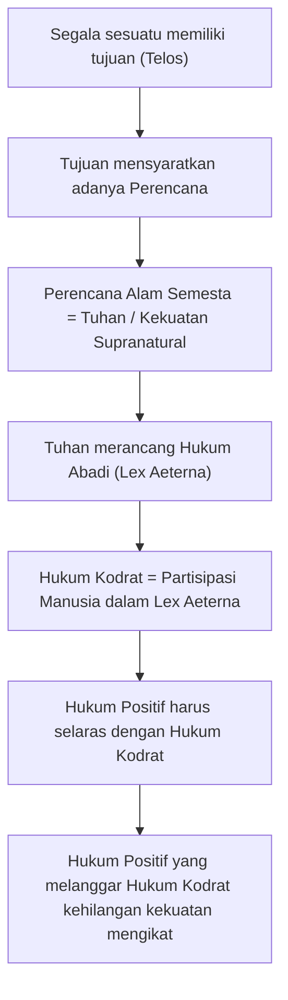

---

## 1.4 Plato dan *The Republic*: Akar Idealisme Hukum

Plato (427–347 SM) merupakan salah satu pelopor pemikiran tentang hukum dan keadilan yang berdasar pada tatanan ideal. Dalam karyanya *The Republic* (*Politeia*), Plato mengajukan konsepsi tentang negara ideal yang terstruktur secara hierarkis berdasarkan kemampuan dan fungsi masing-masing kelompok. Negara yang adil, bagi Plato, adalah negara di mana setiap bagian menjalankan fungsinya dengan benar sesuai kodrat masing-masing — sebuah pandangan yang secara langsung memengaruhi pemikiran Aristoteles dan melaluinya, Thomas Aquinas.

| Kelas Sosial | Fungsi dalam Negara | Keutamaan yang Diperlukan |
|---|---|---|
| **Philosopher King** (*Raja Filsuf*) | Memimpin dan memerintah negara; terlatih untuk memastikan ketertiban dan keadilan | Kebijaksanaan (*Sophia*) |
| **Soldiers** (*Prajurit / Guardian*) | Membela dan melindungi negara | Keberanian (*Andreia*) |
| **Workers** (*Pekerja*) | Memproduksi kebutuhan negara — barang dan jasa | Kesederhanaan (*Sophrosyne*) |

Keadilan (*Dikaiosyne*), menurut Plato, bukan sekadar kebajikan satu individu, melainkan **prinsip harmoni struktural** di mana setiap bagian dari keseluruhan — baik jiwa individu maupun negara — menjalankan fungsi yang memang menjadi kodratnya. Prinsip inilah yang menjadi landasan bagi pemikiran teleologis tentang tujuan negara.

---

## 1.5 Aristoteles: Hukum Kodrat sebagai Nilai Intrinsik

> [!NOTE]
> **Aristoteles** mendefinisikan Hukum Kodrat sebagai:
> *"A theory in ethics and philosophy that says that human beings possess intrinsic values that govern their reasoning and behavior."*
> — Transkripsi kuliah, 2025

**Aristoteles** (384–322 SM), murid Plato dan guru Alexander Agung, membawa teleologi ke tingkat yang lebih sistematis. Dalam karyanya *Nicomachean Ethics* dan *Politics*, Aristoteles berargumen bahwa manusia adalah **zoon politikon** — makhluk politik/sosial secara kodrat. Artinya, hidup dalam komunitas yang terorganisir (polis) bukan sekadar pilihan pragmatis, melainkan adalah **pemenuhan kodrat manusia** itu sendiri.

Dari sini Aristoteles menarik implikasi hukum yang penting: hukum yang baik (*eunomia*) adalah hukum yang memungkinkan manusia menjalani kehidupan yang sesuai dengan kodratnya — yaitu kehidupan yang mengarah pada *eudaimonia* (kebahagiaan sejati / flourishing). Hukum yang tidak mendukung kondisi ini adalah hukum yang cacat secara filosofis.

---

# BAGIAN II — THOMAS AQUINAS: SINTESIS TERBESAR ABAD PERTENGAHAN {#bagian-ii}

## 2.1 Biografi Intelektual Thomas Aquinas (1225–1274)

**Thomas Aquinas** adalah tokoh filsafat dan teologi Kristen terbesar dalam sejarah pemikiran Barat, yang berhasil mensintesiskan filsafat rasional Aristoteles dengan dogma Kristiani. Perjalanan hidupnya mencerminkan perjalanan intelektual abad pertengahan yang kaya:

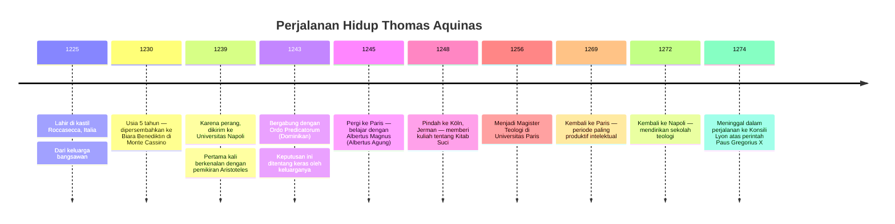

Karya terpentingnya adalah **Summa Theologica** (juga dikenal sebagai *Summa Theologiae*) — sebuah ensiklopedia teologis-filosofis kolosal yang belum selesai pada saat kematiannya. Di dalamnya terdapat risalah tentang hukum (*Treatise on Law*, I-II, QQ.90-108) yang menjadi fondasi teori hukum kodrat Thomistik.

---

## 2.2 Konteks Abad Pertengahan: Sintesis Iman dan Akal

Aquinas hidup dan berpikir dalam konteks abad pertengahan yang ditandai oleh ketegangan antara **teologi Kristiani** yang telah mendominasi pemikiran Eropa selama berabad-abad, dan **filsafat Aristotelian** yang baru-baru itu diterjemahkan kembali ke dalam bahasa Latin melalui karya-karya sarjana Arab seperti Ibnu Rusyd (Averroës) dan Ibnu Sina (Avicenna).

Kontribusi terbesar Aquinas terletak pada keberhasilannya mengintegrasikan dua tradisi yang tampaknya bertentangan ini:

- **Filsafat vs. Teologi:** Perbedaan mendasar antara keduanya terletak pada sikap terhadap *wahyu* (*revelation*). Filsafat mengandalkan pengalaman inderawi, akal budi (*ratio*), dan intuisi. Teologi melakukan hal yang sama, tetapi *ditambah* dengan wahyu ilahi sebagai sumber pengetahuan yang lebih tinggi.

- **Peran Aquinas:** Ia membangun argumentasi bahwa pengalaman, akal budi, dan intuisi *terkait dengan* — dan pada akhirnya mengarah kepada — wahyu. Dengan kata lain, **akal budi tidak bertentangan dengan iman; akal budi adalah jalan menuju iman** (*fides et ratio*).

> [!QUOTE]
> "Love follows knowledge." — Thomas Aquinas
>
> Pernyataan ini mengimplikasikan bahwa kehendak (*will*) dan cinta yang baik hanya mungkin jika didahului oleh pengetahuan (*knowledge*) yang benar tentang yang baik. Ini adalah posisi rasionalis dalam etika teologis: kita tidak bisa mencintai apa yang tidak kita kenal.

Dalam konteks ini, Aquinas memosisikan **filsafat sebagai "pelayan" (*ancilla*) teologi** — sebuah pandangan yang kemudian disebut *philosophia ancilla theologiae*. Namun ini bukan subordinasi yang merendahkan; filsafat tetap memiliki otoritasnya sendiri dalam domain pengetahuan rasional-empiris.

---

## 2.3 Lima Jalan Menemukan Tuhan melalui Akal Budi (*Quinque Viae*)

Aquinas berargumen bahwa keberadaan Tuhan dapat dibuktikan melalui lima argumen rasional. Penting dicatat bahwa ini bukan "bukti" dalam pengertian matematis modern, melainkan **argumen abduktif** — inferensi terbaik menuju penjelasan terbaik:

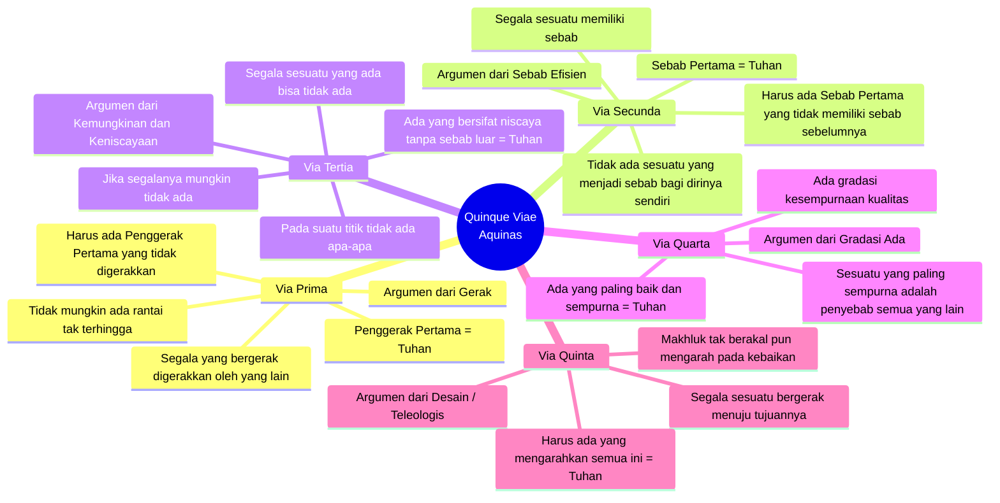

| Via | Nama | Premis Utama | Konklusi |
|---|---|---|---|
| **Prima** | Argumen dari Gerak (*Unmoved Mover*) | Setiap gerak membutuhkan penggerak; rantai tak terhingga tidak mungkin | Harus ada **Penggerak Pertama yang Tidak Digerakkan** |
| **Secunda** | Argumen dari Sebab Efisien | Tidak ada sesuatu yang menjadi sebab bagi dirinya sendiri | Harus ada **Sebab Pertama yang Tidak Disebabkan** |
| **Tertia** | Argumen dari Keniscayaan | Sesuatu yang kontingen (mungkin tidak ada) tidak bisa menjelaskan adanya sesuatu | Harus ada **Wujud Niscaya** (*Necessary Being*) |
| **Quarta** | Argumen dari Gradasi Ada | Gradasi kualitas (baik-lebih baik-terbaik) mensyaratkan standar absolut | Harus ada **Wujud Paling Sempurna** |
| **Quinta** | Argumen Teleologis | Makhluk tak berakal pun bergerak menuju tujuan secara konsisten | Harus ada **Perancana Cerdas** yang mengarahkan alam |

---

## 2.4 Alam Semesta Hukum menurut Aquinas: Empat Tingkat Hukum

Aquinas membangun hierarki hukum yang komprehensif, mencakup empat tingkatan yang saling berhubungan secara logis dan ontologis:

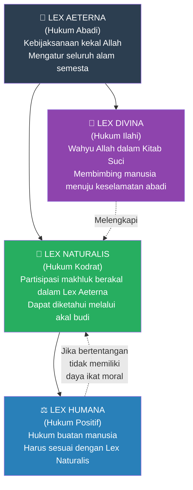

---

### 2.4.1 Lex Aeterna (Hukum Abadi)

**Lex Aeterna** adalah kebijaksanaan kekal Allah sendiri — hukum tertinggi yang hanya ada di dalam pikiran Tuhan dan yang mengatur seluruh alam semesta tanpa pengecualian. Ini bukan hukum yang "diciptakan" dalam pengertian temporal, karena Allah sendiri adalah kekal.

Alam semesta adalah ciptaan Allah yang rasional — karena Allah bersifat rasional secara esensial, alam semesta tidak bisa bersifat acak. Hukum-hukum yang mengatur alam semesta ini dikenal sebagai **hukum abadi**, yang mengendalikan segala sesuatu baik yang bernyawa maupun tidak bernyawa. Semua hal yang tunduk pada hukum ini mendapat dari padanya kecenderungan-kecenderungan tertentu menuju tindakan dan tujuan yang sesuai dengan mereka *(Summa Theologica, I-II, Q93, art. 6)*.

Hukum abadi memiliki **dua cabang utama:**

1. **Hukum-hukum alam fisik** — yang dalam era modern menjadi subjek ilmu-ilmu fisika, biologi, dan ilmu sosial. Inilah hukum-hukum yang menentukan cara alam semesta berfungsi.
2. **Hukum perilaku / hukum moral** — yang membedakan perilaku yang benar dan yang salah bagi makhluk-makhluk berakal budi.

Pertanyaan kritis muncul: Jika setiap orang tunduk pada hukum abadi, mengapa ada pelaku kejahatan? Aquinas menjawab dengan dua aspek:

- **Pertama,** manusia memiliki pengetahuan yang **tidak sempurna** tentang hukum abadi dan karena itu rentan terhadap kesalahan. Selain itu, *prudentia carnis* (kebijaksanaan daging / nafsu) merusak akal dan mengarah pada kejahatan.
- **Kedua,** hukum abadi pada akhirnya **memberikan ganjaran** kepada yang baik dan menghukum yang jahat — "Baik yang terberkati maupun yang terkutuk berada di bawah hukum abadi" *(I-II, Q93, art. 6)*.

> [!NOTE]
> Pertanyaan mengapa Allah tidak memprogram semua manusia untuk memiliki pengetahuan sempurna tentang hukum abadi **tidak dijawab** dalam *Summa Theologica* — ini merupakan salah satu keterbatasan yang diakui dalam sistem Aquinas.

---

### 2.4.2 Lex Divina (Hukum Ilahi)

**Lex Divina** adalah wahyu Allah yang termuat dalam Kitab Suci (Alkitab). Fungsinya berbeda dari Hukum Kodrat: sementara Hukum Kodrat dapat ditemukan melalui akal budi semata, Hukum Ilahi mengandung instruksi spesifik untuk keselamatan manusia yang melampaui kemampuan akal budi murni untuk menemukannya.

Hukum Ilahi diperlukan karena empat alasan menurut Aquinas: (1) untuk membimbing manusia menuju tujuan akhirnya — yaitu kehidupan kekal — yang tidak dapat dicapai melalui akal budi semata; (2) karena penilaian manusia tentang tindakan yang tepat sering kali tidak pasti, terutama dalam hal-hal yang bersifat kontingen; (3) karena manusia tidak hanya perlu mengatur tindakan eksternal tetapi juga gerakan internal jiwa; (4) karena dosa tidak selalu dapat dihukum oleh hukum manusia, maka diperlukan hukum ilahi yang melarang semua dosa.

---

### 2.4.3 Lex Naturalis (Hukum Kodrat)

**Hukum Kodrat** (*Lex Naturalis*) adalah partisipasi makhluk berakal budi dalam Hukum Abadi — cara manusia, dengan menggunakan akal budinya, dapat menangkap dan mengikuti rencana ilahi untuk kehidupan yang baik.

**Beberapa proposisi kunci dalam doktrin Hukum Kodrat Aquinas:**

- **Hukum kodrat menunjuk pada kodrat ciptaan:** Setiap ciptaan memiliki kodrat (*natura*) — yaitu apa yang secara hakiki merupakan realitas dan kekhasan suatu ciptaan. Hukum kodrat mengatur cara ciptaan itu bergerak, hidup, dan berkembang sesuai dengan kodratnya.

- **Makhluk tak berakal budi** hidup menurut kodratnya secara niscaya dan mekanis — mereka *identik* dengan hukum alam. Hewan dan tumbuhan tidak bisa "melanggar" kodratnya dalam pengertian moral karena mereka tidak memiliki kebebasan (*liberum arbitrium*).

- **Manusia adalah kasus yang unik:** Di satu sisi, manusia hidup menurut hukum kodrat (ia perlu makan, berkembang biak, hidup bersama orang lain). Di sisi lain, manusia memiliki **kebebasan** — ia tidak hanya mengikuti faktor alamiah secara mekanis, tetapi mampu bersikap terhadap faktor tersebut.

- **Karena kodrat manusia bersifat terbuka dan tidak pasti,** hukum kodrat tidak bekerja secara niscaya bagi manusia, melainkan lebih sebagai **pernyataan normatif** — dapat dijalankan atau diabaikan. Inilah yang membedakan dimensi moral manusia dari mekanisme alam.

> [!IMPORTANT]
> **Presepe Primer Hukum Kodrat menurut Aquinas:**
> *"Bonum est faciendum et prosequendum et malum vitandum"*
> — Kebaikan harus dilakukan dan dikejar; kejahatan harus dihindari.
> Ini adalah prinsip normatif paling fundamental dalam etika Thomistik.

**Kewajiban moral dasar manusia adalah hidup sesuai dengan kodratnya.** Karena kodrat dapat diketahui dengan akal budi, setiap orang pada dasarnya *seharusnya* mengetahui bagaimana ia harus hidup — tanpa perlu wahyu atau otoritas eksternal. Hidup sesuai kodrat adalah hidup sesuai dengan **martabat manusia** (*dignitas humana*).

Pandangan Aquinas tentang hukum kodrat berjasa dalam **mendamaikan dua tradisi etika** yang sebelumnya tampak berlawanan:
- **Etika Teonom** (*theonomous ethics*): Manusia harus hidup sesuai perintah Tuhan — tetapi tidak menjelaskan *mengapa* perintah itu harus dijalankan.
- **Etika Eudemonisme** (Aristoteles): Manusia harus hidup sesuai kodratnya karena itu yang paling membahagiakan — tetapi tidak menjelaskan *mengapa* itu harus dilakukan.

Aquinas menjembatani keduanya: hidup sesuai kodrat **adalah** hidup sesuai kehendak Tuhan Pencipta; dan tujuan dari perintah Tuhan adalah kebahagiaan manusia itu sendiri (*beate vivere*).

---

### 2.4.4 Lex Humana (Hukum Positif / Hukum Manusia)

**Hukum manusia** (*Lex Humana*) adalah hukum positif buatan manusia — termasuk hukum negara, peraturan perundang-undangan, dan putusan pengadilan. Posisi Aquinas tentang hukum manusia sangat tegas:

- Hukum manusia **harus sesuai** dengan hukum kodrat. Jika tidak, hukum tersebut kehilangan daya ikatnya — tidak perlu ditaati secara moral.
- Eksistensi negara sejalan dengan kodrat manusia sebagai **makhluk sosial** (*animal sociale*) yang membutuhkan "wadah" untuk hidup baik bersama.

**Tujuan Negara = Tujuan Manusia (Tiga Level Kehidupan):**

| Level | Istilah Latin | Makna |
|---|---|---|
| 1 | **Vivere** | Hidup dalam arti tidak mati — kelangsungan hidup biologis dasar |
| 2 | **Bene vivere** | Hidup dengan baik — hidup bermartabat, bermoral, dan bahagia |
| 3 | **Beate vivere** | Kebahagiaan abadi — kehidupan yang berorientasi pada tujuan transenden |

Tujuan negara harus sejalan dengan ketiga tujuan tersebut. Jika tidak, negara harus **dilawan** — sebuah pernyataan yang memiliki implikasi besar bagi teori hak perlawanan terhadap tirani (*right of resistance*).

---

# BAGIAN III — JOHN FINNIS: REVISI KONTEMPORER HUKUM KODRAT {#bagian-iii}

## 3.1 Proyek Filosofis Finnis

**John Finnis** (lahir 1940), seorang filsuf hukum Australia yang mengajar di Oxford dan Notre Dame, menulis karyanya yang paling berpengaruh, *Natural Law and Natural Rights* (1980), sebagai upaya untuk merumuskan kembali teori hukum kodrat dalam kerangka filsafat analitik kontemporer — tanpa mengandalkan argumen teologis atau metafisika supranatural secara langsung.

Finnis berargumen bahwa tujuan Hukum Kodrat adalah memastikan seseorang dapat **hidup yang berharga** (*worthwhile life*) dan "berkembang" (*flourish*) — yaitu untuk menetapkan apa yang "baik" bagi umat manusia. Proyek ini pada dasarnya adalah menjawab pertanyaan Aristotelian: *Apakah yang merupakan kehidupan manusia yang baik?*

---

## 3.2 Kritik Finnis terhadap Aquinas dan Rekonstruksinya

Finnis memulai dengan **menolak lima prekusor primer Aquinas** karena ia menolak aksiom-aksiom yang mendasarinya — terutama ketergantungan Aquinas pada metafisika teleologis Aristotelian dan argumen dari wahyu ilahi. Posisi Finnis lebih bersifat **sekular** meskipun tidak sepenuhnya anti-religius.

Sebagai gantinya, Finnis memperkenalkan **tujuh kebaikan dasar** (*basic goods*) yang bersifat:

- **Self-evident** (terbukti sendiri): Tidak dapat diturunkan dari premis lain; langsung diketahui oleh akal praktis.
- **Universal**: Berlaku bagi semua manusia di semua budaya.
- **Tidak dapat diurutkan hierarkis**: Tidak ada satu kebaikan yang secara inheren lebih tinggi dari yang lain.

| No. | Kebaikan Dasar | Penjelasan |
|---|---|---|
| 1 | **Life** (*Kehidupan*) | Kelangsungan hidup biologis, kesehatan, dan reproduksi |
| 2 | **Knowledge** (*Pengetahuan*) | Kebenaran untuk kepentingannya sendiri; intelektualitas |
| 3 | **Play** (*Hiburan / Permainan*) | Aktivitas yang dinikmati untuk kepentingannya sendiri |
| 4 | **Aesthetic Experience** (*Pengalaman Estetik*) | Apresiasi terhadap keindahan, baik dalam seni maupun alam |
| 5 | **Sociability / Friendship** (*Persahabatan / Interaksi Sosial*) | Hubungan yang bermakna dengan sesama manusia |
| 6 | **Practical Reasonableness** (*Kewajaran Praktis*) | Kemampuan untuk membuat keputusan rasional yang mempengaruhi kehidupan seseorang |
| 7 | **Religion** (*"Agama" / Spiritualitas*) | Pertanyaan tentang makna, tujuan kosmis, dan hubungan dengan yang transenden |

> [!NOTE]
> Finnis menempatkan tanda kutip pada "agama" karena ia memaksudkan kategori yang lebih luas dari agama institusional — yaitu keprihatinan tentang pertanyaan-pertanyaan eksistensial tentang makna dan tujuan hidup, yang tidak harus diekspresikan dalam keyakinan teistik.

---

## 3.3 Konsep Dasar Finnis: *Common Good* dan *Practical Reasonableness*

Konsep dasar yang diperkenalkan oleh Finnis adalah bahwa hukum harus mampu menyediakan **tatanan sosial terbaik** guna merealisasikan **kebaikan bersama** (*common good*). Menurutnya, kebaikan bersama adalah keadaan di mana **semua anggota masyarakat memiliki kesempatan dan sumber daya** untuk mencapai potensi dan kebahagiaan mereka secara penuh.

**Nalar Praktis** (*Practical Reasonableness*) menempati kedudukan istimewa karena ia adalah kebaikan dasar yang sekaligus menjadi *sarana* untuk meraih semua kebaikan dasar lainnya. Finnis membedakan dua jenis penalaran:

- **Penalaran Teoretis** (*Theoretical Reasoning*): Berkaitan dengan apa yang benar secara faktual dan logis; lebih peduli dengan pengetahuan daripada tindakan yang tepat.
- **Penalaran Praktis** (*Practical Reasoning*): Berkaitan dengan apa yang harus dilakukan; bukan hanya mendeskripsikan dunia tetapi mengarahkan tindakan.

Masalah esensial yang dihadapi Finnis adalah: Kebaikan-kebaikan objektif bersifat abstrak, bukan aturan moral konkret. Bahkan jika nilai-nilai objektif (kebaikan-kebaikan dasar) sama di mana-mana dan selalu sama, **aturan-aturan moral berbeda dari tempat ke tempat dan dari waktu ke waktu.** Menurut Finnis, nilai-nilai dasar membentuk *evaluative substratum of moral judgment* atau *premoral principles of natural law*. Hukum kodrat (moral) diturunkan dari nilai-nilai ini melalui kepatuhan terhadap *practical reasonableness*.

**Tentang validitas hukum yang tidak adil:** Finnis menyatakan bahwa hukum tetaplah hukum dan berlaku meskipun tidak adil, namun **tidak ada justifikasi moral untuk menegakkannya**. Pernyataan ini memberikan petunjuk tentang korelasi antara hukum dan etika (dimensi moralitas) yang wajib saling mengisi.

---

# BAGIAN IV — LON FULLER: MORALITAS INTERNAL HUKUM {#bagian-iv}

## 4.1 Konteks Historis: Pengalaman Nazi sebagai Katalis Pemikiran

**Lon Luvois Fuller** (1902–1978) adalah seorang filsuf hukum Amerika yang latar belakang pemikirannya tidak dapat dilepaskan dari trauma intelektual Perang Dunia II. Fuller menyaksikan bagaimana sistem hukum Jerman di bawah rezim Nazi — yang secara teknis formal adalah "hukum yang sah" menurut standar positivisme — digunakan untuk mengesahkan kejahatan paling brutal dalam sejarah manusia.

Beberapa karakteristik sistem politik Jerman di bawah kekuasaan Nazi yang menjadi objek kritik Fuller:

| No. | Patologi Hukum Nazi | Implikasi Teoritis |
|---|---|---|
| 1 | Kebijakan-kebijakan **retroaktif** yang menimbulkan kekerasan | Melanggar prinsip prospektivitas hukum |
| 2 | Penegakan peraturan yang **tidak diketahui publik** | Melanggar prinsip promulgasi / publikasi |
| 3 | **Diskresi tanpa kontrol** berdasarkan "selera" pejabat | Melanggar prinsip konsistensi dan prediktabilitas |
| 4 | **Perintah verbal Hitler** dianggap sebagai dasar kekuasaan untuk membunuh | Melanggar prinsip generalisasi dan formalisasi hukum |
| 5 | **Hukuman ekstra-yudisial** (*extra-judicial punishments*) | Melanggar prinsip kongruensi antara aturan dan tindakan pejabat |
| 6 | **Tidak ada pemisahan kekuasaan** | Melanggar prinsip kelembagaan dasar negara hukum |
| 7 | **Tidak ada kebebasan hakim** dalam memutus perkara | Melanggar independensi yudisial |

---

## 4.2 Teori Fuller tentang Hukum: Tiga Karakteristik Esensial

Fuller menolak dua kubu sekaligus: ia menolak **bentuk-bentuk tradisional teori hukum kodrat** yang mendasarkan hukum manusia pada *universally binding higher law* yang berasal dari Tuhan, sekaligus menolak **positivisme hukum** yang melepaskan hubungan antara hukum dan moralitas. Ia memperkenalkan konsep yang lebih nuansif: **moralitas internal** (*internal morality*) dalam hukum.

Tesis Fuller dapat diringkas dalam tiga karakteristik esensial hukum:

### 4.2.1 Purposive (Bertujuan)

Tujuan abstrak dari hukum adalah memungkinkan individu-individu untuk **berkomunikasi, berkoordinasi, dan saling memahami satu dengan lainnya.** Hukum bukan sekadar instruksi dari atas ke bawah; ia adalah medium koordinasi sosial. Otoritas hukum tidak dapat didasarkan pada hukum itu sendiri, tetapi pada **sikap moral komunitas** (*moral attitudes of the community*) — masyarakat harus secara sukarela mengakui legitimasi sistem hukum.

### 4.2.2 Reciprocal (Timbal-balik)

Hukum tidak dapat dipahami semata-mata sebagai kehendak penguasa jika tujuannya adalah untuk mengoordinasikan masyarakat. Ini adalah **kritik langsung terhadap positivisme hukum** yang menitikberatkan hukum sebagai produk kekuasaan. Fuller berargumen bahwa hukum adalah sistem **kerjasama** (*system of cooperation*), bukan sekadar proyeksi otoritas satu arah. Tujuan hukum mensyaratkan **resiprositas antara penguasa dan warga negara** — penguasa membuat hukum yang jelas dan konsisten, warga negara menaatinya.

### 4.2.3 An Ongoing Enterprise (Proyek yang Berkelanjutan)

Sistem hukum mencapai "tingkat kehukuman" (*degree of law-ness*) yang bervariasi — dari yang sangat baik hingga yang sangat buruk. Pada titik tertentu, tidak lagi masuk akal untuk menyebut sesuatu "hukum" karena ia gagal mencapai tujuan hukum, yaitu memandu perilaku manusia. Seperti halnya dokterin hukum yang tidak dipublikasikan atau yang mensyaratkan hal yang mustahil — sekalipun dibuat dengan itikad baik, hukum seperti itu gagal melakukan pekerjaannya.

---

## 4.3 Dua Dimensi Moralitas Hukum

### A. Moralitas Eksternal (*External Morality*)

Moralitas eksternal hukum merujuk pada **kandungan substantif** aturan-aturan hukum. Hukum mendapatkan kesetiaan (*fidelity*) dari masyarakat melalui kualitas moral umum dari aturan-aturannya. Ini adalah dimensi yang selama ini lebih banyak dibahas dalam teori hukum kodrat tradisional.

### B. Moralitas Internal (*Internal Morality*)

Hukum juga memiliki **moralitas internal** yang muncul dari sifatnya sebagai aktivitas manusia yang bertujuan. Moralitas internal ini **bukan terutama tentang kandungan hukum**, tetapi menyangkut kualitas-kualitas yang harus dimiliki oleh suatu peraturan agar benar-benar menjadi hukum.

Moralitas internal hukum mencakup dua dimensi:
- **Morality of Duty** (*Moralitas Kewajiban*): Kewajiban moral yang fundamental dan esensial — terutama terdiri dari larangan-larangan atau injunksi negatif seperti *"Jangan membunuh," "Jangan mencuri," "Jangan ingkar janji."*
- **Morality of Aspiration** (*Moralitas Aspirasi*): Moralitas perjuangan menuju pencapaian tertinggi yang terbuka bagi manusia — bukan sekadar memenuhi standar minimum, tetapi mengupayakan hukum terbaik yang mungkin.

---

## 4.4 Delapan Cara Gagal Membuat Hukum / Delapan Kebajikan Hukum

Fuller merumuskan **delapan kegagalan yang dapat membuat suatu sistem peraturan gagal menjadi hukum sama sekali.** Setiap kegagalan memiliki "kebajikan" yang menjadi lawannya:

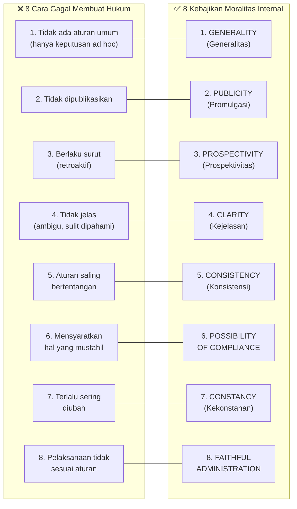

| No. | Kegagalan | Kebajikan Lawannya | Penjelasan |
|---|---|---|---|
| 1 | Tidak ada aturan umum | **Generality** | Hukum harus berlaku secara umum, bukan hanya keputusan ad hoc untuk kasus individual |
| 2 | Tidak dipublikasikan | **Publicity** | Masyarakat harus dapat mengakses dan mengetahui hukum yang mengatur mereka |
| 3 | Berlaku surut (retroaktif) | **Prospectivity** | Hukum seharusnya tidak menghukum tindakan yang dilakukan sebelum hukum itu berlaku |
| 4 | Tidak jelas | **Clarity** | Aturan harus dapat dipahami oleh orang yang terkena aturan tersebut |
| 5 | Saling bertentangan | **Consistency** | Tidak boleh ada dua aturan yang mensyaratkan hal yang saling bertentangan |
| 6 | Mensyaratkan hal mustahil | **Possibility of Compliance** | Hukum tidak bisa menuntut kepatuhan terhadap hal yang secara fisik atau logis mustahil |
| 7 | Terlalu sering berubah | **Constancy** | Hukum harus cukup stabil agar dapat dijadikan pegangan |
| 8 | Pelaksanaan tidak sesuai aturan | **Faithful Administration** | Tindakan pejabat harus sesuai dengan aturan yang telah dinyatakan secara resmi |

---

# BAGIAN V — POSITIVISME HUKUM KLASIK: JEREMY BENTHAM {#bagian-v}

## 5.1 Pengantar: Positivisme sebagai Reaksi terhadap Hukum Kodrat

**Positivisme hukum** merupakan salah satu mazhab hukum yang paling berpengaruh dalam ilmu hukum. Gagasan hukum sebagai ciptaan pembuat hukum manusiawi (*human law giver*) adalah intuisi yang sangat umum. Positivisme berdiri di atas dua pilar utama:

1. **Pembedaan** antara *the law as it is* (hukum sebagaimana adanya) dan *the law as it ought to be* (hukum sebagaimana seharusnya) — yang didasarkan atas alasan-alasan praktis yang baik.
2. **Tidak adanya hubungan konseptual yang niscaya** antara hukum dan moralitas. Hukum tetaplah hukum meskipun melanggar moralitas yang tidak dijadikan hukum.

Positivis hukum menawarkan teori tentang bagaimana kita dapat membedakan hukum "dalam pengertian hukum" dari aturan "dalam pengertian non-hukum." Teori-teori ini umumnya memberikan sifat "hukum" hanya kepada aturan-aturan yang berasal dari otoritas pembuat hukum yang ada sebagai fakta politik atau sosial.

---

## 5.2 Auguste Comte dan Positivisme Ilmu Pengetahuan

Sebelum memahami positivisme hukum, perlu dipahami konteks intelektual yang lebih luas dari positivisme sebagai gerakan epistemologis:

**Auguste Comte** (1798–1857) merupakan pemrakarsa studi sosiologi yang menganggap metode empiris dalam ilmu-ilmu alam merupakan metode yang paling tepat bagi ilmu sosiologi. Ia adalah tokoh pertama yang secara sistematis memperkenalkan konsep **positivisme** dalam ilmu pengetahuan (*empiricism*). Positivisme menjadi antitesis dari pandangan kodrati yang dianut oleh masyarakat sebelum Revolusi Perancis. Comte menolak transendensalisme dan mistisisme, dan mempengaruhi sosiolog-sosiolog selanjutnya seperti Max Weber, Leon Duguit, dan Eugen Ehrlich.

**Hukum Tiga Tahap Comte** (*The Law of Three Stages*) — proposisi bahwa pemikiran manusia dan masyarakat berkembang melalui tiga tahap evolusioner yang berurutan:

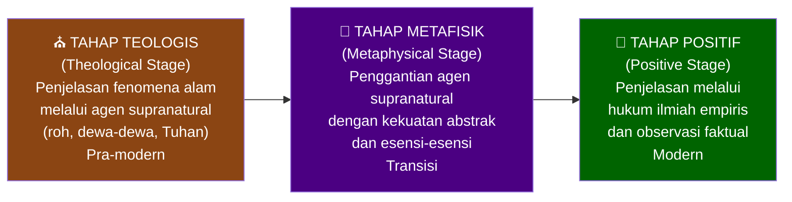

---

## 5.3 Jeremy Bentham (1747–1832): Bapak Utilitarianisme

**Jeremy Bentham** adalah seorang filsuf, juris, dan reformer hukum Inggris. Ia lahir pada tahun 1747 dan meninggal pada tahun 1832. Bentham menyelesaikan pendidikannya di The Queen's College, Oxford. Ia merupakan salah satu tokoh pemikir hukum yang paling berpengaruh, khususnya terkait dengan prinsip individualisme yang menjiwai sistem hukum *common law*.

Buku utamanya adalah ***An Introduction to the Principles of Morals and Legislation*** (1789), yang meletakkan dasar-dasar pemikiran utilitarian dalam hukum dan kebijakan publik.

---

## 5.4 Prinsip Utilitas: "The Greatest Happiness of the Greatest Number"

Prinsip inti utilitarian Bentham adalah bahwa tindakan yang benar adalah tindakan yang **memaksimalkan kebahagiaan bagi jumlah terbesar orang**. Konsep ini, meskipun tampak sederhana, memiliki implikasi yang sangat radikal bagi teori hukum.

Bentham berpendapat bahwa pada hakikatnya kehidupan manusia di tengah masyarakat terdiri dari dua hal: **kebahagiaan** (*pleasure*) dan **penderitaan** (*pain*). Alam telah menempatkan umat manusia di bawah dua penguasa utama: sakit dan kesenangan. Hanya keduanyalah yang dapat menunjukkan apa yang seharusnya kita lakukan.

**Sumber-sumber kebahagiaan menurut Bentham:**

1. **Fisik** (*Physical*): Kesenangan yang bersumber dari kepuasan kebutuhan fisik dan indrawi.
2. **Politik** (*Political*): Kesenangan yang berasal dari keamanan, kebebasan, dan partisipasi dalam kehidupan publik.
3. **Moral** (*Moral*): Kepuasan yang diperoleh dari reputasi yang baik dan hubungan sosial yang harmonis.
4. **Agama** (*Religious*): Kepuasan spiritual dari keyakinan dan praktik keagamaan.

> [!NOTE]
> Bentham **tidak memedulikan** dari mana kesenangan atau kebahagiaan itu datang — yang terpenting adalah apakah keempat hal tersebut membawa konsekuensi kesenangan bagi manusia. Ini adalah posisi **consequentialist** murni: motif di balik pembentukan kebijakan tidak diperhitungkan, hanya konsekuensinya.

---

## 5.5 Kalkulus Kebahagiaan (*Felicific Calculus*)

Nilai kebahagiaan dan penderitaan dari setiap sumber dipengaruhi oleh tujuh faktor (ditambah dua faktor tambahan):

| Faktor | Penjelasan |
|---|---|
| **Intensity** (*Intensitas*) | Seberapa kuat atau kuat kesenangan atau penderitaan tersebut |
| **Duration** (*Durasi*) | Seberapa lama kesenangan atau penderitaan tersebut berlangsung |
| **Certainty** (*Kepastian*) | Seberapa pasti kesenangan atau penderitaan tersebut akan terjadi |
| **Propinquity / Proximity** (*Kedekatan Waktu*) | Seberapa segera atau dekat dalam waktu kesenangan atau penderitaan tersebut akan terjadi |
| **Fecundity** (*Kesuburan*) | Seberapa besar kemungkinan kesenangan tersebut diikuti oleh kesenangan lain; atau penderitaan diikuti oleh penderitaan lain |
| **Purity** (*Kemurnian*) | Seberapa bebas kesenangan tersebut dari campuran penderitaan, atau sebaliknya |
| **Extent** (*Jangkauan*) | Jumlah orang yang terkena dampak oleh kesenangan atau penderitaan tersebut |

Secara formal, Bentham mencoba mengkuantifikasi utilitas total:

$$U = \sum_{i=1}^{n} (P_i - S_i)$$

di mana $U$ adalah total utilitas, $P_i$ adalah kesenangan individu ke-$i$, dan $S_i$ adalah penderitaan individu ke-$i$.

---

## 5.6 Utilitarianisme, Hukum, dan Hukuman

Tujuan dari hukum adalah memberikan **kemanfaatan dan kebahagiaan yang sebesar-besarnya bagi individu** — dengan kata lain, hukum adalah *sarana* untuk mencapai kemanfaatan (*utility*), bukan tujuan itu sendiri. Pandangan Bentham yang difokuskan pada individu dimaksudkan agar tidak terjadi situasi *homo homini lupus* (manusia adalah serigala bagi manusia lain).

Bentham adalah seorang **consequentialism** — yang terpenting baginya adalah konsekuensi dari suatu kebijakan yang dibuat, bukan motif di baliknya.

**Refleksi Kritis terhadap Utilitarianisme:**

| Kritik | Penjelasan |
|---|---|
| **Reduksi Hakikat Manusia** | Konsep *pleasure* dan *pain* dianggap mereduksi manusia hanya menjadi makhluk pengindera — mengabaikan dimensi spiritual, dignitas, dan moralitas intrinsik |
| **Pengukuran Kuantitatif Kebahagiaan** | Kebahagiaan dan penderitaan hanya diukur secara kuantitatif; faktor moral tidak diperhitungkan. Bagaimana mengukur kebahagiaan secara objektif? |
| **Tyranny of the Majority** | Teori ini secara logis dapat membenarkan penindasan minoritas jika hal itu memaksimalkan kebahagiaan mayoritas |
| **Kontribusi Positif** | Teori utilitarian memberi sumbangsih pada **analisis cost-benefit** (*untung-rugi*) dalam proses pembentukan hukum — sebuah metodologi yang sangat berpengaruh dalam kebijakan publik modern |

---

# BAGIAN VI — JURISPRUDENCE HISTORIS: SAVIGNY DAN MAZHAB JERMAN {#bagian-vi}

## 6.1 Perkembangan Pemikiran tentang Ilmu Hukum

Pemikiran tentang hukum sebagai ilmu pengetahuan berkembang melalui dua fase besar:

1. **Practical Jurisprudence → Dogmatik Hukum:** Upaya mensistematisasi hukum sebagai suatu ilmu pengetahuan (*legal science*). Fase ini berfokus pada sistematika dogmatik hukum sebagai keseluruhan ilmu hukum.
2. **Social Scientific Form of Legal Thought** (mulai akhir abad ke-19): Pendekatan yang menempatkan hukum dalam konteks sosial dan historisnya.

---

## 6.2 Pra-Savigny: Leibniz, Wolff, dan Kant

### G.W. Leibniz (1646–1716)
Leibniz meletakkan **dasar metafisika dan logika** bagi pengetahuan hukum. Ia mengembangkan konsep *Law as Rational Order* (harmoni antar-person) dan memandang natural law sebagai **suatu sistem logis** — hukum dapat diturunkan dari prinsip-prinsip rasional serupa dengan matematika dan geometri. Proyek ini dikenal sebagai *Universal Legal Science*.

### Christian Wolff (1679–1754)
Wolff adalah tokoh yang mensistematisasi filsafat rasionalis Leibniz. Ia menyusun sistem deduktif yang komprehensif terkait metafisika, etika, natural law, dan logika. Pemikiran Wolffian mendominasi universitas-universitas Jerman pada pertengahan abad ke-18. Kant belajar dalam tradisi Wolffian sebelum akhirnya mengkritik dan melampaui Wolff.

### Immanuel Kant (1724–1804)
Kant membuat revolusi epistemologis yang berdampak besar pada teori hukum:
- Hukum adalah bagian dari **practical reason** (*akal praktis*), bukan *theoretical reason*.
- Ia memperkenalkan **formal theory of law** dan konsep **legal autonomy**.
- Kant menghancurkan dominasi dasar-dasar metafisika natural law, memuncak pada kesadaran bahwa para sarjana hukum perlu membangun ilmu hukum positif yang bebas dari spekulasi moral atau metafisika.
- Kant membedakan dimensi **ethical** (bersifat internal dalam diri manusia) dan **legal** (berasal dari otoritas eksternal di luar diri manusia, sehingga dapat dipaksakan).
- Hukum dipahami sebagai fenomena historis dan sistematis yang menuntut dua pendekatan: **Geschichte** (sejarah) dan **System** (sistem).

**Istilah Rechtswissenschaft** (*rechtwissenschaft*) yang berarti "ilmu hukum" adalah warisan terminologi yang berkembang pasca-dekonstruksi Kantian terhadap natural law. Para sarjana hukum Jerman awal abad ke-19 menggunakan terminologi ini untuk merujuk pada ilmu hukum positif yang bebas dari spekulasi.

---

## 6.3 Mazhab Historis: Friedrich Carl von Savigny (1779–1861)

**Mazhab Historis** (*The Historical School*) merupakan bagian dari gerakan **Romantisisme** dalam seni dan filsafat — sebuah pemberontakan terhadap rasionalisme empiris Pencerahan. Dalam ilmu hukum, pemberontakan tersebut berupa penolakan terhadap positivisme hukum yang menganggap hukum sebagai *folkways* (kebiasaan rakyat belaka). Mazhab Historis Jerman berargumen bahwa hukum **tidak bersumber dari negara**, melainkan bersumber pada **karakter masyarakat** itu sendiri.

Tokoh utama Mazhab Historis adalah **Friedrich Carl von Savigny** (1779–1861).

---

## 6.4 Doktrin Volksgeist: Jiwa Rakyat sebagai Sumber Hukum

Konsep paling revolusioner Savigny adalah **Volksgeist** (*jiwa rakyat* atau *kesadaran bersama rakyat*):

> *Law was derived from the common consciousness of a people (Volksgeist) who already exist as an 'active personal subject'.*

Dengan kata lain, hukum adalah produk dari suatu masyarakat yang sudah ada. Savigny menolak gagasan bahwa hukum muncul secara tidak disadari sebagai kebiasaan; sebaliknya, hukum **hidup dalam kesadaran bersama** masyarakat, bukan sebagai aturan-aturan yang terpisah, melainkan sebagai *living intuition of law in their organic connection*.

**Tiga tahap perkembangan hukum menurut Savigny:**

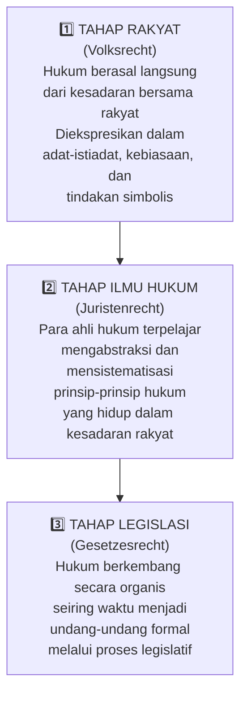

Hukum harus **berakar dari aspek budaya setempat** (*Volksgeist*), namun dengan alur logika dan sistematika yang terorganisasi dengan baik. Metode ini dikenal sebagai **metode historis-sistematis**.

---

## 6.5 Begriffjurisprudenz: Puncak Ilmu Hukum Konseptual

Pemikiran Savigny berkontribusi pada lahirnya dua aliran dalam ilmu hukum Jerman: **Aliran Romanist** dan **Aliran Germanist**. Kedua aliran ini melahirkan ajaran baru yang dikenal sebagai **Begriffjurisprudenz** (*jurisprudensi konseptual*), dengan tokoh utama **Puchta** dan **Jhering**.

Puchta memperkenalkan tiga jenis hukum berdasarkan sumbernya:

| Jenis Hukum | Nama | Sumber |
|---|---|---|
| 1 | **Volksrecht** | Hukum yang memancar secara langsung dari rakyat |
| 2 | **Gesetzesrecht** | Hukum legislatif yang berasal dari pembentuk hukum |
| 3 | **Juristenrecht** | Hukum yang dibuat oleh ahli hukum berdasarkan ilmu hukum |

**Begriffjurisprudenz** setidaknya telah mereduksi hukum dalam analisis **induktif-deduktif**. Kebenaran saintifik serta otoritas *scientific legal rule* tidak tergantung pada dokumen-dokumen sejarah, *practical sense*, atau kemanfaatan sosial, melainkan didasarkan atas **logical connection with the totality of the overall system**. Begriffjurisprudenz menjadi puncak gagasan ilmu hukum karena mampu menampilkan karakteristik ilmu pengetahuan yang jelas dan sistematis.

---

# BAGIAN VII — POSITIVISME HUKUM JOHN AUSTIN {#bagian-vii}

## 7.1 Latar Belakang dan Karya Utama

**John Austin** (1790–1859) adalah tokoh positivisme hukum klasik yang paling berpengaruh di dunia *common law*. Karyanya yang paling penting adalah ***The Province of Jurisprudence Determined*** (1832) — sebuah kompilasi dari 10 seri perkuliahan tentang jurisprudensi yang disampaikan di University of London dalam periode 1829–1833.

Austin, seperti Hobbes dan Bentham sebelumnya, memeluk gagasan **hukum sebagai perintah penguasa** (*law as sovereign command*). Ia mengakui bahwa istilah "hukum" bermakna berbeda bagi orang yang berbeda, tetapi berargumen bahwa kita semua akan lebih baik jika belajar membedakan jenis-jenis hukum yang berbeda.

---

## 7.2 Paradoks Austin: Positivis dengan Simpati terhadap Aquinas

Menariknya, Austin tidak sepenuhnya memisahkan hukum dan moralitas:

- Austin memandang **hukum Tuhan** sebagaimana diwahyukan dalam Kitab Suci sebagai sumber utama aturan moral — dan ia memberikan status *"laws properly so called"* kepada hukum-hukum tersebut.
- Austin berpikir, seperti Aquinas, bahwa ada bagian dari hukum Tuhan yang tidak diwahyukan dan harus ditemukan melalui akal. Karena Tuhan menghendaki kebahagiaan terbesar bagi semua makhluk-Nya, akal membawa kita pada **prinsip utilitas** (selaras dengan Bentham).

Namun dalam praktiknya, Austin memisahkan antara:
- ***Laws properly so called*** (identik dengan konsep hukum positif): Hukum yang dibentuk dan dibuat oleh penguasa bagi "yang dikuasai."
- ***Law improperly so called*** (*law in the figurative sense*): Termasuk aturan rumah tangga, aturan perusahaan, hukum ilmu pengetahuan, dll.

---

## 7.3 Taksonomi Hukum Austin

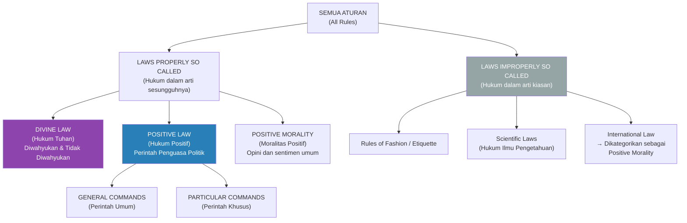

> [!IMPORTANT]
> **Hukum Internasional menurut Austin:** Hukum internasional (*law of nations*) dikategorikan ke dalam **positive morality** — bukan hukum dalam pengertian sesungguhnya — karena tidak mengalir dari kehendak seorang penguasa, melainkan "terdiri dari opini dan sentimen yang berlaku di antara negara-negara." Ini merupakan salah satu implikasi paling kontroversial dari teori Austin.

---

## 7.4 Empat Unsur Hukum Positif Austin

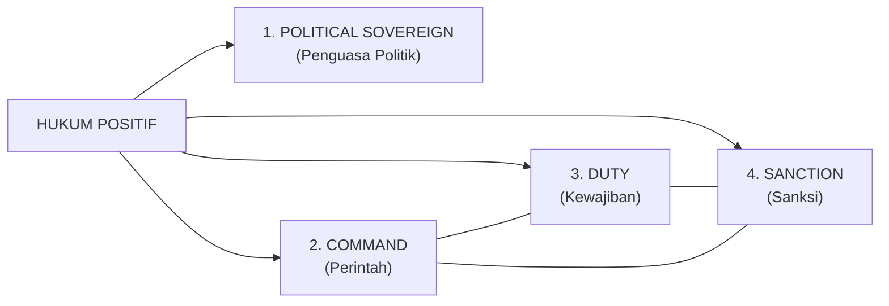

### 7.4.1 Political Sovereign (Penguasa Politik)
Penguasa dalam teori Austin memiliki lima karakteristik yang harus terpenuhi secara kumulatif:

1. Penguasa adalah **superior manusiawi yang determinate** (*a determinate human superior*) — bukan entitas abstrak atau supranatural.
2. **Sebagian besar rakyat secara kebiasaan menaati** penguasa.
3. Penguasa **tidak terbiasa taat** kepada superior manusiawi lainnya.
4. **Kekuasaan penguasa tidak dapat dibatasi secara legal** (*the sovereign's power cannot be legally limited*).
5. **Kedaulatan tidak terbagi** (*sovereignty is indivisible*).

### 7.4.2 Command and Sanction (Perintah dan Sanksi)
Hukum positif menurut Austin dihasilkan oleh perintah penguasa. Sebuah perintah bukan sebuah permintaan, melainkan suatu **imperatif yang menciptakan kewajiban melalui keberadaan sanksi**. Elemen-elemen sebuah command:

1. Suatu **keinginan atau hasrat** yang dikandung oleh makhluk rasional bahwa makhluk rasional lain harus melakukan atau menahan diri dari suatu perbuatan.
2. Suatu **kejahatan/konsekuensi buruk** dalam hal ketidakpatuhan.
3. **Pemberitahuan keinginan** tersebut melalui kata-kata atau tanda-tanda lainnya.

Perintah tidak dapat dipisahkan dari kewajiban dan sanksi — ketiganya adalah aspek dari satu peristiwa tunggal.

---

## 7.5 Tiga Jenis Hukum yang Tidak Imperatif

| No. | Jenis Hukum | Penjelasan |
|---|---|---|
| 1 | **Declaratory Laws** | Hukum yang hanya menyatakan atau menjelaskan hukum yang ada, tanpa menciptakan kewajiban baru |
| 2 | **Laws to Repeal Law** | Hukum yang mencabut hukum lain; bukan perintah imperatif karena menghapus kewajiban, bukan menciptakannya |
| 3 | **Laws of Imperfect Obligation** | Hukum yang tidak disertai sanksi yang memadai untuk memaksakan pelaksanaannya |

---

# BAGIAN VIII — NEOPOSITIVISME H.L.A. HART {#bagian-viii}

## 8.1 Biografi Singkat H.L.A. Hart (1907–1992)

**Herbert Lionel Adolphus Hart** lahir 18 Juli 1907 di Harrogate, Inggris. Ia adalah seorang filsuf hukum analitik yang karya utamanya, ***The Concept of Law*** (1961), mendefinisikan ulang lanskap filsafat hukum abad ke-20. Hart menganalisis hukum sebagai konsep dan menjelaskan hukum berada pada inti **rule of recognition**. Pemikirannya menempatkan positivisme hukum dalam kerangka **hard positivism** dengan memisahkan secara tegas antara hukum dan moral.

---

## 8.2 Kritik Hart terhadap Positivisme Klasik Austin

Hart mengkritisi konsep hukum Austin — sebagai suatu **perintah dari *sovereign commander*** yang kekuasaannya tidak dapat dibatasi oleh apapun — dengan dua argumen utama:

1. **Analogi Perampok:** Bayangkan seorang perampok yang memerintahkan, "Berikan uangmu atau kamu kutembak!" — ini adalah ancaman berbalut imperatif, persis seperti struktur perintah + sanksi milik Austin. Apakah kita mengatakan bahwa perampok memiliki kekuasaan yang memiliki sifat hukum? Tentu tidak. **Bagi Hart, jika seseorang mengikuti hukum hanya karena takut sanksi, maka penguasa tidak lebih dari sekadar perampok yang terorganisir.**

2. **Aspek Internal yang Diabaikan Austin:** Konsep hukum yang ditaati hanya karena ancaman sanksi telah meninggalkan aspek penting dari hukum, yaitu *"the reflective acceptance of the law as binding by the people to whom it is directed."* Hukum bukan hanya faktual (aspek eksternal), tetapi juga mengandung dimensi normativitas internal yang diakui secara sukarela oleh mereka yang tunduk padanya.

---

## 8.3 Aspek Internal dan Eksternal dari Aturan (*Rule*)

Hart membedakan dua perspektif dalam memahami aturan:

| Aspek | Penjelasan | Contoh |
|---|---|---|
| **Aspek Eksternal** (*External Aspect*) | Fakta yang dapat diobservasi dari luar: aturan ini ada dan umumnya diikuti | *Di Arab Saudi ada larangan mengonsumsi minuman beralkohol.* Ini adalah fakta yang dapat dikonfirmasi oleh pengamat luar. |
| **Aspek Internal** (*Internal Aspect*) | Sikap normatif dari dalam: apakah seseorang memiliki *sense of obligation* untuk mengikuti aturan tersebut? | Apakah saya atau orang lain merasa secara normatif terikat oleh larangan tersebut? Ini tidak dapat diobservasi dari luar. |

Contoh konkret: "Saya wajib lapor SPT Pajak tiap tahun, dan saya melakukannya." — Aspek **eksternal**: aturan tersebut adalah fakta. Aspek **internal**: saya memiliki *sense of obligation* untuk melaporkan pajak — bukan semata-mata karena takut sanksi, tetapi karena saya menerima aturan itu sebagai mengikat.

---

## 8.4 Aturan Primer dan Sekunder: Fondasi Sistem Hukum Modern

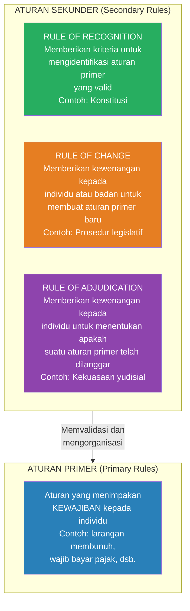

**Aturan Primer** adalah aturan yang menimpakan kewajiban (*obligation*) terhadap orang yang hidup dalam sebuah sistem hukum.

**Aturan Sekunder** adalah aturan tentang aturan — mereka mengatur bagaimana aturan primer dibuat, diidentifikasi, diubah, dan diterapkan. Tanpa adanya aturan sekunder, tidak akan ada sistem hukum sebagaimana dijumpai dalam kehidupan modern.

---

## 8.5 *The Rule of Recognition*: Jantung Teori Hart

**Rule of Recognition** adalah aturan sekunder yang paling fundamental — ia menyediakan **kriteria terakhir** untuk memverifikasi validitas hukum. Ketika parlemen membuat undang-undang dan hakim menemukan bahwa suatu aturan valid menurut *rule of recognition*, mereka tidak sedang mematuhi perintah siapapun dalam pengertian Austin.

Lebih tepatnya, mereka **menerima dan mengamati**, dari sudut pandang internal, efek mengikat dari *rule of recognition*. Sebuah sistem hukum dalam pengertian modern muncul ketika dua kondisi bertemu:

1. Aturan-aturan primer yang dianggap valid oleh *rule of recognition* **secara umum dipatuhi oleh warga negara**.
2. *Rule of recognition* **diterima oleh para pejabat** sebagai standar perilaku resmi.

---

# BAGIAN IX — JOSEPH RAZ: *SOFT POSITIVISM* DAN OTORITAS HUKUM {#bagian-ix}

## 9.1 Biografi Intelektual Joseph Raz (1939–2022)

**Joseph Raz** lahir tanggal 21 Maret 1939. Ayahnya seorang dosen hukum di Universitas Jewish Jerusalem; ibunya, Chaya Mazor Raz, bekerja sebagai jurnalis dan penyair. Raz merupakan anak ketiga dari sembilan bersaudara, dengan latar belakang keluarga yang bertahan hidup di tengah ketidakstabilan politik.

Perjalanan karier akademik Raz:
- 1967–1972: Pengajar di Faculty of Law and Department of Philosophy, Hebrew University, Jerusalem
- 1967: Meraih gelar D.Phil di Oxford dengan disertasi *"Practical Reason and Norms"* di bawah bimbingan H.L.A. Hart
- 1972–1985: Pengajar filsafat di Balliol College, Universitas Oxford
- 1985–2006: **Professor of the Philosophy of Law** di Universitas Oxford
- 2006–2009: Professor of Research di Oxford
- Juga mengajar di Columbia University, New York
- 2 Mei 2022: Meninggal di Rumah Sakit Charing Cross, London, akibat serangan jantung

> [!NOTE]
> Selain berkiprah dalam dunia akademik, Raz juga dikenal sebagai fotografer yang tekun — ia menekuni hobi fotografi selama lebih dari 25 tahun, dengan ciri khas gradasi warna hitam-putih, detail rumit, dan pola asimetris yang mengandung metafora visual mendalam.

---

## 9.2 Kritik Raz terhadap Kelsen: Tanpa *Grundnorm*

Raz tidak setuju dengan proposisi Kelsen tentang *Grundnorm* sebagai dasar validitas sistem hukum. Raz berargumen bahwa **norma dasar tidak memberikan kontribusi apapun pada kriteria identitas dan keanggotaan** suatu sistem hukum.

Menurut Raz, karena semua norma dari suatu tatanan hukum dapat ditelusuri kembali ke konstitusi, berbagai rantai validitas berakhir di sana. Oleh karena itu, **diagram pohon validitas norma dapat tetap ada meskipun norma dasar dihilangkan**. Ia menyatakan bahwa kekuasaan legislatif tidak harus diciptakan oleh hukum, dan bahwa konstitusi pertama adalah hukum karena kita mengetahui bahwa ia termasuk dalam sistem hukum yang efektif.

---

## 9.3 Teori Otoritas Raz: *Service Conception of Authority*

Pemikiran terpenting Raz adalah tentang **otoritas hukum**. Menurut Raz, fungsi utama otoritas adalah untuk memungkinkan individu dapat lebih **menyesuaikan diri dengan alasan yang berlaku bagi individu secara independen** — bukan karena perintah, tetapi karena otoritas tersebut memiliki akses yang lebih baik terhadap alasan-alasan yang ada.

Hukum adalah sebuah **struktur otoritas yang kompleks** karena didasarkan pada sumber otoritas yang memungkinkan otoritas dilaksanakan. Raz juga menegaskan pentingnya membedakan antara **argumen moral** dan **standar moral**:

- Seseorang dapat memasukkan argumen moral ke dalam tahap deliberatif pembentukan aturan.
- Hakim dapat menggunakan standar moral dalam keputusan normatifnya.
- Namun, argumen moral dapat menetapkan apa yang *seharusnya* dipegang oleh lembaga hukum, tetapi **bukan apa yang mereka nyatakan atau pegang**.

---

## 9.4 Hart dan Raz: Pertemuan Dua Pemikiran

Pemikiran Hart dan Raz berada dalam kerangka **Analytical Jurisprudence** yang memandang pengetahuan hukum di era modern tidak seharusnya berkutat hanya pada doktrin atau dogmatik hukum belaka. Keduanya melihat permasalahan memahami hukum sebagai erat dengan **persoalan bahasa** — bahasa diposisikan sebagai bagian dari problem ilmiah. Hukum pada hakikatnya adalah bahasa: aturan bermula dari kesepakatan yang diberlakukan dan mengikat.

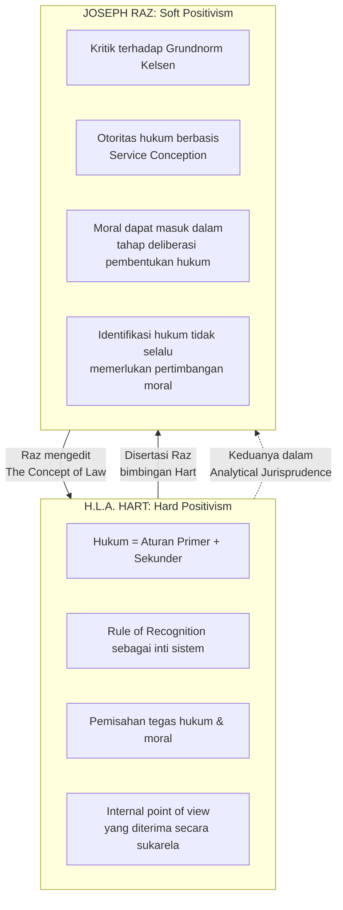

---

# BAGIAN X — REALISME HUKUM AMERIKA: OLIVER WENDELL HOLMES {#bagian-x}

## 10.1 Klaim Dasar Realisme Hukum

**American Legal Realism** adalah gerakan intelektual yang muncul di Amerika Serikat pada awal abad ke-20 sebagai reaksi terhadap formalisme hukum yang mendominasi praktik dan teori hukum saat itu. Klaim dasarnya adalah:

> *"The law in real life is very different from the law stated in the law books."*

Hukum yang nyata, kata kaum Realis, bergantung pada bagaimana **pengadilan banding menafsirkan kata-kata tertulis** dan bagaimana **pengadilan tingkat pertama menentukan fakta** dalam kasus-kasus tertentu.

---

## 10.2 Oliver Wendell Holmes (1841–1935): Bapak Realisme Hukum

**Oliver Wendell Holmes Jr.** adalah hakim Mahkamah Agung Amerika Serikat yang paling berpengaruh sekaligus filsuf hukum terkemuka. Pemikirannya dirumuskan paling tajam dalam esainya yang terkenal, ***"The Path of the Law"*** (1897). Empat proposisi utama pemikirannya:

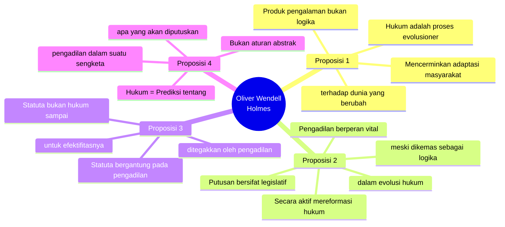

---

## 10.3 Kritik Holmes terhadap Austin

Holmes mengkritisi teori Austin yang menyatakan bahwa hukum merupakan perintah yang dibuat oleh penguasa politik. Holmes mengamati bahwa **hukum dapat eksis secara independen dari dan bahkan dalam oposisi terhadap kehendak penguasa.** Ia menulis bahwa "badan-badan lain yang bukan penguasa, bahkan opini, mungkin menghasilkan hukum dalam pengertian filosofis melawan kehendak penguasa."

Holmes juga menolak pandangan Austin bahwa kebiasaan dan *common law* menjadi hukum saat pengadilan mendapatkan kekuasaan dari penguasa politik — ini menurutnya adalah **fiksi**. Menurutnya, **kebiasaan (*custom*) telah memiliki fungsi mengatur sebelum pengadilan diminta untuk mengakuinya sebagai hukum.**

---

## 10.4 Peran Lembaga Peradilan: Pembuat Hukum yang Terselubung

Holmes berargumen bahwa hakim hendaknya mengakui kewajiban mereka yang tak terhindarkan untuk menimbang *"considerations of social advantage"* dalam menyatakan hukum. Holmes percaya bahwa para hakim melakukan ini dalam kenyataan, sering kali secara tidak sadar. Fondasi nyata dari putusan dibiarkan tidak terungkap karena hakim tidak suka mendiskusikan kebijakan dan membungkus keputusan mereka dalam bahasa logika.

**Hukum sebagai Prediksi:** Holmes membuat klaim luar biasa bahwa hukum hanya terdiri dari prediksi tentang apa yang akan dilakukan pengadilan dalam kasus-kasus tertentu: *"The primary rights and duties with which jurisprudence busies itself again are nothing but prophecies"* (1897, hlm. 458). Prediksi-prediksi ini tersebar di buku-buku undang-undang dan laporan hukum; tugas pengacara adalah menggeneralisasinya dan mereduksinya ke dalam sistem yang dapat dikelola.

---

## 10.5 Analogi "Manusia Jahat" (*Bad Man Analogy*)

Dalam "The Path of the Law," Holmes memperkenalkan analogi terkenal yang disebut **"bad man analogy"**:

Jika hukum hanyalah prediksi tentang apa yang akan dilakukan pengadilan, maka cara terbaik untuk memahaminya adalah melalui kacamata seorang **manusia jahat** (*bad man*) yang hanya peduli dengan konsekuensi material dari tindakannya, bukan perintah moral hati nurani. Dari perspektif egois ini, pertanyaan hukum direduksi sepenuhnya menjadi **kalkulasi risiko pelanggaran** — seperti berapa tahun penjara yang mungkin dijatuhkan untuk suatu kejahatan, atau bagaimana cara berhasil menipu seorang pemberi kerja.

**Kritik terhadap analogi Holmes** (terutama oleh H.L.A. Hart):

> [!NOTE]
> Pandangan manusia jahat terlalu sempit untuk mendefinisikan hukum secara keseluruhan. Hukum bukan hanya tentang penghukuman atas kesalahan; ia juga menyediakan **kerangka untuk tindakan sukarela yang positif**, seperti mendirikan yayasan amal, menyusun surat wasiat, atau membentuk perusahaan. Hukum beroperasi seperti permainan di mana pemain secara sukarela mengikuti aturan untuk keuntungan bersama jauh sebelum wasit pun dibutuhkan untuk menegakkannya. Pandangan sinis manusia jahat sepenuhnya gagal menangkap kehidupan hukum yang semarak di luar ruang pengadilan.

| Aspek | Perspektif Holmes (*Bad Man*) | Kritik Hart |
|---|---|---|
| Definisi Hukum | Prediksi tentang putusan pengadilan | Terlalu sempit — mengabaikan hukum sebagai medium koordinasi sukarela |
| Fungsi Hukum | Hanya penghukuman atas pelanggaran | Hukum juga memungkinkan kontrak, waris, korporasi, dll. |
| Sudut Pandang | Orang yang takut pada sanksi | Gagal menangkap *internal point of view* orang yang menerima hukum sebagai mengikat |
| Nilai Analitis | Mengungkap fungsi penegakan hukum | Tidak representatif bagi sebagian besar interaksi hukum |

---

# BAGIAN XI — NEO-KANTIANISME: KELSEN DAN RADBRUCH {#bagian-xi}

## 11.1 Konteks Intelektual: Neo-Kantianisme sebagai Gerakan

**Neo-Kantianisme** adalah kebangkitan dan pengembangan filsafat Immanuel Kant dalam abad ke-19 dan ke-20 di Jerman. Gerakan ini muncul di Jerman akhir abad ke-19 dan secara langsung memengaruhi pemikir-pemikir hukum seperti Hans Kelsen dan Gustav Radbruch. Tiga ciri khas Neo-Kantianisme dalam teori hukum:

1. **Pemisahan *Sollen* dan *Sein*:** Pemisahan antara dunia "seharusnya" (*ought*) dan dunia "adalah" (*is*) — antara norma dan fakta.
2. **Penekanan pada fondasi normatif dan *a priori*** dari pengetahuan, termasuk penalaran hukum.
3. **Pengaruh pada positivisme hukum** dan pendekatan formalis terhadap hukum.

---

## 11.2 Hans Kelsen (1881–1973): Teori Hukum Murni

### 11.2.1 Biografi dan Konteks Historis

Hans Kelsen memainkan **peran kunci dalam merancang Konstitusi Austria (1920)** dan kemudian menjabat sebagai hakim di Mahkamah Konstitusi Austria. Namun, karena anti-Semitisme dan gejolak politik Nazi, ia terpaksa beremigrasi — mengajar di Jerman, Swiss, dan akhirnya Amerika Serikat.

**Instabilitas Republik Weimar dan bangkitnya totalitarisme** secara langsung memengaruhi penekanan Kelsen pada legalitas dan depolitisasi hukum. Teorinya merespons penyalahgunaan hukum untuk tujuan otoriter. Pengasingannya membentuk keyakinannya pada universalitas hukum dan prinsip-prinsip transnasional.

**Karya Utama:**
1. ***General Theory of Law and State*** (1945)
2. ***Pure Theory of Law*** (*Reine Rechtslehre*, 1934; edisi kedua 1960)

### 11.2.2 *Pure Theory of Law* (1934): Pemurnian Ilmu Hukum

Tujuan utama Kelsen adalah **memurnikan ilmu hukum dari elemen-elemen politik, sosiologis, dan moral**. Ilmu hukum harus bersifat murni — *rein* — dalam pengertian metodologis:

- Hukum adalah sistem pernyataan **"seharusnya" (*Sollen*)**, bukan pernyataan "adalah" (*Sein*).
- Norma-norma mengatur perilaku dan **valid jika diotorisasi oleh norma yang lebih tinggi**.
- Nilai moral tidak relevan terhadap validitas hukum — Teori Murni berfokus pada struktur, bukan kandungan.

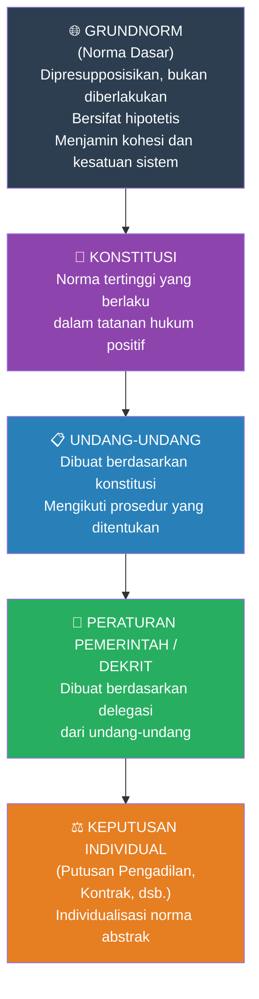

### 11.2.3 *Grundnorm* (Norma Dasar)

**Grundnorm** adalah norma dasar hipotetis yang memvalidasi semua norma lain dalam sistem hukum. Ia **tidak diberlakukan, melainkan dipresupposisikan** oleh ilmu hukum. Fungsinya adalah memastikan koherensi dan kesatuan tatanan hukum.

Konstitusi itu sendiri adalah fakta. Norma-norma konstitusional adalah makna yang diberikan oleh ilmuwan hukum kepada konstitusi. Ilmuwan hukum memberikan kekuatan normatif kepada aturan-aturan konstitusi hanya karena norma yang lebih tinggi memberikan validitas kepada mereka — norma yang lebih tinggi itulah Grundnorm.

**Kritik Raz terhadap Grundnorm:** Raz berpendapat bahwa Grundnorm "tidak memberikan kontribusi apapun pada kriteria identitas dan keanggotaan" sistem hukum. Diagram pohon validitas norma tetap dapat dipertahankan meskipun Grundnorm dihilangkan dari sana.

### 11.2.4 Negara dan Kedaulatan dalam Kerangka Kelsen

- **Negara diidentifikasi dengan tatanan hukum itu sendiri** — negara bukan entitas fisik yang terpisah, melainkan adalah tatanan normatif itu sendiri.
- **Kedaulatan** bukan tentang kekuasaan yang tidak terbatas, tetapi tentang **penciptaan norma** (*norm creation*).
- Negara dan hukum secara konseptual tidak terpisahkan dalam kerangka Kelsen.

---

## 11.3 Gustav Radbruch (1878–1949): Formula Keadilan dan Positivisme yang Dikoreksi

### 11.3.1 Biografi dan Transformasi Intelektual

**Gustav Radbruch** adalah filsuf hukum Jerman sekaligus mantan Menteri Kehakiman Jerman pada era Republik Weimar. Ia hidup melewati empat era yang dramatis: Kekaisaran Jerman, Republik Weimar, era Nazi, dan rekonstruksi pasca-perang.

**Fase Pra-WWII (Positivisme Awal):**
- Awalnya seorang positivis hukum: Hukum adalah valid jika diberlakukan oleh otoritas yang tepat, **apapun kandungannya**.
- Meyakini bahwa **kepastian hukum** (*Rechtssicherheit*) adalah kunci keadilan.
- Mengadvokasi pemisahan tegas antara hukum dan moralitas.

**Fase Pasca-WWII (Transformasi Radikal):**
Merespons kekejaman Nazi dan penyalahgunaan formalisme hukum, Radbruch melakukan **transformasi intelektual** yang dramatis. Pengalamannya menyaksikan bagaimana hukum-hukum Nazi yang secara formal "sah" mengesahkan Holocaust memaksanya untuk merevisi pandangannya secara fundamental.

---

### 11.3.2 Formula Radbruch (*Radbruch Formula*)

> ***"Where statutory law reaches an intolerable level of injustice, it must yield to justice."***
>
> — Gustav Radbruch, *Gesetzliches Unrecht und übergesetzliches Recht* (1946)

Lebih tepatnya, Formula Radbruch menyatakan bahwa **ketidakadilan yang ekstrem bukan merupakan hukum** (*lex iniustissima non est lex*) — bahkan jika ia diberlakukan secara legal. Ini adalah pembalikan radikal dari positivisme awalnya.

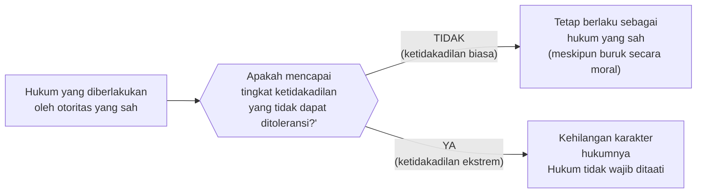

---

### 11.3.3 Tiga Elemen Hukum: Konsep Tripartit Radbruch

Radbruch berargumen bahwa sistem hukum yang baik harus **menyeimbangkan tiga elemen** yang saling bersinergi dan kadang-kadang saling bertenangan:

| Elemen | Istilah Jerman | Penjelasan | Ancaman Jika Diabaikan |
|---|---|---|---|
| **Kepastian Hukum** | *Rechtssicherheit* | Hukum harus dapat diprediksi dan konsisten; orang harus tahu apa yang diizinkan dan dilarang | Chaos, ketidakpastian, kearbitrarian |
| **Keadilan** | *Gerechtigkeit* | Hukum harus memperlakukan kasus yang serupa secara serupa; berdasarkan persamaan dan martabat manusia | Penindasan, diskriminasi, tirani |
| **Kegunaan / Tujuan** | *Zweckmäßigkeit* | Hukum harus melayani tujuan sosial yang berguna; efektif dalam mencapai tujuannya | Hukum yang tidak efektif atau kontraproduktif |

> [!IMPORTANT]
> Urutan prioritas menurut Radbruch (pasca-WWII): **Keadilan** > Kepastian Hukum > Kegunaan. Ketika kepastian hukum berbenturan secara ekstrem dengan keadilan (sebagaimana terjadi di bawah rezim Nazi), **keadilan harus menang**.

---

### 11.3.4 Warisan Radbruch

Formula Radbruch memiliki dampak yang sangat besar, terutama:

1. **Mempengaruhi konstitusionalisme Jerman pasca-perang:** Grundgesetz (Konstitusi Jerman 1949) sangat dipengaruhi oleh pemikiran bahwa ada batas-batas moral yang tidak boleh dilanggar oleh hukum positif.
2. **Digunakan dalam pengadilan pasca-perang:** Formula ini digunakan untuk mengevaluasi apakah hukum-hukum Nazi dapat dianggap mengikat secara hukum.
3. **Penting dalam debat tentang batas moral positivisme hukum:** Formula Radbruch menjadi titik rujukan utama dalam perdebatan antara positivisme (Hart) dan anti-positivisme (Fuller, Dworkin, dll.).

---

## 11.4 Perbandingan Kelsen dan Radbruch: Dua Respons Neo-Kantian terhadap Hukum

| Dimensi | Hans Kelsen | Gustav Radbruch |
|---|---|---|
| **Pendekatan Metodologis** | Pemisahan total antara hukum dan moral; kemurnian metodologis | Integrasi hukum dan moral dalam kondisi ekstrem (*Formula Radbruch*) |
| **Validitas Hukum** | Berdasarkan prosedur dan norma yang lebih tinggi; Grundnorm | Berdasarkan prosedur, tetapi hukum yang sangat tidak adil kehilangan validitasnya |
| **Respons terhadap Nazi** | Teori Murni dimaksudkan untuk mencegah penggunaan hukum sebagai alat ideologi | Formula Radbruch secara eksplisit memberikan alat untuk membatalkan hukum Nazi yang tidak adil |
| **Pengaruh** | Positivisme hukum, yurisprudensi konstitusional, dan hukum internasional | Konstitusionalisme Jerman, keadilan transisional, teori hak asasi manusia |
| **Neo-Kantian** | Menekankan *Sollen* vs *Sein*; hukum sebagai sistem normatif yang otonom | Menekankan nilai-nilai yang *a priori* dari keadilan sebagai batas hukum positif |

---

# RINGKASAN KOMPREHENSIF: PETA TEORI HUKUM

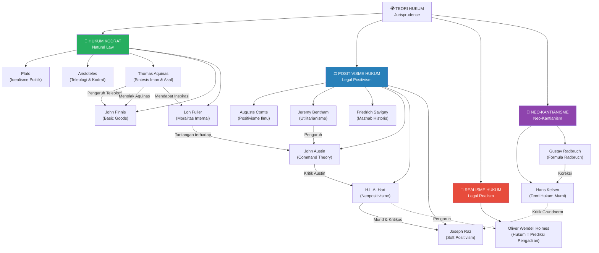

---

# DAFTAR PUSTAKA {#daftar-pustaka}

**Sumber Primer:**

| Penulis | Judul | Penerbit | Tahun |
|---|---|---|---|
| Aquinas, Thomas | *Summa Theologica* (vols. 1–3) | Benziger Bros | 1947 |
| Austin, John | *The Province of Jurisprudence Determined* | John Murray | 1832 |
| Bentham, Jeremy | *An Introduction to the Principles of Morals and Legislation* | T. Payne | 1789 |
| Finnis, John | *Natural Law and Natural Rights* (2nd ed.) | Oxford University Press | 2011 |
| Fuller, Lon L. | *The Morality of Law* (rev. ed.) | Yale University Press | 1969 |
| Hart, H.L.A. | *The Concept of Law* (3rd ed.) | Oxford: Clarendon Press | 1994 |
| Holmes, Oliver Wendell | "The Path of the Law" | *Harvard Law Review* 10:457 | 1897 |
| Kelsen, Hans | *Pure Theory of Law* | University of California Press | 1967 |
| Kelsen, Hans | *General Theory of Law and State* | Harvard University Press | 1945 |
| Radbruch, Gustav | "Gesetzliches Unrecht und übergesetzliches Recht" | *Süddeutsche Juristen-Zeitung* 1(5):105–108 | 1946 |
| Raz, Joseph | *Practical Reason and Norms* | Oxford University Press | 1979 |
| Raz, Joseph | *The Authority of Law* (2nd ed.) | Oxford University Press | 2009 |
| Raz, Joseph | *Between Authority and Interpretation* | Oxford University Press | — |
| Raz, Joseph | *From Normativity to Responsibility* | Oxford University Press | 2011 |

**Sumber Sekunder:**

| Penulis | Judul | Penerbit | Tahun |
|---|---|---|---|
| Huijbers, Theo | *Filsafat Hukum dalam Lintasan Sejarah* | Yogyakarta: Kanisius | 1997 |
| Manullang, E. Fernando M. | *Norma Hanyalah Makna Grundnorm Malah Seperti Tuhan* | Klaten: Nasmedia | 2024 |
| Ratnapala, Suri | *Jurisprudence* | Cambridge University Press | 2009 |
| Wacks, Raymond | *Understanding Jurisprudence: An Introduction to Legal Theory* | Oxford University Press | 2012 |

**Artikel Jurnal:**

- Silalahi, Artha Debora. "Rethinking Constitutional Interpretation through Joseph Raz's Analytical Jurisprudence." *Constitutional Review* Vol.11 No.1 (May 2025): 233–268. DOI: 10.31078/consrev1118.
- Silalahi, Artha Debora, et al. "From Authority to Justification: The Epistemological Foundations of Joseph Raz's Legal Philosophy." *Jurnal Filsafat* Vol.35 No.1-2 (2025): 228–253. DOI: 10.22146/jf.105256.
- Silalahi, Artha Debora. "Criticising the Political System and the Normativity Foundations Through Joseph Raz's Legal and Philosophical Thought." *Mimbar Hukum UGM* Vol.37 No.1 (2025): 55–82. DOI: 10.22146/mh.v37i1.20234.
- Silalahi, Artha Debora, et al. "Exploring the Ontological Basis of Law: Joseph Raz's Views on Normativity Within The Framework of Legal Realism." *International Review of Humanities Studies* Vol.10 No.1 (January 2025): 200–208. DOI: 10.7454/irhs.v10i1.1374.

---

> [!ABSTRACT]
> **Catatan Penutup:** Dokumen ini merupakan ekspansi akademis komprehensif dari catatan kuliah asli. Setiap bagian telah diperluas dengan konteks historis, argumen filosofis yang mendalam, kritik lintas-teori, tabel perbandingan, dan diagram Mermaid.js yang merepresentasikan struktur konseptual yang sebelumnya hanya berupa daftar singkat. Diagram-diagram yang terdapat dalam sumber asli (Figure 5.1, 5.2, 2.3, 2.4) telah direkonstruksi sebagai diagram Mermaid.js fungsional berdasarkan konteks dan deskripsi yang tersedia dalam teks.
