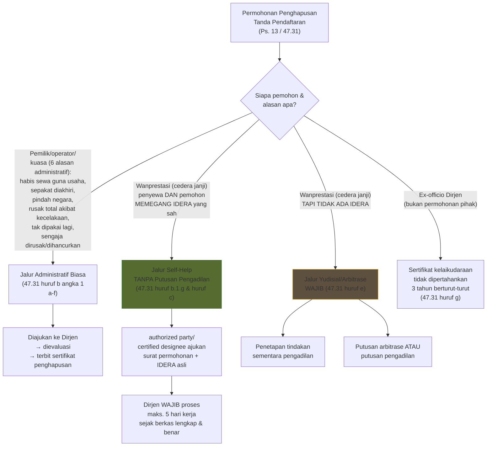
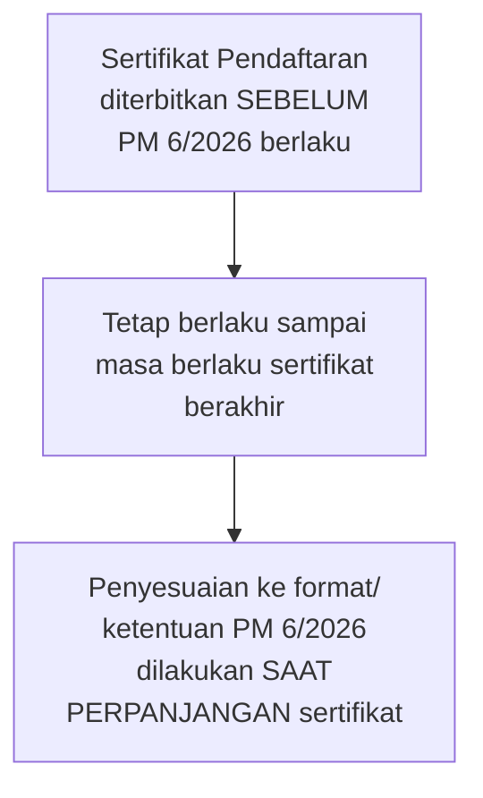

# Perbandingan Komprehensif: PKPS Bagian 47 — Pendaftaran Pesawat Udara

> [!info] Objek Perbandingan
> 1. **PM 52 Tahun 2018** — Peraturan awal (menggantikan KM 49/2009 & KM 82/2004), format: batang tubuh pendek (5 pasal) + **Lampiran** normatif (PKPS 47).
> 2. **PM 26 Tahun 2021** — **Peraturan Perubahan** (bukan pencabutan total) atas PM 52/2018, mengubah sebagian isi Lampiran, dilatarbelakangi Pasal 16 PP 32/2021.
> 3. **PM 6 Tahun 2026** — Peraturan **pengganti total**, format berubah menjadi batang tubuh substantif (19 pasal) + Lampiran, **mencabut PM 52/2018 dan PM 26/2021 sekaligus**.

---

## 1. Peta Riwayat & Status Regulasi

```mermaid
graph TD
    KM49["KM 49/2009<br>+ KM 82/2004"] -->|dicabut oleh Ps. 4| PM52["PM 52/2018<br>(Peraturan Induk)"]
    PM52 -->|diubah sebagian oleh Ps. I| PM26["PM 26/2021<br>(Peraturan Perubahan)"]
    PM52 -->|dicabut oleh Ps. 18 huruf a| PM6["PM 6/2026<br>(Peraturan Pengganti Total)"]
    PM26 -->|dicabut oleh Ps. 18 huruf b| PM6
    PM6 -->|berlaku sejak| Now["21 Juli 2026<br>(tanggal diundangkan)"]

    style PM52 fill:#556b2f,stroke:#b8860b
    style PM26 fill:#003153,stroke:#4169e1
    style PM6 fill:#5e503f,stroke:#2e7d32
```

> [!danger] Yang Benar-Benar Hilang (Dicabut Total)
> Pasal 18 PM 6/2026 secara eksplisit mencabut **kedua-duanya**:
> - PM 52 Tahun 2018 (BN 2018 No. 779)
> - PM 26 Tahun 2021 (BN 2021 No. 562)
>
> Ini **berbeda karakter** dengan PM 26/2021, yang dulunya **hanya mengubah** sebagian pasal dalam Lampiran PM 52/2018 (Pasal I: *"beberapa ketentuan... diubah"*) — bukan pencabutan total. PM 6/2026 mengembalikan pola "peraturan pengganti" (seperti PM 52/2018 dulu mencabut KM 49/2009 & KM 82/2004), bukan pola "peraturan perubahan".

---

## 2. Ikhtisar Struktural

| Aspek | PM 52/2018 | PM 26/2021 | PM 6/2026 |
|---|---|---|---|
| Jenis peraturan | Induk (baru) | **Perubahan** atas PM 52/2018 | **Pengganti total** |
| Format batang tubuh | 5 pasal singkat | 2 pasal (pengubah saja) | **19 pasal substantif** (Ps. 1–19) + Lampiran |
| Dasar hukum utama | Ps. 30 UU 1/2009 | Ps. 16 PP 32/2021 | Ps. 16 PP 32/2021 + ICAO Annex 7 |
| Jumlah Sub Bagian Lampiran | A–E (5) | A–E (mengubah C & E) | A–E (5, dengan penomoran butir baru) |
| Ketentuan Peralihan | tidak ada | tidak ada | **ada** (Pasal 17 — Bab III) |
| Format sertifikat | 1 format | 1 format (tidak diubah) | **2 format transisi** (berlaku s.d. 25 Nov 2026 & mulai 26 Nov 2026) |
| Penandatangan Menteri | Budi Karya Sumadi | Budi Karya Sumadi | Dudy Purwagandhi |

---

## 3. Klarifikasi: Apakah Deregistrasi Sekarang Wajib Pakai Putusan Pengadilan?

> [!important] Koreksi atas Asumsi — Tidak Sepenuhnya Benar
> **Jalur deregistrasi "self-help" tanpa putusan pengadilan MASIH DIPERTAHANKAN di PM 6/2026** — bahkan sejak PM 52/2018 dan PM 26/2021, ini **konsisten** ada. Rezim ini adalah implementasi *Alternative A* Cape Town Convention/Aircraft Protocol (mekanisme IDERA — *irrevocable de-registration and export request authorization*), yang justru **tujuannya** menghindari birokrasi peradilan bagi kreditur pemegang IDERA yang sah.
>
> **Putusan pengadilan (atau arbitrase) baru diwajibkan** untuk jalur yang **berbeda**: yaitu ketika terjadi wanprestasi **namun IDERA tidak tersedia**. Pola dua-jalur ini sebenarnya **sudah muncul sejak PM 26/2021** (huruf c & d), dan di PM 6/2026 hanya **dipertegas & direstrukturisasi ulang** menjadi satu ayat tersendiri (huruf e), bukan ketentuan yang benar-benar baru.

### 3.1 Peta Jalur Deregistrasi (Rezim PM 6/2026 — Pasal 13 jo. 47.31)

### 3.2 Evolusi Ketentuan "Wanprestasi Tanpa Putusan Pengadilan" Lintas 3 Regulasi

| Regulasi | Rujukan | Bunyi inti |
|---|---|---|
| **PM 52/2018** | 47.47 huruf a angka 1 huruf g | *"terjadi cedera janji (wanprestasi) oleh penyewa pesawat udara **tanpa putusan pengadilan**"* — jalur ini sudah ada sejak awal, dikaitkan dengan IDERA (butir 47.101). Belum ada jalur eksplisit "pengadilan/arbitrase" sebagai alternatif ketika tak ada IDERA. |
| **PM 26/2021** | 47.47 huruf b–d | Frasa **"tanpa putusan pengadilan"** dipertahankan persis untuk pemegang IDERA (huruf b). **Baru ditambahkan**: huruf c (permohonan kreditur kepentingan internasional dengan **penetapan tindakan sementara dari pengadilan**) dan huruf d (pihak yang menang **putusan arbitrase/pengadilan** atas wanprestasi). |
| **PM 6/2026** | Pasal 13 huruf a angka 7; 47.31 huruf b.1.g, c, dan e | Frasa **"tanpa putusan pengadilan"** tetap dipertahankan verbatim untuk pemegang IDERA. Jalur pengadilan/arbitrase (dari PM 26/2021 huruf c–d) **dipertahankan dan disatukan** dalam huruf e, dengan penegasan tambahan **berlaku untuk lingkup nasional maupun internasional** (huruf f) — sebelumnya di PM 26/2021 tidak ditegaskan cakupannya. |

> [!success] Kesimpulan Ringkas
> - Jalur **self-help tanpa putusan pengadilan** (berbasis IDERA) → **tidak berubah** dari 2018 sampai 2026, hanya redaksi & letak butir yang direstrukturisasi.
> - Jalur **berbasis putusan pengadilan/arbitrase** → **bukan hal baru di 2026**, melainkan sudah diperkenalkan di **PM 26/2021**. PM 6/2026 hanya menegaskan cakupannya (nasional & internasional) secara lebih eksplisit.
> - Jadi klaim "rezim sekarang butuh putusan pengadilan" **hanya benar untuk kasus tanpa IDERA**, bukan berlaku umum.

---

## 4. Perbandingan Ketentuan per Topik

### 4.1 Ruang Lingkup, Definisi & Klasifikasi

| Topik | PM 52/2018 | PM 26/2021 | PM 6/2026 |
|---|---|---|---|
| Cakupan objek | Pesawat udara berawak | + pesawat udara **tanpa awak berbobot >25 kg** atau untuk angkutan udara (Ps. 1 huruf b baru) | Cakupan tanpa-awak **tidak lagi dibatasi ambang bobot 25 kg** — diintegrasikan ke dalam **klasifikasi umum** pesawat udara (47.5, baru) mencakup RPAS/*Pesawat Udara yang Dikendalikan Jarak Jauh* dan balon bebas tanpa awak |
| Klasifikasi pesawat udara | tidak diatur rinci | tidak diatur rinci | **Baru**: klasifikasi rinci (heavier/lighter than air, bermesin/tanpa mesin, berawak/tanpa awak) — 47.5 |
| Definisi "Debitur"/"Kreditur" | belum eksplisit terpisah | diperkenalkan sebagai definisi tersendiri | dipertahankan & diperjelas |
| Istilah IDERA | "kuasa memohon penghapusan pendaftaran..." | sama | ditambahkan label formal **"Kuasa Memohon Deregistrasi"** sebagai padanan resmi Bahasa Indonesia |
| Operator Pesawat Udara | AOC/OC saja | sama | + **sertifikat operator RPAS** dimasukkan eksplisit ke definisi Operator |

### 4.2 Persetujuan Pengadaan Pesawat Udara

| Ketentuan | PM 52/2018 (47.11–47.23) | PM 26/2021 | PM 6/2026 (47.7–47.15) |
|---|---|---|---|
| Masa berlaku | 6 bulan | tidak diubah | 6 bulan (tetap) |
| Perpanjangan | maks. 2×, diajukan ≥1 bulan sebelum berakhir | maks. 2× (batas waktu pengajuan dihapus) | maks. 2× (mengikuti pola 2021) |
| Persyaratan pemohon | SIUAU Niaga / SIKAU Bukan Niaga | tidak diubah | **sertifikat standar** angkutan udara niaga/bukan niaga (menyesuaikan rezim OSS/perizinan berbasis risiko) |

### 4.3 Persyaratan & Permohonan Pendaftaran

| Ketentuan | PM 52/2018 | PM 26/2021 | PM 6/2026 |
|---|---|---|---|
| Bukti kepemilikan | bukti umum, dilegalisasi notaris | ditambah rincian: *bill of sale, hibah, hadiah, affidavit of ownership, **putusan pengadilan berkekuatan hukum tetap**, bentuk lain yang disetujui Dirjen* | dipertahankan dan **diformalkan sebagai norma Pasal** (bukan hanya Lampiran) — Pasal 4 ayat (4) |
| Bukti penguasaan | tidak dirinci sebagai kategori terpisah | mulai dipisahkan | dipisahkan formal: security agreement, title reservation agreement, leasing agreement (Pasal 4 ayat (5)) |
| Pengecualian syarat usia pesawat & pengadaan | tidak ada | dikecualikan untuk **Pesawat Udara Tanpa Awak** | dikecualikan untuk **Pesawat Udara yang Dikendalikan Jarak Jauh** (istilah lebih presisi) |
| Kuasa dari luar negeri perlu legalisasi KBRI/otoritas LN | **ada, rinci** (47.41 huruf f angka 5) | **dihapus/tidak diatur lagi** | **tetap tidak diatur** (mengikuti pola 2021) |
| Bentuk pendaftaran | manual | manual | manual **atau sistem elektronik** Ditjen (47.25 huruf b) |

> [!warning] Sub-Ketentuan yang Hilang
> Persyaratan legalisasi/otorisasi surat kuasa dari luar negeri melalui **instansi urusan hubungan luar negeri/perwakilan RI** (ada eksplisit di PM 52/2018 butir 47.41 huruf f angka 5) **tidak lagi muncul** di PM 26/2021 maupun PM 6/2026 — kemungkinan disederhanakan dalam pedoman teknis Dirjen, tetapi secara norma tingkat Peraturan Menteri, ketentuan ini **hilang**.

### 4.4 Sertifikat Pendaftaran

| Ketentuan | PM 52/2018 | PM 26/2021 | PM 6/2026 |
|---|---|---|---|
| Masa berlaku | 3 tahun | 3 tahun | 3 tahun (tetap) |
| Yang bisa mengajukan perpanjangan | pemilik/operator | operator; atau pemilik/kuasa bila operator tak aktif | pemegang sertifikat; atau pemilik/kuasa bila sertifikat operator sudah tidak berlaku |
| Isi minimum sertifikat | tidak dirinci selengkap 2026 | tidak diubah | **dirinci taksatif** (Ps. 27 c: no. pendaftaran s.d. pengesahan) |
| Format sertifikat | 1 format tunggal | tidak diubah | **2 format** — Format 1 berlaku s.d. **25 November 2026**, Format 2 (menyesuaikan ICAO) berlaku mulai **26 November 2026** — mencantumkan kolom baru "Dasar Pendaftaran" (kepemilikan/operator/lainnya) |

### 4.5 Penghapusan Tanda Pendaftaran (Deregistrasi) — Ringkasan Tabel

| Alasan Penghapusan | PM 52/2018 | PM 26/2021 | PM 6/2026 |
|---|---|---|---|
| Habis masa sewa guna usaha | ✅ | ✅ | ✅ |
| Diakhiri sesuai kesepakatan | ✅ | ✅ | ✅ |
| Akan didaftarkan di negara lain | ✅ | ✅ | ✅ |
| Rusak berat/total akibat kecelakaan | ✅ | ✅ | ✅ |
| Tak digunakan lagi (permanen) | ✅ | ✅ (tanpa kata "permanen") | ✅ |
| Sengaja dirusak/dibuang | ✅ | ✅ | ✅ |
| **Akan didaftarkan ke operator lain** | ❌ tidak ada | **✅ ditambahkan** | ❌ **dihapus lagi** — tidak muncul di Ps. 13/47.31 |
| Wanprestasi tanpa putusan pengadilan (via IDERA) | ✅ | ✅ | ✅ |
| Permohonan kreditur + **penetapan sementara pengadilan** | ❌ | ✅ (baru) | ✅ (dipertahankan, cakupan ditegaskan nasional+internasional) |
| Permohonan pihak menang **putusan arbitrase/pengadilan** | ❌ | ✅ (baru) | ✅ (dipertahankan) |
| Sertifikat kelaikudaraan tak dipertahankan 3 tahun | ✅ | ✅ (+ sertifikat pendaftaran tak diperpanjang 3 tahun) | ✅ (kembali ke redaksi 2018, syarat "tak diperpanjang 3 tahun" **tidak disebut lagi**) |
| Jangka waktu proses Dirjen (jalur IDERA) | 5 hari kerja | 5 hari kerja | 5 hari kerja (tetap) |
| Dokumen keluaran | "surat keterangan penghapusan" | "surat keterangan penghapusan" | **"sertifikat penghapusan pendaftaran"** — istilah & format baku baru (dengan 2 format transisi, sama seperti sertifikat pendaftaran) |

> [!note] Perubahan Redaksional Menarik
> Alasan **"akan didaftarkan di operator lain"** sempat ditambahkan di PM 26/2021 tapi **dihapus lagi** di PM 6/2026 — kemungkinan karena dianggap tumpang tindih dengan proses **perubahan sertifikat pendaftaran** (47.33) yang mengatur perubahan kepemilikan/operator tanpa perlu penghapusan penuh.

### 4.6 Sertifikat Pendaftaran bagi Pabrik (dan Dealer)

| Ketentuan | PM 52/2018 | PM 26/2021 | PM 6/2026 |
|---|---|---|---|
| Cakupan pihak | **Pabrik dan Dealer** Pesawat Udara | tidak diubah | **hanya Pabrik** Pesawat Udara — **"Dealer" dihapus seluruhnya** dari Sub Bagian D |
| Tujuan penggunaan | produksi, demo, uji, pengoperasian dealer | tidak diubah | litbang, uji terbang produksi, pembuktian kesesuaian, **evakuasi dari daerah berbahaya (baru)**, demonstrasi, kegiatan pendukung lain |
| Masa berlaku | 1 tahun | tidak diubah | 1 tahun (tetap) |
| Tanda pendaftaran sementara (dealer) | diatur (47.81) | tidak diubah | **dihapus** — konsekuensi logis dari hilangnya kategori dealer |

> [!danger] Fitur yang Hilang Total: Sertifikat Pendaftaran bagi *Dealer* Pesawat Udara
> Seluruh mekanisme khusus untuk **dealer pesawat udara** (persyaratan, batasan penggunaan oleh calon pembeli, tanda pendaftaran sementara — dulu diatur di 47.69–47.83 PM 52/2018) **tidak lagi ada** di PM 6/2026. Sub Bagian D kini murni mengatur pabrik pesawat udara saja.

### 4.7 Kepentingan Internasional atas Objek Pesawat Udara & IDERA

| Ketentuan | PM 52/2018 (Sub Bagian E) | PM 26/2021 | PM 6/2026 (Sub Bagian E) |
|---|---|---|---|
| Kewajiban pendaftaran ke *International Registry* saat debitur & kreditur sama-sama domisili Indonesia | ❌ tidak diatur | ❌ tidak diatur | **✅ baru** — 47.59 huruf c: wajib didaftarkan ke **Kantor Pendaftaran Internasional** |
| IDERA tetap berlaku saat debitur pailit/tidak mampu bayar | ❌ tidak diatur eksplisit | ❌ tidak diatur eksplisit | **✅ baru** — 47.61 huruf c (penguatan posisi kreditur sesuai semangat Cape Town Convention Alternative A) |
| Penyebutan "pemegang kuasa" | "pihak yang diberi kuasa (authorized party)" generik | sama | diperjelas eksplisit sebagai **"Kreditur selaku pihak yang diberi kuasa"** di seluruh pasal terkait |
| Butir 47.101 "Penghapusan Tanda Pendaftaran Menggunakan IDERA" (butir tersendiri) | ada (47.101) | **"dihapus"** secara eksplisit (47.101 dihapus) — materi dipindah & digabung ke 47.47 | tidak ada butir 47.101 lagi; materinya sudah menyatu ke **47.31** (Sub Bagian C, bukan Sub Bagian E) |

---

## 5. Rangkuman: Ketentuan Baru di PM 6/2026 (Tidak Ada di 2018/2021)

> [!success] Sepenuhnya Baru
> - Format **batang tubuh substantif** (Pasal 1–19) — bukan sekadar "kulit" 5 pasal yang melempar semua materi ke Lampiran.
> - **Bab III Ketentuan Peralihan** (Pasal 17) — sertifikat lama tetap berlaku sampai masa berlakunya habis, penyesuaian dilakukan saat perpanjangan.
> - **Klasifikasi pesawat udara** yang rinci dan taksonomis (47.5).
> - **Dua format sertifikat transisi** (berlaku s.d. 25 Nov 2026 dan mulai 26 Nov 2026) — baik untuk Sertifikat Pendaftaran maupun Sertifikat Penghapusan Pendaftaran.
> - Kewajiban pendaftaran ke **Kantor Pendaftaran Internasional** untuk kepentingan internasional domestik (debitur–kreditur sama-sama di Indonesia).
> - **IDERA tetap berlaku saat debitur pailit** — klausul perlindungan kreditur baru.
> - Istilah baku Bahasa Indonesia **"Kuasa Memohon Deregistrasi"** untuk IDERA.
> - Penegasan cakupan jalur pengadilan/arbitrase berlaku **nasional maupun internasional** (47.31 huruf f).

## 6. Rangkuman: Ketentuan yang Hilang dari Rezim Sebelumnya

> [!danger] Dihapus / Tidak Dilanjutkan
> - **Kategori "Dealer Pesawat Udara"** beserta seluruh mekanismenya (Sub Bagian D lama).
> - Alasan penghapusan pendaftaran **"akan didaftarkan di operator lain"** (sempat ada di PM 26/2021, hilang lagi di PM 6/2026).
> - Syarat legalisasi surat kuasa dari luar negeri melalui otoritas hubungan luar negeri RI (ada di PM 52/2018, hilang sejak PM 26/2021).
> - Syarat tambahan "sertifikat pendaftaran tidak diperpanjang 3 tahun" sebagai pemicu penghapusan ex-officio (ada di PM 26/2021, tidak disebut lagi di PM 6/2026 — kembali ke redaksi 2018 yang hanya menyebut kelaikudaraan).
> - Ambang bobot **25 kg** sebagai penentu cakupan pesawat udara tanpa awak (ada di PM 26/2021, digantikan sistem klasifikasi umum di PM 6/2026).

---

## 7. Ketentuan Peralihan PM 6/2026 (Pasal 17)

---

> [!tip] Disclaimer
> Dokumen ini adalah **hasil analisis perbandingan tekstual** atas tiga naskah unggahan (PM 52/2018, PM 26/2021, PM 6/2026), bukan pendapat hukum resmi. Beberapa bagian naskah sumber merupakan hasil OCR sehingga disarankan verifikasi silang dengan salinan resmi Berita Negara RI (BN 2018 No. 779, BN 2021 No. 562, BN 2026 No. 494) sebelum digunakan untuk keperluan formal/litigasi.
