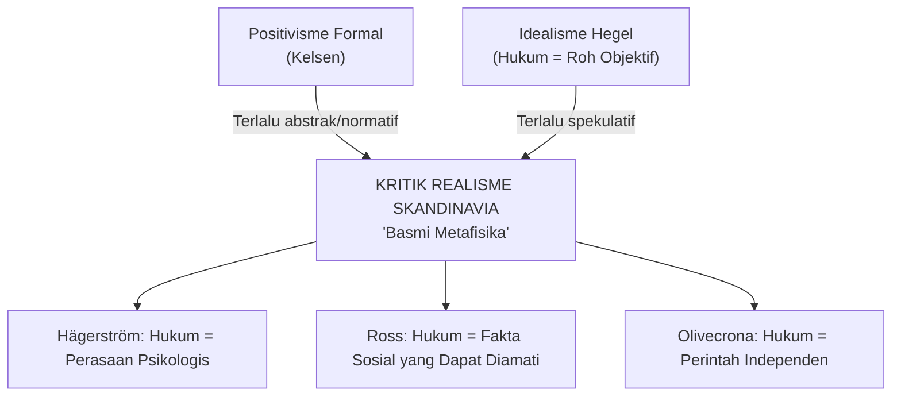
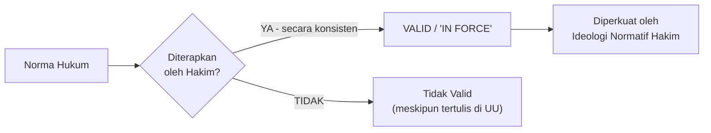
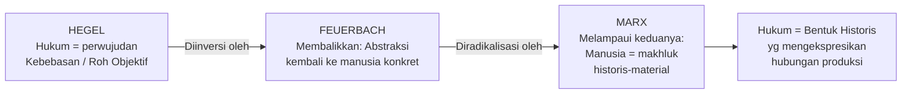
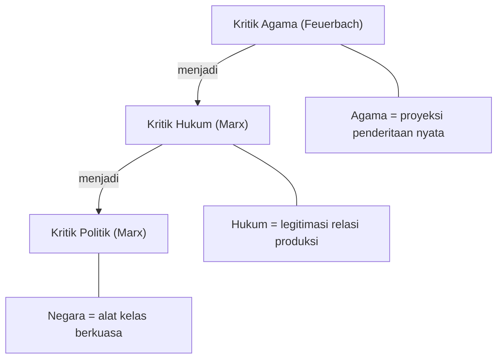
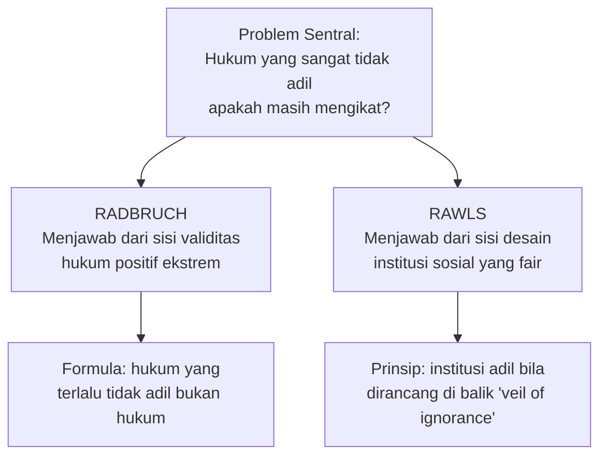
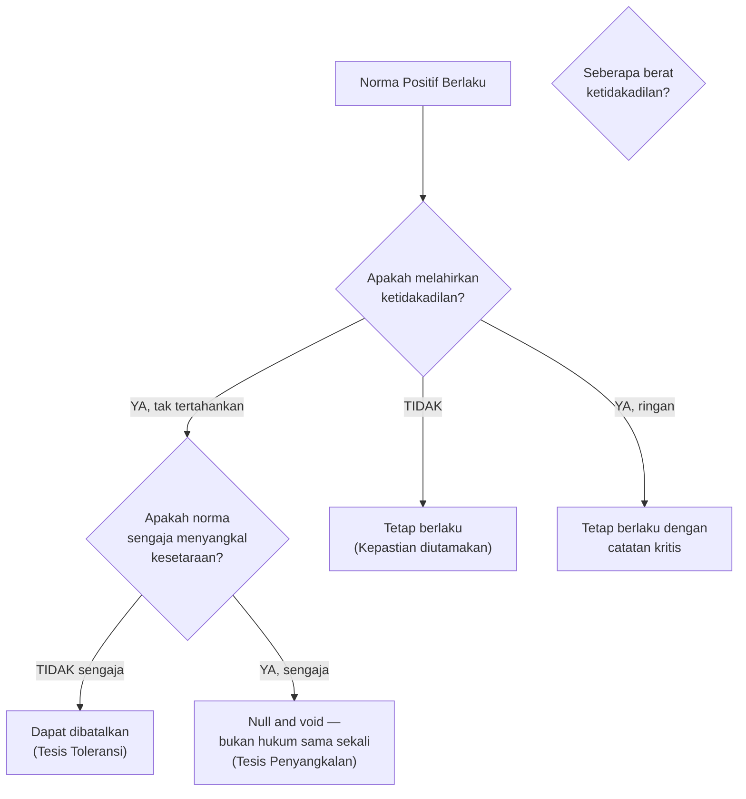
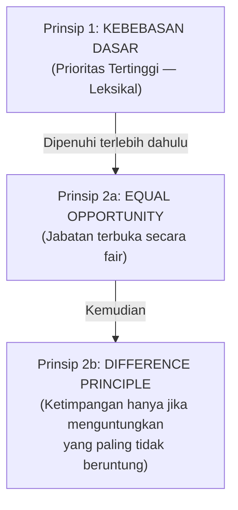
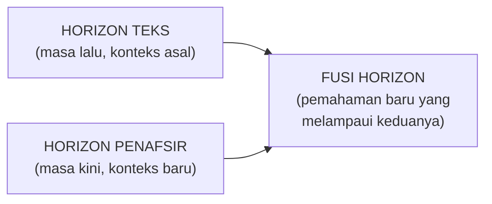
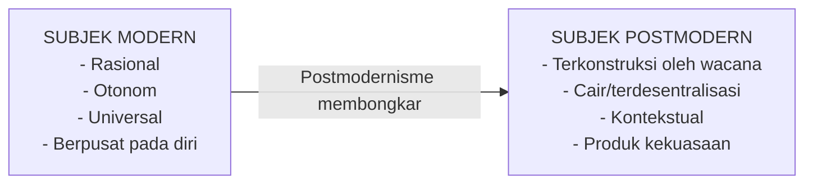
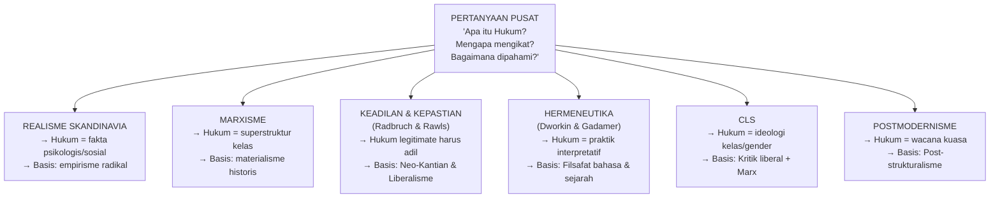

# FILSAFAT HUKUM: Catatan Akademis Komprehensif (Pasca-UTS)
### *Dari Realisme Skandinavia hingga Marxisme, Keadilan & Kepastian, Hermeneutika, CLS, dan Postmodernisme*

**Penyusun:** Gratianus Prikasetya | **Tahun:** 2025–2026
**Sumber Utama:** Ratnapala (2009), Wacks (2012), Rawls (1999), Alexy (2021), Gadamer (1960), Dworkin (1986), Marx & Engels, Silalahi (2025–2026)

---

> [!ABSTRACT]
> Catatan ini merupakan lanjutan langsung dari catatan UTS Filsafat Hukum dan mencakup materi pasca-midterm: (1) Realisme Skandinavia melalui Axel Hägerström dan Alf Ross; (2) Marxisme dalam Teori Hukum melalui garis intelektual Hegel–Feuerbach–Marx; (3) Keadilan dan Kepastian Hukum melalui Radbruch (pasca-PD II) dan John Rawls; (4) Interpretasi & Hermeneutika melalui Ronald Dworkin dan Hans-Georg Gadamer; (5) Critical Legal Studies (CLS) melalui Duncan Kennedy, Roberto Unger, dan kawan-kawan; serta (6) Postmodernisme dalam Teori Hukum melalui Derrida, Foucault, dan Lyotard. Setiap bagian mengintegrasikan biografi, konteks historis, argumen filosofis inti, kritik, dan elemen visual.

---

## Daftar Isi

12. [Bagian XII — Realisme Skandinavia: Hägerström & Ross](#bagian-xii)
13. [Bagian XIII — Marxisme dalam Teori Hukum](#bagian-xiii)
14. [Bagian XIV — Keadilan dan Kepastian Hukum: Radbruch & Rawls](#bagian-xiv)
15. [Bagian XV — Interpretasi & Hermeneutika: Dworkin & Gadamer](#bagian-xv)
16. [Bagian XVI — Critical Legal Studies (CLS)](#bagian-xvi)
17. [Bagian XVII — Postmodernisme dalam Teori Hukum](#bagian-xvii)
18. [Ringkasan Perbandingan Lintas Aliran (Pasca-UTS)](#ringkasan)
19. [Daftar Pustaka Tambahan](#daftar-pustaka-tambahan)

---

# BAGIAN XII — REALISME SKANDINAVIA: AXEL HÄGERSTRÖM & ALF ROSS {#bagian-xii}

## 12.1 Konteks Kemunculan: Dari Positivisme ke Empirisme Radikal

Realisme Skandinavia muncul pada awal abad ke-20 sebagai reaksi keras terhadap dua dominasi intelektual: (1) **positivisme hukum formal** ala Kelsen yang dianggap terlalu abstrak dan metafisis, dan (2) **idealisme Hegelian** yang melihat hukum sebagai perwujudan Roh absolut. Para pemikir Skandinavia berpendapat bahwa kedua pendekatan ini membangun teori hukum di atas konsep-konsep yang tidak memiliki padanan empiris nyata — yaitu konsep seperti "norma", "kewajiban", "hak", dan "validitas" yang dianggap sebagai entitas gaib tanpa eksistensi fisik yang dapat diamati.

Motto gerakan ini dinyatakan Hägerström dengan tegas: ***Censeo metaphysicam esse delendam*** — "Saya berpendapat bahwa metafisika harus dihancurkan."



---

## 12.2 Axel Hägerström (1868–1939): Pendiri dan Pembongkar Metafisika

### 12.2.1 Biografi dan Latar Intelektual

Axel Hägerström adalah seorang **filsuf Swedia**, bukan seorang yuris. Ia mengajar di Universitas Uppsala dan dipengaruhi kuat oleh **Neo-Kantianisme** — khususnya oleh **Hermann Cohen** dari Marburg yang menyatukan *sein* (adalah) dan *sollen* (seharusnya) dalam ranah "mental" atau "kultural". Hägerström memulai perjalanannya sebagai seorang Kantian tulen, tetapi kemudian mengembangkan kritik radikal terhadap Kant sendiri.

Ia secara keras menyebut Kant sebagai ***"father of subjectivism"*** — karena Kant selalu memandang realitas melalui kategori-kategori subjektif yang ada di dalam pikiran manusia. Hägerström ingin melampaui ini: ia percaya bahwa realitas empiris ada *di luar* diri kita, bukan semata-mata konstruksi pikiran.

### 12.2.2 Pergeseran Intelektual: Dari Pikiran ke Perasaan

Hägerström menghabiskan sekitar **sepuluh tahun** mempelajari kodifikasi hukum Romawi (*Corpus Juris Justinianus*). Dari studi mendalam ini, ia menemukan dua anomali yang tidak dapat dijelaskan oleh kerangka rasionalis Kantian:

> [!NOTE]
> **Dua Anomali Romawi yang Mengguncang Hägerström:**
> 1. **Ketaatan seorang budak pada hukum.** Kant mensyaratkan bahwa untuk taat pada hukum, seseorang harus berpikir secara rasional dan bebas. Namun budak tidak memiliki kebebasan itu — lalu *mengapa* budak tetap taat?
> 2. **Penghormatan terhadap batas properti.** Seseorang yang tidak pernah melihat sertifikat kepemilikan, tidak pernah bertemu pemiliknya, tetap tidak memasuki tanah orang lain. Ini bukan karena ia *tahu* batasnya secara rasional — ada sesuatu yang lain yang bekerja.

Hägerström menyimpulkan: ada **dimensi magis** dalam hukum. Masyarakat Romawi sendiri memiliki ritus-ritus hukum (*mancipatio*, *legis actiones*) yang sarat dengan unsur quasi-religius dan mantra. Hukum bukan murni rasio — ia bekerja melalui **perasaan** dan **pengalaman psikologis yang terprogram**.

### 12.2.3 Posisi Filosofis: Emotivisme dan Anti-Metafisika

Hägerström membangun posisi yang disebut **emotivisme moral** dalam konteks hukum:

| Klaim Konvensional | Koreksi Hägerström |
|---|---|
| "Hak milik itu ada secara nyata" | Hak milik adalah **ilusi psikologis** — tidak ada objek fisik bernama "hak" |
| "Kewajiban hukum mengikat karena valid" | "Validitas" hanyalah **perasaan psikologis keharusan** yang tersugesti oleh institusi |
| "Keadilan adalah nilai objektif" | Keadilan hanyalah **ekspresi emosi** — ketika berkata "ini tidak adil", kita hanya mengungkapkan perasaan tidak suka |
| "Hukum berasal dari rasio" | Hukum berasal dari **perasaan kolektif** yang diperkuat oleh ritual dan tradisi |

Dengan kata lain, bagi Hägerström, konsep-konsep hukum seperti *hak*, *kewajiban*, *kepemilikan*, dan *validitas* bukanlah entitas yang benar-benar ada di dunia. Mereka adalah **konstruksi psikologis** yang berfungsi mengatur perilaku manusia melalui mekanisme emosional, bukan melalui penalaran rasional.

> [!QUOTE]
> *"The laws of Jante"* — tradisi Skandinavia yang menyatakan: "Jangan pernah menganggap dirimu lebih dari orang lain." Ini adalah contoh Hägerström bahwa hukum **hidup dalam emosi dan tradisi**, bukan dalam teks tertulis atau pikiran abstrak.

### 12.2.4 Implikasi: Hukum sebagai "Pori-Pori" yang Bergerak

Hägerström secara eksplisit menyatakan bahwa **ia tidak percaya pada "kepastian" hukum** (*Rechtssicherheit*) dalam pengertian Kelsen atau Radbruch. Hukum baginya adalah sesuatu yang elastis seperti "pori-pori" — bisa mengembang dan mengempis, bisa berubah sesuai konteks psikologis dan sosial masyarakat.

Ini adalah kritik fundamental terhadap positivisme: jika hukum hanyalah respon psikologis kolektif, maka klaim positivisme bahwa hukum bisa dipisahkan dari fakta sosial dan psikologis adalah ilusi.

---

## 12.3 Alf Ross (1899–1979): Empirisme Hukum yang Lebih Terstruktur

### 12.3.1 Biografi dan Posisi dalam Aliran

**Alf Ross** adalah seorang filsuf dan yuris Denmark, murid **Kelsen** di Wina sebelum beralih ke pendekatan yang lebih empiris. Ia menjadi Profesor Hukum di Universitas Copenhagen dan menghasilkan karya utamanya ***On Law and Justice*** (1958). H.L.A. Hart menyebutnya sebagai *"the most acute and best-equipped philosopher"* dalam tradisi Realisme Skandinavia.

Ross berbeda dari Hägerström dalam satu hal penting: ia tidak semata-mata mereduksi hukum pada emosi, melainkan membangun **program penelitian empiris yang lebih terstruktur** yang masih mengakui karakter normatif khas hukum.

### 12.3.2 Konsep Validitas menurut Ross: "In Force" bukan "In Books"

Ross menolak konsep validitas Kelsen yang murni normatif (berlaku karena berasal dari norma yang lebih tinggi). Bagi Ross, sebuah norma hukum **valid** bukan karena struktur hierarkinya, melainkan karena ia **berlaku secara efektif** (*in force*) — yaitu ketika norma tersebut:

1. **Diterapkan oleh pengadilan** secara konsisten dalam memutus perkara
2. **Dirasakan sebagai mengikat** (*socially binding*) oleh para hakim — bukan hanya karena takut sanksi, tetapi karena adanya **ideologi normatif** yang tertanam dalam diri hakim



> [!IMPORTANT]
> **Ujian Validitas Ross**: Sebuah norma valid **hanya jika** ada probabilitas yang dapat diprediksi bahwa pengadilan akan menerapkannya di masa depan. Norma yang ada di atas kertas namun tidak pernah diterapkan hakim = bukan hukum yang valid.

### 12.3.3 Ideologi Normatif Hakim

Konsep terpenting Ross adalah **"normative ideology of judges"** (ideologi normatif hakim). Para hakim, ketika memutus perkara, tidak sekadar menerapkan aturan secara mekanis. Mereka bertindak berdasarkan sistem kepercayaan normatif yang telah terinternalisasi — gabungan antara teks hukum tertulis, tradisi peradilan, nilai-nilai moral, dan pertimbangan kebijakan.

Oleh karena itu, untuk mengetahui "hukum yang berlaku" secara akurat, kita harus **mempelajari perilaku hakim** secara empiris, bukan sekadar membaca pasal undang-undang.

### 12.3.4 Perbandingan Ross dengan Hägerström dan Hart

| Dimensi | Hägerström | Alf Ross | H.L.A. Hart |
|---|---|---|---|
| **Sumber Hukum** | Perasaan/emosi kolektif psikologis | Fakta sosial yang dapat diamati (putusan hakim) | Aturan sosial + aturan pengakuan (*rule of recognition*) |
| **Validitas** | Ilusi psikologis | Efektivitas empiris (diterapkan hakim) | Prosedural + aturan sekunder |
| **Metafisika** | Ditolak total | Ditolak; hukum harus empiris | Dikritisi tapi tidak ditolak total |
| **Moralitas** | Sekadar ekspresi emosi subjektif | Non-kognitivis: pernyataan moral bukan benar/salah | Dipisahkan dari hukum (positivisme lunak) |
| **Kepastian Hukum** | Tidak percaya kepastian | Kepastian = prediktabilitas putusan hakim | Kepastian dimungkinkan melalui *rule of recognition* |

---

## 12.4 Karl Olivecrona: Hukum sebagai "Perintah Independen"

Meski bukan tokoh utama kuliah ini, **Karl Olivecrona** melengkapi trio Realisme Skandinavia. Ia menyebut norma hukum sebagai ***"independent imperatives"*** — perintah-perintah yang tidak berasal dari kehendak nyata siapapun (bukan dari Tuhan, bukan dari penguasa nyata), namun tetap memiliki kekuatan psikologis untuk memaksa kepatuhan karena telah terinternalisasi dalam jiwa manusia melalui sosialisasi.

---

## 12.5 Kritik dan Warisan Realisme Skandinavia

> [!WARNING]
> **Kritik Utama terhadap Realisme Skandinavia:**
> 1. **Reduksionisme berlebihan**: Mereduksi seluruh hukum ke dimensi psikologis mengabaikan dimensi normatif yang khas dari hukum.
> 2. **Masalah normatif**: Jika "hak" hanyalah perasaan, bagaimana kita bisa mengkritik hukum yang tidak adil? Dasar evaluasi moral lenyap.
> 3. **Kritik Hart**: Ross dianggap "realis Amerika di Skandinavia" — pendekatan behaviorisnya terlalu menyempitkan makna hukum.
> 4. **Konteks Indonesia**: Dalam sistem hukum yang menjunjung Pancasila (dimensi moral), pendekatan anti-metafisika total tidak mungkin sepenuhnya diterapkan.

**Warisan positifnya**: Realisme Skandinavia sangat berguna untuk **mengkritisi formalisme kosong** — kasus di mana undang-undang ada tapi penegakan hukum gagal karena faktor sosiologis dan psikologis penegak hukum. Ia mengajak kita jujur melihat *hukum yang benar-benar hidup* (*living law*), bukan hanya *hukum di atas kertas*.

---

# BAGIAN XIII — MARXISME DALAM TEORI HUKUM {#bagian-xiii}

## 13.1 Jalur Intelektual: Hegel → Feuerbach → Marx

Untuk memahami teori hukum Marxis, kita harus memahami **garis transformasi intelektual** yang dilewati Marx. Ia tidak muncul dari ruang hampa — ia secara sadar mewarisi Hegel, dikritisi oleh Feuerbach, dan kemudian melampaui keduanya.



### 13.1.1 Hegel: Hukum sebagai Eksistensi Kebebasan

**G.W.F. Hegel** (1770–1831) memahami hukum sebagai **perwujudan objektif kebebasan**. Dalam karyanya *Grundlinien der Philosophie des Rechts* (*Philosophy of Right*, 1820), ia membagi perkembangan "Roh Objektif" (*objektiver Geist*) menjadi tiga momen besar:

| Tahap | Isi | Relevansi Hukum |
|---|---|---|
| **Hak Abstrak** (*Abstraktes Recht*) | Kepemilikan, kontrak, kepribadian hukum | Individu menanamkan kehendaknya ke objek eksternal → kebebasan mendapat wujud fisik |
| **Moralitas** (*Moralität*) | Niat, tanggung jawab, hati nurani subjektif | Kebebasan masuk ke dalam diri → tetapi terlalu individual, tidak terarah |
| **Kehidupan Etis** (*Sittlichkeit*) | Keluarga → Masyarakat Sipil → Negara | Kebebasan individual bersatu dengan tugas sosial; Negara = rekonsiliasi tertinggi |

> [!QUOTE]
> *"'Right' is the existence of free will in the world."*
> — Hegel, *Philosophy of Right* (1820)

**Proposisi utama Hegel yang diteruskan ke Marx**: *Saripati hukum adalah kebebasan.* Negara bagi Hegel bukanlah alat penindasan, melainkan institusi rasional tertinggi di mana manusia merealisasi kebebasannya sebagai warga negara (*Bürger*).

**Kelemahan Hegel** yang kemudian dikoreksi Marx dan Feuerbach: Hegel menganggap skala kebebasan bersifat biner (0–1): ada yang bebas (tuannya) dan tidak bebas (budaknya). Marx dan Feuerbach menjadikannya lebih humanis dengan skala 0–100 — semua manusia pada dasarnya memiliki potensi kebebasan yang setara.

### 13.1.2 Feuerbach: Inversi Idealisme — Abstraksi Dikembalikan ke Manusia

**Ludwig Feuerbach** (1804–1872) melakukan **pembalikan (*inversion*)** terhadap idealisme Hegel. Jika Hegel bertitik tolak dari Roh/Ide yang menjelma ke dunia, Feuerbach berbalik: titik tolaknya adalah **manusia konkret yang sensual**, bukan abstraksi roh.

Langkah Feuerbach yang paling terkenal: **kritik agama sebagai proyeksi**. Tuhan bukanlah pencipta esensi manusia; sebaliknya, Tuhan adalah **gambaran ideal manusia yang diproyeksikan ke luar** dan dianggap mandiri. "Teologi adalah antropologi yang dibalik."

**Signifikansi untuk teori hukum**: Feuerbach mengajarkan Marx untuk **mencurigai abstraksi yang tampak mandiri dari kehidupan manusia**. Sama seperti Tuhan yang sebenarnya adalah proyeksi manusia, konsep hukum yang tampak netral dan abadi — seperti "hak milik", "kontrak bebas", "kepribadian hukum" — sebenarnya adalah **konstruksi manusia yang telah dimistifikasi** seolah-olah berdiri sendiri.

### 13.1.3 Marx: Dari Inversi ke Kritik Material Hukum

Marx menerima langkah anti-abstraksi Feuerbach, tetapi melampaui batasan-batasannya. Bagi Marx, Feuerbach masih terlalu abstrak: ia berbicara tentang "manusia" sebagai esensi yang universal dan ahistoris. Marx menegaskan: **manusia bukanlah esensi abstrak yang terisolasi; ia adalah makhluk sosial dan historis yang terbentuk oleh relasi produksi material.**



---

## 13.2 Inti Teori Marxis tentang Hukum

### 13.2.1 Basis dan Superstruktur

Teori Marxis memahami masyarakat sebagai bangunan dua lapis:

```
┌─────────────────────────────────────────────┐
│            SUPERSTRUKTUR                     │
│  Hukum, Negara, Agama, Ideologi, Seni       │
│  → Melayani dan melegitimasi basis          │
├─────────────────────────────────────────────┤
│               BASIS                          │
│  Mode of Production (Cara Produksi)         │
│  = Alat Produksi + Relasi Produksi          │
│  → Menentukan bentuk superstruktur          │
└─────────────────────────────────────────────┘
```

> [!IMPORTANT]
> **Tesis Pokok Marxisme**: *Hukum bukanlah sistem otonom.* Hukum adalah bagian dari **superstruktur** yang ditentukan oleh **basis ekonomi** (mode of production). Hukum tidak mencerminkan kebenaran universal atau akal budi murni — ia mencerminkan **kepentingan kelas penguasa** di setiap zaman historis.

### 13.2.2 Hukum sebagai Alat Dominasi Kelas

Dalam masyarakat kapitalis:

- **Hukum tampak netral** — "semua orang sama di depan hukum"
- **Realitasnya**: kenetralan formal ini justru **melestarikan ketimpangan material** yang sudah ada
- Orang miskin dan orang kaya memang sama-sama berhak membuat kontrak — tetapi kebebasan kontrak orang miskin yang tidak punya pilihan lain bukan kebebasan yang nyata
- Hak milik privat yang dilindungi hukum adalah **mekanisme akumulasi kapital** yang menguntungkan borjuasi

### 13.2.3 Alienasi dalam Hukum

**Alienasi** (*Entfremdung*) adalah konsep sentral Marx. Dalam konteks hukum:

| Bentuk Alienasi | Manifestasi Hukum |
|---|---|
| **Alienasi dari produk kerja** | Pekerja tidak memiliki apa yang ia hasilkan; hukum hak milik melegitimasi pemilikan oleh pemilik modal |
| **Alienasi dari proses produksi** | Hukum kontrak kerja menyembunyikan eksploitasi di balik "persetujuan sukarela" |
| **Alienasi dari sesama manusia** | Hukum mengabstraksikan manusia menjadi "subjek hukum" yang anonim — konsumen, pemberi kerja, penumpang — menghancurkan keterhubungan manusiawi |
| **Alienasi dari sistem hukum** | Sistem hukum yang lahir dari masyarakat manusia justru menghadapi manusia sebagai kekuatan asing yang mengendalikannya |

### 13.2.4 Materialisme Historis: Hukum Berubah Mengikuti Basis Ekonomi

Marx berpendapat bahwa sejarah didorong bukan oleh perkembangan ide (Hegel), melainkan oleh **perubahan material dalam cara produksi**. Hukum berevolusi mengikuti perubahan ini:

| Zaman Historis | Mode of Production | Bentuk Hukum yang Khas |
|---|---|---|
| **Masyarakat Perbudakan** | Tuan-Budak | Hukum yang melegalkan kepemilikan manusia |
| **Feodalisme** | Tuan Tanah-Serf | Hukum yang melindungi hak-hak feodal dan kepemilikan tanah turun-temurun |
| **Kapitalisme** | Pemilik Modal-Buruh | Hukum kontrak, hak milik privat, hukum perusahaan |
| **Komunisme** (proyeksi) | Tanpa kelas | Hukum menjadi tidak diperlukan dan "layu" (*wither away*) |

### 13.2.5 "Pelayuan Hukum" (*Withering Away of Law*)

Friedrich Engels memprediksi bahwa di bawah komunisme sejati, ketika kelas-kelas sosial telah dihapuskan, **negara dan hukum akan "layu" dengan sendirinya**. Sebab:

- Hukum ada karena ada konflik kelas yang perlu dikelola
- Tanpa kelas, tidak ada konflik kelas
- Tanpa konflik kelas, tidak ada fungsi yang tersisa bagi hukum koersif
- **"Pemerintahan atas orang-orang" digantikan oleh "administrasi atas barang-barang"**

---

## 13.3 Subjek Hukum sebagai "Bayangan dari Pemilik Komoditas"

Ini adalah salah satu kontribusi paling original Marxisme dalam teori hukum. Ada argumen kuat bahwa **konsep subjek hukum modern** — individu yang bebas, setara, dan memiliki hak-hak — adalah **refleksi struktural dari pemilik komoditas di pasar**.

Di pasar, pertukaran komoditas mensyaratkan para pelaku pertukaran yang:
1. **Bebas** — tidak ada paksaan (formalnya)
2. **Setara** — diakui saling sebagai "orang" yang sah bertransaksi
3. **Pemilik** — memiliki hak atas apa yang ditukar

Hukum memproyeksikan kondisi pasar ini ke dalam status universal manusia sebagai "subjek hukum". Ini menciptakan **kesetaraan formal** yang menyembunyikan **ketimpangan material** yang nyata. Properti yang bagi Hegel adalah awal dari kebebasan, bagi Marx adalah **akar dari perbudakan ekonomi**.

---

## 13.4 Gramsci: Hegemoni Hukum

Meski bukan bagian inti dari materi kuliah, penting dicatat bahwa **Antonio Gramsci** (1891–1937) mengembangkan Marxisme dengan konsep **hegemoni** (*hegemonia*): kelas penguasa tidak hanya mendominasi melalui paksaan (repressive state apparatus), tetapi juga melalui **persetujuan** (ideological state apparatus). Hukum adalah salah satu instrumen hegemoni terpenting — ia membuat tatanan yang menguntungkan kelas penguasa tampak sebagai sesuatu yang "natural", "adil", dan "universal".

---

## 13.5 Kritik terhadap Marxisme

| Kritik | Penjelasan |
|---|---|
| **Determinisme Ekonomi** | Marxisme dianggap terlalu mereduksi hukum pada faktor ekonomi, mengabaikan otonomi relatif hukum |
| **Sejarah tidak linier** | Prediksi "pelayuan hukum" tidak terbukti — bahkan negara-negara komunis memiliki aparatus hukum yang sangat kuat |
| **Mengabaikan fungsi positif hukum** | Hukum tidak hanya menindas; ia juga dapat menjadi instrumen emansipasi bagi kelompok yang tertindas |
| **Terlalu biner (kelas penguasa vs tertindas)** | Dinamika kekuasaan jauh lebih kompleks dari dikotomi borjuasi vs proletariat |

---

# BAGIAN XIV — KEADILAN DAN KEPASTIAN HUKUM: RADBRUCH & RAWLS {#bagian-xiv}

## 14.1 Peta Problem: Mengapa Keadilan vs Kepastian Selalu Muncul?

Filsafat hukum tidak pernah berhenti pada pertanyaan "apa bunyi aturan", tetapi juga: *mengapa aturan mengikat?* dan *apakah hukum tetap sah ketika sangat tidak adil?*



---

## 14.2 Gustav Radbruch: Evolusi Pemikiran (Revisited)

*Catatan: Radbruch sudah dibahas di UTS. Bagian ini memperdalam dimensi pasca-PD II dan elaborasi formula yang lebih rinci.*

### 14.2.1 Pra-PD II: Radbruch sebagai Relativis Nilai

Pada periode sebelum Perang Dunia II, Radbruch masih **seorang relativis nilai**: ia berpendapat bahwa karena manusia tidak bisa menyepakati apa yang "adil" secara substansi, maka sebaiknya masyarakat bersepakat pada yang dapat disepakati — yaitu **hukum positif** (*das Gesetzte Recht*). Kepastian hukum menjadi prioritas karena tanpa kesepakatan pada "apa yang tertulis", kita terancam perang saudara.

Pendekatan ini bersifat **top-down**: kepastian (positivitas) digunakan untuk menjustifikasi kemanfaatan dan keadilan. Tiga tujuan hukum (kepastian, kemanfaatan, keadilan) dipandang sebagai **satu kesatuan integral** (*law as integrity*) yang masing-masing saling memengaruhi.

### 14.2.2 Pasca-PD II: Kehre (Pembalikan Haluan)

Pengalaman langsung rezim Nazi — di mana hukum positif yang "valid" secara formal digunakan untuk melegalkan pembantaian etnis — memaksa Radbruch membalik posisinya secara fundamental. Ia menyebut perubahan ini sebagai ***Kehre*** (pembalikan haluan):

| | Pra-PD II | Pasca-PD II |
|---|---|---|
| **Prioritas** | Kepastian → justifikasi keadilan & kemanfaatan (*top-down*) | Keadilan → menentukan batas kepastian & kemanfaatan (*bottom-up*) |
| **Hukum positif yang tidak adil** | Tetap mengikat demi stabilitas | Dapat dibatalkan jika melampaui ambang ketidakadilan yang tak tertahankan |
| **Positivisme** | Didukung sebagai sarana stabilitas | Dikritik sebagai "kekacauan intelektual" yang memungkinkan Nazi berkuasa |

### 14.2.3 Formula Radbruch: Dua Tesis

Formula Radbruch — sebagaimana direkonstruksi oleh Robert Alexy — terdiri dari **dua tesis yang berbeda** tapi saling terkait:

> [!IMPORTANT]
> **Tesis 1 — Tesis Toleransi (*The Intolerability Thesis*):**
> Hukum positif harus **tetap didahulukan** demi kepastian hukum, **KECUALI** konflik antara undang-undang dan keadilan mencapai tingkat yang "*tak tertahankan*" (*unerträglich*). Pada titik itu, undang-undang tersebut harus dinyatakan **tidak berlaku demi keadilan**.
>
> **Tesis 2 — Tesis Penyangkalan (*The Disavowal Thesis*):**
> Jika sebuah aturan hukum **secara sengaja menyangkal prinsip kesetaraan** — misalnya hukum yang membolehkan pembunuhan berdasarkan ras — maka aturan tersebut **bukan sekadar "hukum yang buruk"**, melainkan ***sama sekali bukan hukum*** (*null and void*). Ia kehilangan sifat hukumnya sejak semula.



### 14.2.4 Kritik atas Formula Radbruch

| Pengkritik | Isi Kritik |
|---|---|
| **H.L.A. Hart** | "Kekacauan intelektual" (*intellectual confusion*): jika suatu aturan dibuat secara sah oleh otoritas yang berwenang, ia adalah hukum meskipun sangat jahat. Lebih baik katakan: *"Ini hukum yang sangat jahat"* daripada *"Ini bukan hukum"*. |
| **Masalah Subjektivitas** | Siapa yang berhak menentukan ambang "tak tertahankan"? Tidak ada kriteria objektif yang jelas. |
| **Bahaya bagi Kepastian** | Membuka pintu bagi hakim untuk membatalkan UU atas dasar "moral universal" yang subjektif. |
| **Masalah Retroaktivitas** | Menggunakan Formula untuk menghukum pejabat Nazi dianggap melanggar *nullum crimen sine lege* — menghukum tindakan yang pada saat dilakukan sah secara formal. |
| **Legitimasi Demokratis** | Memberikan kekuasaan kepada hakim (yang tidak dipilih rakyat) untuk membatalkan UU (cerminan kehendak rakyat) atas dasar moralitas yang cair. |

---

## 14.3 John Rawls: Justice as Fairness

### 14.3.1 Konteks dan Latar Rawls

**John Rawls** (1921–2002) mengembangkan teorinya dalam konteks **hegemoni utilitarianisme** yang mendominasi filsafat moral dan politik Anglo-Saxon. Utilitarianisme Bentham dan Mill — yang mengukur keadilan dari jumlah kebahagiaan total (*the greatest good for the greatest number*) — memiliki implikasi berbahaya: **ia dapat membenarkan pengorbanan hak-hak minoritas demi kesejahteraan mayoritas**.

> [!NOTE]
> Jika 90% rakyat makmur dengan memperbudak 10%, secara utilitarian itu "adil" — tetapi secara moral nurani itu mengerikan. Rawls menulis untuk membongkar kenyamanan ini.

Rawls juga berhadapan dengan **Reasonableness Pluralism** — realitas bahwa dalam masyarakat modern yang pluralis, tidak ada satu visi substantif tentang kebaikan (*comprehensive doctrine*) yang bisa dipaksakan kepada semua orang tanpa melanggar kebebasan mereka.

### 14.3.2 Konstruktivisme Kantian Rawls

Rawls mengembangkan apa yang ia sebut **konstruktivisme Kantian**: prinsip-prinsip keadilan bukan sesuatu yang "terberi" di alam atau ditentukan oleh Tuhan — ia harus **dibangun bersama** melalui prosedur yang adil. Fokusnya bukan pada *"apa hasilnya"* melainkan pada *"bagaimana proses mencapainya"*.

| Elemen | Penjelasan |
|---|---|
| **Konstruktivisme** | Keadilan dibangun, bukan ditemukan |
| **Ekuilibrium Reflektif** | Mulai dari intuisi moral → rumuskan prinsip umum → jika bertabrakan, revisi prinsip atau intuisi → cari koherensi |
| **Proseduralisme Murni** | Jika prosedurnya adil, hasilnya otomatis adil — seperti lotere yang jujur |
| **Rasionalitas Pilihan** | Manusia diasumsikan *self-interested* (mementingkan diri) tapi *not envious* (tidak iri pada orang lain) |

### 14.3.3 Posisi Asal dan Tabir Ketidaktahuan

Alat utama konstruksi Rawls adalah eksperimen pikiran (*thought experiment*) yang disebut ***original position*** (posisi asal) dengan ***veil of ignorance*** (tabir/selubung ketidaktahuan).

Dalam kondisi ini, kita **berpura-pura tidak tahu**:
- Kelas sosial kita
- Kekayaan dan sumber daya kita
- Bakat dan kemampuan alami kita
- Agama, keyakinan, dan pandangan hidup kita
- Posisi kita dalam generasi (apakah kita hidup kini atau di masa depan)

**Tujuannya**: menghilangkan bias dalam memilih prinsip keadilan. Tidak ada yang bisa "mendesain" aturan untuk menguntungkan posisinya sendiri jika ia tidak tahu posisinya apa.

> [!QUOTE]
> *"Original position"* dalam Rawls adalah analogi dari **kontrak sosial yang benar-benar adil** — bukan kontrak yang dibuat oleh orang-orang yang sudah tahu posisi mereka (seperti kontrak Hobbes atau Locke yang masih bias).

### 14.3.4 Dua Prinsip Keadilan Rawls

Dari posisi asal, Rawls berargumen bahwa orang-orang rasional akan memilih **dua prinsip** berikut (dengan prioritas leksikal — Prinsip 1 tidak boleh dikorbankan demi Prinsip 2):

**Prinsip 1 — Kebebasan yang Sama (*Equal Liberty Principle*):**
> Setiap orang memiliki hak yang sama atas sistem kebebasan dasar yang paling luas (*most extensive basic liberties*) yang kompatibel dengan sistem serupa bagi semua orang. Kebebasan ini meliputi: kebebasan berpendapat, beragama, berpolitik, hak atas integritas pribadi, dan rule of law.

**Prinsip 2 — Kesempatan Fair + Difference Principle:**
> Ketimpangan sosial dan ekonomi hanya dapat dibenarkan jika memenuhi dua kondisi:
> - **(a) Fair Equality of Opportunity**: jabatan dan posisi yang tidak setara harus terbuka bagi semua orang secara fair (bukan sekadar formal)
> - **(b) Difference Principle**: ketimpangan menguntungkan pihak yang **paling tidak beruntung** (*the least advantaged*)



> [!IMPORTANT]
> **Strategi *Maximin***: Di balik veil of ignorance, orang rasional akan memilih prinsip yang **memaksimalkan kondisi minimum** (*maximum minimum* / *maximin*). Karena tidak tahu posisi mana yang akan ditempati, orang akan memilih aturan yang paling baik bagi posisi yang **terburuk sekalipun**.

### 14.3.5 Kepastian Hukum dalam Rawls

Rawls tidak memformulasikan "kepastian hukum" sebagai konsep terpisah, tetapi ia hadir secara implisit sebagai komponen *rule of law* yang dibutuhkan agar kerjasama sosial berjalan fair:

- **Keteraturan institusional**: Aturan yang umum, diketahui, dan diterapkan konsisten — agar warga dapat merencanakan hidupnya
- **Fair terms of cooperation**: Kepastian mendukung rasa saling percaya — semua orang tunduk pada aturan yang sama
- **Batas konstitusional**: Kebebasan dasar dan prinsip keadilan membatasi legislasi biasa

Intinya: bagi Rawls, **kepastian hukum bernilai sejauh ia menjaga kondisi fair** bagi kebebasan dan kerjasama sosial. Kepastian yang melahirkan ketidakadilan struktural tidak dapat dipertahankan.

---

## 14.4 Perbandingan Inti: Radbruch vs Rawls

| Aspek | Radbruch | Rawls |
|---|---|---|
| **Objek Utama** | Validitas hukum positif ketika berhadapan dengan ketidakadilan ekstrem | Desain struktur dasar masyarakat yang adil dan stabil |
| **Makna Keadilan** | Nilai hukum yang dapat mengalahkan kepastian pada ambang ekstrem | *Fairness*: prinsip yang dipilih di balik *veil of ignorance* |
| **Kepastian Hukum** | Nilai formal yang penting; menjaga ketertiban dan prediktabilitas | Syarat *rule of law* dan stabilitas kerjasama sosial |
| **Cara Bernalar** | *Balancing* antara *legal certainty* dan *substantive justice* | Kontrak hipotetis: *original position* dan dua prinsip |
| **Risiko Teori** | Ambang "ekstrem" dapat diperdebatkan; membuka pintu subjektivitas hakim | Terlalu ideal/abstrak; dikritik Nozick (teori entitlement) dan komunitarian |

---

## 14.5 Catatan: Robert Nozick sebagai Antipoda Rawls

Penting untuk menempatkan **Robert Nozick** (1938–2002) sebagai kontrapoin Rawls. Dalam ***Anarchy, State, and Utopia*** (1974), Nozick menolak *difference principle* Rawls dengan argumen:

- Keadilan bukan soal **pola distribusi hasil** (*end-state / patterned theories*), melainkan soal **cara hak diperoleh** (*historical entitlement theory*)
- Selama kepemilikan diperoleh melalui **perolehan yang sah** (*just acquisition*) dan **transfer yang sukarela** (*voluntary transfer*), negara tidak berhak mengambilnya demi redistribusi
- Negara ideal = **negara minimal** (*minimal state*): hanya menjaga keamanan, kontrak, dan perlindungan hak

**Nozick vs Rawls** adalah salah satu perdebatan terbesar dalam filsafat politik abad ke-20 — antara **egalitarianisme liberal** (Rawls) dan **libertarianisme** (Nozick).

---

# BAGIAN XV — INTERPRETASI & HERMENEUTIKA: DWORKIN & GADAMER {#bagian-xv}

## 15.1 Mengapa Interpretasi menjadi Masalah Filsafat?

Hukum tidak pernah hadir sebagai teks yang sepenuhnya selesai. Ketika hakim atau akademisi berhadapan dengan perkara konkret, mereka tidak sekadar **membaca** aturan — mereka **menentukan makna** dari aturan tersebut. Ini menjadi masalah filosofis karena:

1. **Bahasa itu ambigu** — teks hukum terbuka pada berbagai penafsiran
2. **Hard cases** (*perkara sulit*) — norma positif tidak memberikan jawaban tegas
3. **Nilai-nilai moral** — keputusan hukum tidak pernah murni "teknis"
4. **Sejarah dan konteks** — makna kata berubah seiring waktu

Baik Dworkin maupun Gadamer menolak pandangan bahwa penafsiran adalah proses mekanis yang hanya "menemukan" arti objektif yang sudah ada di dalam teks. Namun mereka bergerak dari titik perhatian yang berbeda.

---

## 15.2 Ronald Dworkin (1931–2013): Hukum sebagai Praktik Interpretatif

### 15.2.1 Biografi dan Konteks

**Ronald Dworkin** adalah filsuf hukum Amerika yang menjadi profesor di Oxford dan NYU. Ia adalah kritikus utama positivisme H.L.A. Hart dan mengembangkan teori hukum yang menempatkan moralitas sebagai unsur **inheren** dalam hukum — bukan eksternal.

### 15.2.2 Kritik atas Positivisme: Aturan + Prinsip

Dalam karya **"The Model of Rules"** (1967) dan ***Taking Rights Seriously*** (1977), Dworkin membantah tesis Hart bahwa hukum hanya terdiri dari **aturan (*rules*)**.

Dworkin menunjukkan bahwa hakim juga menggunakan **prinsip (*principles*)** — yang berbeda dari aturan:

| | Aturan (*Rules*) | Prinsip (*Principles*) |
|---|---|---|
| **Cara Kerja** | *All-or-nothing* — berlaku penuh atau tidak sama sekali | Memiliki **dimensi berat (*weight*)** — dipertimbangkan, tidak selalu mengalahkan |
| **Sumber** | Prosedur pembuatan hukum (legislasi, preseden) | Moralitas politik komunitas |
| **Contoh** | "Kendaraan dilarang masuk taman" | "Seseorang tidak boleh memperoleh keuntungan dari kesalahannya sendiri" |
| **Dalam Hard Cases** | Tidak memadai | Menentukan arah putusan hakim |

**Contoh Kasus Riggs v. Palmer** (1889): Seorang cucu membunuh kakeknya agar segera mendapat warisan. Secara aturan wills, ia berhak atas warisan. Namun hakim menolak memberikannya, berdasarkan **prinsip**: *"No man shall be permitted to profit by his own fraud"*. Dworkin menggunakan kasus ini untuk menunjukkan bahwa praktik hukum *sudah selalu bekerja melalui prinsip-prinsip moral*.

### 15.2.3 Law as Integrity: Hakim sebagai Penulis Chain Novel

Gagasan terpenting Dworkin adalah ***Law as Integrity*** — hukum sebagai integritas. Ini berbeda dari dua pandangan lain:

- **Conventionalism**: hukum hanyalah apa yang secara eksplisit diputuskan oleh institusi di masa lalu
- **Pragmatism**: hakim harus memutus yang terbaik untuk masa depan, terlepas dari sejarah

**Law as integrity** menyatakan: hakim harus memutus berdasarkan prinsip yang paling dapat **menjelaskan secara koheren dan membenarkan secara moral** seluruh sejarah hukum yang ada. Hakim adalah bagian dari rantai panjang praktik hukum.

Dworkin menggunakan analogi ***chain novel***: sebuah novel ditulis berantai oleh banyak penulis. Setiap penulis baru harus:
1. **Membaca** semua bab sebelumnya dengan seksama
2. **Melanjutkan** cerita secara koheren — tidak bisa mengubah karakter atau plot secara sewenang-wenang
3. **Membuat** bab baru sebaik-baiknya dari sisi sastra

Begitu pula hakim: tidak bebas *de novo* dan tidak sekadar mengulang teks. Ia harus **menafsirkan praktik hukum yang ada** dan meneruskannya dengan cara yang paling koheren dan bermakna secara moral.

### 15.2.4 Hercules: Hakim Ideal Dworkin

Dworkin mengandaikan hakim ideal bernama **Hercules** — seorang hakim dengan:
- Pengetahuan sempurna tentang semua hukum positif yang berlaku
- Pemahaman mendalam tentang semua prinsip moral yang mendasari sistem hukum
- Kapasitas tak terbatas untuk menimbang dan mengintegrasikan semuanya

Meski Hercules adalah ideal yang tidak dapat dicapai sepenuhnya, **standar ini adalah arah** yang harus dituju oleh setiap hakim nyata.

### 15.2.5 Dworkin: Satu Jawaban yang Benar

Dalam perdebatan tentang *hard cases*, Dworkin berpendapat bahwa **selalu ada satu jawaban yang paling benar** (*one right answer thesis*), meskipun sulit ditemukan. Ini berbeda dari pandangan realis atau CLS yang menyatakan hukum pada dasarnya indeterminate.

---

## 15.3 Hans-Georg Gadamer (1900–2002): Hermeneutika Filosofis

### 15.3.1 Biografi dan Karya Utama

**Hans-Georg Gadamer** adalah filsuf Jerman, murid Heidegger, yang mengembangkan hermeneutika filosofis dalam karyanya monumentalnya ***Wahrheit und Methode*** (*Truth and Method*, 1960). Ia hidup hingga usia 102 tahun dan menjadi salah satu filsuf paling berpengaruh abad ke-20.

Berbeda dari Dworkin yang bergerak dari normatifitas hukum, Gadamer bergerak dari pertanyaan **ontologis dan epistemologis**: *Apa kondisi kemungkinan pemahaman itu sendiri?*

### 15.3.2 Konsep-Konsep Kunci Gadamer

**A. Pra-Pemahaman dan Rehabilitasi Prasangka (*Vorurteil*)**

Gadamer menolak cita-cita Pencerahan bahwa penafsiran yang baik harus bebas dari prasangka (*prejudice-free*). Sebaliknya, ia merehabilitasi konsep **prasangka** (*Vorurteil* = "penilaian-awal"):

> Prasangka bukan sekadar bias yang harus dihilangkan. Prasangka adalah **landasan dari mana pemahaman tumbuh** — pra-pemahaman yang kita bawa ke setiap perjumpaan dengan teks. Tanpa prasangka, kita tidak memiliki titik tolak untuk memahami apapun.

**B. Tradisi dan Otoritas**

Gadamer berargumen bahwa **tradisi** (*Überlieferung*) bukanlah belenggu yang harus dilepas, melainkan medium yang memungkinkan kita memahami. Kita selalu sudah berada *di dalam* tradisi — kita tidak bisa berdiri di luar sejarah untuk melihatnya secara netral.

**C. Kesadaran yang Dipengaruhi Sejarah (*Wirkungsgeschichtliches Bewusstsein*)**

Ini adalah salah satu konsep terpenting Gadamer: **"historically effected consciousness"** (kesadaran yang terpengaruh sejarah). Artinya:
- Setiap penafsir berada dalam situasi historis tertentu
- Pemahaman kita selalu sudah dibentuk oleh akibat-akibat historis dari teks, peristiwa, atau tradisi yang kita tafsirkan
- Kita tidak bisa keluar sepenuhnya dari situasi historis kita

**D. Horizon dan Fusi Horizon (*Horizontverschmelzung*)**

***Horizon*** adalah batas pemahaman yang dimiliki seseorang pada waktu tertentu — gambaran sejauh mana ia dapat melihat dari tempatnya berdiri. Setiap orang, setiap era, memiliki horizonnya sendiri.

***Fusi Horizon*** (*Horizontverschmelzung*): ketika penafsir berusaha memahami teks dari masa lalu, yang terjadi bukan semata-mata "masuk" ke horizon masa lalu itu, melainkan terjadi **peleburan/perpaduan antara horizon penafsir (kini) dan horizon teks (lalu)**, menghasilkan pemahaman baru yang melampaui keduanya.



> [!QUOTE]
> *"Understanding is always the fusion of these horizons supposedly existing by themselves."*
> — Hans-Georg Gadamer, *Truth and Method* (1960)

**E. Lingkaran Hermeneutis (*Hermeneutischer Zirkel*)**

Pemahaman bergerak dalam **lingkaran**: untuk memahami keseluruhan teks, kita harus memahami bagian-bagiannya; tetapi untuk memahami bagian-bagian, kita sudah membutuhkan pemahaman tentang keseluruhan. Bagi Gadamer, ini bukan lingkaran setan yang harus dipecahkan, melainkan **struktur ontologis dari pemahaman itu sendiri** — sesuatu yang harus dijalani, bukan dihindari.

### 15.3.3 Implikasi Gadamer bagi Interpretasi Hukum

1. **Tidak ada interpretasi yang netral**: Hakim selalu membawa horizon historis, tradisi, dan pra-pemahaman ke dalam proses interpretasi
2. **Makna hukum terus bergerak**: Setiap era memahami undang-undang yang sama secara berbeda karena horizon historis yang berbeda — ini bukan kesalahan, ini struktur hermeneutis hukum
3. **Metode formal tidak cukup**: Interpretasi gramatikal, sistematis, atau historis hanyalah alat bantu — pemilihan metode sendiri sudah mengandung orientasi nilai tertentu
4. **Kritik terhadap originalisme**: Mencari "maksud asli pembentuk UU" secara murni adalah ilusi hermeneutis — kita tidak bisa sepenuhnya memasuki horizon orang lain

---

## 15.4 Perbandingan dan Ketegangan: Dworkin vs Gadamer

| Dimensi | Dworkin | Gadamer |
|---|---|---|
| **Proyek Utama** | Normatif: mencari justifikasi moral terbaik bagi praktik hukum | Deskriptif-ontologis: menjelaskan kondisi kemungkinan pemahaman |
| **Satu Jawaban Benar?** | Ya — ada interpretasi yang paling benar secara moral | Tidak ada jawaban final — pemahaman selalu terbuka dan bergerak |
| **Peran Penafsir** | Hakim sebagai agen moral yang aktif mencari integritas | Penafsir sebagai bagian dari tradisi yang tidak bisa keluar darinya |
| **Sejarah Hukum** | Harus diinterpretasikan secara koheren dan moral (*chain novel*) | Membentuk horizon kita secara tak sadar (*Wirkungsgeschichte*) |
| **Kritik Silang** | Gadamer: Dworkin terlalu optimis bahwa ada "satu jawaban moral" yang stabil | Dworkin tidak ada kritik langsung, tapi hermeneutika dianggap tidak cukup normatif |

> [!NOTE]
> **Titik Temu**: Keduanya sepakat bahwa interpretasi hukum **tidak murni mekanis** dan selalu melibatkan keterlibatan aktif penafsir. Tidak ada interpretasi yang bebas nilai atau bebas dari horizon historis.

---

# BAGIAN XVI — CRITICAL LEGAL STUDIES (CLS) {#bagian-xvi}

## 16.1 Kemunculan dan Identitas Gerakan

**Critical Legal Studies (CLS)** muncul pada akhir 1970-an di Amerika Serikat — terutama dipicu oleh konferensi di Harvard Law School (1977). CLS adalah gerakan intelektual yang **menantang asumsi mendasar teori hukum liberal**, khususnya:
- Klaim bahwa hukum bersifat **netral dan objektif**
- Klaim bahwa ada **pemisahan tegas** antara penalaran hukum dan perdebatan politik
- Klaim bahwa *rule of law* secara genuinely melindungi semua orang secara setara

CLS berbeda dari Realisme Hukum Amerika (Holmes, Frank, Llewellyn) yang masih beroperasi **dalam** kerangka liberalisme. CLS secara eksplisit membongkar **ideologi liberalisme itu sendiri**.

**Tokoh-tokoh kunci**: Duncan Kennedy, Roberto Unger, Mark Kelman, Peter Gabel, Karl Klare.

---

## 16.2 Kritik terhadap Teori Hukum Liberal

### 16.2.1 Kontradiksi Pertama: Aturan vs Standar

**Duncan Kennedy** berargumen bahwa seluruh hukum mengandung ketegangan fundamental antara dua bentuk norma:

| | **Aturan Formal (*Rules*)** | **Standar Fleksibel (*Standards*)** |
|---|---|---|
| **Karakter** | Batasan yang jelas, dapat diterapkan mekanis | Fleksibel, memerlukan penilaian kontekstual |
| **Nilai yang Terkandung** | **Individualisme** — otonomi individu untuk merencanakan hidupnya | **Altruisme** — penyesuaian demi kepentingan bersama/kolektif |
| **Contoh** | "Batas kecepatan 60 km/jam" | "Berkendara dengan kecepatan yang wajar" |
| **Masalah** | Kaku — mengabaikan konteks | Memberi diskresi luas yang dapat disalahgunakan |

**Klaim Kennedy**: Pilihan antara aturan dan standar **selalu merupakan pilihan politik** — bukan pilihan teknis yang netral. Hukum yang tampak formal dan netral pada kenyataannya sudah termuati pilihan nilai dari awal.

### 16.2.2 Kontradiksi Kedua: Fakta vs Nilai

Positivisme liberal memisahkan **fakta** (objektif, dapat diverifikasi) dari **nilai** (subjektif, preferensi). CLS menolak pemisahan ini: **nilai berfungsi sebagai aksioma universal yang mengatur praktik sosial dan hukum**, bukan sekadar selera pribadi. Ketika pengadilan menentukan "fakta" dalam suatu perkara, ia selalu sudah melakukan pilihan nilai tentang apa yang relevan dan apa yang diabaikan.

### 16.2.3 Kontradiksi Ketiga: Intensionalisme vs Determinisme

**Mark Kelman** menunjukkan bagaimana hukum pidana menggunakan **"kerangka waktu" (*time framing*)** secara selektif untuk mengaburkan pilihan moral:

- **Kerangka waktu sempit**: Fokus hanya pada momen perbuatan → terdakwa tampak bertindak bebas (*intensional*)
- **Kerangka waktu luas**: Masukkan konteks kemiskinan, trauma, kondisi sosial → terdakwa tampak ditentukan oleh situasi (*determinis*)

Keputusan tentang *mana* kerangka waktu yang digunakan adalah **keputusan moral dan politik** yang disembunyikan di balik teknik hukum formal.

### 16.2.4 Kontradiksi Fundamental: Individualisme vs Altruisme

Di balik semua kontradiksi itu, CLS melihat **kontradiksi fundamental** dalam liberalisme: manusia membutuhkan orang lain untuk bertahan hidup (*interdependensi*), sekaligus membutuhkan kebebasan dari ancaman orang lain (*otonomi*). Liberalisme menganggap ini masalah "keseimbangan praktis" — CLS memandangnya sebagai **paradoks yang tidak bisa diselesaikan**, yang selama ini disangkal oleh wacana hukum melalui mekanisme ideologis yang rumit.

---

## 16.3 Reifikasi dan Alienasi dalam Hukum

**Peter Gable** mengaplikasikan konsep Marxis alienasi ke dalam teori hukum:

> Bahasa hukum mengabstraksikan individu ke dalam **kategori** — konsumen, penumpang, buruh, pemberi kerja. Ini **menghancurkan keterhubungan manusiawi** dan membuat orang menerima status quo sebagai sesuatu yang alami.

Proses ini disebut **reifikasi** (*reification*): peran sosial diubah menjadi "benda" yang objektif. Masyarakat menyangkal penderitaan struktural karena penyangkalan kolektif telah menjadi syarat untuk koneksi sosial itu sendiri.

---

## 16.4 Indeterminasi Hukum (*Legal Indeterminacy*)

Salah satu klaim terkuat CLS: **hukum bersifat indeterminate** — tidak ada satu jawaban hukum yang "benar" secara objektif. Ini karena:

1. **Kontradiksi internal dalam doktrin hukum**: Setiap prinsip hukum memiliki counter-prinsip yang sama kuatnya (misal: *pacta sunt servanda* vs perlindungan konsumen)
2. **Bahasa terbuka pada interpretasi** yang tidak terbatas
3. **Pilihan nilai yang disembunyikan** dalam setiap teknik hukum

Implikasi: hakim tidak **menemukan** hukum — ia **membuat** hukum, sambil menyembunyikan kreativitas itu di balik ilusi objektivitas.

> [!NOTE]
> Ini berbeda dari posisi Dworkin yang menyatakan selalu ada satu jawaban yang paling benar. CLS justru berpendapat tidak ada jawaban yang *sudah ada* untuk ditemukan.

---

## 16.5 Roberto Unger: Superliberalisme dan Rekonstruksi

**Roberto Unger** adalah tokoh CLS yang paling konstruktif. Ia tidak berhenti pada kritik dekonstruktif, melainkan mengusulkan alternatif yang ia sebut ***superliberalism*** atau ***empowered democracy***.

Unger mengusulkan **disagregasi hak milik** dan penggantinya dengan **empat jenis hak**:

| Jenis Hak | Isi |
|---|---|
| **Hak Kekebalan (*Immunity Rights*)** | Keamanan mutlak individu dari negara dan organisasi — dasar kebebasan personal |
| **Hak Destabilisasi (*Destabilization Rights*)** | Hak untuk menantang dan mengguncang institusi yang telah mengkristal, mengklaim monopoli, atau terisolasi dari kontrol demokratis |
| **Hak Pasar (*Market Rights*)** | Klaim sementara atas modal sosial sebagai pengganti hak milik absolut — mencegah konsentrasi kekayaan |
| **Hak Solidaritas (*Solidarity Rights*)** | Mendorong ketergantungan timbal balik dan tanggung jawab komunal antar anggota masyarakat |

Inti proyek Unger: **desentralisasi kekuasaan** dan memungkinkan masyarakat terus-menerus merekonstruksi aturan sosialnya — demokrasi partisipatoris yang radikal.

---

## 16.6 Hukum sebagai Praktik Transformatif

CLS mendorong praktik hukum yang **transformatif** — mengubah ruang pengadilan menjadi arena politik:

> Contoh yang dikutip: pembelaan terhadap seorang perempuan yang membunuh pemerkosanya. Alih-alih sekadar pembelaan teknis (menyangkal kesadaran terdakwa), pengacara radikal mengubahnya menjadi **pernyataan politik** yang menegaskan legitimasi kemarahan terhadap kekerasan seksual. Strategi ini bertujuan memecah reifikasi dan memungkinkan juri membuat keputusan manusiawi.

Namun CLS juga mengakui: perubahan sosial tidak bisa dicapai hanya melalui argumen hukum. Dibutuhkan **organisasi dan mobilisasi demokratis** yang menyadari peran hegemoni hukum.

---

## 16.7 Kritik terhadap CLS dan Warisannya

| Kritik | Penjelasan |
|---|---|
| **Melebih-lebihkan indeterminasi** | Jika hukum benar-benar indeterminate, bagaimana kita menjelaskan konsistensi relatif dalam putusan hakim? |
| **Tidak menawarkan program praktis** | Dekonstruksi mudah; membangun alternatif sangat sulit |
| **Bahaya nihilisme** | Jika semua hukum adalah politik, apa dasar kritik terhadap hukum yang otoriter? |
| **Kritik Patricia Williams (CRT)** | Mendekonstruksi wacana hak secara prematur dapat merampas satu-satunya senjata kelompok terpinggirkan |

**Warisan CLS**: meskipun proyek utopanya diperdebatkan, CLS telah **memaksa teori hukum liberal mengkaji ulang asumsinya** dan melahirkan turunan-turunan kritis seperti *Critical Race Theory (CRT)*, *Feminist Legal Theory*, dan *LatCrit*.

---

# BAGIAN XVII — POSTMODERNISME DALAM TEORI HUKUM {#bagian-xvii}

## 17.1 Apa itu Postmodernisme?

Postmodernisme bukan aliran yang homogen — ia adalah **kumpulan sikap intelektual** yang berbagi satu keengganan mendasar: menolak **metanarasi** (*grand narratives* atau *metanarratives*) — narasi-narasi besar yang mengklaim kebenaran universal.

**Jean-François Lyotard** mendefinisikan kondisi postmodern sebagai ***"incredulity towards metanarratives"*** — ketidakpercayaan terhadap metanarasi. Metanarasi yang ditolak mencakup:

- Narasi kemajuan Pencerahan
- Marxisme (emansipasi proletariat melalui revolusi)
- Liberalisme demokratis
- Rasionalitas ilmiah sebagai satu-satunya jalan kebenaran

Dalam hukum, narasi-narasi ini diterjemahkan menjadi: *"rule of law menjamin keadilan"*, *"legislasi rasional menciptakan tatanan sosial"*, *"konstitusionalisme menjamin kebebasan"*, *"ilmu hukum menghasilkan kebenaran objektif"*.

**Postmodernisme hukum menolak semuanya.**

---

## 17.2 Tokoh-Tokoh Fondasi

### 17.2.1 Jacques Derrida: Dekonstruksi dan Keadilan

**Derrida** (1930–2004) mengembangkan metode **dekonstruksi** — sebuah pembacaan teks yang membongkar asumsi-asumsi tersembunyi dan hierarki oposisi biner di dalamnya.

**Konsep *Différance***: Derrida menciptakan kata *différance* (gabungan "berbeda" dan "menunda") untuk menunjukkan bahwa **makna tidak pernah hadir secara penuh** dalam sebuah kata atau teks. Makna selalu tertunda (*deferred*) dan tergantung pada perbedaan dengan tanda-tanda lain dalam jaringan tanpa akhir. Tidak ada *"transcendental signified"* — titik akhir yang mengunci makna.

**Implikasi bagi hukum:**
1. Teks hukum **tidak memiliki makna yang tetap dan pasti** — kepastian hukum menjadi ilusi
2. Setiap putusan hukum membawa **undecidability** — momen ketika hakim harus membuat lompatan yang tidak dapat sepenuhnya dijustifikasi oleh aturan yang ada
3. **Oposisi hierarkis dalam hukum** (aturan/pengecualian, publik/privat, pidana/pembebasan) dapat dibolak-balik untuk membongkar ketidakpastian yang tersembunyi di baliknya

**Keadilan vs Hukum menurut Derrida:**

> [!QUOTE]
> Bagi Derrida, **keadilan adalah ideal yang melampaui (*transcends*) hukum** — ia tidak terbatas, tidak terhitung, dan tidak dapat dikodifikasikan. Hukum *dapat* didekonstruksi dan diubah, tetapi keadilan sendiri adalah yang mendorong dekonstruksi itu. Keadilan adalah "yang tak dapat didekonstruksi."

Lebih jauh: keputusan hukum yang benar-benar adil memerlukan **"momen kegilaan"** (*madness*) — saat di mana hakim menangguhkan penerapan mekanis aturan untuk menciptakan interpretasi yang segar dan responsif terhadap keunikan tiap kasus. Tanpa momen ini, hukum hanya menjadi mesin yang tidak berjiwa.

### 17.2.2 Michel Foucault: Kuasa/Pengetahuan dan Disiplin

**Foucault** (1926–1984) memberikan kontribusi yang berbeda: analisis tentang bagaimana **kuasa dan pengetahuan saling mengonstruksi satu sama lain** (*pouvoir/savoir*).

**Tiga kontribusi Foucault yang relevan untuk teori hukum:**

| Konsep | Penjelasan |
|---|---|
| **Power/Knowledge** | Apa yang kita terima sebagai "kebenaran ilmiah" atau "hukum yang objektif" adalah hasil dari proses normalisasi dan disiplin yang mendefinisikan apa yang "normal" dan apa yang "menyimpang" |
| **Subjek Hukum sebagai Produk Wacana** | Kategori-kategori hukum seperti "kriminal", "gila", "pengungsi" bukan deskripsi netral — mereka adalah konstruksi wacana yang menentukan identitas dan takdir seseorang |
| **Genealogi Institusi Hukum** | Penjara, pengadilan, rumah sakit jiwa — institusi-institusi ini bukan manifestasi kemajuan humanisme, melainkan bentuk-bentuk disiplin dan kontrol yang semakin halus dan menyebar |

Dalam ***Surveiller et Punir*** (*Discipline and Punish*, 1975), Foucault menunjukkan pergeseran dari hukuman publik yang kasar (*torture, execution*) ke penjara modern — bukan sebagai kemajuan humanis, melainkan sebagai **pergeseran strategi kuasa** yang semakin efisien dalam mendisiplinkan tubuh dan jiwa.

### 17.2.3 Jean-François Lyotard: Akhir Metanarasi

**Lyotard** (1924–1998) dalam ***La Condition Postmoderne*** (*The Postmodern Condition*, 1979) mendiagnosis bahwa legitimasi pengetahuan dalam masyarakat kontemporer tidak lagi dapat bersandar pada metanarasi besar.

Yang tersisa adalah **permainan bahasa lokal** (*petits récits* / *language games*) — praktik-praktik diskursif yang berlaku dalam komunitas epistemik tertentu, tanpa klaim kebenaran universal. Ini memiliki implikasi pluralisme hukum yang kuat: tidak ada satu sistem hukum yang dapat mengklaim supremasi universal.

---

## 17.3 Subjek Hukum dalam Pandangan Postmodern

Modernisme mengandaikan **subjek hukum** sebagai individu yang rasional, otonom, dan universal — pembawa hak yang mandiri. Postmodernisme membongkar pengandaian ini:



**Nietzsche** telah meletakkan fondasi: "aku" (*self*) adalah konstruksi sosial yang diciptakan oleh kebutuhan moral masyarakat untuk menegakkan pertanggungjawaban.

**Lacan** menunjukkan bahwa subjek itu **terbagi dan tidak pernah utuh** — bahasa (yang mendahului subjek) membentuk subjek, bukan sebaliknya.

**J.M. Balkin** menunjukkan bahwa subjek hukum konvensional adalah **"jaringan subjektivitas yang terfragmentasi"** — dibentuk oleh berbagai posisi struktural seperti kelas, keluarga, dan kewarganegaraan.

---

## 17.4 Dekonstruksi vs Keadilan: Sebuah Tegangan Produktif

Postmodernisme menghadapi kritik fundamental: **jika semua makna tidak pasti dan semua fondasi dibongkar, bagaimana kita membangun keadilan?**

Beberapa respons yang menarik:

**Richard Rorty dan Stanley Fish** — teori permainan bahasa:
> Meskipun tidak ada kebenaran transendental, **komunitas wacana memiliki konvensi yang cukup stabil** untuk memungkinkan hukum berfungsi secara bermakna dalam konteks lokalnya. Kebenaran = koherensi dengan norma dalam komunitas epistemik.

**Boaventura de Sousa Santos** — pluralisme hukum:
> Yang diperlukan bukan sekadar dekonstruksi, melainkan **proliferasi komunitas interpretatif hukum** yang melampaui monopoli negara atas legalitas. Legalitas ada dalam berbagai bentuk yang tumpang tindih (*legal pluralism*). "Legal fetishism" harus diakhiri.

**Patricia Williams (CRT)** — mempertahankan wacana hak:
> Meskipun hak-hak itu konstruksi sosial, mereka tetap menjadi **instrumen penting bagi kelompok terpinggirkan** untuk mendapatkan pengakuan politik. Mendekonstruksi wacana hak secara prematur bisa justru merampas satu-satunya senjata yang tersedia bagi mereka yang paling membutuhkannya.

---

## 17.5 Implikasi Praktis bagi Sistem Hukum

Postmodernisme, meski tampak "nihilistik", sebenarnya mendorong **praktisi hukum untuk lebih reflektif**:

1. **Kritis terhadap klaim netralitas dan objektivitas** — setiap argumen hukum membawa muatan nilai
2. **Membuka ruang bagi pluralisme dan inklusivitas** — wacana hukum tidak hanya milik elite akademis dan pengadilan
3. **Sensitif terhadap konteks** — keadilan tidak bisa diterapkan secara abstrak universal
4. **Mendengarkan suara-suara yang dibungkam** — wacana hukum resmi selalu mengeksklusi dan memarjinalkan perspektif tertentu

---

## 17.6 Ratnapala: Kritik terhadap Postmodernisme Hukum

Ratnapala memandang postmodernisme sebagai **tantangan serius bagi rule of law dan kepastian hukum**. Sementara mengakui insight-insight kritisnya, Ratnapala memperingatkan bahaya:
- **Nihilisme**: Jika tidak ada kebenaran, tidak ada dasar untuk mengkritik kekejaman
- **Relativisme hukum**: Setiap sistem hukum sama validnya → legitimasi hukum internasional dan HAM menjadi problematis
- **Kelumpuhan praktis**: Berpraktik hukum membutuhkan tingkat kepastian tertentu

---

# RINGKASAN PERBANDINGAN LINTAS ALIRAN (PASCA-UTS) {#ringkasan}

## Peta Besar: Enam Aliran Pasca-Midterm



---

## Tabel Perbandingan Komprehensif

| Aliran | Tokoh Utama | Hakekat Hukum | Validitas Hukum | Keadilan | Kepastian | Kritik Utama |
|---|---|---|---|---|---|---|
| **Realisme Skandinavia** | Hägerström, Ross, Olivecrona | Fakta psikologis/sosial empiris | Efektif diterapkan hakim (*in force*) | Sekadar ekspresi emosi, tidak objektif | Ditolak / prediktabilitas hakim | Mereduksi normativitas hukum |
| **Marxisme** | Marx, Engels, Gramsci | Superstruktur kelas; alat dominasi | Legitimasi ideologis oleh kelas penguasa | Distribusi material yang setara | Kepastian formal menyembunyikan ketimpangan | Determinisme ekonomi |
| **Radbruch (pasca-PD II)** | Radbruch | Kompromi nilai: kepastian + keadilan + kemanfaatan | Prosedural, KECUALI ketidakadilan ekstrem | Nilai hukum yang dapat membatalkan kepastian | Penting tapi tidak absolut | Siapa tentukan "ekstrem"? |
| **Rawls** | Rawls | Institusi sosial yang fair (*justice as fairness*) | Prosedural + bermoral (veil of ignorance) | Fairness: pilih di balik veil of ignorance | Syarat rule of law yang fair | Terlalu ideal; dikritik Nozick |
| **Dworkin** | Dworkin | Praktik interpretatif berbasis integritas moral | Koherensi moral + sejarah institusional | Inherent dalam hukum (*one right answer*) | Dimungkinkan melalui integritas | Hakim Hercules terlalu ideal |
| **Gadamer** | Gadamer | Praktik hermeneutis dalam tradisi | Tidak dibahas secara langsung | Terbuka, plural, selalu bergerak | Ilusi — makna selalu bergerak | Kurang normatif |
| **CLS** | Kennedy, Unger, Gabel | Ideologi yang melegitimasi dominasi | Indeterminate; konstruksi politik | Transformasi struktural; hak tidak cukup | Dibongkar: menutup-nutupi pilihan nilai | Tidak tawarkan program praktis |
| **Postmodernisme** | Derrida, Foucault, Lyotard | Wacana kuasa/pengetahuan | Dikonstruksi melalui wacana | Tidak terkodifikasikan; ideal yang melampaui hukum | Dibongkar: teks terbuka pada différance | Nihilisme; relativisme |

---

## Garis Sambung ke Materi UTS

Enam aliran di atas tidak berdiri sendiri — mereka merespons dan berdialog dengan aliran-aliran yang sudah dibahas sebelum UTS:

| Aliran Pasca-UTS | Merespons | Argumen Dialog |
|---|---|---|
| **Realisme Skandinavia** | Positivisme Kelsen, Neo-Kantianisme | "Norma Kelsen = entitas gaib tanpa eksistensi fisik" |
| **Marxisme** | Hegel, Naturalisme | "Hukum bukan manifestasi kebebasan, melainkan alat kelas" |
| **Radbruch Pasca-PD II** | Positivisme Austin/Hart | "Hukum positif yang sangat tidak adil bukan hukum" |
| **Rawls** | Utilitarianisme Bentham, Nozick | "Utilitas tidak bisa dipakai untuk mengorbankan hak dasar" |
| **Dworkin** | Hart (positivisme) | "Hukum bukan hanya aturan; ada prinsip moral yang inheren" |
| **Gadamer** | Formalisme, Originalisme | "Penafsiran selalu historis; tidak ada interpretasi murni objektif" |
| **CLS** | Realisme Amerika, Liberalisme | "Realisme belum cukup; liberalisme itu sendiri yang bermasalah" |
| **Postmodernisme** | Semua grand theory | "Semua klaim universalitas adalah metanarasi yang harus dibongkar" |

---

# DAFTAR PUSTAKA TAMBAHAN {#daftar-pustaka-tambahan}

**Sumber Primer:**

| Penulis | Judul | Penerbit | Tahun |
|---|---|---|---|
| Derrida, Jacques | *Force of Law: The 'Mystical Foundation of Authority'* | Cardozo Law Review | 1990 |
| Dworkin, Ronald | *Taking Rights Seriously* | Harvard University Press | 1977 |
| Dworkin, Ronald | *Law's Empire* | Harvard University Press | 1986 |
| Foucault, Michel | *Surveiller et Punir (Discipline and Punish)* | Gallimard | 1975 |
| Gadamer, Hans-Georg | *Wahrheit und Methode (Truth and Method)* | Mohr Siebeck | 1960 |
| Lyotard, Jean-François | *La Condition Postmoderne (The Postmodern Condition)* | Minuit | 1979 |
| Marx, Karl | *Zur Kritik der Hegelschen Rechtsphilosophie (Critique of Hegel's Philosophy of Right)* | 1843 | — |
| Marx, Karl & Engels, Friedrich | *The Communist Manifesto* | — | 1848 |
| Nozick, Robert | *Anarchy, State, and Utopia* | Basic Books | 1974 |
| Radbruch, Gustav | *Gesetzliches Unrecht und übergesetzliches Recht* | Süddeutsche Juristen-Zeitung | 1946 |
| Rawls, John | *A Theory of Justice* (rev. ed.) | Harvard University Press | 1999 |
| Rawls, John | *Political Liberalism* | Columbia University Press | 1993 |
| Ross, Alf | *On Law and Justice* | Stevens & Sons | 1958 |

**Sumber Sekunder:**

| Penulis | Judul | Penerbit | Tahun |
|---|---|---|---|
| Alexy, Robert | *Law's Ideal Dimension* | Oxford University Press | 2021 |
| Kennedy, Duncan | "Form and Substance in Private Law Adjudication" | *Harvard Law Review* 89:1685 | 1976 |
| Ratnapala, Suri | *Jurisprudence* | Cambridge University Press | 2009 |
| Unger, Roberto Mangabeira | *The Critical Legal Studies Movement* | Harvard University Press | 1986 |
| Wacks, Raymond | *Understanding Jurisprudence* (3rd ed.) | Oxford University Press | 2012 |

---

> [!ABSTRACT]
> **Catatan Penutup:** Dokumen ini merupakan kelanjutan langsung dari catatan UTS Filsafat Hukum dan menjadi pasangan akademis yang melengkapinya. Materi pasca-UTS bergerak dari aliran-aliran yang lebih kritis dan refleksif — Realisme Skandinavia, Marxisme, CLS, dan Postmodernisme — yang masing-masing mempertanyakan asumsi-asumsi fondasional dari teori-teori yang sudah dibahas sebelumnya. Sementara itu, Keadilan & Kepastian Hukum (Radbruch-Rawls) serta Hermeneutika (Dworkin-Gadamer) menawarkan jalan tengah yang lebih konstruktif. Kedua dokumen ini dibaca bersama membentuk panorama lengkap filsafat hukum dari Hukum Kodrat Aquinas hingga Dekonstruksi Derrida.
