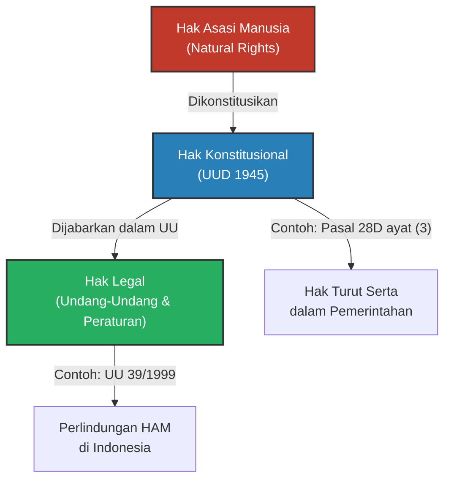
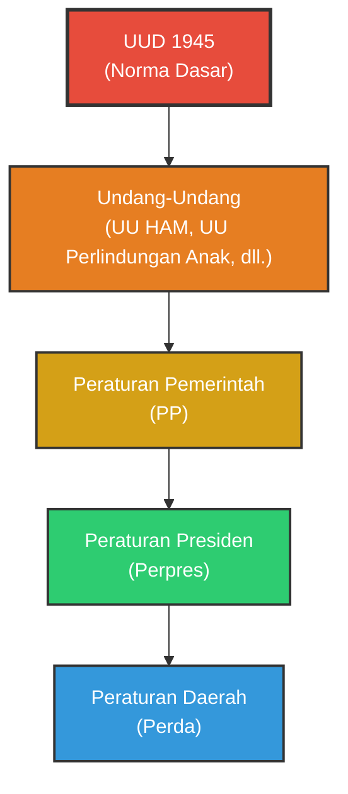
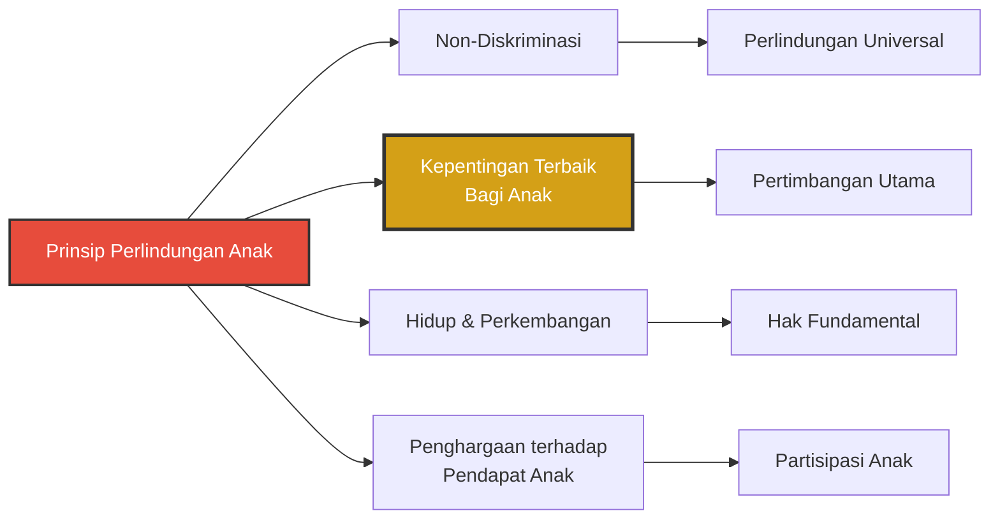
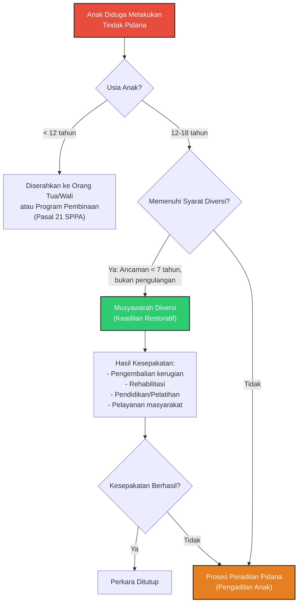
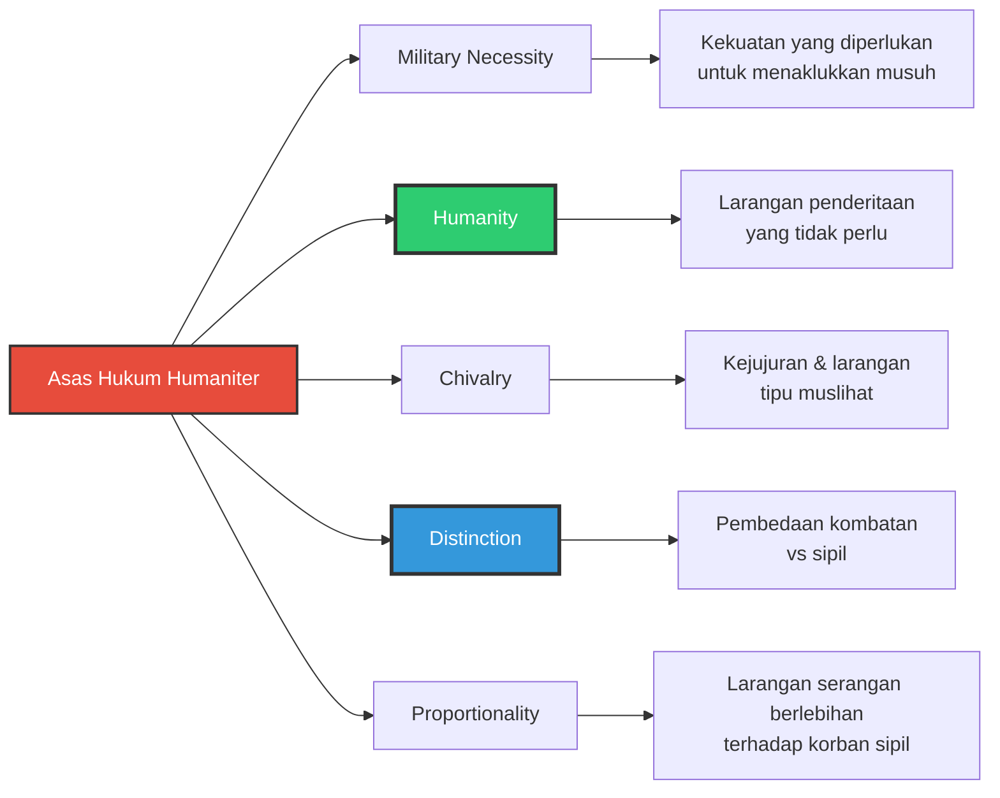
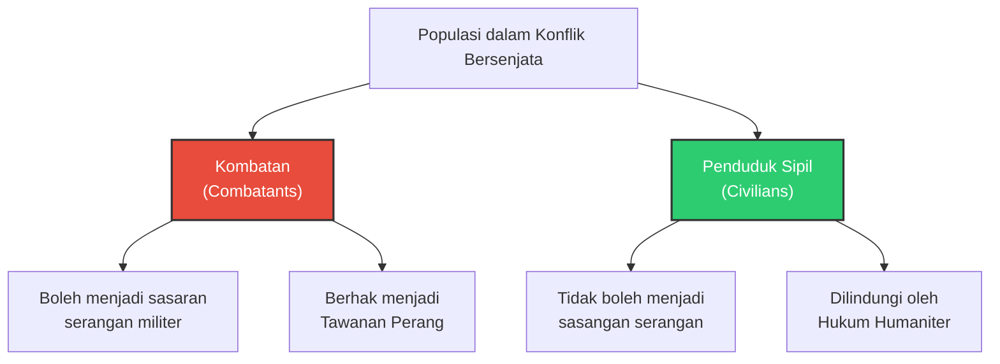

> [!ABSTRACT]
> Dokumen ini menyajikan catatan akademik lengkap mengenai tiga pilar utama Hukum dan Hak Asasi Manusia (HUHAM):  **(1) Hak Turut Serta dalam Pemerintahan (HTSDP)**, yang menganalisis hak partisipasi warga negara dari perspektif konstitusional, legal, dan demokratis;  **(2) Hak Anak**, yang membahas definisi anak dalam sistem hukum Indonesia, prinsip-prinsip perlindungan berdasarkan Konvensi Hak Anak (CRC), serta mekanisme peradilan pidana anak termasuk diversi dan keadilan restoratif; dan  **(3) Hukum Humaniter Internasional**, yang mencakup sejarah, sumber hukum, asas-asas (military necessity, humanity, distinction, proportionality), serta mekanisme penegakan dari tingkat nasional hingga Mahkamah Pidana Internasional (ICC).  Catatan ini disusun berdasarkan Undang-Undang Dasar 1945, UU No. 39/1999 tentang HAM, UU No. 23/2002 tentang Perlindungan Anak, UU No. 11/2012 tentang Sistem Peradilan Pidana Anak (SPPA), Konvensi Jenewa 1949, Protokol Tambahan 1977, ICCPR, ICESCR, CRC, dan instrumen hukum internasional lainnya, dengan penambahan konteks perbandingan, kritik implementasi, dan studi kasus ilustratif.

---

## 1. Pendahuluan: Hak Asasi Manusia, Hak Konstitusional, dan Hak Legal

### 1.1 Definisi dan Klasifikasi Hak

Dalam terminologi hukum Indonesia, terdapat tiga kategori hak yang sering tumpang tindih namun memiliki landasan filosofis dan yuridis yang berbeda:

1. **Hak Asasi Manusia (Human Rights / *Natural Rights*)**: Hak yang melekat pada manusia sejak lahir karena dia adalah manusia (*human being*). Hak ini bersifat **inalienable** (tidak dapat dicabut), **universal**, dan tidak bergantung pada pengakuan negara. Contoh: hak untuk hidup, hak untuk bebas dari penyiksaan, dan hak atas kebebasan pikiran. Filosofinya berakar pada pemikiran John Locke tentang *"life, liberty, and property"* serta teori hak alamiah (*natural law*).

2. **Hak Konstitusional (Constitutional Rights)**: Hak-hak yang dijamin dan diatur secara tegas dalam konstitusi suatu negara. Di Indonesia, hak konstitusional dijamin dalam **UUD 1945**, terutama Pasal 28A–28J (hasil amandemen). Hak asasi manusia yang telah tercantum dalam UUD 1945 secara otomatis menjadi hak konstitusional. Namun, *tidak semua hak konstitusional adalah hak asasi manusia*; ada hak konstitusional yang bersifat khusus bagi warga negara tertentu (misalnya hak memilih yang hanya dimiliki warga negara, bukan setiap orang).

3. **Hak Legal (Legal Rights / *Civil Rights*)**: Hak yang diberikan oleh undang-undang atau peraturan perundang-undangan di bawah konstitusi (*subordinate legislations*). Hak ini dapat diubah, dikurangi, atau dicabut oleh pembentuk undang-undang sesuai dengan prosedur yang berlaku. Contoh: hak atas tunjangan tertentu, hak atas izin usaha, atau hak atas jaminan sosial yang diatur dalam peraturan pemerintah.

> [!IMPORTANT]
> **Relasi Hierarkis**: UUD 1945 → UU HAM (UU 39/1999) → UU Sektor (Perlindungan Anak, SPPA, dll.) → Peraturan Pemerintah/Perpres. Hak asasi manusia yang dikonstitusikan menjadi **hak konstitusional**, kemudian dijabarkan menjadi **hak legal** melalui undang-undang.

### 1.2 Hierarki Instrumen Hukum di Indonesia

> [!NOTE]
> Sebagai norma fundamental, konstitusi mencerminkan nilai dasar yang disepakati sebagai *nilai bersama* masyarakat dan warga negara. Pembentukan negara adalah perwujudan keinginan terhadap kedaulatan bersama atas tujuan bersama, dengan semangat dan cara yang disepakati secara bersama-sama. Oleh karena itu, hak-hak yang diatur dalam konstitusi tidak dapat dipisahkan dari keinginan masyarakat tentang bagaimana hak-hak mereka harus diatur.

---

## 2. Hak Turut Serta dalam Pemerintahan (HTSDP)

### 2.1 Definisi dan Ruang Lingkup

**Hak Turut Serta dalam Pemerintahan** (*The Right to Participate in Government*) adalah hak setiap warga negara untuk terlibat dalam penyelenggaraan pemerintahan, baik secara langsung (*direct participation*) maupun tidak langsung melalui perwakilan yang dipilih secara bebas (*representative democracy*).

Dalam UUD 1945, hak ini dijamin dalam **Pasal 28D ayat (3)**: *"Setiap warga negara berhak memperoleh kesempatan yang sama dalam pemerintahan"*. Pasal ini menempatkan HTSDP sebagai **hak konstitusional** sekaligus **hak warga negara** (*citizenship right*), artinya hanya warga negara Indonesia yang memiliki hak ini, berbeda dengan hak asasi manusia yang dimiliki oleh *setiap orang* (*every person*) tanpa memandang status kewarganegaraan.

HTSDP dapat dianalisis dari dua sudut pandang:
- **Sudut kedudukannya sebagai hak**: Sebagai bagian dari hak demokratis yang menjamin setiap warga negara memiliki *equal opportunity* untuk berpartisipasi.
- **Sudut ruang lingkupnya**: Sebagai bentuk keikutsertaan masyarakat/warga negara dalam pemerintahan, yang mencakup pemilihan umum, pemilihan langsung kepala daerah, partisipasi dalam pembuatan kebijakan publik, dan pengawasan terhadap penyelenggaraan pemerintahan.

> [!QUOTE]
> *"Terkadang norma atau nilai yang terbentuk dalam masyarakat berjalan jauh lebih cepat daripada norma atau kaedah hukum yang tercipta dalam suatu peraturan perundang-undangan."* Fenomena ini menunjukkan adanya *gap* antara *living law* (hukum yang hidup dalam masyarakat) dan *positive law* (hukum tertulis), sehingga pembentuk undang-undangan harus responsif terhadap perkembangan nilai-nilai demokrasi di masyarakat.

### 2.2 Instrumen Internasional

#### 2.2.1 Deklarasi Universal Hak Asasi Manusia (DUHAM / UDHR) – 1948

**Pasal 21** DUHAM mengatur hak partisipasi politik dalam tiga butir:

| Butir | Isi | Makna Hukum |
|-------|-----|-------------|
| 1 | *Everyone has the right to take part in the government of his country, directly or through freely chosen representatives.* | Menegaskan partisipasi langsung dan perwakilan sebagai dua jalur utama. |
| 2 | *Everyone has the right of equal access to public service in his country.* | Menjamin akses yang setara ke jabatan publik (aparatur sipil negara). |
| 3 | *The will of the people shall be the basis of the authority of government... expressed in periodic and genuine elections which shall be by universal and equal suffrage and shall be held by secret vote or by equivalent free voting procedures.* | Menegaskan kedaulatan rakyat (*popular sovereignty*) sebagai sumber legitimasi pemerintahan. |

#### 2.2.2 Kovenan Internasional tentang Hak-Hak Sipil dan Politik (ICCPR) – 1966

Diratifikasi Indonesia melalui **UU No. 12 Tahun 2005**. **Pasal 25** ICCPR menjabarkan tiga komponen hak partisipasi politik:
1. Hak untuk mengambil bagian dalam pengelolaan urusan publik (*directly or through freely chosen representatives*).
2. Hak untuk memilih dan dipilih dalam pemilihan umum yang berkala, dengan hak pilih universal dan setara, serta pemungutan suara rahasia.
3. Hak untuk memiliki akses yang setara kepada jabatan publik (*equal access to public service*).

> [!NOTE]
> General Comment No. 25 (1996) dari Human Rights Committee menjelaskan bahwa hak dalam Pasal 25 ICCPR tidak hanya mencakup hak formal untuk memilih, tetapi juga mencakup **hak untuk menjadi anggota partai politik**, **hak untuk kampanye**, dan **hak untuk mendapatkan informasi** yang memadai untuk membuat pilihan yang terinformasi.

#### 2.2.3 Deklarasi Kairo tentang Hak Asasi Manusia dalam Islam (Cairo Declaration) – 1990

Diadopsi pada Konferensi Menteri Luar Negeri Islam ke-19 di Kairo, 5 Agustus 1990. **Pasal 23(b)** menyatakan:
> *"Setiap orang berhak untuk berpartisipasi, secara langsung atau tidak langsung dalam administrasi urusan publik negaranya. Dia juga memiliki hak untuk memangku jabatan publik sesuai dengan ketentuan Syariah."*

Perbedaan mendasar dengan instrumen universal adalah adanya kualifikasi *"sesuai dengan ketentuan Syariah"*, yang menunjukkan pendekatan hak asasi manusia berbasis nilai keislaman.

#### 2.2.4 Deklarasi Hak Asasi Manusia ASEAN (ASEAN Human Rights Declaration) – 2012

Diadopsi pada 18 November 2012 di Phnom Penh, Kamboja. Bagian *Civil and Political Rights* angka 25 menyatakan:
> *"Setiap orang yang merupakan warga negara di negaranya memiliki hak untuk berpartisipasi dalam pemerintahan di negaranya, baik secara langsung maupun tidak langsung melalui perwakilan yang dipilih secara demokratis, sesuai dengan hukum nasional..."*

> [!WARNING]
> ASEAN Human Rights Declaration mengandung klausul *"sesuai dengan hukum nasional"* yang lebih luas dibandingkan instrumen universal, sehingga memberikan *margin of appreciation* yang besar bagi negara-negara ASEAN untuk membatasi hak partisipasi berdasarkan undang-undang domestik.

#### 2.2.5 Deklarasi PBB tentang Hak dan Tanggung Jawab Individu, Kelompok, dan Organ Masyarakat (1999)

Dokumen ini, yang sering disebut *Declaration on Human Rights Defenders*, menegaskan dalam **Pasal 1** bahwa setiap orang memiliki hak untuk mempromosikan dan melindungi HAM. **Pasal 2** menegaskan tanggung jawab utama negara untuk melindungi HAM, dan **Pasal 3** menegaskan bahwa hukum domestik harus konsisten dengan Piagam PBB.

### 2.3 Instrumen Nasional

#### 2.3.1 UUD 1945

| Pasal | Isi | Kategori Hak |
|-------|-----|--------------|
| 28D ayat (1) | Pengakuan, jaminan, perlindungan, dan kepastian hukum yang adil serta perlakuan sama di hadapan hukum. | Hak Umum (setiap orang) |
| 28D ayat (2) | Hak untuk bekerja serta mendapat imbalan dan perlakuan yang adil dan layak. | Hak Ekonomi |
| **28D ayat (3)** | **Setiap warga negara berhak memperoleh kesempatan yang sama dalam pemerintahan.** | **Hak Warga Negara** |
| 28D ayat (4) | Hak atas status kewarganegaraan. | Hak Warga Negara |

#### 2.3.2 UU No. 39 Tahun 1999 tentang Hak Asasi Manusia (UU HAM)

> [!IMPORTANT]
> **UU HAM** (UU 39/1999) menjabarkan hak turut serta dalam pemerintahan secara lebih rinci dalam **Pasal 43–44**.

| Pasal | Isi | Makna Yuridis |
|-------|-----|---------------|
| 43 ayat (1) | Setiap warga negara berhak dipilih dan memilih dalam pemilu berdasarkan persamaan hak, melalui pemungutan suara yang **langsung, umum, bebas, rahasia, jujur, dan adil** (Luber Jurdil). | Pemilu adalah **instrumen utama** untuk mewujudkan hak turut serta dalam pemerintahan. |
| 43 ayat (2) | Setiap warga negara berhak turut serta dalam pemerintahan secara langsung atau melalui wakil yang dipilihnya dengan bebas. | Menegaskan prinsip partisipasi **langsung** dan **perwakilan**. |
| 43 ayat (3) | Setiap warga negara dapat diangkat dalam setiap jabatan pemerintahan. | Memberikan kesempatan pada warga negara untuk turut serta dalam pemerintahan secara langsung melalui kinerja mereka dalam berbagai jabatan publik. |
| 44 | Setiap orang berhak mengajukan pendapat, permohonan, pengaduan, dan/atau usulan kepada pemerintah dalam rangka pelaksanaan pemerintahan yang bersih, efektif, dan efisien. | Rakyat dapat terus mengawasi jalannya pemerintahan, memberikan masukan, pendapat, pengaduan, maupun permohonan kepada pemerintah yang sedang berkuasa. |

> [!NOTE]
> Prinsip **Luber Jurdil** (Langsung, Umum, Bebas, Rahasia, Jujur, dan Adil) merupakan standard minimum pemilu demokratis yang juga diakui dalam praktik internasional. Prinsip ini kemudian diatur lebih lanjut dalam **UU No. 7 Tahun 2017 tentang Pemilihan Umum** (sebagai perubahan dari UU sebelumnya).

### 2.4 HTSDP sebagai Hak Konstitusional dan Hak Legal

#### 2.4.1 Sebagai Hak Konstitusional

Esensi dari konstitusi yang berisi perlindungan hak-hak asasi manusia mencerminkan suatu bentuk **persamaan setiap manusia di hadapan hukum**. Konstitusi merupakan wujud keikutsertaan masyarakat dan warga negara dalam sebuah pemerintahan, karena pembentukan sebuah negara adalah perwujudan keinginan terhadap suatu kedaulatan bersama atas tujuan bersama, dengan semangat dan cara yang disepakati secara bersama-sama. Tujuan bersama dan cara untuk menjalankan negara tersebut dilaksanakan oleh suatu pemerintahan.

#### 2.4.2 Sebagai Hak Legal (Legal Rights)

Hak konstitusional adalah hak-hak yang dijamin di dalam dan oleh UUD 1945. Hak-hak legal timbul berdasarkan jaminan undang-undang dan peraturan perundang-undangan di bawahnya. Hak turut serta dalam pemerintahan dapat dikategorikan sebagai hak legal karena keberadaannya yang memang timbul karena adanya aturan dan jaminan undang-undang terhadap hak tersebut, misalnya UU Pemilu, UU Pilkada, UU ASN, dan peraturan lainnya yang mengatur mekanisme partisipasi.

### 2.5 HTSDP sebagai Ciri dari Negara Demokratis

Robert Dahl (1989) dalam bukunya *"Democracy and Its Critics"*, mengemukakan bahwa untuk mencapai demokrasi yang ideal dibutuhkan lima kriteria:

| Kriteria | Definisi | Relevansi di Indonesia |
|----------|----------|------------------------|
| **Effective Participation** | Warga negara harus memiliki peluang yang setara dan memadai terhadap pilihan dan tempat mereka dalam ruang publik. | Partisipasi dalam pemilu, musyawarah desa, dan pengawasan penyelenggaraan pemerintahan. |
| **Voting Equality at the Decisive Stage** | Setiap warga negara harus diyakinkan bahwa penilaiannya akan dianggap sama dengan penilaian orang lain. | Prinsip *"one person, one vote, one value"* dalam pemilu. |
| **Enlightened Understanding** | Warga negara harus menikmati kesempatan yang sama untuk memilih apa yang terbaik bagi mereka. | Hak atas informasi publik (UU No. 14 Tahun 2008 tentang Keterbukaan Informasi Publik). |
| **Control of the Agenda** | Setiap orang harus memiliki kesempatan untuk memutuskan masalah/kebijakan apa yang penting dan harus didiskusikan terlebih dahulu. | Mekanisme *citizen initiative* atau pengajuan usul RUU oleh DPRD bersama rakyat. |
| **Inclusiveness** | Kesetaraan harus diperluas ke seluruh warga negara dan setiap orang memiliki legitimasi dalam proses politik. | Penghapusan diskriminasi dalam pemilu berdasarkan gender, etnis, atau agama. |

> [!NOTE]
> Agenda tersebut merupakan upaya untuk mewujudkan **tata pemerintahan yang baik** (*good governance*), antara lain: keterbukaan, akuntabilitas, efektivitas, dan efisiensi, menjunjung tinggi supremasi hukum, dan membuka partisipasi masyarakat yang dapat menjamin kelancaran, keserasian, dan keterpaduan tugas dan fungsi penyelenggaraan pemerintahan dan pembangunan.

### 2.6 Kewajiban Dasar dan Tanggung Jawab Pemerintah

| Pasal UU HAM | Isi | Interpretasi |
|--------------|-----|--------------|
| **Pasal 70** | Dalam menjalankan hak dan kebebasannya, setiap orang wajib tunduk kepada pembatasan yang ditetapkan undang-undang dengan maksud untuk menjamin pengakuan serta penghormatan atas hak dan kebebasan orang lain dan untuk memenuhi tuntutan yang adil sesuai dengan pertimbangan moral, keamanan, dan ketertiban umum dalam suatu masyarakat demokratis. | Pembatasan hak harus berdasarkan **undang-undang**, tidak boleh sewenang-wenang, dan harus untuk tujuan yang sah dalam masyarakat demokratis. |
| **Pasal 71** | Pemerintah wajib dan bertanggung jawab menghormati, melindungi, menegakkan, dan memajukan hak asasi manusia yang diatur dalam UU ini, peraturan perundang-undangan lain, dan hukum internasional tentang HAM yang diterima oleh Indonesia. | Menegaskan kewajiban negara (*obligation to respect, protect, and fulfill*) terhadap HAM. |
| **Pasal 73** | Hak dan kebebasan yang diatur dalam UU ini hanya dapat dibatasi oleh dan berdasarkan undang-undang, semata-mata untuk menjamin pengakuan dan penghormatan terhadap HAM serta kebebasan dasar orang lain, kesusilaan, ketertiban umum dan kepentingan bangsa. | Prinsip **legalitas pembatasan hak**: pembatasan harus berdasarkan UU, tidak boleh bertentangan dengan esensi hak, dan harus proporsional. |

> [!IMPORTANT]
> Prinsip *"dibatasi oleh dan berdasarkan undang-undang"* dalam Pasal 73 UU HAM sejalan dengan **Pasal 4 ayat (2) ICCPR** dan **Pasal 4 UU HAM** tentang hak yang tidak dapat dikurangi dalam keadaan apapun (*non-derogable rights*).

### 2.7 Mekanisme Pemenuhan dan Penegakan HTSDP

#### 2.7.1 Pemerintah/Pemerintah Daerah

1. Menyelenggarakan pemilihan umum secara reguler dan berkala.
2. Meningkatkan akuntabilitas pejabat publik.
3. Memberikan kesempatan bagi masyarakat untuk mengambil bagian dalam urusan publik (musyawarah perencanaan pembangunan, *participatory budgeting*).
4. Meningkatkan transparansi lembaga publik termasuk prosedur pembuatan kebijakannya.
5. Meningkatkan akses masyarakat seluas mungkin terhadap informasi tentang kegiatan otoritas nasional dan lokal (sesuai UU KIP).

#### 2.7.2 Mahkamah Konstitusi (MK)

MK menegakkan konstitutionalisme berdasarkan hak asasi yang membentuk norma konstitusi, sebagai sistem kontrol yang demokratis. MK berwenang menguji undang-undang terhadap UUD 1945 (*judicial review*), sehingga dapat membatalkan undang-undang yang membatasi hak partisipasi secara berlebihan atau diskriminatif. Contoh: Putusan MK No. 102/PUU-XIII/2015 tentang verifikasi partai politik, dan berbagai putusan terkait pemilu.

#### 2.7.3 Komnas HAM

1. Mengembangkan kondisi yang kondusif bagi pelaksanaan hak asasi manusia sesuai dengan Pancasila, UUD 1945, Piagam PBB, dan DUHAM.
2. Meningkatkan perlindungan dan penegakan hak asasi manusia guna berkembangnya pribadi manusia Indonesia seutuhnya dan kemampuannya berpartisipasi dalam berbagai bidang kehidupan.

> [!QUOTE]
> *"Sebagai contoh dalam hal pemerintah membuat suatu kebijakan publik, maka diharapkan adanya suatu konsep keterlibatan seluruh unsur yang berhubungan dengan tujuan adanya kebijakan tersebut. Sehingga dikeluarkannya sebuah kebijakan oleh pemerintah bertujuan untuk mengurus dan mengatur publik, bukan sebagai alat yang digunakan untuk merugikan masyarakat."*

### 2.8 Perbandingan dengan Negara Lain dan Kritik Implementasi di Indonesia

| Aspek | Indonesia | Praktik Internasional (Contoh: Jerman/Skandinavia) |
|-------|-----------|-----------------------------------------------------|
| **Partisipasi Langsung** | Terbatas pada pemilu dan pilkada; *referendum* hanya untuk daerah otonomi baru (UU No. 5 Tahun 1974). | *Referendum* dan *citizen initiative* umum di Swiss; *Bürgerbegehren* di Jerman. |
| **Transparansi Kebijakan** | UU KIP 2008 memberikan akses, namun praktik *open government* masih berkembang. | *Freedom of Information Act* di banyak negara dengan sanksi tegas bagi pelanggar. |
| **Pengawasan** | Komnas HAM dan Ombudsman berperan, namun seringkali rekomendasi tidak mengikat. | *National Human Rights Institutions* (NHRI) dengan status A (Paris Principles) memiliki kewenangan investigasi yang lebih kuat. |

> [!WARNING]
> **Kritik Implementasi**: Meskipun kerangka hukum HTSDP di Indonesia relatif lengkap, praktiknya masih menghadapi tantangan: (1) *money politics* dan politik uang dalam pemilu; (2) rendahnya partisipasi perempuan dan kelompok marginal dalam politik; (3) keterbatasan akses informasi di tingkat daerah; (4) lemahnya mekanisme *accountability* terhadap pelanggaran hak partisipasi.

---

## 3. Hak Anak

### 3.1 Definisi "Anak" dalam Sistem Hukum Indonesia

Definisi "anak" tidak seragam dalam peraturan perundang-undangan Indonesia. Perbedaan ini mencerminkan berbagai pendekatan hukum berdasarkan tujuan pengaturan (perkawinan, ketenagakerjaan, pidana, atau perlindungan umum).

| Sumber Hukum | Definisi Anak | Usia/Kriteria |
|--------------|---------------|---------------|
| **Pasal 1 butir 5 UU HAM** (UU 39/1999) | Mereka yang berumur kurang dari 18 tahun dan belum pernah kawin. | < 18 tahun, belum kawin |
| **Pasal 1 butir 1 UU 23/2002** (UU Perlindungan Anak) | Seseorang yang belum berusia 18 tahun, termasuk anak di dalam kandungan. | < 18 tahun, termasuk janin |
| **Pasal 1 butir 2 UU 4/1979** (UU Kesejahteraan Anak) | Mereka yang berusia kurang dari 21 tahun dan belum pernah kawin. | < 21 tahun, belum kawin |
| **Pasal 330 KUHPerdata** | Mereka yang berusia kurang dari 21 tahun. | < 21 tahun |
| **Pasal 7 UU 1/1974** (UU Perkawinan) | Usia minimum menikah: 19 tahun (pria) dan 16 tahun (wanita) [sebelum putusan MK]. | [VERIFICATION NEEDED: Putusan MK No. 22/PUU-XV/2017 menyatakan batas usia nikah 16 tahun bagi perempuan adalah diskriminasi, sehingga batas usia menikah bagi laki-laki dan perempuan sama-sama 19 tahun. Namun, perlu diverifikasi apakah UU Perkawinan telah diubah secara resmi pasca-putusan MK atau hanya putusan MK yang berlaku.] |
| **Pasal 1 butir 26 UU 13/2003** (UU Ketenagakerjaan) | Mereka yang berumur kurang dari 18 tahun. | < 18 tahun |
| **Pasal 4 UU 3/1997** (UU Pengadilan Anak) | Untuk pertanggungjawaban pidana, usia minimal anak adalah 12 tahun. | 12–18 tahun (pidana) |
| **Pasal 1 CRC** (Konvensi Hak Anak) | Setiap manusia di bawah usia 18 tahun kecuali menurut hukum yang berlaku bagi anak, dewasa dicapai lebih awal. | < 18 tahun (standar internasional) |

> [!IMPORTANT]
> Dengan berlakunya **UU No. 35 Tahun 2014** (Perubahan atas UU 23/2002) dan **UU No. 17 Tahun 2016**, batasan usia anak dalam UU Perlindungan Anak (di bawah 18 tahun, termasuk janin) merupakan standar yang berlaku umum, kecuali untuk anak yang berhadapan dengan hukum yang tunduk pada **UU No. 11 Tahun 2012** tentang Sistem Peradilan Pidana Anak (SPPA) dan UU No. 3/1997 tentang Pengadilan Anak.

### 3.2 Prinsip-Prinsip Perlindungan Anak

Prinsip-prinsip ini diatur dalam **Bab II Pasal 2 UU No. 23 Tahun 2002** tentang Perlindungan Anak, yang sejalan dengan **Pasal 2–3 CRC**:

| Prinsip | UU 23/2002 | CRC | Penjelasan |
|---------|------------|-----|------------|
| **Non-diskriminasi** | Pasal 2 ayat (1) | Pasal 2 | Tidak adanya perlakuan yang membeda-bedakan anak berdasarkan suku, agama, ras, golongan, jenis kelamin, etnis, budaya, bahasa, status hukum, urutan kelahiran, serta kondisi fisik dan/atau mental. |
| **Kepentingan Terbaik Bagi Anak** (*Best Interest of the Child*) | Pasal 2 ayat (2) | Pasal 3 | Dalam semua tindakan yang menyangkut anak, kepentingan yang terbaik bagi anak harus menjadi pertimbangan utama. |
| **Hak untuk Hidup, Kelangsungan Hidup, dan Perkembangan** | Pasal 2 ayat (3) | Pasal 6 | Hak asasi yang paling mendasar, dilindungi oleh negara, pemerintah, masyarakat, keluarga, dan orang tua. |
| **Penghargaan terhadap Pendapat Anak** | Pasal 2 ayat (4) | Pasal 12 | Penghormatan atas hak anak untuk berpartisipasi dan menyatakan pendapatnya dalam pengambilan keputusan yang menyangkut kehidupannya, disesuaikan dengan usia dan kematangan. |

### 3.3 Instrumen Internasional

| Instrumen | Tahun | Ratifikasi Indonesia | Hak Anak yang Diatur |
|-----------|-------|---------------------|----------------------|
| **Deklarasi Jenewa tentang Hak-Hak Anak** | 1924 | – | Hak anak atas bantuan kemanusiaan (pra-CRC). |
| **DUHAM (UDHR)** | 1948 | – | Pasal 25 ayat (2): anak berhak atas perawatan dan bantuan khusus. |
| **ICCPR** | 1966 | UU No. 12/2005 | Pasal 24: perlindungan anak tanpa diskriminasi; Pasal 6: hak hidup. |
| **ICESCR** | 1966 | UU No. 11/2005 | Pasal 10 ayat (3): perlindungan khusus bagi anak dan remaja dari eksploitasi ekonomi dan sosial. |
| **CRC (Konvensi Hak Anak)** | 1989 | Keppres No. 36/1990 | Pasal 6–41: hak hidup, identitas, keluarga, kesehatan, pendidikan, perlindungan dari kekerasan, dll. |
| **Konvensi ILO No. 138** | 1973 | UU No. 20/1999 | Batas usia minimum untuk bekerja. |
| **Konvensi ILO No. 182** | 1999 | UU No. 1/2000 | Pelarangan bentuk-bentuk pekerjaan terburuk untuk anak. |
| **Riyadh Guidelines** | 1990 | – | Pencegahan delinkuensi juvenile. |
| **Beijing Rules** | 1985 | – | Standar administrasi peradilan anak (Rule 7: *age of criminal responsibility*). |
| **General Comment No. 10 CRC** | 2007 | – | Hak anak dalam sistem peradilan pidana juvenile; usia minimum pidana tidak boleh di bawah 12 tahun. |

> [!NOTE]
> CRC merupakan konvensi HAM yang paling banyak diratifikasi dalam sejarah (196 negara per Oktober 2015). Hanya Amerika Serikat yang belum meratifikasi, meskipun telah menandatangani konvensi tersebut.

### 3.4 Instrumen Nasional

| Undang-Undang | Keterangan |
|---------------|------------|
| **UUD 1945** | Pasal 28B ayat (2): setiap anak berhak atas kelangsungan hidup, tumbuh, dan berkembang serta berhak atas perlindungan dari kekerasan dan diskriminasi. |
| **UU No. 39/1999** (UU HAM) | Pasal 52–66 mengatur hak anak secara spesifik. |
| **UU No. 23/2002** (UU Perlindungan Anak) | Mengatur hak anak, kewajiban orang tua, dan sanksi pidana. Diubah oleh UU No. 35/2014 dan UU No. 17/2016. |
| **UU No. 3/1997** (UU Pengadilan Anak) | Mengatur peradilan bagi anak yang melakukan tindak pidana. |
| **UU No. 11/2012** (SPPA) | Sistem Peradilan Pidana Anak, mulai berlaku 2014, menggantikan sebagian UU 3/1997. |
| **UU No. 36/2009** (UU Kesehatan) | Mengatur kesehatan ibu, bayi, dan anak; Pasal 75–76 tentang aborsi. |
| **UU No. 12/2006** (UU Kewarganegaraan) | Mengatur kewarganegaraan anak, termasuk dari perkawinan campuran. |
| **UU No. 23/2004** (UU PKDRT) | Perlindungan anak dari kekerasan dalam rumah tangga. |
| **UU No. 21/2007** (UU Tindak Pidana Perdagangan Orang) | Perlindungan anak dari trafficking. |
| **UU No. 13/2006** (UU Perlindungan Saksi dan Korban) | Perlindungan anak sebagai saksi/korban. |
| **UU No. 20/2003** (Sisdiknas) | Pasal 5 ayat (2): pendidikan khusus bagi penyandang disabilitas. |

### 3.5 Hak Anak menurut UU HAM (Pasal 52–66) – Tabel Ringkasan

#### Hak yang Bersifat Umum

| Pasal | Hak | Penjelasan Singkat |
|-------|-----|-------------------|
| **52** | Hak untuk dilindungi oleh orang tua, masyarakat, dan negara; diakui dan dilindungi oleh hukum sejak dalam kandungan. | Hak anak adalah HAM; perlindungan dimulai sejak konsepsi. |
| **53** | Hak atas kehidupan, kelangsungan hidup, nama, dan kewarganegaraan. | Hak fundamental yang melekat sejak lahir. |
| **55** | Hak untuk beribadah menurut agamanya; berpikir dan berekspresi sesuai tingkat intelektualitas di bawah bimbingan orang tua. | Kebebasan beragama dan berekspresi dengan kualifikasi bimbingan orang tua. |
| **56** | Hak untuk mengetahui siapa orang tuanya; hak untuk dibesarkan dan dipelihara sendiri oleh orang tuanya. | Hak atas identitas asal-usul dan hak untuk tumbuh dalam keluarga asal. |
| **57** | Hak untuk dibesarkan, dipelihara, dirawat, dididik, diarahkan, dan dibimbing oleh orang tua/wali sampai dewasa; hak memperoleh orang tua angkat. | Hak parental care dan hak adopsi. |
| **58** | Perlindungan hukum dari segala bentuk kekerasan, penganiayaan, penelantaran, perlakuan buruk, dan pelecehan seksual dari orang tua/wali. | Perlindungan dari *child abuse* dalam lingkungan keluarga. |
| **59** | Hak untuk tidak dipisahkan dari orang tuanya (kecuali untuk kepentingan terbaik anak berdasarkan aturan hukum yang sah). | Prinsip *best interest* dalam kasus perceraian orang tua. |
| **60** | Hak memperoleh pendidikan dan informasi yang bermanfaat bagi pengembangan pribadi. | Hak pendidikan dan hak informasi yang sesuai usia. |
| **61** | Hak untuk beristirahat, bergaul dengan anak sebaya, bermain, berekreasi, dan berkreasi. | Hak rekreasi dan *leisure* untuk perkembangan psikososial. |
| **62** | Hak atas pelayanan kesehatan dan jaminan sosial. | Hak kesehatan dan perlindungan sosial. |
| **63** | Hak untuk tidak dilibatkan dalam perang, sengketa bersenjata, kerusuhan sosial, dan peristiwa berunsur kekerasan. | Perlindungan dari *child soldiering* dan eksploitasi militer. |
| **64** | Hak memperoleh perlindungan dari eksploitasi ekonomi dan pekerjaan yang membahayakan. | Perlindungan dari *child labor* yang berbahaya. |
| **65** | Hak memperoleh perlindungan dari eksploitasi dan pelecehan seksual, penculikan, perdagangan anak, serta penyalahgunaan napza. | Perlindungan dari *trafficking* dan eksploitasi seksual komersial. |

#### Hak yang Bersifat Khusus

| Pasal | Hak | Penjelasan Singkat |
|-------|-----|-------------------|
| **54** | Anak cacat fisik/mental berhak atas perawatan, pendidikan, pelatihan, dan bantuan khusus atas biaya negara. | Affirmative action bagi penyandang disabilitas. |
| **66** | Anak yang melakukan tindak pidana tidak boleh dianiaya, disiksa, atau dijatuhi hukuman tidak manusiawi; hukuman mati/seumur hidup dilarang. | *Juvenile justice*; perlindungan dalam sistem peradilan pidana. |

### 3.6 Hak-Hak Spesifik Anak

#### 3.6.1 Hak untuk Hidup

Hak untuk hidup merupakan hak asasi yang paling mendasar. **Pasal 53 ayat (1) UU HAM** menyatakan setiap anak sejak dalam kandungan berhak untuk hidup, mempertahankan hidup, dan meningkatkan taraf kehidupannya.

- **Aborsi**: Secara umum, aborsi tanpa alasan yang sah merupakan pelanggaran HAM karena merampas hak untuk hidup janin. **Pasal 346 KUHP** melarang pengguguran kandungan. Namun, **UU No. 36/2009** (UU Kesehatan) Pasal 75 memberikan pengecualian: aborsi dapat dilakukan jika ada indikasi kedaruratan medis dan kehamilan akibat perkosaan, dengan syarat tertentu (Pasal 75–76).
- **ICCPR Pasal 6 ayat (1)**: Setiap manusia berhak atas hak untuk hidup yang melekat pada dirinya dan wajib dilindungi oleh hukum; tak seorang pun dapat dirampas hak hidupnya secara sewenang-wenang.
- **SPPA**: Peniadaan hukuman mati terhadap anak yang melakukan tindak pidana menegaskan hak anak untuk hidup. **Pasal 66 UU HAM** dan **Pasal 6 ayat (5) ICCPR** tegas melarang hukuman mati bagi anak.

> [!WARNING]
> **Studi Kasus Ilustratif**: Perdebatan aborsi di Indonesia seringkali bertabrakan antara hak janin untuk hidup (pro-life) dan hak perempuan atas kesehatan reproduksi serta perlindungan korban perkosaan (pro-choice). UU Kesehatan 2009 mencoba menyeimbangkan keduanya, namun implementasinya masih menghadapi tantangan akses pelayanan kesehatan yang memadai dan stigma sosial.

#### 3.6.2 Hak Atas Suatu Nama

**Pasal 53 ayat (2) UU HAM**: Setiap anak sejak kelahirannya berhak atas suatu nama. **Pasal 24 ayat (2) ICCPR**: Setiap anak harus didaftarkan segera setelah kelahirannya. **Pasal 5a UU 23/2002**: Setiap anak berhak atas nama sebagai identitas diri.

- **Pasal 27–28 UU 23/2002**: Identitas anak harus dituangkan dalam akta kelahiran berdasarkan surat keterangan dari saksi kelahiran. Jika orang tua tidak diketahui, akta kelahiran dibuat berdasarkan keterangan penemu.
- **Anak di luar kawin**: Anak luar kawin hanya memiliki hubungan perdata dengan ibunya (Pasal 43 UU 1/1974). Namun, jika ayah mengakuinya, anak tetap berhak menyandang nama ayahnya dan mencantumkannya di akta kelahiran (Pasal 43 UU 1/1974 yang diubah berdasarkan Putusan MK No. 46/PUU-VIII/2010 tentang status anak luar kawin).

#### 3.6.3 Hak Atas Kewarganegaraan

**Pasal 53 ayat (2) UU HAM**, **Pasal 24 ayat (3) ICCPR**, dan **Pasal 15 ayat (1) DUHAM** menjamin hak anak atas kewarganegaraan.

- **Asas Ius Sanguinis**: Kewarganegaraan berdasarkan keturunan (darah). Prinsip utama dalam **UU No. 12/1958** (Penjelasan Umum) dan **UU No. 12/2006** (UU Kewarganegaraan). Anak mengikuti kewarganegaraan ayahnya (Pasal 1 sub b dan c UU 12/1958); jika tidak memiliki hubungan hukum dengan ayah, mengikuti ibunya (sub e).
- **Asas Ius Soli**: Pengecualian bagi anak yang lahir di wilayah RI dengan orang tua tidak diketahui, stateless, atau tidak memperoleh kewarganegaraan dari orang tuanya (Pasal 1 huruf f, g, h, i UU 12/1958; Pasal 4).
- **Perkawinan Campuran**: **Pasal 29 UU 23/2002** dan **UU 12/2006**: Anak dari perkawinan campuran berhak memperoleh kewarganegaraan dari ayah atau ibunya. Saat ini, anak dari perkawinan campuran yang sah memiliki kewarganegaraan ganda hingga berusia 18 tahun, kemudian harus memilih (Pasal 6 UU 12/2006).
- **Anak Angkat**: Mengikuti warga negara orang tua angkatnya (Pasal 2 UU 12/1958).

> [!NOTE]
> **Perkembangan Terkini**: UU No. 12/2006 tentang Kewarganegaraan RI mengatur secara komprehensif kewarganegaraan anak hasil perkawinan campuran, termasuk mekanisme pemilihan kewarganegaraan ganda pada usia 18 tahun.

#### 3.6.4 Hak Anak Cacat (Penyandang Disabilitas)

**Pasal 54 UU HAM**, **Pasal 23 CRC**, dan **Pasal 9, 12, 51, 59, 70 UU 23/2002** menentukan bahwa setiap anak yang cacat fisik dan/atau mental berhak memperoleh perawatan, pendidikan, pelatihan, dan bantuan khusus atas biaya negara.

- **Pasal 70 UU 23/2002**: Perlindungan terhadap anak cacat mencakup:
  1. Memperlakukan anak secara manusiawi sesuai martabat dan hak anak;
  2. Memenuhi kebutuhan khusus anak;
  3. Memperoleh perlakuan yang sama dengan anak lainnya untuk integrasi sosial;
  4. Pelarangan labelisasi dan diskriminasi dalam pendidikan.
- **UU No. 20/2003** (Sisdiknas) Pasal 5 ayat (2): Warga negara yang memiliki kelainan fisik, emosional, mental, intelektual, dan/atau sosial berhak memperoleh pendidikan khusus.
- **UU No. 8/2016** (Penyandang Disabilitas): Mengatur hak penyandang disabilitas secara umum, termasuk anak, atas pendidikan, kesehatan, dan aksesibilitas.

> [!IMPORTANT]
> **Kritik Implementasi**: Meskipun kerangka hukum telah ada, anak penyandang disabilitas di Indonesia masih menghadapi keterbatasan akses ke sekolah inklusif, fasilitas kesehatan yang memadai, dan stigma sosial yang menghambat integrasi penuh.

#### 3.6.5 Hak Untuk Beribadah

**Pasal 55 UU HAM**: Setiap anak berhak untuk beribadah menurut agamanya, berpikir, dan berekspresi sesuai dengan tingkat intelektualitas dan usianya di bawah bimbingan orang tua dan/atau wali.

- **Pasal 18 ICCPR**: Menjamin kebebasan beragama, termasuk hak orang tua untuk memberikan pendidikan agama kepada anak-anaknya sesuai dengan keyakinan mereka.
- **Pasal 14 dan 30 CRC**: Kebebasan pikiran, hati nurani, dan agama; hak untuk beragama dengan bimbingan orang tua.
- **Pasal 6, 42–43 UU 23/2002**: 
  - Anak berhak mendapatkan jaminan perlindungan untuk beribadah menurut agamanya dari negara, pemerintah, masyarakat, keluarga, orang tua, wali, dan lembaga sosial.
  - Anak mengikuti agama orang tuanya sebelum mampu menentukan pilihannya sendiri.
- **Pasal 86 UU 23/2002**: Ancaman pidana penjara maksimal 5 tahun dan/atau denda Rp 100 juta bagi setiap orang yang dengan sengaja menggunakan tipu muslihat atau membujuk anak untuk memilih agama lain bukan atas kemauannya sendiri.

#### 3.6.6 Hak Mengetahui Asal Usul & Dipelihara oleh Orang Tua

**Pasal 56–57 UU HAM** dan **Pasal 7, 13, 26, 45–49 UU 23/2002** mengatur hak anak untuk mengetahui orang tuanya, dibesarkan dan diasuh oleh orang tuanya sendiri, serta hak atas orang tua angkat.

- **Pasal 56 ayat (2) UU HAM**: Pengecualian jika orang tua tidak mampu membesarkan anak dengan baik, anak boleh diasuh atau diangkat oleh orang lain sesuai peraturan.
- **Adopsi**: Diatur dalam **SEMA No. 6/1983** dan **KepmenSos No. 41/1984**. Syarat: calon orang tua angkat berstatus kawin minimal 5 tahun. Setelah disetujui Pengadilan, akta kelahiran ditambahkan keterangan adopsi.
- **Anak Luar Kawin**: Diatur dalam Pasal 43–44 UU 1/1974. Anak luar kawin memiliki hubungan perdata dengan ibunya. Ayah dapat mengingkari anak jika membuktikan istri berzina (Pasal 44 UU 1/1974), namun Putusan MK No. 46/PUU-VIII/2010 telah mengubah status anak luar kawin agar memiliki hubungan perdata juga dengan ayah biologisnya.

#### 3.6.7 Hak Atas Perlindungan dari Kekerasan

**Pasal 58 UU HAM** menjamin perlindungan hukum dari segala bentuk kekerasan fisik atau mental, penelantaran, perlakuan buruk, dan pelecehan seksual selama dalam pengasuhan orang tua/wali.

- **Pemberatan hukuman** (Pasal 58 ayat (2) UU HAM): Jika pelaku adalah orang tua, wali, atau pengasuh yang seharusnya melindungi, dikenakan pemberatan.
- **KUHP**: Pasal 356 (penganiayaan berat terhadap anak sendiri); Pasal 283 (pornografi), 287 (perkosaan), 288, 290, 292, 294, 295 (pencabulan), 330 (penculikan).
- **RKUHP**: Merumuskan kejahatan terhadap anak dalam Pasal 423 (perkosaan), 425 (percabulan), 428–430 (incest), 487 (penganiayaan).
- **UU 23/2002 Bab X**: Ancaman pidana bagi pelaku kekerasan, penelantaran, diskriminasi, eksploitasi, penculikan, dan perdagangan anak. Sanksi berlaku juga bagi mereka yang mengetahui dan sengaja membiarkan (Pasal 77–85).
- **UU No. 23/2004** (PKDRT): Perlindungan anak dari kekerasan dalam rumah tangga.
- **Pasal 54 UU 23/2002**: Anak di lingkungan sekolah wajib dilindungi dari tindakan kekerasan oleh guru, pengelola sekolah, atau teman (*bullying*).
- **Pasal 69 dan 71 UU 23/2002**: Anak korban perlakuan salah berhak atas rehabilitasi medis dan psikososial oleh pemerintah, serta kerahasiaan identitas (Pasal 17 ayat (2)).

> [!WARNING]
> **Studi Kasus**: Kasus kekerasan seksual terhadap anak di lingkungan pendidikan dan keagamaan (seperti kasus yang terungkap di beberapa pondok pesantren dan sekolah) menunjukkan lemahnya mekanisme pelaporan dan perlindungan. UU 23/2002 memberikan kerangka hukum, namun implementasi di tingkat daerah seringkali terhambat oleh stigma, ketidaktahuan korban akan haknya, dan praktik *victim-blaming*.

#### 3.6.8 Hak Atas Pendidikan dan Informasi

**Pasal 60 UU HAM**: Setiap anak berhak memperoleh pendidikan dan pengajaran dalam rangka pengembangan pribadinya sesuai minat, bakat, dan tingkat kecerdasannya; serta berhak mencari, menerima, dan memberikan informasi sesuai dengan tingkat intelektualitas dan usianya.

- **Pasal 14 ICESCR**: Menjamin hak setiap orang atas pendidikan. Pendidikan dasar wajib gratis dan tersedia bagi semua.
- **UU 20/2003** (Sisdiknas): Wajib belajar 9 tahun (12 tahun untuk daerah tertentu); pendidikan dasar berkewajiban untuk dilaksanakan.
- **Pendidikan tata krama dan budi pekerti**: Merupakan bagian dari pendidikan karakter yang diakomodasi dalam sistem pendidikan nasional.

#### 3.6.9 Hak Atas Istirahat dan Rekreasi

**Pasal 61 UU HAM**: Setiap anak berhak untuk beristirahat, bergaul dengan anak yang sebaya, bermain, berekreasi, dan berkreasi sesuai dengan minat, bakat, dan tingkat kecerdasannya. Hak ini seringkali terabaikan dalam praktik, terutama di kota-kota besar di mana anak menghadapi tekanan akademik yang tinggi dan kurangnya ruang publik yang aman untuk bermain.

#### 3.6.10 Hak Atas Kesehatan

**Pasal 62 UU HAM**: Setiap anak berhak memperoleh pelayanan kesehatan dan jaminan sosial secara layak, sesuai dengan kebutuhan fisik, mental, dan spiritualnya. **UU No. 36/2009** (UU Kesehatan) mengatur kesehatan ibu, bayi, dan anak secara komprehensif, termasuk imunisasi, gizi, dan pelayanan kesehatan reproduksi remaja.

#### 3.6.11 Hak untuk Tidak Dilibatkan dalam Perang

**Pasal 63 UU HAM**: Setiap anak berhak untuk tidak dilibatkan dalam peristiwa peperangan, sengketa bersenjata, kerusuhan sosial, dan peristiwa lain yang mengandung unsur kekerasan. **Pasal 38 CRC** dan **Protokol Tambahan I dan II Konvensi Jenewa 1977** melarang perekrutan anak di bawah 15 tahun ke dalam angkatan bersenjata. **UU 23/2002** Pasal 63 melarang perekrutan dan perbuatan memperalat anak untuk kepentingan militer.

#### 3.6.12 Hak untuk Tidak Dieksploitasi

**Pasal 64 UU HAM**: Perlindungan dari eksploitasi ekonomi dan pekerjaan yang membahayakan. **Pasal 65 UU HAM**: Perlindungan dari eksploitasi seksual, penculikan, perdagangan anak, dan penyalahgunaan napza.

- **UU 13/2003** (Ketenagakerjaan): Pengusaha dilarang mempekerjakan anak (Pasal 68), dengan pengecualian pekerjaan ringan untuk anak 13–15 tahun (Pasal 69): izin orang tua, perjanjian kerja, waktu maksimal 3 jam, siang hari, tidak mengganggu sekolah, jaminan keselamatan, dan upah sesuai ketentuan.
- **Konvensi ILO No. 182** (UU 1/2000): Melarang bentuk-bentuk pekerjaan terburuk untuk anak, termasuk perbudakan, pelacuran, pornografi, produksi narkotika, dan pekerjaan yang membahayakan kesehatan, keselamatan, atau moral.
- **Faktor Penyubur Perdagangan Anak**: Tekanan ekonomi, putus sekolah, korban kekerasan, perkawinan usia dini, tidak ada akta kelahiran, tertipu penyalur tenaga kerja, lemahnya sanksi hukum, dan kebodohan.
- **Pasal 297 KUHP**: Tindakan memperdagangkan perempuan dan anak laki-laki diancam pidana selama 6 tahun.

> [!IMPORTANT]
> **Kendala Penegakan**: Kasus perdagangan remaja (usia 18–20 tahun) seringkali tidak ter-cover oleh UU Perlindungan Anak yang membatasi definisi anak sampai 18 tahun, sehingga pelaku lepas dari sanksi khusus perlindungan anak meskipun korban masih dalam kategori rentan.

### 3.7 Sistem Peradilan Pidana Anak (SPPA), Diversi, dan Keadilan Restoratif

#### 3.7.1 Kerangka Hukum

**UU No. 11/2012** tentang Sistem Peradilan Pidana Anak (SPPA) mulai berlaku tahun 2014, menggantikan sebagian besar UU No. 3/1997 tentang Pengadilan Anak. SPPA mengadopsi pendekatan *child-friendly justice* yang berpusat pada rehabilitasi dan reintegrasi, bukan pembalasan.

| Kategori | Definisi | Usia |
|----------|----------|------|
| **Anak yang Berkonflik dengan Hukum (ABH)** | Anak yang diduga/terbukti melakukan tindak pidana. | 12 ≤ usia < 18 tahun |
| **Anak Korban Tindak Pidana** | Anak yang mengalami penderitaan fisik, mental, atau kerugian ekonomi akibat tindak pidana. | < 18 tahun |
| **Anak Saksi Tindak Pidana** | Anak yang memberikan keterangan untuk penyidikan, penuntutan, atau pemeriksaan di sidang. | < 18 tahun |

> [!NOTE]
> **Pasal 6 UU 26/2000** (Pengadilan HAM): Pengadilan HAM tidak berwenang memeriksa pelanggaran HAM berat yang dilakukan oleh orang di bawah 18 tahun. Anak yang melakukan pelanggaran HAM berat diperiksa oleh Pengadilan Negeri biasa.

#### 3.7.2 Prinsip-Prinsip Dasar SPPA

**Pasal 2 SPPA** menegaskan asas-asas:
1. Perlindungan;
2. Keadilan;
3. Non-diskriminasi;
4. Kepentingan terbaik bagi anak;
5. Penghargaan terhadap pendapat anak;
6. Kelangsungan tumbuh kembang anak;
7. Pembinaan dan pembimbingan anak;
8. Proporsionalitas;
9. Perampasan kemerdekaan dan pemidanaan adalah upaya terakhir (*ultimum remedium*);
10. Penghindaran pembalasan.

#### 3.7.3 Proses Diversi

**Diversi** adalah upaya pengalihan penyelesaian perkara anak dari proses peradilan pidana ke proses di luar peradilan pidana, berdasarkan pendekatan **Keadilan Restoratif** (*Restorative Justice*).

> [!IMPORTANT]
> **Tujuan Diversi** (Pasal 6 SPPA):
> 1. Mencapai perdamaian antara korban dan anak;
> 2. Menyelesaikan perkara anak di luar proses peradilan;
> 3. Menghindarkan anak dari perampasan kemerdekaan;
> 4. Mendorong masyarakat untuk berpartisipasi;
> 5. Menanamkan rasa tanggung jawab kepada anak.

**Syarat Diversi** (Pasal 7 SPPA):
- Ancaman pidana kurang dari tujuh tahun;
- Bukan merupakan pengulangan tindak pidana;
- Diterapkan pada tingkat penyidikan, penuntutan, dan pemeriksaan.

**Pihak dalam Diversi**:
- Pelaku (anak) dan orang tua/walinya;
- Korban dan/atau orang tua/walinya;
- Pembimbing Kemasyarakatan (PK);
- Pekerja Sosial Profesional (PSP).

**Hasil Kesepakatan Diversi**:
1. Pengembalian kerugian;
2. Rehabilitasi medis dan psikososial;
3. Penyerahan kembali kepada orang tua/wali;
4. Keikutsertaan dalam pendidikan/pelatihan di lembaga pendidikan atau LPKS paling lama 3 bulan;
5. Pelayanan masyarakat paling lama 3 bulan.

#### 3.7.4 Keadilan Restoratif

**Keadilan Restoratif** adalah penyelesaian perkara tindak pidana dengan melibatkan pelaku, korban, keluarga pelaku/korban, dan pihak terkait untuk bersama-sama mencari penyelesaian yang adil dengan menekankan **pemulihan kembali pada keadaan semula** (*restoration*), bukan pembalasan (*retribution*).

#### 3.7.5 Pidana dan Tindakan

**Pidana Pokok** (Pasal 71 SPPA):
1. Pidana peringatan;
2. Pidana dengan syarat;
3. Pembinaan di luar lembaga;
4. Pelayanan masyarakat;
5. Pengawasan;
6. Pelatihan kerja;
7. Pembinaan dalam lembaga;
8. Penjara.

**Pidana Tambahan** (Pasal 71 ayat (2)):
- Perampasan keuntungan dari tindak pidana;
- Pemenuhan kewajiban adat.

**Syarat Penahanan** (Pasal 32 SPPA):
- Anak telah berumur 14 tahun atau lebih; **dan**
- Diduga melakukan tindak pidana dengan ancaman pidana penjara 7 tahun atau lebih.
- Anak tidak boleh ditahan jika memperoleh jaminan dari orang tua/wali/lembaga bahwa anak tidak akan melarikan diri, merusak barang bukti, atau mengulangi tindak pidana.

**Pidana Pembatasan Kebebasan** diterapkan jika anak melakukan tindak pidana berat (ancaman di atas 7 tahun), dengan ketentuan:
- Pidana dijatuhkan ½ dari maksimum penjara orang dewasa;
- Minimum khusus pidana penjara tidak berlaku terhadap anak;
- Anak yang belum berusia 14 tahun hanya bisa dikenai tindakan (Pasal 69 SPPA).

#### 3.7.6 Perlakuan Khusus dalam Peradilan

- Sidang tertutup untuk umum (Pasal 153 ayat (3) KUHAP; UU SPPA);
- Hakim, penuntut umum, penyidik, penasihat hukum, dan petugas lain tidak memakai toga atau pakaian dinas;
- Anak dipisahkan dari orang dewasa selama menjalani hukuman (Pasal 66 ayat (5) UU HAM; Pasal 10 ayat (2) ICCPR);
- Bantuan hukum wajib diberikan (Pasal 51–52 UU 3/1997; Pasal 66 ayat (6–7) UU HAM; Pasal 14 ayat (1) ICCPR);
- Pemberian hukuman lebih bertujuan untuk mendidik kembali (*reeducate*) dan memperbaiki anak (*rehabilitate*).

#### 3.7.7 Moral Disengagement pada Anak

**Moral Disengagement** adalah ketidakmampuan seseorang dalam mengontrol perilaku yang ia lakukan sehingga memungkinkannya untuk melakukan perilaku yang tidak manusiawi. Konsep ini dikembangkan oleh Albert Bandura dan relevan untuk memahami mekanisme psikologis di balik delinkuensi anak.

| Mekanisme | Definisi | Contoh pada Anak |
|-----------|----------|------------------|
| **1. Moral Justification** | Perilaku merusak dibenarkan demi tujuan sosial yang dianggap mulia. | "Tawuran untuk membela martabat sekolah." |
| **2. Euphemistic Language** | Bahasa yang menyamarkan sifat merusak dari perilaku. | "Berdansa" untuk tawuran; "nongkrong" untuk konspirasi. |
| **3. Advantageous Comparison** | Membandingkan perilaku sendiri dengan kejahatan yang lebih besar. | "Setidaknya kami tidak membunuh seperti geng lain." |
| **4. Displacement of Responsibility** | Menyalahkan pihak lain atas kerusakan. | "Guru yang menyuruh kami melakukan ini." |
| **5. Diffusion of Responsibility** | Mengaburkan peran individu dalam kerusakan kolektif. | "Semua orang ikut, jadi saya juga ikut." |
| **6. Misrepresenting the Harm** | Mendistorsi, meminimalkan, atau tidak percaya akan efek merusak. | "Dia hanya lecet sedikit." |
| **7. Ascription of Blame** | Menyalahkan korban atas penderitaannya. | "Dia yang provokasi duluan." |
| **8. Dehumanization** | Menghilangkan kualitas kemanusiaan dari korban. | Memanggil korban dengan nama binatang atau hinaan. |

> [!WARNING]
> Pemahaman terhadap mekanisme *moral disengagement* penting dalam merancang program intervensi psikososial dan diversi, karena diversi tidak hanya menyelesaikan perkara hukum tetapi juga harus mengembalikan kesadaran moral anak akan konsekuensi perbuatannya.

---

## 4. Hukum Humaniter Internasional

### 4.1 Pengertian dan Sejarah

**Hukum Humaniter Internasional** (International Humanitarian Law / IHL), sering disebut **hukum perang** (*law of war* atau *law of armed conflict*), adalah keseluruhan asas, kaidah, dan ketentuan internasional—baik tertulis maupun tidak tertulis—yang mencakup hukum perang dan hukum HAM, bertujuan untuk menjamin penghormatan terhadap harkat dan martabat manusia dalam situasi konflik bersenjata.

> [!QUOTE]
> Menurut Mohammed Bedjaoui, hukum humaniter tidak dimaksudkan untuk **melarang perang**, tetapi ditujukan untuk **memanusiawikan perang** (*humanize the war*).

#### Sejarah Singkat

- **1859**: Henry Dunant, seorang pengusaha Swiss, menyaksikan pemandangan mengerikan dalam Pertempuran Solferino (Italia Utara) antara Prancis dan Austria, di mana ribuan prajurit terluka dan mati tanpa perawatan.
- **1862**: Dunant menerbitkan *"Un Souvenir de Solferino"* (Kenangan dari Solferino) dengan dua himbauan:
  1. Pembentukan lembaga internasional yang menangani orang sakit dan terluka, apapun kebangsaan, agama, atau rasnya;
  2. Negara-negara membuat kesepakatan yang mengakui lembaga tersebut dan memberi jaminan perlindungan.
- **1863**: Terbentuk **International Committee for Aid to the Wounded**, yang kemudian menjadi **International Committee of the Red Cross (ICRC)**.
- **1864**: **Konvensi Jenewa Pertama** (*Convention for the Amelioration of the Condition of the Wounded in Armies in the Field*), disahkan oleh 16 negara.
- **1949**: Empat Konvensi Jenewa yang komprehensif.
- **1977**: Dua Protokol Tambahan yang memperluas perlindungan.

### 4.2 Sumber Hukum Humaniter

| Sumber | Keterangan |
|--------|------------|
| **Hukum Kebiasaan Internasional** (*Customary International Law*) | Prinsip-prinsip yang berkembang dari praktik konsisten negara-negara yang diterima sebagai hukum (*opinio juris*). Contoh: prinsip pembedaan, larangan penyiksaan. |
| **Traktat/Perjanjian Internasional** | Konvensi Den Haag, Konvensi Jenewa, Protokol Tambahan, dll. |
| **Hukum Den Haag** (*Hague Law*) | Mengatur cara dan alat berperang (*means and methods of warfare*). Berasal dari Konferensi Den Haag I (1899) dan II (1907). |
| **Hukum Jenewa** (*Geneva Law*) | Mengatur perlindungan korban perang (tentara luka, tawanan perang, penduduk sipil). Berasal dari Konvensi Jenewa 1949 dan Protokol 1977. |
| **Upaya PBB** | Resolusi-resolusi Dewan Keamanan PBB; pembentukan ICC; larangan senjata tertentu. |

#### Konvensi Den Haag 1899 dan 1907

**Konferensi Perdamaian I (1899)** menghasilkan 3 konvensi dan 3 deklarasi:
- **Konvensi I**: Penyelesaian Damai Persengketaan Internasional.
- **Konvensi II**: Hukum dan Kebiasaan Perang di Darat.
- **Konvensi III**: Adaptasi Asas-Asas Konvensi Jenewa 1864 untuk Perang di Laut.
- **Deklarasi**: Larangan peluru dum-dum; larangan peluncuran proyektil dari balon; larangan gas beracun.

**Konferensi Perdamaian II (1907)** menghasilkan 13 konvensi, termasuk:
- **Konvensi III**: Cara Memulai Peperangan (pernyataan perang atau ultimatum bersyarat).
- **Konvensi IV**: Hukum dan Kebiasaan Perang di Darat (dengan *Klausula Martens*).
- **Konvensi V**: Hak dan Kewajiban Negara Netral dalam Perang di Darat.
- **Konvensi XIII**: Hak dan Kewajiban Negara Netral dalam Perang di Laut.

> [!IMPORTANT]
> **Klausula Martens** (Pembukaan Konvensi Den Haag IV 1907): *"Until a more complete code of laws of war is issued, the High Contracting Parties think it right to declare that in cases not included in the Regulations adopted by them, populations and belligerents remain under the protection and empire of the principles of international law, as they result from the usages established between civilized nations, from the laws of humanity and the requirements of the public conscience."*
> 
> Klausula ini menjamin bahwa meskipun suatu situasi tidak diatur secara eksplisit dalam traktat, pihak-pihak yang berperang tetap terlindungi oleh prinsip-prinsip hukum internasional umum, hukum kemanusiaan, dan hati nurani publik.

### 4.3 Asas-Asas Hukum Humaniter

#### 4.3.1 Asas Tujuan Militer (*Military Necessity*)

Pihak yang bersengketa dibenarkan menggunakan kekerasan untuk menundukkan lawan demi tercapainya tujuan perang. Hak para pihak untuk menentukan kekuatan yang diperlukan untuk menaklukkan musuh dalam waktu sesingkat-singkatnya dengan biaya rendah dan korban sekecil-kecilnya. Namun, hak ini **tidak tak terbatas**; senjata dan metode yang digunakan tetap harus mematuhi larangan hukum humaniter.

#### 4.3.2 Asas Kemanusiaan (*Humanity*)

Pihak yang bersengketa diharuskan memperhatikan perikemanusiaan. Dilarang menggunakan kekerasan yang menimbulkan luka berlebihan atau penderitaan tidak perlu. Orang-orang yang luka, sakit, atau telah menjadi tawanan perang tidak lagi merupakan ancaman, sehingga harus dirawat dan dilindungi. Penduduk sipil yang tidak turut serta dalam konflik harus dilindungi dari akibat perang.

#### 4.3.3 Asas Kesatriaan (*Chivalry*)

Di dalam perang, kejujuran harus diutamakan. Penggunaan alat-alat yang tidak terhormat, tipu muslihat, dan cara-cara yang bersifat khianat dilarang. Prinsip ini merupakan sisa dari sifat-sifat kesatriaan pada masa silam, namun masih relevan dalam larangan penggunaan senjata kimia, biologis, dan *perfidy* (tipu daya yang melibatkan perlindungan hukum humaniter, misalnya menyamar sebagai petugas medis untuk menyerang).

#### 4.3.4 Asas Pembedaan (*Distinction Principle*)

Asas ini membedakan penduduk negara yang terlibat konflik bersenjata ke dalam dua golongan: **Kombatan** dan **Penduduk Sipil**.

- **Kombatan**: Penduduk yang terlibat secara langsung dalam permusuhan; anggota angkatan bersenjata. Hanya kombatan yang berhak menyerang dan menahan musuh.
- **Penduduk Sipil**: Penduduk yang tidak terlibat dalam permusuhan. Penduduk sipil tidak boleh dijadikan objek serangan, bahkan dalam pembalasan (*reprisals*).

**Prinsip-prinsip Aplikasi**:
1. Pihak-pihak yang bersengketa harus membedakan antara kombatan dan penduduk sipil guna menyelamatkan penduduk sipil dan objek-objek sipil.
2. Penduduk sipil tidak boleh dijadikan objek serangan.
3. Tindakan maupun ancaman kekerasan yang tujuan utamanya menyebarkan teror terhadap penduduk sipil dilarang.
4. Pihak-pihak yang bersengketa harus mengambil segala langkah pencegahan yang memungkinkan untuk menyelamatkan penduduk sipil.

#### 4.3.5 Asas Proporsionalitas (*Proportionality*)

Menekankan pelarangan serangan yang berlebihan untuk tujuan keuntungan militer yang dapat mengakibatkan cedera atau kematian korban sipil serta perusakan objek sipil. Serangan militer hanya diperbolehkan jika keuntungan militer yang diharapkan tidak berlebihan dibandingkan dengan kerugian sipil yang diperkirakan (*incidental loss*).

> [!WARNING]
> **Pelanggaran yang Dilarang dalam Semua Situasi**: Pembunuhan, penyiksaan, hukuman badan, mutilasi, penghinaan martabat pribadi, penyanderaan, hukuman kolektif, pelaksanaan hukuman tanpa pengadilan, dan perlakuan kejam atau merendahkan martabat manusia.

### 4.4 Klasifikasi Konflik Bersenjata

| Jenis | Definisi | Instrumen Hukum yang Berlaku |
|-------|----------|------------------------------|
| **Sengketa Bersenjata Internasional** | Konflik antara dua atau lebih negara. | Empat Konvensi Jenewa 1949; Protokol I 1977; Hukum Den Haag; Hukum Kebiasaan. |
| **Sengketa Bersenjata Non-Internasional** | Konflik bersenjata yang terjadi di dalam wilayah suatu negara (misalnya pemberontakan bersenjata). | Pasal 3 Bersama Konvensi Jenewa 1949; Protokol II 1977; Hukum Kebiasaan. |
| **Internasionalisasi Konflik Internal** | Konflik internal yang berubah sifat menjadi internasional karena intervensi negara lain. | Tergantung pada tingkat intervensi; bisa diterapkan Protokol I. |

> [!NOTE]
> Protokol I 1977 memperluas definisi sengketa bersenjata internasional untuk mencakup perlawanan terhadap dominasi kolonial, perjuangan melawan pendudukan asing, dan perlawanan terhadap rezim rasialis.

### 4.5 Konvensi Jenewa 1949 dan Protokol Tambahan 1977

Indonesia meratifikasi Konvensi Jenewa 1949 melalui **UU No. 59 Tahun 1958** tentang Keikutsertaan dalam Empat Konvensi Jenewa 1949.

#### Empat Konvensi Jenewa 1949

| Konvensi | Subjek Perlindungan | Kewajiban Negara Peserta |
|----------|---------------------|--------------------------|
| **I** | Perbaikan Keadaan Anggota Angkatan Bersenjata yang Luka dan Sakit di Medan Pertempuran Darat. | Perlindungan, perawatan, dan penghormatan terhadap personel medis serta fasilitas kesehatan. |
| **II** | Perbaikan Keadaan Anggota Angkatan Bersenjata yang Luka, Sakit, dan Korban Karam di Laut. | Perlindungan personel kapal rumah sakit dan kapal yang membantu korban karam. |
| **III** | Perlakuan Terhadap Tawanan Perang. | Perlakuan manusiawi; larangan penyiksaan; hak atas peradilan yang adil; kewajiban bekerja tidak berbahaya. |
| **IV** | Perlindungan Penduduk Sipil di Waktu Perang. | Perlindungan penduduk sipil dari tindakan kekerasan, deportasi, dan pengambilan sandera; perlindungan property sipil. |

#### Protokol Tambahan 1977

| Protokol | Subjek | Inovasi Utama |
|----------|--------|---------------|
| **Protokol I** | Perlindungan Korban Pertikaian Bersenjata Internasional. | Memperluas definisi konflik internasional; memperkenalkan konsep *civilian population*, *civilian objects*, dan *military objectives*; mengatur *civil defence*. |
| **Protokol II** | Perlindungan Korban Pertikaian Bersenjata Non-Internasional. | Memberikan perlindungan lebih rinci dalam konflik internal (minimal 2 pihak bersenjata dengan kontrol teritorial tertentu). |

#### Pasal 3 Bersama Konvensi Jenewa 1949

Pasal 3 merupakan ketentuan **minimal** yang berlaku dalam konflik non-internasional, memberikan perlindungan khusus kepada:
- Orang-orang yang tidak turut serta aktif dalam sengketa (termasuk anggota angkatan perang yang telah meletakkan senjata atau *hors de combat*);
- Harus diperlakukan dengan kemanusiaan, tanpa perbedaan merugikan;
- Larangan: kekerasan atas jiwa dan raga (pembunuhan, penyiksaan), penyanderaan, perkosaan, dan hukuman mati tanpa keputusan pengadilan yang teratur.

### 4.6 Rule of Engagement (ROE)

**ROE** adalah keseluruhan instruksi yang diberikan kepada suatu kesatuan operasional, mencakup instruksi yang bersifat tetap maupun khusus yang berhubungan dengan operasi angkatan bersenjata.

- ROE tidak harus selalu berkaitan dengan perintah dalam menghadapi musuh; dapat diberikan kepada kesatuan yang mengadakan kunjungan persahabatan.
- Dalam menyusun ROE, perlu diperhatikan: **tujuan** (*objectives*), **perintah** (*orders*), dan **pembatasan** (*restraint*).
- ROE menyatukan hukum humaniter dengan ketentuan operasional militer, sehingga prajurit dapat membedakan tindakan yang diizinkan (*permitted*), dilarang (*forbidden*), dan yang memerlukan otorisasi khusus (*reserved for authorization*).

### 4.7 Hubungan Hukum Humaniter dan HAM

Hukum humaniter dan HAM saling melengkapi. Hukum humaniter berlaku khusus dalam situasi konflik bersenjata, sedangkan HAM berlaku dalam segala situasi (perdamaian dan perang). Namun, terdapat tumpang tindih signifikan, terutama dalam perlindungan terhadap penyiksaan, pembunuhan sewenang-wenang, dan perlakuan tidak manusiawi.

#### Derogasi dan Public Emergency

**Pasal 4 ayat (1) ICCPR** mengatur pengesampingan HAM dalam keadaan darurat umum (*public emergency*) yang mengancam kehidupan bangsa dan telah diumumkan secara resmi. Negara dapat mengambil upaya yang menyimpang (*derogate*) dari kewajiban ICCPR, sejauh dituntut oleh situasi darurat, dengan syarat tidak bertentangan dengan kewajiban hukum internasional lain dan tidak menyangkut diskriminasi.

**Hak yang Tidak Dapat Diderogasi** (*Non-Derogable Rights*) menurut **Pasal 4 ayat (2) ICCPR** dan **Pasal 4 UU HAM**:
- Hak untuk hidup;
- Hak untuk tidak disiksa;
- Hak kebebasan pribadi, pikiran, dan hati nurani;
- Hak beragama;
- Hak untuk tidak diperbudak;
- Hak untuk diakui sebagai pribadi dan persamaan di hadapan hukum;
- Hak untuk tidak dituntut atas dasar hukum yang berlaku surut (*non-retroactivity*).

> [!IMPORTANT]
> **Definisi *Public Emergency*** menurut **European Commission of Human Rights** (dan *Siracusa Principles*):
> 1. Harus jelas dan nyata (*actual or imminent*);
> 2. Dampaknya harus kepada seluruh bagian negara dan terhadap struktur masyarakat;
> 3. Mengancam kehidupan terorganisir komunitas (*threaten the organized life of the community*);
> 4. Bersifat *exceptional*, sehingga tindakan normal tidak memadai.
> 
> *Paris Standard* menambahkan: *"Public Emergency means an exceptional situation of crisis or public danger, actual or imminent, which affects the whole population or the whole population of the area to which the declaration applies and constitutes a threat to the organized life of the community of which the state is composed."*

> [!WARNING]
> **Siracusa Principles** menegaskan: pembatasan hak tidak boleh membahayakan esensi hak (*essence of rights*). Semua klausul pembatasan harus ditafsirkan secara tegas (*strict interpretation*) dan ditujukan untuk mendukung hak-hak, bukan membatasinya secara sewenang-wenang.

### 4.8 Mekanisme Penegakan Hukum Humaniter

#### 4.8.1 Mekanisme Nasional

**Pasal 1 Konvensi Jenewa** memberikan kewajiban bagi Pihak Peserta Agung untuk *"menghormati dan menjamin penghormatan"* (*to respect and to ensure respect*) terhadap Konvensi.

- **Pasal 49 (1) Konvensi I**, **Pasal 50 (1) Konvensi II**, **Pasal 129 (1) Konvensi III**, dan **Pasal 146 (1) Konvensi IV**: Negara wajib menerbitkan undang-undang nasional yang memberikan sanksi pidana efektif bagi pelaku pelanggaran berat (*grave breaches*).
- **Protokol I 1977**: Memperkenalkan **Komisi Internasional Pencari Fakta** (*International Fact-Finding Commission*) untuk menyelidiki pelanggaran.

#### 4.8.2 Mekanisme Internasional

| Mekanisme | Karakter | Yurisdiksi |
|-----------|----------|------------|
| **Mahkamah Nuremberg** | Ad hoc (1945–1946) | Kejahatan terhadap perdamaian, kejahatan perang, kejahatan terhadap kemanusiaan. |
| **Mahkamah Tokyo** | Ad hoc (1946–1948) | Kejahatan perang Jepang di Asia-Pasifik. |
| **ICTY** (Yugoslavia) | Ad hoc (1993–2017) | Pelanggaran serius hukum humaniter internasional, genosida, kejahatan terhadap kemanusiaan. |
| **ICTR** (Rwanda) | Ad hoc (1994–2015) | Genosida dan kejahatan perang di Rwanda. |
| **ICC** (Roma Statute, 1998) | Permanen (sejak 2002) | Genosida, kejahatan terhadap kemanusiaan, kejahatan agresi, kejahatan perang. |

> [!IMPORTANT]
> **Prinsip Komplementaritas ICC**: ICC hanya berwenang jika mahkamah nasional tidak mau (*unwilling*) atau tidak mampu (*unable*) untuk mengadili pelaku. Ini menegaskan bahwa yurisdiksi nasional memiliki prioritas utama.

#### 4.8.3 Pelanggaran Berat (*Grave Breaches*) dan Penegakan di Indonesia

Konvensi Jenewa 1949 menetapkan kewajiban negara serta hak-hak individu yang dilindungi. Penolakan terhadap Konvensi Jenewa merupakan pelanggaran hukum internasional. Indonesia, sebagai negara peserta, wajib mengintegrasikan ketentuan-ketentuan ini ke dalam hukum nasional.

| Jenis Kejahatan | Contoh | Dasar Hukum |
|-----------------|--------|-------------|
| **Willful killing** | Pembunuhan tawanan perang atau sipil. | Pasal 340 KUHP; Konvensi Jenewa |
| **Torture** | Penyiksaan terhadap tawanan. | Pasal 21 UU 39/1999; Konvensi Menentang Penyiksaan |
| **Willfully causing suffering** | Penganiayaan yang disengaja. | Pasal 351 dst KUHP |
| **Destruction of property** | Perusakan harta sipil yang meluas. | Pasal 406 KUHP |
| **Forced labour** | Memaksa tawanan bekerja untuk angkatan musuh. | Konvensi Jenewa III |
| **Denial of fair trial** | Menghalangi tawanan memperoleh peradilan bebas. | Pasal 14 ICCPR; Konvensi Jenewa III |

### 4.9 Perkembangan Baru: Perlindungan Masyarakat Sipil dan Civil Defence

#### 4.9.1 Distinction antara Objek Sipil dan Sasaran Militer

Protokol I 1977 memperkenalkan terminologi baru yang sebelumnya tidak digunakan dalam hukum Den Haag:
- **Penduduk sipil** (*civilian population*), **orang sipil** (*civilian*), **objek-objek sipil** (*civilian objects*);
- **Kombatan** (*combatant*) dan **sasaran militer** (*military objectives*).

> [!NOTE]
> Sejak Perang Dunia I, korban di pihak penduduk sipil meningkat pesat (sampai 80% dalam beberapa konflik modern), sehingga ketentuan hukum perang memberikan perhatian signifikan terhadap perlindungan penduduk sipil.

#### 4.9.2 Civil Defence (Perlindungan Masyarakat)

Protokol I memperkenalkan organisasi **Civil Defence** (di Indonesia dulu dikenal sebagai Hansip/*Pertahanan Sipil*). Organisasi ini bertugas melindungi penduduk sipil terhadap akibat bencana alam maupun peperangan. Ada usul untuk mengubah istilah ini menjadi **"civil protection"** (*Perlindungan Masyarakat*) agar tidak disalahartikan sebagai organisasi pertahanan militer.

---

## 5. Penutup

Hukum dan Hak Asasi Manusia (HUHAM) merupakan pilar fundamental dalam bangunan negara hukum demokratis Indonesia. Tiga topik utama—Hak Turut Serta dalam Pemerintahan, Hak Anak, dan Hukum Humaniter—saling terkait dalam satu visi perlindungan dan penegakan harkat martabat manusia.

1. **HTSDP** menegaskan bahwa kedaulatan berada di tangan rakyat, dan partisipasi bukan sekadar hak formal, tetapi merupakan prasyarat tata kelola pemerintahan yang baik. Implementasinya memerlukan sinergi antara pemerintah, Mahkamah Konstitusi, Komnas HAM, dan partisipasi aktif masyarakat sipil.

2. **Hak Anak** mengingatkan bahwa anak bukan objek belaka, melainkan subjek hak yang memiliki hak hidup, perlindungan, partisipasi, dan pengembangan. Sistem peradilan pidana anak dengan pendekatan diversi dan keadilan restoratif menunjukkan paradigma baru dari pembalasan menuju rehabilitasi dan reintegrasi.

3. **Hukum Humaniter** mengajarkan bahwa bahkan dalam situasi ekstrem seperti perang, tetap ada batasan kemanusiaan yang tidak boleh dilanggar. Prinsip pembedaan, proporsionalitas, dan kewajiban negara untuk menegakkan hukum—baik melalui mekanisme nasional maupun internasional seperti ICC—merupakan jaminan bahwa martabat manusia tidak dapat dihilangkan oleh keadaan apapun.

> [!QUOTE]
> *"Tidak seorang pun dapat melepaskan atau dipaksa untuk melepaskan haknya terhadap perlindungan yang diberikan oleh hukum humaniter."* Prinsip ini berlaku pula bagi seluruh hak asasi manusia: hak ini melekat, tidak dapat dicabut, dan menjadi tanggung jawab kolektif umat manusia untuk menghormati, melindungi, dan memenuhinya.

---

## Daftar Pustaka dan Referensi

### Sumber Primer (Instrumen Hukum)

1. Undang-Undang Dasar Negara Republik Indonesia Tahun 1945 (sebagaimana telah diubah dengan Perubahan Keempat Tahun 2002).
2. Undang-Undang Nomor 39 Tahun 1999 tentang Hak Asasi Manusia (Lembaran Negara RI Tahun 1999 Nomor 165).
3. Undang-Undang Nomor 23 Tahun 2002 tentang Perlindungan Anak (Lembaran Negara RI Tahun 2002 Nomor 109), sebagaimana diubah dengan UU Nomor 35 Tahun 2014 dan UU Nomor 17 Tahun 2016.
4. Undang-Undang Nomor 11 Tahun 2012 tentang Sistem Peradilan Pidana Anak (Lembaran Negara RI Tahun 2012 Nomor 153).
5. Undang-Undang Nomor 3 Tahun 1997 tentang Pengadilan Anak (Lembaran Negara RI Tahun 1997 Nomor 32).
6. Undang-Undang Nomor 12 Tahun 2005 tentang Pengesahan International Covenant on Civil and Political Rights (ICCPR).
7. Undang-Undang Nomor 11 Tahun 2005 tentang Pengesahan International Covenant on Economic, Social and Cultural Rights (ICESCR).
8. Undang-Undang Nomor 59 Tahun 1958 tentang Keikutsertaan dalam Empat Konvensi Jenewa 1949.
9. Undang-Undang Nomor 36 Tahun 2009 tentang Kesehatan.
10. Undang-Undang Nomor 12 Tahun 2006 tentang Kewarganegaraan Republik Indonesia.
11. Undang-Undang Nomor 20 Tahun 2003 tentang Sistem Pendidikan Nasional.
12. Kitab Undang-Undang Hukum Perdata (KUHPerdata).
13. Kitab Undang-Undang Hukum Pidana (KUHP) dan Rancangan KUHP.
14. Universal Declaration of Human Rights (UDHR), 1948.
15. Convention on the Rights of the Child (CRC), 1989.
16. Geneva Convention I–IV, 1949.
17. Protocol Additional I & II to the Geneva Conventions, 1977.
18. Rome Statute of the International Criminal Court, 1998.

### Sumber Sekunder (Buku, Jurnal, dan Dokumen Akademik)

19. Dahl, Robert A. (1989). *Democracy and Its Critics*. New Haven: Yale University Press.
20. Bedjaoui, Mohammed. (1991). *International Law: Achievements and Prospects*. UNESCO/Dordrecht: Martinus Nijhoff.
21. Bandura, Albert. (2002). "Selective Moral Disengagement in the Exercise of Moral Agency." *Journal of Moral Education*, 31(2), 101–119.
22. Beulah Shekhar. (2009). *Child Rights and Human Rights*. New Delhi: Serials Publications.
23. General Comment No. 10 (2007): Children's Rights in Juvenile Justice (CRC/C/GC/10).
24. Siracusa Principles on the Limitation and Derogation Provisions in the International Covenant on Civil and Political Rights, 1984.
25. Paris Principles relating to the Status of National Institutions (1993).
26. United Nations Standard Minimum Rules for the Administration of Juvenile Justice ("The Beijing Rules"), 1985.
27. United Nations Guidelines for the Prevention of Juvenile Delinquency ("The Riyadh Guidelines"), 1990.
28. Human Rights Committee, General Comment No. 25 (1996) on Article 25 (Participation in Public Affairs and the Right to Vote).
29. Putusan Mahkamah Konstitusi RI No. 22/PUU-XV/2017 tentang Uji Materi UU Perkawinan (batas usia perkawinan).
30. Putusan Mahkamah Konstitusi RI No. 46/PUU-VIII/2010 tentang Status Anak Luar Kawin.
31. Asshidique, Jimly. (2006). *Konstitusi & Konstitutionalisme Indonesia*. Jakarta: Sinar Grafika.
32. Marzuki, Peter Mahmud. (2017). *Penelitian Hukum*. Jakarta: Kencana Prenada Media Group.
33. Muladi. (2010). *Kapita Selekta Sistem Peradilan Pidana*. Semarang: Badan Penerbit Universitas Diponegoro.
34. Soerjono Soekanto. (1982). *Sosiologi Suatu Pengantar*. Jakarta: Rajawali.

---

*Catatan ini disusun untuk keperluan akademik dan tidak menggantikan nasihat hukum profesional. Beberapa ketentuan hukum, terutama yang berkaitan dengan perubahan undang-undang dan putusan pengadilan, perlu diverifikasi secara berkala terhadap sumber resmi yang berlaku.*
