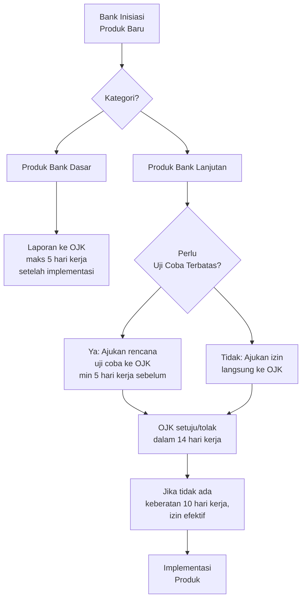
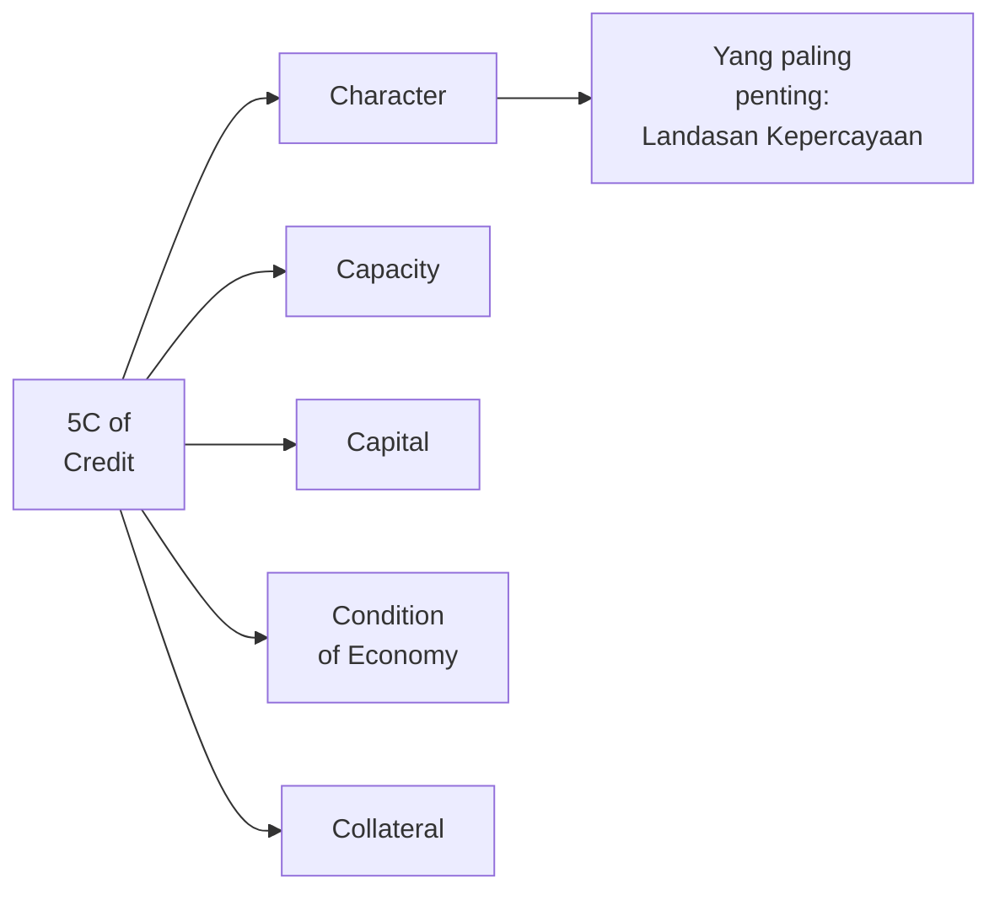
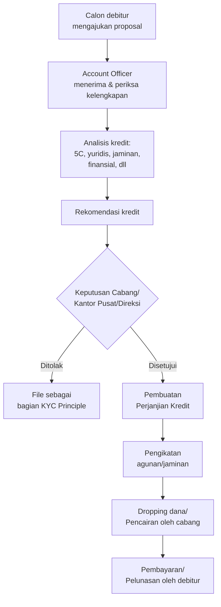
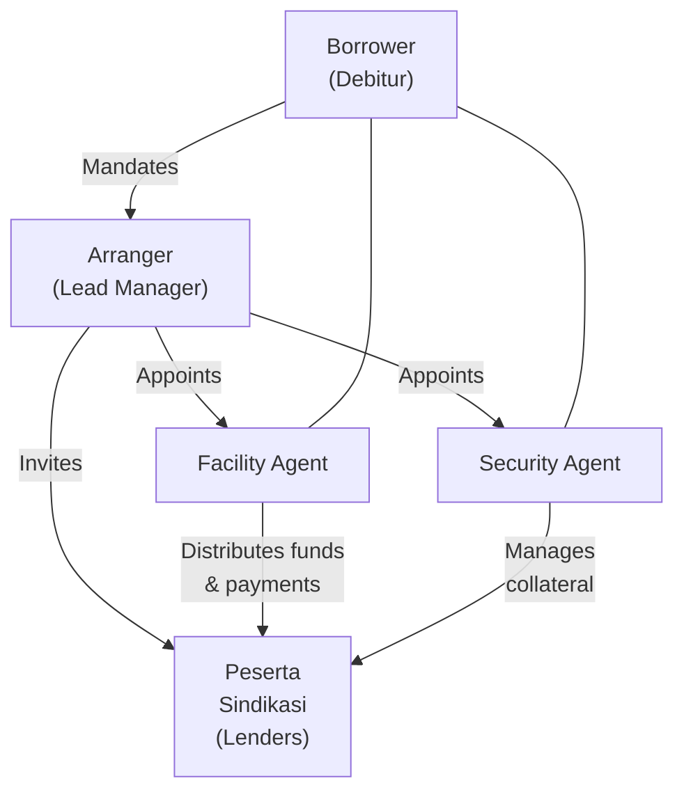
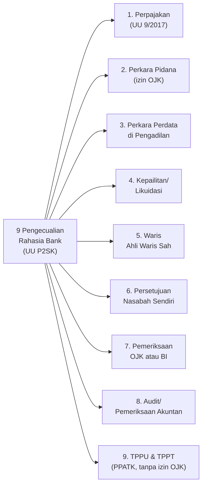
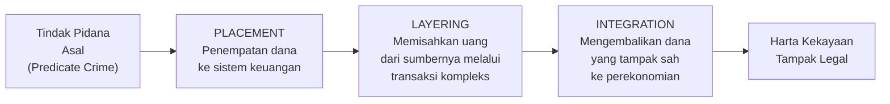
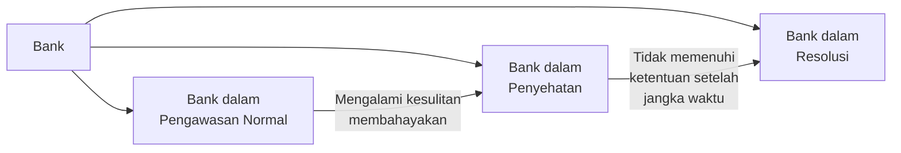
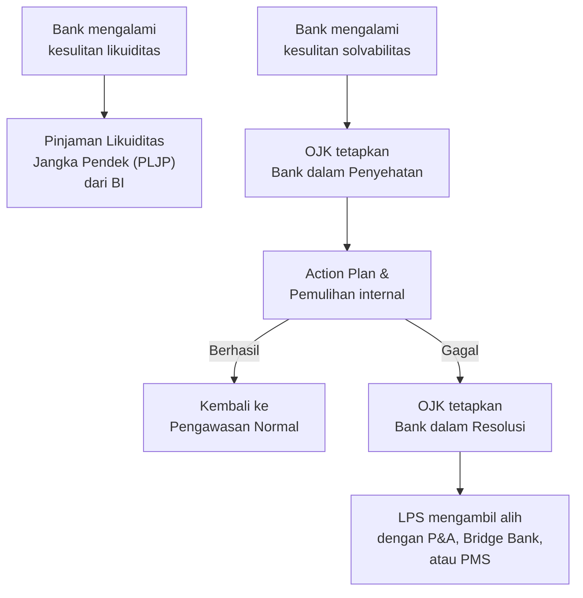

> [!ABSTRACT]
> Dokumen ini merupakan sintesis komprehensif dari dua sumber belajar Hukum Perbankan — rangkuman UAS Michael Ho dan kumpulan soal serta jawaban kasus. Seluruh topik telah diperluas, celah materi telah diisi, dan seluruh regulasi telah diperbarui per **Juni 2026**. Perubahan regulasi kunci meliputi: (1) UU No. 4 Tahun 2023 tentang Pengembangan dan Penguatan Sektor Keuangan (**P2SK**) yang mengamendemen/menggantikan berbagai ketentuan UU Perbankan dan UU PPKSK; (2) POJK No. 8 Tahun 2023 tentang APU-PPT-PPPSM yang menggantikan POJK No. 12/POJK.01/2017; (3) UU No. 27 Tahun 2022 tentang Perlindungan Data Pribadi; (4) POJK No. 6/POJK.07/2022 tentang Perlindungan Konsumen; (5) Putusan MK No. 15/PUU-XIX/2021 tentang perluasan kewenangan penyidik TPPU. Dokumen mencakup: sistem perbankan, digital banking, produk bank, transaksi internasional, L/C, sumber dana & perlindungan nasabah, cek & bilyet giro, CAR, kredit & pembiayaan, kredit sindikasi, rahasia bank, tindak pidana perbankan, TPPU, dan pencegahan/penanganan krisis sistem keuangan.

---

### 1. Sistem Perbankan Indonesia: Specialized, Universal, dan Hybrid

#### 1.1 Tiga Model Sistem Perbankan

Produk dan layanan bank dipengaruhi secara fundamental oleh model sistem perbankan yang diterapkan suatu negara. Terdapat tiga model utama:

**Specialized Banking System**

Sistem ini bersifat ketat dan spesifik. Bank hanya menjalankan kegiatan perbankan dengan fokus pada produk atau jasa yang terbatas, atau menargetkan segmen pasar yang sangat spesifik. Contoh historis di Indonesia adalah Bank Tabungan Negara (BTN) yang awalnya hanya menghimpun tabungan, namun kemudian diizinkan menyalurkan Kredit Pemilikan Rumah (KPR). Contoh lain: bank yang mengkhususkan diri pada sektor pertanian, ekspor-impor, atau kredit mikro. Kelemahan utama sistem ini adalah kesulitan pertumbuhan karena ruang gerak yang sempit.

**Universal Banking System**

Bank dapat beroperasi di berbagai sektor keuangan secara langsung. Cakupan kegiatan usaha meliputi commercial banking penuh, investment banking, hingga produk kompleks seperti bancassurance. Seluruh kebutuhan nasabah terkait produk dan jasa perbankan tersedia dalam satu lembaga. Amerika Serikat pernah mengalami kegagalan sistem universal pada tahun 1930-an karena bank terlibat dalam pasar yang sangat fluktuatif sehingga menimbulkan risiko sistemik yang besar. Di AS, Glass-Steagall Act 1933 kemudian memisahkan commercial banking dan investment banking, meskipun sebagian besar ketentuan ini dicabut pada 1999.

**Hybrid (Mixed) System — Model Indonesia**

Indonesia tidak menganut sistem murni, melainkan campuran. Terdapat kebebasan tertentu namun juga pembatasan. Bukti model hybrid ini tampak dari peraturan yang membolehkan sejumlah produk lintas sektor selama lazim dilakukan, namun membatasi keterlibatan langsung dalam bidang lain.

> [!NOTE]
> Dasar hukum pembatasan kegiatan usaha bank di Indonesia terdapat dalam **Pasal 6, 7, dan 10 UU Perbankan** (UU No. 7/1992 sebagaimana telah diubah dengan UU No. 10/1998 dan terakhir diubah dengan **UU No. 4 Tahun 2023 tentang P2SK**), serta **POJK No. 13/POJK.03/2021 tentang Penyelenggaraan Produk Bank Umum**.

| Dimensi | Specialized | Universal | Hybrid (Indonesia) |
|---|---|---|---|
| Ruang lingkup | Sempit/terbatas | Sangat luas | Menengah, dengan batasan |
| Contoh produk | KPR, kredit pertanian | Bancassurance, investment banking | Art. 6 + Art. 7 UU Perbankan |
| Risiko | Rendah-menengah | Tinggi | Terkendali |
| Regulasi kunci | — | Glass-Steagall (AS, 1933) | Art. 6-10 UU Perbankan, POJK 13/2021 |

#### 1.2 Perkembangan Regulasi Kegiatan Usaha Bank

Sebelum tahun 2005, produk perbankan umumnya tidak diatur secara spesifik oleh Bank Indonesia, diserahkan kepada kebijakan masing-masing bank. Setelah itu, regulasi berkembang menjadi:

- **PBI No. 14/2/PBI/2012** tentang Kegiatan Alat Pembayaran menggunakan Kartu (menggantikan PBI No. 7/52/2005)
- **PBI No. 19/12/PBI/2017** tentang Penyelenggaraan Teknologi Finansial
- **PBI No. 23/11/PBI/2021** tentang Standar Nasional Sistem Pembayaran
- **POJK No. 13/POJK.03/2021** tentang Penyelenggaraan Produk Bank Umum (berlaku hingga saat ini)
- **UU No. 4 Tahun 2023 tentang P2SK** — perubahan terakhir dan terluas terhadap UU Perbankan

> [!IMPORTANT]
> **Perubahan akibat UU P2SK (2023):** Pasal 6 huruf m UU Perbankan lama (kegiatan anjak piutang, usaha kartu kredit dan kegiatan wali amanat) **dihapus** dan sebagian diintegrasikan ke dalam rezim perizinan OJK yang lebih fleksibel. Subjek hukum "Setiap Orang" diperluas dalam ketentuan pidana. Fungsi LPS diperluas mencakup penjaminan polis asuransi dan penyelesaian permasalahan perusahaan asuransi.

---

### 2. Digital Banking

#### 2.1 Evolusi Sistem Pembayaran

Evolusi sistem pembayaran berjalan dari barter → uang fisik → cek dan transfer → pembayaran digital (paperless, signatureless) → uang virtual/cryptocurrency. Selama pandemi COVID-19, transaksi elektronik melonjak drastis hingga mencapai puluhan triliun rupiah, didorong oleh kebutuhan pembayaran nirsentuh.

> [!NOTE]
> Bartering masih eksis dalam skala internasional, misalnya antara negara dalam kerangka trade balance (imbal dagang). Bank berevolusi menjadi digital bank, namun tetap harus memastikan keamanan dan edukasi nasabah.

#### 2.2 Jenis Layanan Digital Banking

**Internet Banking** — Nasabah melakukan transaksi perbankan (finansial dan non-finansial) melalui komputer yang terhubung jaringan internet bank. Jenis transaksi: transfer dana, informasi saldo dan mutasi rekening, informasi nilai tukar, pembayaran tagihan (kartu kredit, telepon, listrik), dan pembelian (pulsa, tiket pesawat, saham).

**Phone Banking** — Transaksi perbankan melalui telepon dimana nasabah menghubungi contact center bank. Bank menyediakan staf khusus atau program otomatis interaktif. Jenis transaksi: transfer dana, informasi saldo, mutasi rekening, pembayaran (kartu kredit, PLN, telepon, asuransi), dan pembelian pulsa.

**SMS Banking** — Layanan transaksi perbankan melalui ponsel dengan format SMS, ke nomor telepon bank atau menggunakan aplikasi yang dipasang bank. Jenis transaksi: transfer dana, informasi saldo, mutasi rekening, pembayaran kartu kredit, pembelian pulsa.

**Mobile Banking** — Memiliki tingkat kecanggihan lebih tinggi dari SMS Banking. Bank bekerja sama dengan operator seluler sehingga dalam SIM Card GSM sudah terpasang program khusus untuk transaksi perbankan. Jenis transaksi lebih luas: transfer, saldo, mutasi, informasi nilai tukar, pembayaran (kartu kredit, PLN, telepon, asuransi), dan pembelian (pulsa, saham).

> [!NOTE]
> Dasar hukum layanan digital perbankan: **POJK No. 12/POJK.03/2021** tentang Bank Umum (mengatur digital bank), **PBI No. 23/11/PBI/2021** tentang Standar Nasional Sistem Pembayaran, dan **PBI No. 19/12/PBI/2017** tentang Penyelenggaraan Teknologi Finansial. Khusus untuk bank digital (bank yang menjalankan kegiatan usaha secara digital), POJK No. 12/POJK.03/2021 mewajibkan pemenuhan infrastruktur teknologi informasi yang andal, keamanan siber, dan manajemen risiko yang memadai.

---

### 3. Produk Bank: Pasal 6 UU P2SK dan POJK No. 13/POJK.03/2021

#### 3.1 Kegiatan Usaha Bank Umum (Pasal 6 UU Perbankan sebagaimana diubah P2SK)

Bank Umum dapat melakukan kegiatan usaha sebagai berikut:

1. Menghimpun dana dari masyarakat dalam bentuk simpanan berupa **giro, deposito berjangka, sertifikat deposito, tabungan**, dan/atau bentuk lainnya yang dipersamakan.
2. Memberikan **kredit atau pembiayaan** berdasarkan Prinsip Syariah.
3. Menerbitkan surat pengakuan **utang**.
4. Membeli, menjual, atau menjamin atas **risiko sendiri maupun untuk kepentingan dan atas perintah nasabahnya** surat-surat berharga seperti wesel, obligasi, SBI, dan sebagainya.
5. Memindahkan **uang** baik untuk kepentingan sendiri maupun nasabah.
6. Menempatkan dana pada, meminjam dana dari, atau meminjamkan dana kepada **bank lain**, baik menggunakan surat, sarana telekomunikasi, maupun cek.
7. Menerima pembayaran dari tagihan atas **surat berharga** dan melakukan perhitungan dengan atau antarpihak ketiga.
8. Menyediakan tempat untuk **menyimpan barang dan surat berharga** (safe deposit box).
9. Melakukan kegiatan **penitipan** untuk kepentingan pihak lain berdasarkan kontrak (custodian).
10. Melakukan penempatan dana dari nasabah kepada nasabah lainnya dalam bentuk **surat berharga** yang tidak tercatat di bursa efek.
11. Membeli melalui pelelangan agunan baik semua maupun sebagian, apabila debitur tidak memenuhi kewajiban kepada bank.
12. Melakukan kegiatan anjak piutang, usaha kartu kredit, dan kegiatan wali amanat (**setelah P2SK, sebagian ketentuan ini disinkronisasi dengan regulasi OJK**).
13. Menyediakan pembiayaan dan/atau melakukan kegiatan lain berdasarkan Prinsip Syariah sesuai dengan ketentuan.
14. Melakukan kegiatan dalam **valuta asing** dengan memenuhi ketentuan sebagai bank devisa.
15. Melakukan kegiatan **penyertaan modal** pada bank atau perusahaan lain di bidang keuangan, seperti sewa guna usaha, modal ventura, perusahaan efek, asuransi, serta lembaga kliring penyelesaian dan penyimpanan, dengan memenuhi ketentuan OJK.
16. Melakukan kegiatan **penyertaan modal sementara** untuk mengatasi akibat kegagalan kredit atau kegagalan pembiayaan berdasarkan Prinsip Syariah, dengan syarat harus menarik kembali penyertaannya, dengan memenuhi ketentuan OJK.
17. Bertindak sebagai **pendiri dana pensiun** dan pengurus dana pensiun sesuai dengan ketentuan dalam peraturan perundang-undangan dana pensiun.
18. Melakukan kegiatan **lain** yang lazim dilakukan oleh bank sepanjang tidak bertentangan dengan undang-undang ini dan peraturan perundang-undangan yang berlaku.

> [!IMPORTANT]
> **Pasal 6(j) — "Kegiatan Lain dengan Persetujuan OJK":** Bank dapat melakukan kegiatan lain di luar yang telah disebutkan, selama mendapat persetujuan OJK. Namun bank dilarang: (a) melakukan penyertaan modal kecuali sebagaimana diatur dalam Pasal 7; (b) melakukan usaha perasuransian, kecuali memasarkan produk asuransi melalui kerja sama (*bancassurance*) sebagaimana diatur dalam Pasal 7 huruf d; (c) melakukan kegiatan usaha lain di luar yang diatur dalam Pasal 6 dan Pasal 7.

#### 3.2 Kategorisasi Produk Bank berdasarkan POJK No. 13/POJK.03/2021

POJK No. 13/POJK.03/2021 tentang Penyelenggaraan Produk Bank Umum membagi produk bank menjadi dua kategori utama:

**Produk Bank Dasar (Basic Bank Products)**

Layanan terkait penghimpunan dana, penyaluran dana, dan kegiatan sederhana lainnya yang diatur OJK. Contoh: tabungan, giro, deposito, kredit konsumtif standar, transfer dana domestik.

**Produk Bank Lanjutan (Advanced Bank Products)**

Mencakup layanan yang melibatkan teknologi informasi tinggi, kegiatan dengan lembaga keuangan bukan bank, kegiatan yang memerlukan persetujuan otoritas lain, dan layanan yang bersifat kompleks. Contoh: produk derivatif, bancassurance, structured product, kredit sindikasi lintas yurisdiksi, layanan digital banking berbasis AI/open banking.

#### 3.3 Mekanisme Penyelenggaraan Produk Bank Baru



**Rencana Penyelenggaraan Produk Bank (RPPB)**

Bank wajib menyusun RPPB yang disampaikan ke OJK paling lambat akhir November sebelum tahun rencana. Bank dapat melakukan perubahan RPPB maksimal 3 kali, yaitu paling lambat akhir Maret, Juni, dan September tahun berjalan. Jika tidak ada rencana produk baru, bank tetap wajib menyampaikan *nil RPPB*. Pelaporan dilakukan secara daring melalui SIPENA (Aplikasi Pelaporan Online OJK — Laporan Tidak Terstruktur) atau SPRINT (Sistem Perizinan dan Registrasi Terintegrasi).

#### 3.4 Produk Bank Spesifik

**Jaminan Bank (Bank Guarantee)**
Jaminan yang diberikan oleh bank kepada penerima jaminan (beneficiary), menyatakan bahwa bank akan membayar sejumlah uang tertentu jika nasabah (applicant) wanprestasi. Merupakan instrumen mitigasi risiko dalam transaksi komersial.

**Anjak Piutang (Factoring)**
Kegiatan pembiayaan piutang usaha dengan cara menjual atau menggadaikan piutang usaha sebagai jaminan untuk memperoleh pinjaman atau tambahan modal kerja. Perusahaan menjual piutang dengan harga diskon kepada perusahaan anjak piutang (factor). Factor juga dapat mengelola administrasi kredit perusahaan.

**Kartu Kredit**
APMK (Alat Pembayaran Menggunakan Kartu) yang dapat digunakan untuk pembayaran atas kewajiban dari kegiatan ekonomi, termasuk transaksi pembelanjaan dan/atau penarikan tunai. Kewajiban pemegang kartu dipenuhi terlebih dahulu oleh acquirer atau penerbit, dan pemegang kartu wajib membayar kembali baik secara sekaligus (*charge card*) maupun cicilan.

**Wali Amanat (Trustee)**
Pihak yang mewakili kepentingan pemegang efek bersifat utang (seperti obligasi). Bertanggung jawab memastikan emiten memenuhi kewajibannya kepada pemegang obligasi.

**Kliring dan RTGS**
- *Kliring*: Sistem pengiriman uang antarbank melalui mobile banking, internet banking, dan teller bank — untuk transaksi nominal lebih kecil (BI Fast Payment, SKNBI).
- *RTGS (Real Time Gross Settlement)*: Sarana transfer uang dalam jumlah besar secara real time melalui teller bank atau sistem elektronik — untuk transaksi besar, bersifat final dan irrevocable.

**Layanan Penyimpanan (Custodian)**

Pasal 6 huruf (i) UU Perbankan mengatur kegiatan penitipan. Pasal 9 UU Perbankan memberikan perlindungan kuat atas aset yang dititipkan:
- Bank bertanggung jawab atas pengamanan aset deposan.
- Aset yang dititipkan harus dicatat dan dibukukan secara terpisah.
- Dalam hal bank pailit, seluruh aset yang dititipkan tidak termasuk dalam **boedel pailit** dan wajib dikembalikan kepada deposan masing-masing.

#### 3.5 Manajemen Risiko Produk Bank

Bank wajib menerapkan manajemen risiko, tata kelola, dan pengendalian internal atas produk secara terintegrasi. Pertimbangan utama:

1. **Kebutuhan nasabah** — produk harus relevan dengan pasar yang dituju
2. **Kecukupan modal** — bank harus memiliki modal yang memadai
3. **Kesiapan infrastruktur** — sistem teknologi informasi harus handal
4. **Kesiapan SDM** — staf harus memahami produk secara menyeluruh
5. **Edukasi nasabah** — informasi yang cukup harus tersedia sebelum produk diluncurkan
6. **Kepatuhan regulasi** — harus memenuhi seluruh ketentuan yang berlaku

**Kewajiban Transparansi Produk:**
Dalam hal ada perubahan fitur produk yang berdampak pada nasabah (misalnya perubahan suku bunga kredit, nisbah bagi hasil, atau limit kartu kredit), bank **wajib memberitahukan nasabah secara tertulis paling lambat 7 hari kerja** sebelum perubahan berlaku.

> [!WARNING]
> Dasar hukum transparansi produk semula ada di **PBI No. 7/6/2005** — namun regulasi ini **telah dicabut** dan digantikan oleh **POJK No. 6/POJK.07/2022 tentang Perlindungan Konsumen dan Masyarakat di Sektor Jasa Keuangan** yang berlaku sejak Agustus 2022. Selain itu, **PBI No. 3 Tahun 2023 tentang Perlindungan Konsumen Bank Indonesia** juga mengatur aspek perlindungan konsumen dalam sistem pembayaran.

---

### 4. Transaksi Internasional, Valas, dan Cara Pembayaran Ekspor-Impor

#### 4.1 Kegiatan Bank dalam Transaksi Perdagangan

Dasar hukum: **Pasal 6, 7, dan 13 UU Perbankan** sebagaimana telah diubah dengan UU No. 4 Tahun 2023.

- **Bank Umum (Bank Devisa):** Pasal 6 membolehkan kegiatan valas jika memenuhi persyaratan sebagai bank devisa.
- **Bank Perkreditan Rakyat (BPR):** Pasal 14 melarang BPR melakukan kegiatan dalam valuta asing.

#### 4.2 Jenis Transaksi Valuta Asing

**Spot (Transaksi Tunai/Kas)**
Pertukaran mata uang secara langsung pada harga saat ini, diselesaikan dalam 2 hari kerja. Keunggulan: cepat dan mudah. Kelemahan: tidak ada perlindungan terhadap pergerakan kurs yang tidak menguntungkan.

*Contoh:* Wisatawan menukar IDR ke USD. Kurs 1 USD = Rp 16.000 sehingga Rp 8.000.000 menghasilkan USD 500.

**Forward (Transaksi Berjangka)**
Pembelian atau penjualan valuta pada harga yang ditetapkan sekarang, dengan penyerahan dan pembayaran di masa mendatang. Memberikan perlindungan terhadap fluktuasi kurs namun kurang fleksibel.

*Contoh:* Perusahaan AS membeli komponen elektronik senilai EUR 5 juta dari Jerman dalam 3 bulan. Untuk menghindari risiko kurs, mereka sepakat forward rate 1 EUR = 1,10 USD.

**Swap (Transaksi Barter Valas)**
Pertukaran dua mata uang berbeda secara simultan antara dua investor, disertai perjanjian untuk membalikkan transaksi di kemudian hari. Membantu menyelesaikan kewajiban tanpa terpapar risiko kurs.

*Contoh:* Perusahaan farmasi AS memiliki pinjaman USD 50 juta di Brasil tetapi mendapat pembiayaan lebih murah di pasar modal AS. Mereka melakukan swap: membayar bunga dalam BRL kepada bank Brasil, sementara bank Brasil membayar bunga USD kepada perusahaan AS.

**Futures**
Kontrak serupa forward namun dengan persyaratan yang terstandarisasi (fitur, tanggal, ukuran) dan diperdagangkan di bursa. Lebih formal dan tidak dapat diubah setelah disepakati.

*Contoh:* Petani gandum AS mengamankan harga jual 1.000 ton gandum di September pada $10/bushel melalui futures contract, terlepas dari pergerakan harga di kemudian hari.

**Option (Kontrak Opsi)**
Hak (bukan kewajiban) untuk membeli atau menjual valuta pada kurs yang telah disepakati pada tanggal tertentu. Investor dapat memilih menggunakan atau tidak menggunakan haknya.

*Contoh:* Eksportir Indonesia mengkhawatirkan penurunan EUR. Mereka membeli *put option* senilai EUR 10 juta dengan strike price 1 EUR = 1,15 USD. Jika EUR/USD turun di bawah 1,10 saat kadaluarsa, mereka menggunakan opsi untuk menjual EUR pada 1,15 USD.

> [!NOTE]
> Dasar hukum transaksi valas: **UU No. 24 Tahun 1999 tentang Lalu Lintas Devisa dan Sistem Nilai Tukar** (menggantikan UU No. 32/1964). Indonesia menganut **sistem devisa bebas** (Pasal 2 ayat (1) UU 24/1999) dengan **sistem nilai tukar mengambang bebas (free floating rate)**. Peraturan terkini: **PBI No. 24/7/PBI/2022 tentang Transaksi Valuta Asing terhadap Rupiah antara Bank dengan Pihak Domestik**.

#### 4.3 Sistem Nilai Tukar

| Sistem | Karakteristik | Contoh Negara |
|---|---|---|
| Fixed Rate | Kurs ditetapkan dan dijaga pemerintah/bank sentral | Arab Saudi (dipatok ke USD) |
| Free Floating Rate | Kurs ditentukan sepenuhnya oleh pasar | Indonesia (sejak 1997), AS, Eropa |
| Managed Floating Rate | Kurs mengambang namun bank sentral dapat intervensi | China (CNY) |

#### 4.4 Cara Pembayaran dalam Transaksi Ekspor-Impor

Dasar hukum: **Penjelasan Pasal 3 PP No. 29 Tahun 2017 tentang Cara Pembayaran dan Cara Penyerahan Barang dalam Kegiatan Ekspor dan Impor**, serta **Pasal 3 PBI No. 5/6/PBI/2003 tentang SKBDN** sebagaimana diubah dengan **PBI No. 10/5/PBI/2008**.

**Advance Payment (Pembayaran Dimuka)**
Importir membayar kepada eksportir sebelum barang dikirim, baik seluruhnya maupun sebagian.
- *Kelebihan eksportir:* Mendapat pembayaran lebih dahulu, tidak ada risiko gagal bayar.
- *Kelemahan importir:* Risiko barang tidak terkirim.

**Open Account (Rekening Terbuka)**
Penjual dan pembeli sepakat untuk menyelesaikan pembayaran di kemudian hari, umumnya digunakan antara mitra bisnis yang sudah saling mengenal. Tahapan: (1) Penandatanganan sales contract → (2) Pengiriman → (3) Pengiriman dokumen ekspor → (4) Penerimaan barang → (5) Pembayaran sesuai termin.
- *Kelebihan importir:* Pembayaran baru dilakukan setelah menerima barang.
- *Kelemahan eksportir:* Risiko tidak dibayar.

**Konsinyasi (Consignment)**
Eksportir menitipkan barang kepada pihak asing (consignee) untuk dijualkan atas nama eksportir. Consignee bertindak sebagai agen. Eksportir tetap memiliki barang hingga terjual. Consignee membayar setelah barang terjual.
- *Kelebihan importir:* Tidak menanggung risiko karena barang masih milik eksportir.
- *Kelemahan eksportir:* Ketidakpastian waktu penerimaan pembayaran.

**Wesel Inkaso / Collection**
Bank membantu proses penagihan dari importir kepada eksportir menggunakan wesel (draft) atau surat sanggup. Dua metode:
- *Documents against Payment (D/P):* Dokumen diserahkan ke importir setelah pembayaran tunai.
- *Documents against Acceptance (D/A):* Dokumen diserahkan setelah importir menerima (menanda-tangani) wesel.
- *Kelebihan importir:* Tidak perlu bayar sebelum menerima dokumen.
- *Kelemahan eksportir:* Risiko tidak dibayar, transaksi dapat dibatalkan.

**Letter of Credit (L/C)**
Wajib untuk ekspor barang tertentu. Merupakan instrumen paling aman bagi kedua pihak (eksportir dan importir), dijamin oleh bank penerbit.

**Trade Balance / Imbal Dagang**
Pembayaran barang impor melalui ekspor barang lain dari negara pengimpor.

| Cara Bayar | Eksportir | Importir |
|---|---|---|
| Pembayaran Dimuka | (+) Terima pembayaran dulu | (−) Risiko barang tidak terkirim |
| Open Account | (−) Risiko tidak dibayar | (+) Bayar setelah terima barang |
| Wesel Inkaso | (−) Risiko gagal bayar | (+) Tidak perlu bayar sebelum terima dokumen |
| Konsinyasi | (−) Ketidakpastian pembayaran | (+) Tidak menanggung risiko |
| Letter of Credit | (+) Dijamin pembayaran bank jika dokumen sesuai | (+) Dijamin terima dokumen sesuai syarat setelah bayar |

### 5. Letter of Credit (L/C): UCP 600 dan SKBDN

#### 5.1 Definisi Letter of Credit

Letter of Credit (L/C) adalah janji tertulis dari **bank penerbit (issuing bank)** kepada **penerima manfaat (beneficiary/eksportir/penjual)** untuk melakukan pembayaran jika beneficiary menyerahkan dokumen-dokumen sesuai persyaratan L/C.

> [!QUOTE]
> UCP 600 mendefinisikan Credit sebagai: "Any arrangement, however named or described, that is irrevocable and thereby constitutes a definite undertaking of the issuing bank to honour a complying presentation."

**Honour** berarti:
- Membayar pada saat penarikan jika L/C bersifat *sight payment*, atau
- Menanggung kewajiban pembayaran tangguhan (*deferred payment*) dan membayar pada saat jatuh tempo, atau
- Mengakseptasi wesel (*bill of exchange*) yang ditarik oleh beneficiary dan membayar pada jatuh tempo jika L/C bersifat akseptasi.

#### 5.2 Prinsip-Prinsip L/C

**Prinsip Kemandirian (Principle of Independence)**
Kontrak L/C berdiri sendiri, terpisah dari kontrak penjualan atau kontrak lain yang melatarbelakangi penerbitannya. Bank tidak terikat pada hubungan hukum antara applicant dan beneficiary. Ini memberikan kepastian pembayaran bagi beneficiary.

**Prinsip Kepatuhan Dokumen (Principle of Strict Compliance / Documentary Compliance)**
Bank hanya berkewajiban membayar berdasarkan dokumen yang diserahkan, tanpa perlu memverifikasi transaksi atau kondisi barang yang sesungguhnya. Bank berhadapan dengan dokumen, bukan barang (*banks deal in documents, not in goods*). Pemeriksaan dilakukan dua kali: di advising bank, kemudian di issuing bank.

**Prinsip Itikad Baik (Good Faith)**
Semua pihak dalam L/C bertindak berdasarkan itikad baik. Fraud exception: jika beneficiary secara nyata melakukan penipuan dalam dokumen yang diserahkan, bank dapat menolak pembayaran.

#### 5.3 Mekanisme L/C

```mermaid
graph LR
    A["Importir<br>(Applicant)"] -->|"1. Sales Contract"| B["Eksportir<br>(Beneficiary)"]
    A -->|"2. Permohonan buka L/C"| C["Issuing Bank"]
    C -->|"3. Menerbitkan L/C"| D["Advising Bank<br>(Correspondent Bank)"]
    D -->|"4. Meneruskan L/C"| B
    B -->|"5. Kirim barang"| A
    B -->|"6. Serahkan dokumen"| D
    D -->|"7. Verifikasi dokumen &"<br>"teruskan ke Issuing Bank"| C
    C -->|"8. Verifikasi kedua &"<br>"serahkan dokumen ke Importir"| A
    C -->|"9. Pembayaran ke Advising Bank"| D
    D -->|"10. Pembayaran ke Eksportir"| B
```

**Langkah-langkah:**
1. Importir dan eksportir menandatangani sales contract.
2. Importir meminta bank penerbit (issuing bank) membuka L/C untuk eksportir.
3. Issuing bank menerbitkan L/C dan mengirimkan ke advising bank (koresponden bank penerbit).
4. Advising bank menyampaikan L/C kepada eksportir.
5. Eksportir mengirim barang sesuai persyaratan L/C.
6. Eksportir menyerahkan dokumen (commercial invoice, bill of lading, packing list, dll.) kepada advising bank.
7. Advising bank memverifikasi dokumen; jika sesuai, diteruskan ke issuing bank.
8. Issuing bank melakukan pemeriksaan kedua; dokumen diserahkan ke importir, dan importir menggunakan dokumen untuk mengklaim barang.
9. Issuing bank melakukan pembayaran.

#### 5.4 Para Pihak dalam L/C

| Pihak | Peran |
|---|---|
| **Applicant (Importir/Pembeli)** | Meminta bank membuka L/C |
| **Issuing Bank** | Bank importir, penerbit L/C, yang berkomitmen membayar |
| **Advising Bank** | Meneruskan L/C kepada beneficiary; dapat juga menjadi nominated bank |
| **Beneficiary (Eksportir/Penjual)** | Penerima L/C, yang akan menerima pembayaran |
| **Paying Bank** | Bank yang melakukan pembayaran kepada beneficiary |
| **Negotiating Bank** | Bank yang membayar eksportir dan menagih ke issuing bank |
| **Confirming Bank** | Menambahkan konfirmasi (jaminan pembayaran tambahan) atas permintaan issuing bank |
| **Reimbursing Bank** | Bank yang melakukan penggantian pembayaran kepada nominated bank |

#### 5.5 Jenis-Jenis L/C

**Berdasarkan sifat dapat dibatalkan atau tidak:**
- *Revocable L/C:* Dapat diubah/dibatalkan tanpa persetujuan beneficiary. **Tidak berlaku berdasarkan Pasal 3 UCP 600** (semua L/C bersifat irrevocable secara default).
- *Irrevocable L/C:* Tidak dapat diubah atau dibatalkan tanpa persetujuan semua pihak. Ini adalah standar di bawah UCP 600.
- *Confirmed L/C:* Advising bank (confirming bank) menambahkan jaminan pembayaran atas permintaan issuing bank; memberikan keamanan ganda bagi eksportir.

**Berdasarkan cara pembayaran:**
- *Sight Payment L/C:* Pembayaran segera setelah dokumen sesuai diserahkan.
- *Deferred Payment L/C:* Pembayaran pada tanggal jatuh tempo di masa mendatang yang ditentukan dalam L/C.
- *Acceptance L/C:* Issuing bank mengakseptasi wesel berjangka; pembayaran dilakukan pada jatuh tempo wesel.
- *Negotiation L/C:* Nominated bank membeli wesel/dokumen dari beneficiary, kemudian menagih ke issuing bank.

**Jenis khusus:**
- *Transferable L/C:* Beneficiary pertama dapat mengalihkan hak L/C kepada satu atau lebih beneficiary kedua. UCP 600: hanya satu kali transfer diperbolehkan; untuk domestik (SKBDN) hanya satu kali transfer.
- *Assignment L/C:* Beneficiary mengalihkan hak penerimaan hasil L/C kepada pihak lain.
- *Standby L/C:* Menjamin pembayaran jika pembeli wanprestasi; fungsi seperti bank guarantee.
- *Clean L/C:* Pembayaran tanpa memerlukan dokumen pengiriman tambahan.
- *Red Clause L/C:* Klausul khusus yang memungkinkan issuing bank menginstruksikan confirming bank untuk memberikan uang muka kepada eksportir sebelum pengiriman barang.
- *Green Clause L/C:* Memungkinkan pembayaran uang muka kepada penjual dengan syarat jaminan (misalnya gudang penyimpanan barang) sebelum pengiriman/penyerahan dokumen. Jika penjual gagal serahkan dokumen, gugatan dapat dipulihkan melalui jaminan tersebut.

#### 5.6 Dokumen dalam L/C

- **Commercial Invoice:** Daftar barang yang dikirim beserta nilainya.
- **Transport Document:** Dokumen pengiriman (Bill of Lading untuk laut, Airway Bill untuk udara).
- **Financial Document:** Wesel (bill of exchange) untuk pembayaran.
- **Insurance Document:** Sertifikat atau polis asuransi atas barang.
- **Certificate of Origin:** Sertifikat negara asal barang.
- **Sanitary/Phytosanitary Certificate:** Sertifikat kesehatan/kelayakan barang.
- **Packing List:** Daftar rincian kemasan barang.

#### 5.7 Dasar Hukum L/C

- **UCP 600 (Uniform Customs and Practice for Documentary Credits, ICC Publication No. 600)** — berlaku sejak 1 Juli 2007, diterbitkan oleh International Chamber of Commerce (ICC). Digunakan secara sukarela (opsional) namun menjadi standar global. **UCP 700 belum ada per Juni 2026.**
- **ISBP (International Standard Banking Practice)** — panduan penerapan UCP 600 dalam praktik.
- **PBI No. 5/11/PBI/2003 tentang Pembayaran Transaksi Impor** — masih berlaku untuk aspek teknis pembukaan L/C impor di Indonesia.

**Ketentuan PBI No. 5/11/PBI/2003 tentang Syarat Formulir Permintaan L/C:**

Formulir permintaan pembukaan L/C untuk pembayaran impor wajib memuat: nama dan alamat lengkap importir; nama dan alamat lengkap eksportir; nilai L/C; syarat pembayaran; rincian dokumen; tenggat penyerahan dokumen; tanggal penerbitan dan kadaluarsa L/C; metode penerbitan L/C (surat, telex, SWIFT); deskripsi barang termasuk nama, kuantitas, harga satuan, harga FOB/C&F/CIF; tarif bea masuk; kode HS (*Harmonized System*); asuransi; tanggal pengiriman terakhir; negara tujuan; negara asal.

#### 5.8 Surat Kredit Berdokumen Dalam Negeri (SKBDN)

SKBDN adalah L/C yang digunakan untuk transaksi perdagangan dalam negeri (domestik). Diatur oleh **PBI No. 5/6/PBI/2003 tentang SKBDN** sebagaimana diubah dengan **PBI No. 10/5/PBI/2008**.

| Aspek | International L/C | SKBDN (Domestic L/C) |
|---|---|---|
| Dasar hukum | UCP 600 (opsional) | PBI No. 10/5/PBI/2008 |
| Mata uang | Tidak ada syarat khusus | Menggunakan Rupiah; dapat menggunakan valas untuk transaksi perdagangan tertentu |
| Yurisdiksi | Internasional | Hanya berlaku di Indonesia (bank, applicant, beneficiary) |
| Jenis transaksi | Perdagangan barang dan jasa | Hanya perdagangan barang |
| Deferred Payment | Dibolehkan | Tidak ada |
| Dokumen pengangkutan | Lengkap | Kondisional (jika dipersyaratkan, harus memenuhi Pasal 19) |
| Transfer | Multiple transfer diperbolehkan | Maksimal satu kali transfer |

---

### 6. Sumber Dana Perbankan dan Perlindungan Nasabah

#### 6.1 Simpanan (Dana Pihak Ketiga — DPK)

Berdasarkan **Pasal 1 UU Perbankan:**

**Simpanan (Pasal 1 angka 5)**
Dana yang dipercayakan oleh masyarakat kepada bank berdasarkan perjanjian penyimpanan dana dalam bentuk giro, deposito, sertifikat deposito, tabungan, dan/atau bentuk lainnya yang dipersamakan.

**Giro (Pasal 1 angka 6)**
Simpanan yang penarikannya dapat dilakukan setiap saat dengan menggunakan cek, bilyet giro, sarana perintah pembayaran lainnya, atau dengan pemindahbukuan.

**Deposito (Pasal 1 angka 7)**
Simpanan yang penarikannya hanya dapat dilakukan pada waktu tertentu berdasarkan perjanjian nasabah penyimpan dengan bank.

**Sertifikat Deposito (Pasal 1 angka 8)**
Simpanan dalam bentuk deposito yang sertifikat bukti penyimpanannya dapat dipindahtangankan (*bearer instrument*).

**Tabungan (Pasal 1 angka 9)**
Simpanan yang penarikannya hanya dapat dilakukan menurut syarat tertentu yang disepakati, tetapi tidak dapat ditarik dengan cek, bilyet giro, dan/atau alat lainnya yang dipersamakan.

| Aspek | Giro | Tabungan | Deposito |
|---|---|---|---|
| Penarikan | Setiap saat | Setiap saat (dengan syarat tertentu) | Hanya saat jatuh tempo |
| Instrumen penarikan | Cek, Bilyet Giro | Slip/kuitansi | Bilyet deposito |
| Suku bunga | Paling rendah (jasa giro) | Rendah | Paling tinggi |
| Penggunaan bisnis | Umumnya untuk transaksi bisnis | Umumnya nasabah perorangan | Investasi jangka pendek/menengah |

| Aspek | Deposito | Sertifikat Deposito |
|---|---|---|
| Bentuk | Atas nama (registered) | Atas bawa/atas unjuk (bearer) |
| Suku bunga | Dibayar di belakang | Dibayar di muka (diskonto) |
| Pemindahtanganan | Tidak dapat | Dapat dipindahtangankan |
| Keamanan | Lebih aman | Kurang aman (bearer) |

#### 6.2 Sumber Dana Lainnya

- **Pinjaman antar Bank Dalam Negeri** — melalui pasar uang antar bank (PUAB)
- **Pinjaman antar Bank Luar Negeri (Offshore Loan)** — pinjaman dari bank atau lembaga keuangan asing
- **Pinjaman Subordinasi** — pinjaman yang bersifat subordinasi (dibahas di bagian CAR)
- **Pasar Modal — Go Public (IPO)** — penerbitan saham perdana di bursa efek
- **Obligasi (Bond)** — surat utang jangka menengah-panjang
- **Pinjaman Bank Indonesia** — sebagai *lender of the last resort* (PLJP — Pinjaman Likuiditas Jangka Pendek)

#### 6.3 Perlindungan Dana Nasabah Perbankan

**Skema Perlindungan Langsung (Direct/Explicit Protection)**

1. **Pasal 37B UU Perbankan** — mewajibkan bank menjamin dana nasabah.
2. **Lembaga Penjamin Simpanan (LPS)** — UU No. 24 Tahun 2004 sebagaimana diubah dengan UU No. 7 Tahun 2009, dan terakhir diubah dengan **UU No. 4 Tahun 2023 (P2SK)**.
3. **POJK No. 6/POJK.07/2022 tentang Perlindungan Konsumen dan Masyarakat di Sektor Jasa Keuangan** — menggantikan POJK No. 1/POJK.07/2013.
4. **PBI No. 3 Tahun 2023 tentang Perlindungan Konsumen Bank Indonesia** — mengatur perlindungan konsumen dalam sistem pembayaran.

**Skema Perlindungan Tidak Langsung (Indirect/Implicit Protection)**

1. Pembinaan dan pengawasan BI (Pasal 29-37 UUP)
2. POJK tentang Transparansi Produk Bank (kini terintegrasi dalam POJK 6/2022)
3. POJK dan PBI tentang Laporan Pengaduan dan Mediasi Perbankan
4. **UU No. 8 Tahun 1999 tentang Perlindungan Konsumen** — bersifat *lex specialis* terhadap UU No. 4 Tahun 2023
5. KUHPerdata Pasal 1365 (PMH), 1367 (tanggung jawab majikan), dan wanprestasi
6. **UU No. 8 Tahun 2010 tentang TPPU** (Pasal 19 jo 22, Pasal 26, 41 jo 66-67)
7. **UU No. 21 Tahun 2011 tentang OJK** (Pasal 28-31), diubah sebagian dengan UU No. 4 Tahun 2023
8. **UU No. 24 Tahun 2004 tentang LPS** (Pasal 4-20), diubah sebagian dengan UU No. 4 Tahun 2023
9. **PP No. 66 Tahun 2008 tentang Besaran Nilai Simpanan yang Dijamin LPS**
10. **UU No. 27 Tahun 2022 tentang Perlindungan Data Pribadi (PDP)** — baru, melindungi data pribadi nasabah

> [!NOTE]
> **Update Regulasi:** POJK No. 1/POJK.07/2013 tentang Perlindungan Konsumen Sektor Jasa Keuangan **telah digantikan** oleh **POJK No. 6/POJK.07/2022** yang mulai berlaku pada Agustus 2022. PBI No. 7/6/2005 tentang Transparansi Informasi Produk Bank dan Penggunaan Data Pribadi Nasabah juga **telah dicabut**.

#### 6.4 Lembaga Penjamin Simpanan (LPS)

**Fungsi LPS Setelah UU P2SK (2023):**

1. **Menjamin simpanan nasabah penyimpan**
   - Merumuskan dan menetapkan kebijakan pelaksanaan penjaminan
   - Melaksanakan penjaminan

2. **Menjamin polis asuransi** *(fungsi baru)*
   - Merumuskan dan melaksanakan program penjaminan polis

3. **Turut aktif memelihara Stabilitas Sistem Keuangan**
   - Merumuskan, menetapkan, dan melaksanakan kebijakan Stabilitas Sistem Keuangan

4. **Melakukan resolusi Bank**
   - Melaksanakan persiapan tindakan resolusi Bank termasuk uji tuntas (due diligence)
   - Merumuskan dan melaksanakan kebijakan resolusi Bank Dalam Resolusi

5. **Melakukan penyelesaian permasalahan Perusahaan Asuransi** *(fungsi baru)*
   - Melaksanakan persiapan likuidasi Perusahaan Asuransi yang dicabut izinnya oleh OJK
   - Melaksanakan likuidasi Perusahaan Asuransi tersebut

**Nilai Simpanan yang Dijamin LPS:**
Berdasarkan **PP No. 66 Tahun 2008 jo. UU P2SK**, nilai simpanan yang dijamin untuk setiap nasabah pada **satu bank** paling banyak **Rp 2.000.000.000,00 (dua miliar rupiah)**.

> [!IMPORTANT]
> LPS hanya dapat mengembalikan simpanan nasabah **jika bank gagal dan dilikuidasi** — bukan dalam kondisi pengawasan normal. Premi yang dibayar setiap bank kepada LPS adalah **0,1%** dari rata-rata saldo simpanan setiap semester (0,2% per tahun).

**Klaim yang Tidak Layak Dibayar:**
1. Data simpanan nasabah tidak tercatat di bank.
2. Nasabah penyimpan merupakan pihak yang diuntungkan secara tidak wajar.
3. Nasabah penyimpan merupakan pihak yang menyebabkan keadaan bank menjadi tidak sehat.

**Urutan Pembayaran Kewajiban Bank dalam Likuidasi** (Pasal 54 ayat (2) UU LPS jo. UU P2SK):
1. Biaya likuidasi
2. Gaji dan hak-hak pegawai (paling lama 3 bulan sebelum pencabutan izin)
3. Simpanan yang dijamin LPS
4. Sisa simpanan nasabah yang tidak dijamin LPS
5. Kewajiban lain kepada kreditur konkuren
6. Kewajiban subordinasi
7. Pemegang saham (jika masih ada sisa kekayaan)

---

### 7. Cek dan Bilyet Giro

#### 7.1 Cek

Cek adalah warkat atau surat berharga, termasuk surat tagihan utang, yang bersifat **perintah tidak bersyarat** dari penandatangan atau nasabah (penarik/drawer) kepada bank (tertarik/drawee) untuk membayar sejumlah uang tertentu kepada seseorang atau pihak tertentu atau pembawa (bearer).

**Dasar Hukum:** Pasal 176 KUHD (Kitab Undang-Undang Hukum Dagang).

**Syarat Formal Cek (Pasal 178 KUHD):**
1. Harus tercantum kata "CEK" dalam teks dokumen.
2. Berisi perintah tidak bersyarat untuk membayar sejumlah uang tertentu.
3. Harus ada nama bank yang membayar (tertarik/drawee).
4. Harus ada tempat pembayaran.
5. Harus ada tempat dan tanggal penarikan cek.
6. Harus ada tanda tangan penarik cek.

**Karakteristik Cek:**
- **Tenggang waktu:** 70 (tujuh puluh) hari. Setelah jangka waktu ini, penarik tidak wajib menyediakan dana dan dapat menarik kembali cek.
- **Tanggal:** Hanya ada satu tanggal (tanggal penerbitan). Tidak berlaku mundur.
- **Jenis:** Cek Atas Nama, Cek Atas Bawa (bearer), dan Cek Atas Pengganti.
- **Sifat surat berharga:** Dapat dipindahtangankan.
- **Pencairan:** Dapat dicairkan secara tunai atau masuk ke rekening.
- **Mekanisme hukum:** Dapat dilakukan **protes non pembayaran** (jika cek tidak dibayar oleh bank).
- **Keberlakuan mundur:** Tidak berlaku mundur (*tidak dapat menetapkan tanggal efektif di masa mendatang*).

> [!WARNING]
> Penggunaan cek kosong untuk penipuan dapat menimbulkan pertanggungjawaban pidana (Pasal 378 KUHP — penipuan), namun satu kasus tunggal biasanya tidak cukup untuk penuntutan pidana. Cek sebagai surat berharga pada umumnya tidak dapat dijadikan agunan karena dapat dipindahtangankan, namun ada institusi yang menerimanya sebagai jaminan dalam praktik.

#### 7.2 Bilyet Giro

Bilyet Giro adalah surat perintah nasabah yang sudah distandarisasi bentuknya kepada bank untuk **memindahbukukan** sejumlah dana dari rekening yang bersangkutan kepada pihak penerima yang disebutkan namanya pada bank yang sama atau bank lain.

**Dasar Hukum:** Peraturan Bank Indonesia tentang Bilyet Giro (PBI No. 18/41/PBI/2016 tentang Bilyet Giro).

**Karakteristik Bilyet Giro:**
- **Tanggal:** Memiliki **dua tanggal** — tanggal penerbitan dan tanggal efektif.
- **Jenis:** Hanya Bilyet Giro Atas Nama.
- **Sifat:** **Bukan** surat berharga yang dapat dipindahtangankan.
- **Pencairan:** Hanya dapat dipindahbukukan, sehingga penerima harus memiliki rekening.
- **Mekanisme hukum:** **Tidak ada upaya hukum protes non pembayaran**.
- **Keberlakuan mundur:** **Dapat berlaku mundur** (tanggal efektif dapat ditetapkan di masa mendatang).

| Aspek | Cek | Bilyet Giro |
|---|---|---|
| Instrumen | Surat perintah bayar tunai | Surat perintah pemindahbukuan |
| Tanggal | Satu tanggal (penerbitan) | Dua tanggal (penerbitan dan efektif) |
| Jenis | Atas nama, atas bawa, atas pengganti | Hanya atas nama |
| Dipindahtangankan | Ya | Tidak |
| Pencairan tunai | Ya | Tidak (hanya pemindahbukuan) |
| Protes non pembayaran | Ada | Tidak ada |
| Berlaku mundur | Tidak | Ya |
| Tenggang waktu | 70 hari | 70 hari sejak tanggal efektif |
| Dasar hukum | Pasal 176 KUHD | PBI No. 18/41/PBI/2016 |

---

### 8. Capital Adequacy Ratio (CAR), Subordinated Loan, dan Prime Customer

#### 8.1 Capital Adequacy Ratio (CAR)

CAR (Rasio Kecukupan Modal) adalah ukuran kemampuan bank untuk mempertahankan modalnya guna menutupi potensi kerugian dari pemberian kredit, investasi, surat berharga, dan kewajiban kepada bank lain. CAR dinyatakan sebagai persentase dari **Total Aset Tertimbang Menurut Risiko (ATMR)**.

**Formula:**
> CAR = (Modal Bank / ATMR) × 100%

**Ketentuan minimum:**
- Minimum 8% secara internasional (Basel I).
- Basel II dan Basel III mengharuskan lebih tinggi, terutama untuk Bank Sistemik.
- Rata-rata CAR perbankan Indonesia saat ini jauh di atas minimum, yaitu sekitar **24%+**.
- Bank Sistemik wajib memenuhi **capital surcharge** (tambahan modal) di atas minimum tersebut.

*Contoh:* Jika bank memiliki ATMR Rp 100 miliar dan CAR minimum 8%, maka bank harus memiliki modal minimum Rp 8 miliar.

**Komponen Modal Bank:**
- Capital gain
- Laba ditahan (*retained earnings*)
- Modal inti lainnya (saham biasa, cadangan yang diungkapkan)
- Modal pelengkap (instrumen hibrida, *subordinated loan* yang memenuhi syarat)

**Kriteria bank masuk pengawasan dari sisi permodalan:** CAR di bawah 8%.

> [!NOTE]
> Peraturan terkait CAR: **POJK No. 27/POJK.03/2022 tentang Kewajiban Penyediaan Modal Minimum Bank Umum** (menggantikan ketentuan lama, berlaku mulai Januari 2023). Regulasi ini juga mencabut larangan kredit untuk pembelian tanah.

#### 8.2 Subordinated Loan (Pinjaman Subordinasi)

Subordinated loan adalah jenis pinjaman di mana pelunasannya berperingkat lebih rendah dalam hierarki pembayaran saat likuidasi atau kepailitan dibandingkan utang lain (senior debt). Artinya, jika peminjam mengalami kesulitan keuangan, pinjaman subordinasi akan dibayar setelah utang senior dilunasi.

**Tiga Pihak yang Terlibat:**
1. **Peminjam (Borrower):** Individu atau perusahaan yang meminjam dana.
2. **Pemberi Pinjaman (Lender):** Lembaga keuangan atau investor yang menyediakan pinjaman subordinasi.
3. **Kreditur Senior:** Pihak dengan utang yang berperingkat lebih tinggi dalam hierarki pembayaran.

**Fungsi dalam Perbankan:**
Subordinated loan yang memenuhi persyaratan tertentu (tenor panjang, tidak ada perjanjian netting, tidak dijamin) dapat diperhitungkan sebagai **komponen modal pelengkap (Tier 2 Capital)** dalam perhitungan CAR. Ini memberikan fleksibilitas bagi bank untuk memperkuat posisi modal tanpa menerbitkan saham baru.

**Keunggulan:**
- Solusi bagi peminjam yang membutuhkan modal tetapi tidak memiliki agunan yang cukup.
- Cocok untuk perusahaan baru atau yang mengalami kesulitan keuangan ringan.

#### 8.3 Prime Customer

Dalam perbankan, **prime customer** (nasabah utama/nasabah prima) mengacu pada nasabah yang paling bernilai bagi lembaga keuangan. Karakteristik prime customer:

- Profil risiko rendah.
- Riwayat keuangan yang kuat.
- Memanfaatkan berbagai layanan perbankan secara luas.

**Perlakuan Khusus untuk Prime Customer:**
- Suku bunga pinjaman yang lebih rendah.
- Biaya yang dikurangi atau dibebaskan.
- Layanan perbankan eksklusif (*private banking*).
- Layanan nasabah personal (dedicated relationship manager).
- Undangan ke acara eksklusif atau program loyalitas.

**Relevansi dalam Kredit:**
Prime customer dapat mendapatkan fasilitas **overdraft** (penarikan melebihi saldo rekening) tanpa perjanjian kredit tertulis formal, cukup berdasarkan kesepakatan (*overdraft facility*). Ini merupakan salah satu bentuk kredit yang tidak selalu harus tertulis (*kredit tidak tertulis*), umumnya diterapkan untuk nasabah korporat besar.

> [!NOTE]
> Pasal 8 ayat (1) UU Perbankan menyebutkan bahwa kredit diberikan berdasarkan *persetujuan atau kesepakatan*. Artinya, kredit secara hukum tidak harus berbentuk tertulis, meskipun dalam praktik perjanjian kredit tertulis memberikan perlindungan hukum yang lebih kuat bagi kedua pihak.

---

### 9. Kredit dan Pembiayaan Syariah

#### 9.1 Perbedaan Kredit dan Pembiayaan

**Kredit (Bank Konvensional)**
> Pasal 1 angka 11 UU Perbankan: "Kredit adalah penyediaan uang atau tagihan yang dapat dipersamakan dengan itu, berdasarkan persetujuan atau kesepakatan pinjam-meminjam antara bank dengan pihak lain yang mewajibkan pihak peminjam untuk melunasi utangnya setelah jangka waktu tertentu dengan pemberian **bunga**."

**Pembiayaan Syariah (Bank Syariah)**
> Pasal 1 angka 26 UU Perbankan Syariah sebagaimana diubah UU No. 4 Tahun 2023: "Pembiayaan adalah penyediaan dana atau tagihan yang dapat dipersamakan dengan itu berdasarkan persetujuan atau kesepakatan antara Bank Syariah dan/atau UUS dan pihak lain yang mewajibkan pihak yang dibiayai untuk mengembalikan dana tersebut setelah jangka waktu tertentu dengan imbalan ujrah, tanpa imbalan, atau bagi hasil."

**Skema Pembiayaan Syariah:**
- *Bagi hasil:* Mudharabah dan Musyarakah
- *Sewa-menyewa:* Ijarah atau Ijarah Muntahiya Bittamlik (IMBT)
- *Jual beli:* Murabahah, Salam, dan Istishna
- *Pinjam-meminjam:* Qardh
- *Sewa jasa:* Ijarah untuk transaksi multijasa

#### 9.2 Prinsip 5C dalam Pemberian Kredit

Sebelum memberikan kredit, bank menganalisis menggunakan prinsip **5C**:



1. **Character** — Integritas dan itikad baik peminjam. Ini adalah **faktor terpenting** karena landasan kredit adalah kepercayaan. Peminjam berkarakter baik akan memenuhi kewajiban meskipun kondisi keuangan sedang sulit.
2. **Capacity** — Kemampuan peminjam untuk membayar, diukur dari arus kas dan laporan keuangan.
3. **Capital** — Kekuatan finansial peminjam, termasuk kekayaan bersih dan struktur modal.
4. **Condition of Economy** — Kondisi ekonomi makro dan industri yang berdampak pada kemampuan peminjam.
5. **Collateral** — Agunan yang dapat menjamin pelunasan kredit jika peminjam wanprestasi.

**Mengapa Character Paling Penting?**
- Kredit didasarkan fundamental pada kepercayaan.
- Peminjam berkarakter kuat cenderung memenuhi komitmennya, menjadikan mereka risiko rendah.
- Bank menghargai hubungan jangka panjang dengan peminjam yang terbukti karakternya.
- Bahkan jika faktor lain (capital, collateral) kurang menguntungkan, peminjam dengan karakter sangat baik masih dapat memperoleh kredit.

**Cara Mengetahui Karakter Peminjam:**
1. Penelitian riwayat nasabah di bank yang bersangkutan.
2. Bertanya kepada bank lain (Pasal 44 UU Perbankan).
3. **SLIK (Sistem Layanan Informasi Keuangan)** — pengganti BI Checking, dikelola OJK.
4. Rekomendasi dari instansi atau asosiasi terkait.
5. Trade checking — bertanya kepada pemasok dan pembeli nasabah.
6. Informasi dari **LPIP (Lembaga Pengelola Informasi Perkreditan)** — biro kredit swasta.

#### 9.3 Jaminan dan Agunan

**Jaminan (Pasal 8 ayat (1) UU Perbankan)**
> "Jaminan adalah keyakinan bank berdasarkan analisis yang mendalam atas itikad baik dan kemampuan serta kesanggupan nasabah debitur untuk melunasi utangnya atau mengembalikan pembiayaan dimaksud sesuai dengan yang diperjanjikan."

Jaminan bersifat lebih luas dan mencakup keyakinan bank secara umum.

**Agunan (Pasal 1 angka 23 UU Perbankan)**
> "Agunan adalah jaminan tambahan yang diserahkan nasabah debitur kepada bank dalam rangka pemberian fasilitas kredit atau pembiayaan berdasarkan Prinsip Syariah."

Agunan bersifat lebih spesifik — merupakan jaminan tambahan berupa aset.

**Kriteria Agunan yang Baik:**
1. Memiliki nilai ekonomi (dapat dikonversi ke uang atau memiliki likuiditas).
2. Memiliki hak kepemilikan yang dapat dialihkan dari pemilik asli ke pihak lain.
3. Memiliki nilai yuridis — dapat diikat secara hukum sehingga bank memiliki hak prioritas dalam proses likuidasi. Contoh: hipotik, fidusia, gadai, hak tanggungan.

#### 9.4 Kualitas Kredit (Kolektibilitas)

Berdasarkan **POJK No. 40/POJK.03/2019 tentang Penilaian Kualitas Aset Bank Umum** (mengadopsi standar IFRS 9 yang ditranslasikan ke PSAK):

| Kolektibilitas | Status | Keterangan |
|---|---|---|
| 1 | **Lancar** | Pembayaran tepat waktu, tidak ada keterlambatan |
| 2 | **Dalam Perhatian Khusus (DPK)** | Keterlambatan 1-90 hari |
| 3 | **Kurang Lancar** | Keterlambatan 91-120 hari |
| 4 | **Diragukan** | Keterlambatan 121-180 hari |
| 5 | **Macet** | Keterlambatan lebih dari 180 hari |

> [!IMPORTANT]
> Kolektibilitas 1 dan 2 dikategorikan sebagai **kredit lancar**. Kolektibilitas 3, 4, dan 5 dikategorikan sebagai **Non-Performing Loan (NPL) / Kredit Bermasalah**.
> 
> Kriteria penentuan kolektibilitas tidak hanya berdasarkan keterlambatan pembayaran, tetapi juga mempertimbangkan **tiga faktor**: prospek usaha, kinerja debitur, dan kemampuan membayar.
> 
> **Bank masuk pengawasan** jika NPL Net > 3% atau NPL Gross > 5%. (Net: agunan sudah diperhitungkan; Gross: agunan belum diperhitungkan.)

**Non-Performing Loan (NPL):**
- NPL mewakili kredit yang berada dalam kondisi default (gagal bayar).
- Berdampak negatif pada likuiditas, pendapatan, dan kesehatan bank.
- NPL tinggi dapat mengurangi kapasitas penyaluran kredit.
- Pengelolaan NPL: restrukturisasi, penjualan kredit, atau penghapusbukuan.

#### 9.5 SLIK (Sistem Layanan Informasi Keuangan)

SLIK menggantikan BI Checking (SID — Sistem Informasi Debitur) sejak **1 Januari 2018**. SLIK dikelola oleh OJK dan berisi:

- Identitas debitur
- Pemilik dan pengurus (untuk debitur badan usaha)
- Fasilitas penyediaan dana yang diterima
- Data agunan
- Data penjamin
- Kualitas fasilitas penyediaan
- Informasi lainnya

**Dasar Hukum SLIK:**
- POJK No. 18/POJK.03/2017 tentang Pelaporan dan Permintaan Informasi Debitur Melalui SLIK sebagaimana diubah dengan **POJK No. 64/POJK.03/2020**.

**Pelapor Wajib:**
1. Bank dan Unit Usaha Syariah (UUS)
2. Lembaga pembiayaan
3. Perusahaan efek dan lembaga pendanaan efek
4. Lembaga Keuangan Mikro
5. Lembaga keuangan nonbank yang memiliki akses dan kewajiban melaporkan data debitur
6. Koperasi (opsional)

**Penggunaan IDEB (Informasi Debitur):**
- Mendukung proses pemberian Fasilitas Penyediaan Dana.
- Menerapkan manajemen risiko kredit.
- Mengidentifikasi kualitas debitur untuk pemenuhan ketentuan.
- Pengelolaan SDM.
- Verifikasi kerja sama dengan pihak ketiga.

**Larangan:** Memberikan atau memperjualbelikan IDEB kepada pihak lain, atau menggunakan IDEB di luar ketentuan Pasal 15 ayat 4 POJK No. 64/POJK.03/2020.

#### 9.6 Innovative Credit Scoring (ICS)

ICS menggunakan data digital (data telekomunikasi, e-commerce, media sosial) sebagai alternatif data keuangan historis konvensional. Berperan penting dalam memperluas inklusi keuangan bagi kelompok **unbanked** dan **underbanked** yang tidak memiliki riwayat kredit formal.

LPIP (Lembaga Pengelola Informasi Perkreditan) yang diatur oleh **POJK No. 42/POJK.03/2019** dapat memberikan credit scoring, credit rating, dan agregasi informasi keuangan. Contoh: PT Biro Kredit PEFINDO dan Kredit Biro Indonesia Jaya.

#### 9.7 Proses Pemberian Kredit



#### 9.8 Isi Perjanjian Kredit

1. Judul perjanjian
2. Komparisi (identitas para pihak)
3. Fasilitas kredit dan jangka waktu
4. Suku bunga kredit (tetap/mengambang)
5. Klausula mengenai barang agunan
6. Biaya yang timbul: provisi, commitment fee, dll.
7. Klausula mengenai asuransi kredit
8. Larangan-larangan bagi debitur (negative covenant)
9. Klausula penarikan kredit
10. Hak bank untuk mengakhiri perjanjian kapan saja
11. Ketentuan penyelesaian kredit
12. Ketentuan-ketentuan lainnya

#### 9.9 Restrukturisasi Kredit

Restrukturisasi kredit adalah upaya perbaikan yang dilakukan bank terhadap debitur yang mengalami kesulitan memenuhi kewajibannya, dengan cara mengubah syarat-syarat kredit.

**Dasar Hukum:**
- **POJK No. 40/POJK.03/2019 tentang Penilaian Kualitas Aset Bank Umum** (Pasal 53 dan seterusnya)
- **POJK No. 11/POJK.03/2020** tentang Stimulus Perekonomian Nasional sebagai Kebijakan Countercyclical Dampak COVID-19 (masa relaksasi telah berakhir namun memberikan kerangka konseptual)

**Bentuk-Bentuk Restrukturisasi Kredit (Pasal 53 POJK No. 40/2019):**
1. **Penurunan suku bunga kredit** — agar cicilan lebih ringan
2. **Perpanjangan jangka waktu kredit** — durasi pelunasan diperpanjang
3. **Pengurangan tunggakan bunga** — beban bunga yang belum dibayar dikurangi/dihapus
4. **Pengurangan tunggakan pokok** — pokok utang dapat dikurangi sesuai kesepakatan
5. **Penambahan fasilitas kredit** — debitur mendapat tambahan pinjaman untuk memperkuat arus kas
6. **Pengambilalihan agunan** — bank mengambil alih agunan sebagai penyelesaian
7. **Konversi kredit menjadi penyertaan modal sementara** — utang diubah menjadi saham atau kepemilikan sementara bank
8. **Cessie** — pengalihan piutang
9. **Pembebasan/hapus tagih** — bank menghapus sebagian atau seluruh tagihan

**Tujuan Restrukturisasi:**
- Membantu debitur bertahan secara finansial, terutama di masa krisis.
- Menekan angka NPL agar tidak meningkat drastis.
- Menjaga kesehatan permodalan dan stabilitas sistem perbankan.

#### 9.10 Suku Bunga: Tetap vs. Mengambang

| Aspek | Suku Bunga Tetap (*Fixed Rate*) | Suku Bunga Mengambang (*Floating Rate*) |
|---|---|---|
| Definisi | Suku bunga konstan sepanjang tenor pinjaman | Suku bunga berubah mengikuti benchmark/indeks pasar |
| Kepastian | Tinggi — cicilan dapat diprediksi | Rendah — cicilan dapat berubah |
| Benchmark | Tidak mengacu pada indeks | INDONIA, JIBOR (lama), LIBOR (internasional, sudah pensiun) |
| Risiko peminjam | Tidak terpengaruh kenaikan suku bunga | Terpapar risiko kenaikan suku bunga |
| Keuntungan peminjam | Bila suku bunga naik | Bila suku bunga turun |

> [!IMPORTANT]
> **Update:** JIBOR (Jakarta Interbank Offered Rate) telah **digantikan** oleh **INDONIA (Indonesia Overnight Index Average)** sebagai referensi suku bunga acuan untuk pasar uang domestik. Secara global, LIBOR (London Interbank Offered Rate) telah **resmi pensiun** pada **30 Juni 2023** dan digantikan oleh SOFR (Secured Overnight Financing Rate) di AS dan SONIA di Inggris.

#### 9.11 Pembatasan dan Larangan Perkreditan

1. **BMPK (Batas Maksimum Pemberian Kredit)**
   - Maksimum 10% dari modal bank untuk satu pihak terkait.
   - Maksimum 25% dari modal inti untuk satu orang/kelompok tidak terkait bank.
   - Untuk BUMN: maksimum 30% dari modal bank.
   - Dasar hukum: Pasal 11 UU Perbankan; POJK No. 32/POJK.03/2018 tentang BMPK.

2. **Kredit kepada Non-Residen:** Dilarang memberikan cerukan (overdraft) dan pembiayaan dalam rupiah kepada non-residen. Dasar hukum: PBI No. 24/7/PBI/2022.

3. **Kredit untuk Jual Beli Saham:** Dilarang kecuali kepada perusahaan efek dengan batasan 25% dari modal perusahaan efek atau 15% dari modal bank; total maksimum 30% dari modal bank.

4. **Kredit untuk Pembiayaan dalam Mata Uang Asing terhadap Rupiah:** Dilarang memberikan cerukan dan kredit untuk pembiayaan yang didenominasi valas terhadap rupiah.

> [!NOTE]
> **Update 2023:** Larangan kredit untuk pembelian tanah (**SK Direksi BI lama**) telah **dicabut** oleh **POJK No. 27/POJK.03/2022 tentang KPMM Bank Umum** yang berlaku mulai **1 Januari 2023**. Bank kini dapat memberikan kredit kepada pengembang untuk pengadaan dan/atau pengolahan tanah sepanjang memenuhi persyaratan.

**Apakah pelanggaran BMPK langsung merupakan tindak pidana?**
Tidak. Pelanggaran BMPK bersifat administratif terlebih dahulu. Bank diminta memperbaiki dalam jangka waktu tertentu. Hanya jika tidak diperbaiki setelah peringatan, barulah dapat diterapkan ketentuan pidana (ultimum remedium). Pasal 54 UU OJK menegaskan bahwa seluruh pelanggaran perbankan adalah administratif terlebih dahulu.

### 10. Kredit Sindikasi

#### 10.1 Definisi dan Karakteristik

Kredit sindikasi adalah kredit yang diberikan kepada peminjam (*borrower*) oleh **dua atau lebih bank (peserta sindikasi)**, yang diatur dalam satu perjanjian kredit. Kredit disusun dan distrukturkan oleh *arranger*, dan dikelola oleh *agent bank*. Setiap peserta menyediakan persentase tertentu dari kredit dan menerima persentase yang sama dari pembayaran kembali.

**Karakteristik Kredit Sindikasi:**
1. Ada lebih dari satu pemberi kredit.
2. Hanya ada satu dokumentasi kredit.
3. Jumlah kredit sangat besar.
4. Jangka waktu kredit menengah atau panjang.
5. Hanya ada satu tingkat suku bunga bagi debitur.
6. Memiliki satu agent bank yang sama.

#### 10.2 Para Pihak dalam Kredit Sindikasi



| Pihak | Peran |
|---|---|
| **Borrower** | Nasabah peminjam; umumnya PT; pihak yang menandatangani perjanjian kredit sindikasi |
| **Arranger / Lead Manager** | Bank yang mengatur seluruh proses dari awal sampai penandatanganan; mendapat fee terbesar |
| **Lead Manager** | Memimpin sindikasi; kadang peran terpisah dari arranger untuk mengumpulkan bank peserta |
| **Facility Agent** | Bank yang berperan sebagai agen fasilitas kredit; mengelola komunikasi, pencairan, dan pembayaran antara borrower dan bank peserta |
| **Security Agent** | Bank yang mengurus jaminan/agunan kredit; menjadi pemegang jaminan atas nama semua peserta |
| **Lenders (Peserta)** | Bank-bank yang memberikan bagian kredit masing-masing |

#### 10.3 Kredit Sindikasi Campuran: Konvensional dan Syariah

> [!IMPORTANT]
> **Apakah bank konvensional dan bank syariah dapat bergabung dalam satu kredit sindikasi?**
> **Ya**, hal ini dimungkinkan dan diperbolehkan secara hukum di Indonesia.

**Mekanisme Kredit Sindikasi Campuran:**

1. **Rekening terpisah:** Rekening pembiayaan bank syariah dan bank konvensional dibuat sendiri-sendiri sehingga dana sindikasi tidak tercampur, termasuk bagi hasil dan bunga yang diterima peserta menjadi terpisah.

2. **Dua dokumen perjanjian terpisah:**
   - *Perjanjian Kredit* (untuk bank konvensional): memuat ketentuan bunga, suku bunga mengambang, agunan, wanprestasi, dll.
   - *Perjanjian Pembiayaan Syariah* (untuk bank syariah): berdasarkan prinsip syariah seperti murabahah, ijarah, atau mudharabah.

3. **Intercreditor Agreement** sebagai dokumen induk yang menyelaraskan hak dan kewajiban seluruh pihak, menentukan mekanisme pengambilan keputusan, dan mengatur distribusi dana, *default clause*, dll.

4. **Tanggung jawab tidak bersifat tanggung renteng** — masing-masing peserta hanya bertanggung jawab atas bagian komitmennya. Tanggung jawab perbuatan ribawi menjadi beban pihak yang melakukannya.

**Dasar Hukum:**
- Pasal 6 huruf b UU No. 4 Tahun 2023 tentang P2SK — bank dapat menyalurkan dana dalam bentuk kredit dan/atau pembiayaan berdasarkan prinsip syariah.
- UU No. 21 Tahun 2008 tentang Perbankan Syariah.
- Fatwa DSN-MUI sebagai sumber prinsip legal syariah.

**Akad Syariah yang Dapat Digunakan dalam Sindikasi:**

| Akad | Mekanisme | Dasar Hukum |
|---|---|---|
| **Murabahah** | Jual beli barang dengan margin keuntungan disepakati | UU 21/2008 & Fatwa DSN No. 04/2000 |
| **Ijarah** | Sewa-menyewa barang atau jasa dengan pembayaran imbalan sewa | UU 21/2008 & Fatwa DSN No. 09/2000 |
| **Ijarah Muntahiya Bittamlik (IMBT)** | Sewa diakhiri dengan pemindahan kepemilikan | Fatwa DSN No. 27/2002 |
| **Mudharabah** | Kerja sama: bank menyediakan modal, nasabah mengelola; keuntungan dibagi sesuai nisbah | UU 21/2008 & Fatwa DSN No. 07/2000 |
| **Musyarakah** | Kerja sama: bank dan nasabah sama-sama setor modal; berbagi untung-rugi proporsional | Fatwa DSN No. 08/2000 |
| **Qardh** | Pinjaman kebajikan tanpa imbalan; hanya dikembalikan pokoknya | Fatwa DSN No. 19/2001 |

#### 10.4 Proses Kredit Sindikasi

**Pre-Mandate:**
1. Calon borrower menunjuk arranger.
2. Penetapan hubungan hukum antara borrower dan arranger.

**Post-Mandate:**
1. Penyiapan Information Memorandum (IM) — dokumen yang menjelaskan borrower dan proyek secara komprehensif.
2. Penyiapan draft perjanjian kredit sindikasi.
3. Pengiriman undangan kepada calon bank peserta sindikasi.
4. Roadshows — presentasi kepada calon peserta.
5. Tanggapan calon peserta.
6. Penunjukan Agent Bank.
7. Penandatanganan perjanjian kredit sindikasi.
8. Publisitas / tombstone.

**Post-Signing:**
1. Peran arranger berakhir, digantikan oleh agent bank.
2. Pemberitahuan pencairan (*notices of drawdown*).

#### 10.5 Jenis Biaya dalam Kredit Sindikasi

| Biaya | Dibayar Kepada | Keterangan |
|---|---|---|
| **Arrangement Fee (Front-End Fee)** | Arranger | Jasa menyusun dan mengkoordinasikan sindikasi |
| **Underwriting Fee** | Arranger yang menjamin | Jika arranger menjamin ketersediaan dana |
| **Management Fee** | Bank dalam kelompok manajemen | Jasa koordinasi administratif |
| **Participation Fee** | Setiap bank peserta | Imbalan atas partisipasi |
| **Agency Fee** | Agent bank | Wajib, dibayar semesteran atau tahunan |
| **Commitment Fee** | Agent bank → peserta | Atas porsi kredit yang belum ditarik |

#### 10.6 Isi Perjanjian Kredit Sindikasi

Perjanjian kredit sindikasi memuat antara lain: pendahuluan; definisi-definisi; penunjukan agent bank dan tugasnya; besarnya jumlah kredit; mata uang; tujuan penggunaan kredit; jangka waktu; tingkat suku bunga; jadwal penarikan; besarnya angsuran dan waktu pembayaran; jenis dan besarnya fee; jenis jaminan dan cara pengikatannya; conditions precedent (syarat tangguh); covenants (positive dan negative); jaminan (indemnity) bagi agent bank; larangan peserta berhubungan langsung dengan debitur; representations and warranties; sharing clause; events of default dan cross default; prepayment; hak mengajukan permohonan pailit debitur; kewenangan pengambilan keputusan; voting clause; loan transfer; kewajiban agent mengungkapkan informasi; larangan agent mendelegasikan tugasnya; exculpation clause; pengunduran diri dan penggantian agent; **clawback provision**; loan restructuring; choice of law; choice of jurisdiction.

> [!NOTE]
> **Clawback Provision:** Jika salah satu bank peserta tidak memenuhi komitmennya (misalnya gagal mentransfer bagian dananya), agent bank dapat menalangi terlebih dahulu dan kemudian menagih kepada bank yang tidak memenuhi komitmen tersebut.
>
> **Governing Law:** Umumnya diatur dalam perjanjian. Untuk agunan yang berupa aset fisik, berlaku asas **lex rei sitae** — hukum tempat aset berada.

**Apakah Agent Bank Dapat Diganti?**
Ya, agent bank dapat diganti. Alasannya: masalah kinerja, perubahan kepemilikan/manajemen, atau perubahan strategis sindikasi. Proses penggantian diatur dalam perjanjian sindikasi dan memerlukan persetujuan dari semua pihak yang terlibat. Persyaratan pengunduran diri dan penggantian agent diatur dalam **Exculpation Clause** dan **pasal pengunduran diri agent**.

---

### 11. Rahasia Bank

#### 11.1 Dasar Filosofi dan Sejarah

Rahasia bank berasal dari zaman kuno dan telah menjadi praktik umum dalam dunia perbankan. Landasan keberadaannya:
1. Hak setiap individu/badan hukum untuk menjaga kerahasiaan urusan keuangan.
2. Kewajiban yang timbul dari hubungan kontraktual antara bank dan nasabah.
3. Praktik umum perbankan global.
4. Mencerminkan sifat bank sebagai lembaga kepercayaan.
5. Didasarkan pada regulasi hukum.

#### 11.2 Definisi dan Cakupan Rahasia Bank

**Berdasarkan UU Perbankan (Pasal 1 angka 28):**
> "Rahasia Bank adalah segala sesuatu yang berhubungan dengan keterangan mengenai **Nasabah Penyimpan** dan **simpanannya**."

**Berdasarkan UU Perbankan Syariah:**
> "Rahasia Bank adalah segala sesuatu yang berhubungan dengan keterangan mengenai **Nasabah Penyimpan** dan simpanannya serta **Nasabah Investor** dan investasinya."

**Berdasarkan UU No. 4 Tahun 2023 (P2SK) — Pasal 40:**
UU P2SK memperbarui dan memperluas ketentuan rahasia bank, menegaskan kewajiban menjaga rahasia atas informasi yang menyangkut keadaan keuangan, rekening, dan transaksi nasabah yang diperoleh bank dalam kegiatan usahanya.

**Data Nasabah yang Harus Dirahasiakan (SE OJK No. 14/SEOJK.07/2014):**
- *Individu:* Nama; alamat; tanggal lahir/usia; nomor telepon; nama ibu kandung.
- *Korporasi:* Nama; alamat; nomor telepon; struktur direksi dan komisaris termasuk KTP/paspor; struktur pemegang saham.

#### 11.3 Pihak yang Wajib Menjaga Rahasia Bank

Berdasarkan UU P2SK (Pasal 40-44B), pihak yang wajib menjaga rahasia bank meliputi:
- **Direksi** bank
- **Dewan Komisaris** bank
- **Pegawai bank**
- **Pihak Terafiliasi** — yaitu semua pihak yang karena pekerjaannya atau jabatannya memperoleh keterangan nasabah, termasuk:
  - Akuntan publik
  - Penilai aset (*appraiser*)
  - Konsultan hukum
  - Konsultan lainnya
  - Pihak yang mengendalikan atau dikendalikan bank
  - Fintech partner, vendor IT yang bekerja sama dengan bank (tambahan akibat P2SK)

> [!IMPORTANT]
> **Perbedaan dengan mantan pegawai dan mantan direktur:** Mantan pegawai, mantan direktur, dan mantan komisaris juga tetap terikat kewajiban rahasia bank. Mereka dapat dijerat dengan **Pasal 322-323 KUHP** tentang membuka rahasia jabatan jika mereka membocorkan informasi yang diperoleh semasa bertugas.

#### 11.4 Teori Rahasia Bank

**Teori Absolut:** Bank harus menjaga kerahasiaan informasi nasabah dalam segala keadaan, tanpa pengecualian apa pun. Digunakan oleh Swiss dan negara-negara surga pajak.

**Teori Relatif:** Bank dapat mengungkapkan informasi nasabah dalam situasi-situasi tertentu yang mendesak, misalnya untuk kepentingan negara atau kepentingan publik. **Indonesia menganut teori relatif.**

#### 11.5 Pengecualian Rahasia Bank dalam UU P2SK

Berdasarkan Pasal 41 hingga Pasal 44C UU P2SK, terdapat **9 jenis pengecualian** rahasia bank:



| No. | Jenis Pengecualian | Mekanisme | Dasar Hukum |
|---|---|---|---|
| 1 | Perpajakan | Dirjen Pajak mengakses langsung | UU No. 9/2017 |
| 2 | Perkara pidana | Izin OJK; penyidik/jaksa/hakim yang meminta | Pasal 42 UU Perbankan |
| 3 | Perkara perdata di pengadilan | Permintaan hakim untuk sengketa keperdataan | UU Perbankan |
| 4 | Kepailitan/likuidasi | Permintaan kurator atau likuidator | UU PKPU, UU LPS |
| 5 | Waris | Ahli waris sah yang dibuktikan melalui pengadilan | UU Perbankan |
| 6 | Persetujuan nasabah | Kuasa tertulis atau persetujuan tertulis nasabah | UU Perbankan |
| 7 | Pemeriksaan OJK/BI | Dalam rangka pengawasan sektor keuangan | UU OJK, UU BI |
| 8 | Audit/pemeriksaan | Akuntan publik yang disetujui bank/nasabah | UU Perbankan |
| 9 | TPPU & TPPT | PPATK dan penyidik — tanpa izin OJK | UU No. 8/2010 |

**Pengecualian di Luar UU Perbankan (UU Lain):**

| UU | Pengecualian |
|---|---|
| UU No. 15/2003 tentang Penetapan Perpu Terorisme | Tindak pidana terorisme |
| Pasal 29 UU No. 31/1999 tentang Tipikor | Korupsi (dengan izin OJK) |
| Pasal 12(1)(c) UU No. 30/2002 tentang KPK | KPK tidak perlu izin |
| Pasal 28, 45, 72 UU No. 8/2010 tentang TPPU | Pencucian uang |
| Pasal 80(1)(c) UU No. 35/2009 tentang Narkotika | Narkotika |
| UU No. 3/2011 tentang Transfer Dana (Pasal 6) | Transfer dana |
| UU No. 9/2013 tentang Pencegahan Pendanaan Terorisme | Pendanaan terorisme |
| UU No. 18/2013 tentang Pemberantasan Kebakaran Hutan | Kehutanan |
| UU No. 9/2017 tentang Akses Informasi Keuangan Perpajakan | Pajak (AEOI) |
| UU No. 27/2022 tentang PDP (Pasal 4(2) jo. Pasal 15(1)) | Data pribadi |
| Putusan MK No. 64/PUU-X/2012 | Harta bersama dalam perceraian |

#### 11.6 Perbedaan Cara Membuka Rahasia Bank berdasarkan Keperluan

**Dengan Izin OJK:**
1. Untuk kepentingan perpajakan (kecuali berdasarkan UU 9/2017 yang tidak memerlukan izin).
2. Untuk penyelesaian piutang yang dialihkan ke lembaga negara (BUPLN/PUPN).
3. Untuk keperluan peradilan dalam perkara pidana (polisi, jaksa, hakim).

**Tanpa Izin OJK:**
1. Dalam perkara perdata antara bank dan nasabahnya.
2. Untuk pertukaran informasi antar bank.
3. Atas permintaan, persetujuan, atau kuasa tertulis dari nasabah atau ahli warisnya.
4. Untuk TPPU — PPATK dan penyidik dapat langsung meminta tanpa izin OJK.

#### 11.7 Format Pembukaan Rahasia Bank

**Untuk Keperluan Pajak (UU No. 9/2017):**
- Dirjen Pajak secara langsung dapat mengakses melalui mekanisme yang ditetapkan.
- Sebelum UU No. 9/2017, harus melalui permohonan ke Menteri Keuangan yang kemudian diteruskan ke BI/OJK.

**Untuk Keperluan Pidana (Pasal 42 UU Perbankan):**
- Penyidik, penuntut umum, atau hakim mengajukan permohonan tertulis kepada pimpinan OJK, disertai:
  - Nama dan jabatan pejabat yang meminta
  - Nama tersangka/terdakwa
  - Alasan permintaan
  - Nomor perkara
  - Nomor rekening/keterangan yang diminta
  - Kaitan antara perkara pidana dengan informasi yang diminta
- Jangka waktu penerbitan izin: **14 hari** sejak permohonan lengkap diterima; untuk kasus korupsi: **3 hari kerja**.

> [!NOTE]
> **Perbedaan Polisi/Jaksa vs KPK dalam Rahasia Bank:**
> - **Polisi dan Jaksa (Pidana Umum):** Wajib meminta izin ke OJK untuk membuka rahasia bank (Pasal 42 UU Perbankan).
> - **KPK:** Tidak perlu izin OJK — berdasarkan **Pasal 12(1)(c) UU No. 30 Tahun 2002 tentang KPK**, KPK memiliki kewenangan langsung.
> - **PPATK:** Tidak perlu izin OJK untuk keperluan analisis TPPU — berdasarkan Pasal 38-39 UU TPPU dan Pasal 41B-41C UU P2SK.

#### 11.8 Rahasia Bank dalam Perkara TPPU

Berdasarkan **Pasal 72 ayat (2) UU No. 8 Tahun 2010 tentang TPPU:**
> "Ketentuan mengenai rahasia bank dan rahasia transaksi keuangan lainnya **tidak berlaku** bagi penyidik, penuntut umum, atau hakim dalam perkara tindak pidana pencucian uang."

**Tata Cara Pembukaan Rahasia Bank dalam Perkara TPPU (Pasal 72 ayat (1)):**

Permintaan harus disampaikan secara tertulis kepada bank oleh penyidik/penuntut umum/hakim, memuat:
1. Nama dan jabatan pihak yang meminta keterangan.
2. Identitas orang yang diminta keterangannya (nasabah/tersangka/terdakwa).
3. Uraian singkat tindak pidana yang disangkakan/didakwakan.
4. Letak/posisi harta kekayaan yang dimaksud.
5. Lampiran dokumen hukum:
   - Laporan polisi dan surat perintah penyidikan (untuk penyidik)
   - Surat penunjukan penuntut umum (untuk jaksa)
   - Penetapan majelis hakim (untuk pengadilan)

Permintaan harus ditandatangani oleh pimpinan lembaga pemohon (Kapolri/Kapolda, Jaksa Agung/Kajati, Ketua Majelis Hakim). Tembusan wajib dikirim ke PPATK.

#### 11.9 Sanksi atas Pelanggaran Rahasia Bank

**Sanksi Pidana (UU Perbankan):**
- Memaksa bank atau pihak terafiliasi untuk memberikan informasi rahasia bank (Pasal 47 ayat (1)): **penjara 2-4 tahun + denda Rp 10 miliar - Rp 200 miliar**.
- Komisaris/direksi/pegawai/pihak terafiliasi yang dengan sengaja membocorkan rahasia bank (Pasal 47 ayat (2)): **penjara 2-4 tahun + denda Rp 4 miliar - Rp 8 miliar**.
- Komisaris/direksi/pegawai yang sengaja tidak memberikan keterangan wajib sesuai Pasal 42A dan 44A (Pasal 47A): **penjara 2-7 tahun + denda Rp 4 miliar - Rp 15 miliar**.

**Sanksi Administratif (POJK 6/2022):**
1. Teguran tertulis
2. Denda
3. Pembatasan kegiatan usaha
4. Pembekuan kegiatan usaha
5. Pencabutan izin kegiatan usaha

**Sanksi Perdata:**
- PMH (Perbuatan Melawan Hukum) — bank dilarang membuka data nasabah, dengan pengecualian tertentu.
- Wanprestasi — hubungan bank-nasabah bersifat kontraktual.

#### 11.10 Perlindungan Data Nasabah dalam UU PDP (2022)

**UU No. 27 Tahun 2022 tentang Perlindungan Data Pribadi (PDP)** mengatur:

- Data keuangan nasabah (termasuk saldo dan riwayat transaksi) dikategorikan sebagai **data pribadi** berdasarkan Pasal 4(2)(f).
- Bank dikategorikan sebagai **pengendali data** yang bertanggung jawab atas keamanan dan perlindungan data pribadi keuangan.
- Dalam hal terjadi **kebocoran data**, bank wajib memberitahu pihak yang terdampak dan otoritas berwenang dalam **3×24 jam**.
- Kegagalan perlindungan data dapat mengakibatkan sanksi administratif: peringatan tertulis, penghentian sementara pemrosesan data, penghapusan/pemusnahan data, dan/atau denda administratif.

---

### 12. Tindak Pidana di Bidang Perbankan (TPBP)

#### 12.1 Pengertian dan Ruang Lingkup

Tidak ada definisi resmi TPBP dalam UU. Secara doktrin, TPBP adalah tindak pidana yang menjadikan bank sebagai:
- **Sarana kejahatan (Crime through the Bank):** Bank digunakan sebagai alat untuk melakukan kejahatan. *Contoh:* nasabah membuka rekening untuk membobol rekening orang lain; pencucian uang menggunakan fasilitas transfer bank.
- **Sasaran/objek kejahatan (Crime against the Bank):** Bank dirugikan secara langsung. *Contoh:* pembobolan bank melalui hacking; pemalsuan dokumen kredit; pembocoran rahasia bank oleh orang dalam.

**Tujuan Pengaturan TPBP:**
1. Melindungi kepentingan nasabah dan masyarakat pengguna jasa perbankan.
2. Menjaga stabilitas sektor perbankan.
3. Mencegah tindak pidana yang merugikan perbankan.

#### 12.2 Ketentuan Pidana dalam UU Perbankan (UU No. 4 Tahun 2023/P2SK)

UU P2SK menambah jumlah tindak pidana perbankan menjadi **19 macam**, semuanya dikategorikan sebagai **Kejahatan** (bukan Pelanggaran). Pasal-pasal yang relevan:

| Pasal | Tindak Pidana | Sifat |
|---|---|---|
| **Pasal 46** | Bank gelap / penghimpunan dana tanpa izin (*illegal bank*) | Primum remedium |
| **Pasal 47 ayat (1)** | Memaksa bank/pihak terafiliasi membocorkan rahasia bank | — |
| **Pasal 47 ayat (2)** | Pihak terafiliasi membocorkan rahasia bank | — |
| **Pasal 47A** | Penghalangan terhadap pejabat yang berwenang yang meminta keterangan wajib (obstruction) | — |
| **Pasal 48** | Tidak memberikan keterangan/tidak melaksanakan perintah OJK | Senjata OJK untuk mendapatkan data |
| **Pasal 49 ayat (1)** | Pencatatan palsu, menghilangkan pencatatan, window dressing | Primum remedium |
| **Pasal 49 ayat (2)** | Perbantuan terhadap tindakan ayat (1) | — |
| **Pasal 49 ayat (3)** | Perbuatan lain terkait rekayasa pencatatan | — |
| **Pasal 49 ayat (4)** | KKN, tidak melaksanakan langkah yang diminta OJK (cease & desist order) | Ultimum remedium |
| **Pasal 49 ayat (5)** | Memberi imbalan, komisi, atau uang tambahan untuk kejahatan perbankan | — |
| **Pasal 50** | Pihak terafiliasi tidak melaksanakan langkah kepatuhan bank | — |
| **Pasal 50A** | Pemegang saham yang menyuruh pengurus/pegawai untuk tidak melaksanakan langkah kepatuhan | Primum remedium |
| **Pasal 50B** | Kejahatan korporasi | — |
| **Pasal 50C** | Sanksi pidana denda tambahan untuk korporasi | — |
| **Pasal 50D** | Pidana tambahan berupa penggantian kerugian | — |

**Untuk Bank Syariah** (UU Perbankan Syariah setelah P2SK): 27 macam tindak pidana, diatur dalam Pasal 59-66C.

#### 12.3 Ciri-Ciri Tindak Pidana Perbankan

1. Semua merupakan **kejahatan** (bukan pelanggaran).
2. **Subjek hukum diperluas** menjadi "Setiap Orang" — tidak lagi terbatas pada direksi, komisaris, pegawai, dan pemegang saham; kini termasuk pihak luar perbankan.
3. Dikenal adanya **Pidana Tambahan** (pengumuman putusan hakim, pembekuan kegiatan usaha korporasi).
4. **Korporasi dapat dipidana** (Pasal 50B).
5. Dikenal **hukuman penjara subsider** sebagai pengganti penggantian kerugian.
6. Diatur juga **pembantuan dan penyertaan**.

#### 12.4 Administrative Penal Law dan Ultimum Remedium

> [!IMPORTANT]
> UU Perbankan mengenal **administrative penal law** — melanggar UU Perbankan tidak langsung berarti tindak pidana. Harus melalui tahap administratif terlebih dahulu (diminta perbaiki/action plan). Jika tidak diperbaiki dalam batas waktu yang ditentukan, barulah diterapkan sanksi pidana. Pidana hanya sebagai **ultimum remedium** (upaya terakhir).
> 
> Namun, **UU P2SK juga mengenal restorative justice** dan **Non-Prosecution Agreement (NPA)**: pelaku dapat mengajukan kepada OJK agar diselesaikan secara administratif dengan membayar ganti rugi, tanpa penuntutan pidana. OJK yang menangani.

**Cease and Desist Order (CDO):**
Perintah yang dikeluarkan oleh OJK kepada bank untuk melakukan atau tidak melakukan kegiatan tertentu guna memenuhi ketentuan peraturan dan/atau mencegah serta mengurangi kerugian konsumen, masyarakat, dan sektor perbankan. CDO ditandatangani oleh kedua belah pihak dan bersifat mengikat.

#### 12.5 Penyidik Tindak Pidana Perbankan

> [!NOTE]
> **Perkembangan Terkini (Putusan MK):**
> UU P2SK menjadikan OJK sebagai penyidik tunggal tindak pidana perbankan. Namun, PP turunannya mengubah hal tersebut. **Putusan MK** mengakui dua lembaga dapat menyidik (OJK dan Kepolisian). Penyidik OJK terdiri atas: penyidik polisi yang ditempatkan di OJK, PPNS (Penyidik Pegawai Negeri Sipil) OJK, dan penyidik OJK murni. Kepolisian luar juga dapat menyidik namun harus berkoordinasi dengan OJK. Untuk bank milik negara atau daerah, dapat dilaporkan kepada penyidik kejaksaan (kaitannya dengan tipikor).

**Penyidik TPPU (Pasal 74 UU No. 8/2010 jo. Putusan MK No. 15/PUU-XIX/2021):**
Penyidikan TPPU dilakukan oleh penyidik tindak pidana asal. Definisi penyidik diperluas oleh MK mencakup pejabat/instansi yang oleh peraturan perundang-undangan diberi kewenangan penyidikan:
1. Kepolisian (Polri)
2. Kejaksaan
3. KPK
4. BNN
5. Dirjen Pajak (DJP)
6. Dirjen Bea dan Cukai (DJBC)
7. Lembaga lain yang oleh UU diberi kewenangan penyidikan tindak pidana asal

> PPATK **bukan penyidik** — PPATK adalah *financial intelligence unit* yang menganalisis dan menyampaikan hasil ke penyidik.

#### 12.6 Pasal-Pasal Khusus yang Perlu Dipahami

**Pasal 46 — Bank Gelap (Illegal Bank)**
"Setiap orang" yang menghimpun dana masyarakat dalam bentuk simpanan tanpa izin OJK. Berlaku juga untuk praktik "bank dalam bank" (orang dalam menampung simpanan dalam rekening penampungan).

**Pasal 49 ayat (1) — Window Dressing**
Membuat pencatatan palsu; menghilangkan/tidak memasukkan pencatatan; mengubah, mengaburkan, menyembunyikan, menghapus pencatatan. Sanksi sangat berat — tingkat kesehatan bank menjadi Tidak Sehat dan pengurus dipidana.

**Pasal 49 ayat (4) — Tidak Melaksanakan CDO**
Berlaku setelah bank menerima action plan/CDO dari OJK dan tidak melaksanakannya. Bersifat ultimum remedium. Pasal 49 ayat (2B) UU P2SK menegaskan ini.

**Pasal 50A — Tindak Pidana Pemegang Saham**
Pemegang saham yang dengan sengaja menyuruh direksi/komisaris/pegawai untuk melakukan atau tidak melakukan tindakan yang mengakibatkan bank tidak melaksanakan langkah-langkah ketaatan. Berbeda dengan Pasal 49 (bank tidak perbaiki pelanggaran), di Pasal 50A ini pemegang saham yang secara aktif memerintahkan.

**Pasal 50B — Kejahatan Korporasi**
Bank berbentuk badan hukum maupun non-badan hukum dapat dipidana jika tindak pidana: dilakukan/diperintahkan oleh anggota direksi, komisaris, PSP; dilakukan dalam rangka pemenuhan maksud dan tujuan badan usaha; dilakukan sesuai tugas dan fungsi pelaku; dan dimaksudkan memberi manfaat bagi korporasi.

---

### 13. Tindak Pidana Pencucian Uang (TPPU)

#### 13.1 Pengertian Money Laundering

Money laundering (pencucian uang) adalah:
> Upaya menyembunyikan dan/atau menyamarkan asal-usul harta kekayaan dari hasil tindak pidana sehingga harta kekayaan tersebut seolah-olah berasal dari aktivitas yang sah.

Tujuannya: mempersulit penelusuran (*tracing*) dan mempersulit penyidikan. Berdasarkan asas hukum pidana, seseorang tidak boleh menikmati hasil pidana (lihat Pasal 280 KUHP dan Pasal 3-5 UU No. 8/2010).

**Perbedaan Pencucian Uang vs Pemutihan Uang:**
- *Pencucian uang:* Uang asalnya dari tindak pidana. Sekali ilegal, tetap ilegal namun disaMarkan menjadi tampak legal.
- *Pemutihan uang:* Uang haram dilegalkan. Contoh: tax amnesty — pajak yang ditunggak/laporan tidak benar menjadi dibenarkan oleh negara. Dari yang ilegal menjadi legal melalui mekanisme resmi.

#### 13.2 Tiga Tahapan TPPU



**1. Placement (Penempatan)**
Tahap awal: uang tunai hasil tindak pidana dimasukkan ke dalam sistem keuangan formal. Masih mudah terdeteksi karena terlihat dari pergerakan dana dan masih dekat dengan tindak pidana asal.
- *Contoh:* Menyetorkan uang tunai ke rekening bank; membeli instrumen keuangan; menyelundupkan uang ke luar negeri; memecah setoran dalam jumlah kecil (*smurfing/structuring*).

**2. Layering (Pelapisan)**
Tahap kedua: memisahkan hasil tindak pidana dari sumbernya melalui serangkaian transaksi yang kompleks. Tujuan: menyamarkan asal-usul dana dengan membuat jejak transaksi sulit dilacak.
- *Contoh:* Transfer ke berbagai rekening di dalam/luar negeri; jual-beli aset fiktif; menyamarkan transaksi melalui *shell companies*.

**3. Integration (Integrasi)**
Tahap akhir: mengembalikan dana yang telah "dicuci" ke perekonomian formal seolah-olah sah. Sulit dibedakan dari uang legal.
- *Contoh:* Investasi dalam properti, saham, bisnis legal; pembelian barang mewah; penempatan dana di sektor ekspor-impor.

> [!IMPORTANT]
> **Apakah hanya satu tahap sudah merupakan TPPU?**
> **Ya**. Berdasarkan Pasal 3, 4, dan 5 UU No. 8 Tahun 2010, masing-masing pasal berdiri sendiri sebagai bentuk TPPU. Tidak perlu terpenuhi ketiga tahapan secara berurutan. Cukup satu perbuatan yang memenuhi unsur salah satu pasal tersebut.

#### 13.3 Pasal-Pasal Pokok TPPU (UU No. 8 Tahun 2010)

**Pasal 3 — Pelaku Aktif (Conversion)**
Setiap orang yang menempatkan, mentransfer, mengalihkan, membelanjakan, membayarkan, menghibahkan, menitipkan, membawa ke luar negeri, mengubah bentuk, menukarkan dengan mata uang atau surat berharga, atau perbuatan lain atas harta kekayaan yang diketahuinya atau patut diduganya merupakan hasil tindak pidana.
- *Sanksi:* Penjara paling lama **20 tahun** + denda paling banyak **Rp 10 miliar**.

**Pasal 4 — Menyembunyikan/Menyamarkan (Third Party ML)**
Setiap orang yang menyembunyikan atau menyamarkan asal usul, sumber, lokasi, peruntukan, pengalihan hak-hak, atau kepemilikan yang sebenarnya atas harta kekayaan.
- Biasa dilakukan pihak ketiga (third party money laundering).
- *Sanksi:* Penjara paling lama **20 tahun** + denda paling banyak **Rp 5 miliar**.

**Pasal 5 — Pelaku Pasif (Menerima/Menguasai)**
Setiap orang yang menerima atau menguasai penempatan, pentransferan, pembayaran, hibah, sumbangan, penitipan, penukaran, atau menggunakan harta kekayaan yang diketahuinya atau patut diduganya berasal dari tindak pidana.
- *Sanksi:* Penjara paling lama **5 tahun** + denda paling banyak **Rp 1 miliar**.

> [!QUOTE]
> **Apakah menggunakan uang hasil TPPU untuk membangun usaha termasuk TPPU?**
> **Ya**, hal ini termasuk tindak pidana pencucian uang berdasarkan Pasal 5 UU No. 8 Tahun 2010, karena perbuatan tersebut merupakan "menggunakan harta kekayaan yang diketahuinya atau patut diduganya berasal dari tindak pidana." Ini juga merupakan bagian dari tahap **integration** dalam proses pencucian uang.

#### 13.4 Keunikan Hukum TPPU

**1. Monisme (Gabungan Perbuatan dan Kesalahan)**
TPPU menggabungkan perbuatan dan kesalahan (mens rea dan actus reus), tidak boleh dipisahkan. Konsekuensinya: jika terbukti perbuatannya, terbukti pula kesalahannya. Ini mencegah pelaku berlindung di balik argumen "tidak tahu" ketika bukti perbuatan sudah jelas.

**2. Rahasia Bank Dikecualikan**
Untuk keperluan TPPU, ketentuan rahasia bank tidak berlaku terhadap PPATK maupun penegak hukum saat penyidikan.

**3. Pembuktian Terbalik (Pasal 77-78)**
Terdakwa wajib membuktikan bahwa harta kekayaannya bukan berasal dari tindak pidana. Hakim memerintahkan terdakwa untuk membuktikan bahwa harta yang terkait perkara bukan berasal dari tindak pidana.

**4. Tidak Wajib Dibuktikan Tindak Pidana Asalnya Terlebih Dahulu (Pasal 69)**
TPPU dapat disidik dan diadili meskipun tindak pidana asalnya belum terbukti. Ini mencegah hambatan penegakan hukum akibat sulitnya pembuktian tindak pidana asal.
- Jika penyidik menemukan TPPU dan tindak pidana asal secara bersamaan, keduanya digabungkan (*concursus realis*) sesuai Pasal 75, dan dilaporkan ke PPATK.

**5. Asset Recovery Tanpa Pemidanaan (Non-Conviction Based Asset Forfeiture — Pasal 67)**
Pengadilan dapat merampas hasil kejahatan tanpa harus menghukum pelakunya terlebih dahulu. Hukum acaranya: **Perma No. 1 Tahun 2013** dan **SEMA No. 3 Tahun 2013**.

**6. Pemeriksaan In Absentia (Pasal 79 ayat (1))**
Terdakwa yang melarikan diri tidak dapat diwakili oleh pengacaranya; harus hadir langsung. Pengadilan dapat memeriksa dan memutus perkara tanpa kehadiran terdakwa.

**7. Perlindungan Saksi dan Pelapor**
Informasi tentang pelapor dan saksi tidak boleh dibocorkan atau disebarkan.

**8. Kerja Sama Internasional**
Rumusan delik TPPU hampir sama di setiap negara, memudahkan kerja sama dalam bentuk legal assistance, ekstradisi, dll.

#### 13.5 Tindak Pidana Asal TPPU (Predicate Crimes)

Berdasarkan Pasal 2 ayat (1) UU No. 8 Tahun 2010, ada **26 kategori** tindak pidana asal, ditambah tindak pidana lain yang diancam dengan pidana penjara **4 tahun atau lebih**:

Korupsi • Penyuapan • Narkotika • Psikotropika • Penyelundupan tenaga kerja • Penyelundupan imigran • Bidang perbankan • Bidang pasar modal • Bidang perasuransian • Kepabeanan • Cukai • Perdagangan orang • Perdagangan senjata gelap • Terorisme • Penculikan • Pencurian • Penggelapan • Penipuan • Pemalsuan uang • Perjudian • Prostitusi • Bidang perpajakan • Bidang kehutanan • Bidang lingkungan hidup • Bidang kelautan dan perikanan • Tindak pidana lain diancam penjara ≥4 tahun.

#### 13.6 Pusat Pelaporan dan Analisis Transaksi Keuangan (PPATK)

PPATK adalah *Financial Intelligence Unit (FIU)* Indonesia.

**Dasar Pembentukan:** UU No. 15/2002, UU No. 25/2003, UU No. 8/2010.

**Karakteristik:**
- Bertanggung jawab langsung kepada Presiden.
- Independen — tidak di bawah departemen, kementerian, atau lembaga negara.
- Personil berasal dari berbagai instansi terkait.
- Melapor ke Presiden dan DPR setiap 6 bulan.

**Fungsi PPATK:**
1. Pencegahan dan pemberantasan TPPU.
2. Pengelolaan data dan informasi.
3. Pengawasan kepatuhan.
4. Analisis atau pemeriksaan.

**Produk PPATK (bukan alat bukti — hanya produk intelijen):**
1. Informasi
2. Rekomendasi
3. Laporan Hasil Analisis (LHA) — dari analisis "behind the desk"
4. Laporan Hasil Pemeriksaan (LHP) — mirip penyelidikan

Yang mencari alat bukti tetap penyidik, bukan PPATK.

#### 13.7 Laporan Keuangan yang Wajib Disampaikan ke PPATK

| Jenis Laporan | Ambang Batas |
|---|---|
| Laporan Transaksi Keuangan Mencurigakan (LTKM) | Tidak ada batas nominal; berdasarkan analisis kecurigaan |
| Laporan Transaksi Keuangan Tunai (LTKT) | Kumulatif Rp 500 juta atau lebih per hari |
| Laporan Pembawaan Uang Tunai Lintas Batas | Rp 100 juta atau lebih |
| Laporan Transaksi Wire Transfer | Semua transfer dana ke/dari luar negeri |
| Laporan Penyedia Barang/Jasa Lainnya | Paling sedikit Rp 500 juta per transaksi |

**Transaksi Keuangan Mencurigakan (TKM) — Pasal 1 angka 5 UU TPPU:**
1. Menyimpang dari profil, karakteristik, atau kebiasaan transaksi nasabah.
2. Bertujuan menghindari pelaporan transaksi (structuring/smurfing).
3. Dilakukan/batal dilakukan diduga menggunakan harta dari tindak pidana.
4. Transaksi yang diminta PPATK karena melibatkan harta yang diduga dari tindak pidana.

TKM dilaporkan **paling lama 3 hari kerja** sejak PJK mengetahui adanya unsur transaksi mencurigakan.

#### 13.8 Double Criminality Principle (Asas Dwi-Kriminalitas)

Asas ini menyatakan bahwa seseorang hanya dapat diekstradisi dari satu negara ke negara lain untuk diadili **jika tindakan yang dituduhkan merupakan tindak pidana di kedua negara tersebut**. Asas ini penting dalam kerja sama internasional pemberantasan TPPU, memastikan pelaku tidak dapat menghindari proses hukum hanya karena perbedaan definisi hukum antarnegara.

**Empat Macam Perjanjian Internasional terkait TPPU:**
1. **Exchange of Information** — pertukaran informasi (misalnya antar PPATK dan Interpol)
2. **Mutual Legal Assistance (MLA)** — proses kejahatan dan alat bukti; pelaku melarikan uang ke luar negeri, penyidik asing dapat meminta data di Indonesia
3. **Extradition** — penyerahan pelaku dari satu negara ke negara lain
4. **Transfer of Sentence Person** — menukar/memindahkan pelaku pidana yang sedang menjalani hukuman

#### 13.9 Tipologi TPPU

| Modus | Penjelasan |
|---|---|
| **Smurfing** | Memecah transaksi besar menjadi banyak transaksi kecil oleh banyak pelaku |
| **Structuring** | Memecah transaksi untuk menghindari ambang batas pelaporan |
| **U-Turn** | Memutarbalikkan transaksi kemudian dikembalikan ke rekening asal |
| **Cuckoo Smurfing** | Mengirim dana kejahatan ke rekening pihak ketiga yang menunggu kiriman dari luar negeri |
| **Pembelian Aset Mewah** | Menyembunyikan kepemilikan melalui aset/barang mewah |
| **Barter** | Menghindari transaksi keuangan yang terdeteksi dengan tukar-menukar barang |
| **Underground Banking** | Pengiriman uang informal berbasis kepercayaan (hawala) |
| **Penggunaan Pihak Ketiga** | Transaksi menggunakan identitas orang lain |
| **Mingling** | Mencampur dana kejahatan dengan dana bisnis legal (*cash-intensive businesses*) |
| **Identitas Palsu** | Transaksi menggunakan KTP/dokumen palsu |

#### 13.10 Customer Due Diligence (CDD) dan Prinsip KYC

CDD dilakukan saat (berdasarkan Pasal 19 **POJK No. 8 Tahun 2023** tentang APU-PPT-PPPSM):
1. Melakukan hubungan usaha dengan calon nasabah.
2. Transaksi keuangan ≥ Rp 100 juta.
3. Transfer dana.
4. Ada indikasi transaksi mencurigakan.
5. PJK meragukan kebenaran informasi calon nasabah.

> [!IMPORTANT]
> **Update Regulasi:** **POJK No. 8 Tahun 2023 tentang Penerapan Program APU, PPT, dan PPPSM di Sektor Jasa Keuangan** (berlaku 2023) **menggantikan POJK No. 12/POJK.01/2017**. Substansi baru POJK 8/2023:
> 1. Penambahan PJK wajib menerapkan APU-PPT, termasuk wali amanat, penyelenggara inovasi teknologi sektor keuangan.
> 2. Kewajiban penilaian risiko PPSPM (Proliferasi Senjata Pemusnah Massal).
> 3. Kewajiban PJK memastikan profesi penunjang terdaftar di GoAML (sistem PPATK).
> 4. Kewajiban menyusun Individual Risk Assessment (IRA).
> 5. Countermeasures terhadap negara berisiko tinggi.

**Politically Exposed Person (PEP):**
PEP adalah orang yang mendapat kepercayaan untuk memiliki kewenangan publik: penyelenggara negara dan anggota partai politik yang berpengaruh. Termasuk WNI maupun WNA. PEP dikategorikan sebagai **nasabah berisiko tinggi (high-risk customer)** yang memerlukan Enhanced Due Diligence (EDD).

**Beneficial Owner (BO):**
Pemilik sebenarnya dari dana atau pengendalian transaksi:
- Pemilik sebenarnya yang secara ultimate memiliki rekening.
- Pihak yang mengendalikan transaksi nasabah.
- Pihak yang memberikan kuasa melakukan transaksi.
- Pengendali badan hukum.
- Pengendali akhir dari transaksi yang dilakukan melalui badan hukum (Ultimate Beneficial Owner/UBO).

#### 13.11 Penanganan Harta Kekayaan Dugaan TPPU

1. **PJK:** Dapat menunda transaksi **5 hari kerja** jika patut diduga menggunakan harta dari tindak pidana.
2. **PPATK:** Dapat meminta PJK menghentikan sementara transaksi **5+15 hari kerja** (total 20 hari). Jika tidak ada yang mengajukan keberatan, PPATK menyerahkan ke penyidik.
3. **Aparat Penegak Hukum (Penyidik):** Dapat memerintahkan penundaan transaksi **5 hari kerja**; pemblokiran **30 hari kerja** (Pasal 71).
4. Jika pelaku tidak ditemukan dalam 30 hari, hakim memutuskan (dalam 7 hari) harta kekayaan sebagai aset negara atau dikembalikan kepada yang berhak.

> [!NOTE]
> **Indonesia lepas dari FATF Grey List (Oktober 2023):** Indonesia berhasil keluar dari *grey list* (Yurisdiksi yang Sedang dalam Pemantauan yang Ditingkatkan) Financial Action Task Force (FATF) pada Oktober 2023, setelah memenuhi berbagai rekomendasi FATF terkait kerangka APU-PPT. Ini meningkatkan reputasi Indonesia di pasar keuangan internasional.

### 14. Pencegahan dan Penanganan Krisis Sistem Keuangan

#### 14.1 Kerangka Umum: UU PPKSK dan Perubahan P2SK

Dasar hukum utama penanganan krisis sistem keuangan di Indonesia adalah **UU No. 9 Tahun 2016 tentang Pencegahan dan Penanganan Krisis Sistem Keuangan (PPKSK)**. Undang-undang ini kemudian diintegrasikan dan sebagian diubah oleh **UU No. 4 Tahun 2023 tentang P2SK**. Perubahan utama meliputi:

- Perluasan fungsi LPS (termasuk penjaminan polis asuransi dan likuidasi perusahaan asuransi).
- Penegasan kewenangan KSSK dan mekanisme pengambilan keputusan.
- Penguatan skema resolusi bank melalui **Bridge Bank**, **P&A**, dan **PMS**.

**Tujuan UU PPKSK:**
- Memberikan langkah-langkah pencegahan dan penanganan kondisi krisis sistem keuangan.
- Mewujudkan stabilitas sistem keuangan yang kokoh, baik dari ancaman dalam negeri maupun luar negeri.
- Mengutamakan penggunaan sumber daya bank sendiri dan pendekatan bisnis, bukan anggaran negara (*bail-out* dihindari).

#### 14.2 Komite Stabilitas Sistem Keuangan (KSSK)

KSSK adalah forum koordinasi tertinggi untuk pencegahan dan penanganan krisis sistem keuangan.

> [!IMPORTANT]
> **Keanggotaan KSSK (Pasal 4 UU P2SK):**
> 1. **Menteri Keuangan** – sebagai koordinator merangkap anggota dengan hak suara
> 2. **Gubernur Bank Indonesia** – anggota dengan hak suara
> 3. **Ketua Dewan Komisioner OJK** – anggota dengan hak suara
> 4. **Ketua Dewan Komisioner LPS** – anggota dengan hak suara
>
> *Perubahan:* Sebelum P2SK, LPS hanya sebagai anggota tanpa hak suara. Sekarang LPS memiliki hak suara penuh.

**Sistem Pengambilan Keputusan KSSK:**
- Berdasarkan **voting**.
- Jika terjadi *deadlock* (suara sama kuat), **Menteri Keuangan** yang memutuskan.
- Menganut prinsip **primus inter pares** (yang pertama di antara yang sederajat).

**Wewenang KSSK:**
- Menetapkan tata kelola dan sekretariat KSSK.
- Membentuk gugus tugas/kelompok kerja.
- Menetapkan kriteria dan indikator Stabilitas Sistem Keuangan.
- Melakukan penilaian kondisi stabilitas sistem keuangan.
- Menetapkan langkah koordinasi pencegahan krisis.
- Merekomendasikan kepada Presiden untuk mengubah status Stabilitas Sistem Keuangan (dari normal ke krisis atau sebaliknya).
- Merekomendasikan langkah penanganan krisis.
- Mengoordinasikan langkah antar anggota untuk mendukung resolusi Bank Sistemik oleh LPS.

**Rapat KSSK:**
- Rapat berkala: **satu kali setiap 3 bulan**.
- Rapat sewaktu-waktu: atas permintaan anggota KSSK.

#### 14.3 Status Pengawasan Bank (Baru menurut UU PPKSK + P2SK)

OJK mengatur dan menetapkan tiga status pengawasan bank:



| Status | Kriteria | Penanganan |
|---|---|---|
| **Pengawasan Normal** | Memenuhi tingkat kesehatan, likuiditas, dan permodalan | Pengawasan rutin OJK; bank wajib memiliki *Recovery Plan* (RRP) |
| **Penyehatan** | Tidak memenuhi tingkat kesehatan, likuiditas, dan/atau permodalan (CAR <8%, NPL>5%, dll.) | OJK memberikan action plan; LPS dapat melakukan uji tuntas; jangka waktu maksimal 1 tahun |
| **Resolusi** | Setelah masa penyehatan berakhir bank masih belum memenuhi ketentuan; atau bank tidak dapat mengembalikan penempatan dana LPS | LPS mengambil alih penanganan; OJK mencabut izin usaha jika diperlukan |

**Tindakan OJK terhadap Bank dalam Penyehatan:**
- Memerintahkan bank menjual sebagian/seluruh aset atau mengalihkan kewajiban.
- Menyerahkan pengelolaan bank kepada pihak lain.
- Membatasi kegiatan usaha tertentu.
- Menunjuk **pengelola statuter** yang mengambil alih wewenang direksi dan dewan komisaris.

#### 14.4 Bank Sistemik (Systemically Important Bank / SIB)

**Definisi (POJK No. 46/POJK.03/2015):**
> Bank sistemik adalah bank yang karena ukuran aset, modal, kewajiban, luas jaringan, kompleksitas transaksi, dan keterkaitannya dengan sektor keuangan lain, apabila mengalami gangguan atau gagal, dapat menyebabkan terganggunya operasional atau stabilitas keuangan secara keseluruhan.

**Ciri-ciri SIB:**
- Ukuran aset dan modal sangat besar.
- Kompleksitas transaksi tinggi (derivatif, pasar uang, dll.).
- Saling keterkaitan erat dengan banyak bank dan lembaga keuangan lain.
- Jaringan operasional yang luas (nasional bahkan internasional).

**Kewajiban Bank Sistemik (Pasal 18 UU PPKSK):**
1. Memenuhi **Capital Surcharge** – tambahan modal di atas CAR minimum.
2. Memenuhi rasio kecukupan likuiditas yang lebih ketat.
3. Menyusun **Rencana Resolusi (Living Will)** yang harus disetujui LPS.
4. Tunduk pada **stress test** secara berkala oleh OJK.

**Penetapan Bank Sistemik:**
- OJK berkoordinasi dengan BI dan LPS.
- Diperbarui setiap **6 bulan**.
- Disampaikan kepada KSSK.

> [!NOTE]
> **Too Big to Fail (TBTF):** Teori bahwa bank yang sangat besar dan sistemik tidak boleh dibiarkan gagal karena dampaknya akan melumpuhkan perekonomian. Pemerintah cenderung akan menyelamatkan (*bail-out*) meskipun menimbulkan *moral hazard*. Di Indonesia, konsep TBTF diimplementasikan melalui rezim SIB dengan pengawasan ketat, *capital surcharge*, dan rencana resolusi.

#### 14.5 Penanganan Bank Bermasalah: Normal vs. Krisis

**Dalam Kondisi Normal (Stabilitas Sistem Keuangan Terjaga):**



**Dalam Kondisi Krisis Sistem Keuangan:**
- Krisis ditetapkan oleh Presiden atas rekomendasi KSSK.
- Penanganan dilakukan terhadap **seluruh bank** yang mengalami kesulitan likuiditas dan solvabilitas.
- Presiden dapat mengaktifkan **Program Restrukturisasi Perbankan (PRP)**.

#### 14.6 Mekanisme Resolusi Bank oleh LPS

LPS memiliki tiga instrumen utama untuk menangani Bank Dalam Resolusi (khususnya Bank Sistemik):

**1. Purchase and Assumption (P&A)**
Pengalihan sebagian atau seluruh aset dan/atau kewajiban bank sistemik kepada bank penerima (bank sehat). Tujuannya agar fungsi dan pelayanan bank yang berpotensi menimbulkan dampak sistemik tetap berjalan.

**Langkah P&A:**
- Identifikasi dan pemisahan *sound asset* (aset sehat) dan *unsound asset* (aset bermasalah).
- Pemisahan kewajiban yang dapat dialihkan dan yang tidak dapat dialihkan.
- LPS menetapkan jenis/kriteria aset yang dialihkan:
  - Aset dengan kualitas lancar atau dalam perhatian khusus, tidak dalam sengketa/disita/dijaminkan.
  - Aset tetap dan inventaris.
  - Aset tak berwujud yang dimanfaatkan.
  - Aset agunan dari kewajiban yang dialihkan.
- LPS membayar selisih antara nilai aset dan nilai kewajiban yang dialihkan.

**2. Bridge Bank (Bank Perantara)**
LPS mendirikan bank baru sebagai penampung sementara aset, kewajiban, dan operasional bank sistemik yang bermasalah.

> [!NOTE]
> **Pengecualian UU PT:** Dalam pendirian Bridge Bank, ketentuan UU PT yang mewajibkan PT didirikan oleh minimal 2 orang **tidak berlaku**. LPS dapat menjadi satu-satunya pendiri dan pemegang saham.

**Langkah Bridge Bank:**
- LPS telah menyiapkan entitas perbankan berizin namun belum beroperasi.
- Saat bank sistemik bermasalah, seluruh operasional dialihkan ke Bridge Bank.
- Pemisahan *sound asset* dan *unsound asset*; kewajiban yang dapat dialihkan dan tidak dapat dialihkan.
- Bridge Bank mendapat setoran modal dari LPS.
- Setelah Bridge Bank sehat, dijual kepada pihak ketiga dengan *recovery rate* optimal.
- Badan hukum Bridge Bank dibubarkan setelah seluruh aset dan kewajiban terjual.
- *Unsound asset* dan kewajiban tidak teralihkan dilelang, hasilnya menutup biaya LPS.

**3. Penyertaan Modal Sementara (PMS)**
LPS menyuntikkan modal ke dalam bank sistemik (mengambil alih kepemilikan) untuk sementara waktu hingga bank sehat kembali.

**Karakteristik PMS:**
- LPS menguasai, mengelola, dan melakukan tindakan kepemilikan atas aset bank.
- LPS dapat menjual/ mengalihkan aset tanpa persetujuan debitur/kreditur.
- LPS dapat melakukan merger, konsolidasi, atau pengalihan manajemen.
- Jangka waktu PMS: paling lama **3 tahun** (sebelumnya 5 tahun, diperpendek oleh P2SK) untuk melakukan *divestasi* (menjual kembali saham LPS).
- Seluruh biaya yang dikeluarkan LPS merupakan penyertaan modal sementara yang harus dikembalikan melalui divestasi.

*Contoh historis:* Bank Century (2008) – LPS melakukan bail-out Rp 6,7 triliun dan mengambil alih kepemilikan, kemudian menjadi Bank Mutiara, kemudian dijual ke JTrust (Jepang) dengan nilai Rp 4 triliun. Selisih defisit dianggap biaya penanganan krisis.

#### 14.7 Bail-in vs. Bail-out vs. Blanket Guarantee

> [!IMPORTANT]
> **Bail-in** (Pasal 21 UU PPKSK):
> - Kerugian bank ditanggung secara internal oleh pemegang saham, pemegang obligasi, dan kreditur.
> - Utang dikonversi menjadi saham (ekuitas).
> - Nasabah kecil (simpanan di bawah nilai yang dijamin LPS) tidak terkena bail-in.
> - Tujuan: menghindari penggunaan uang negara (*bail-out*).

> [!IMPORTANT]
> **Bail-out** (Pasal 55-59 UU PPKSK):
> - Upaya penyelamatan bank menggunakan dana pemerintah (APBN).
> - Hanya dalam situasi darurat sistemik dan harus mendapat persetujuan DPR.
> - Dihindari karena: (1) *Moral hazard*, (2) Ketidakadilan ("privatize profits, socialize losses"), (3) Mengganggu kompetisi wajar.
>
> *Pengecualian:* Perppu No. 1/2020 tentang Kebijakan Keuangan Negara untuk Penanganan COVID-19 mengizinkan *bail-out* dan pembelian surat berharga negara oleh BI (quantitative easing) dalam konteks pandemi.

> [!NOTE]
> **Blanket Guarantee:** Pada masa krisis (misalnya krisis moneter 1998), pemerintah memberikan jaminan tak terbatas atas seluruh kewajiban bank. Ini berbeda dengan penjaminan LPS yang terbatas hingga Rp 2 miliar per nasabah per bank.

#### 14.8 Fly to Quality

**Fly to quality** adalah fenomena di mana investor/nasabah memindahkan dananya dari aset berisiko tinggi ke aset yang dianggap lebih aman sebagai respons terhadap ketidakpastian ekonomi atau krisis keuangan.

**Dalam konteks perbankan:**
- Saat ada rumor kebangkrutan bank, nasabah menarik dana dari bank kecil/berisiko.
- Dana dipindahkan ke bank besar yang dianggap lebih stabil (SIB) atau ke instrumen yang dijamin pemerintah (obligasi negara, SBN).
- Hal ini dapat memperburuk krisis dengan menciptakan *bank run* pada bank yang dianggap lemah.

**Contoh:** Krisis keuangan global 2008 – investor menjual saham dan membeli obligasi pemerintah AS. Pandemi COVID-19 awal 2020 – fenomena serupa terjadi.

#### 14.9 Koordinasi Makroprudensial dan Mikroprudensial

BI, OJK, dan LPS melakukan koordinasi kebijakan makroprudensial, mikroprudensial, dan penanganan permasalahan bank melalui mekanisme forum koordinasi.

**Pemeriksaan bersama:**
- Jika ditemukan potensi permasalahan bank, OJK bersama BI dan/atau LPS dapat melakukan pemeriksaan bersama sebagai langkah antisipatif dan/atau penanganan permasalahan bank.

**Peran masing-masing dalam krisis:**
- **BI:** Kebijakan moneter, makroprudensial, lender of last resort (PLJP).
- **OJK:** Pengawasan mikroprudensial, penetapan status bank, pencabutan izin usaha.
- **LPS:** Penjaminan simpanan, resolusi bank, penanganan bank gagal.
- **KSSK:** Koordinasi lintas sektor, rekomendasi status krisis ke Presiden.

#### 14.10 Perubahan Status Bank dalam Resolusi dan Likuidasi

**Pencabutan Izin Usaha:**
- **OJK** yang berwenang mencabut izin usaha bank (Pasal 38 UU OJK jo. Pasal 23 ayat (1) UU PPKSK).
- Pencabutan dilakukan setelah LPS menyatakan bahwa resolusi tidak dapat dilakukan dan bank akan dilikuidasi.

**Likuidasi Bank:**
- Dilaksanakan oleh **Tim Likuidasi** yang dibentuk LPS.
- Urutan pembayaran kewajiban (Pasal 54 ayat (2) UU LPS jo. P2SK):
  1. Biaya likuidasi
  2. Gaji dan hak pegawai (paling lama 3 bulan sebelum pencabutan izin)
  3. Simpanan yang dijamin LPS (maks Rp 2 miliar per nasabah)
  4. Sisa simpanan nasabah tidak dijamin LPS
  5. Kewajiban lain kepada kreditur konkuren
  6. Kewajiban subordinasi
  7. Pemegang saham (jika ada sisa kekayaan)

**Sengketa dalam Likuidasi:**
- Gugatan terhadap tindakan/keputusan LPS dalam likuidasi diajukan ke **Pengadilan Negeri Jakarta Pusat** (Pasal 56 UU LPS).
- Gugatan **tidak menangguhkan** proses likuidasi.

**Pertanggungjawaban Direksi, Komisaris, dan Pemegang Saham:**
- **Secara perdata:** Pasal 97(3) UUPT (direksi bertanggung jawab atas kerugian karena kesalahan/kelalaian); Pasal 114(3) UUPT (komisaris jika lalai mengawasi).
- **Secara pidana:** UU Tipikor (jika ada unsur korupsi); Pasal 49-50 UU Perbankan.
- **LPS** berwenang menuntut pihak yang menyebabkan bank gagal (Pasal 50-51 UU LPS).
- **Pemegang saham pengendali (PSP)** dapat dimintai tanggung jawab hingga harta pribadi jika terbukti menyebabkan kepailitan (*piercing the corporate veil*).

---

### Daftar Pustaka Tambahan

#### Sumber Primer (Peraturan Perundang-undangan)

1. **Undang-Undang No. 7 Tahun 1992 tentang Perbankan** sebagaimana diubah dengan **UU No. 10 Tahun 1998**, dan terakhir diubah dengan **UU No. 4 Tahun 2023 tentang Pengembangan dan Penguatan Sektor Keuangan (P2SK)**.
2. **Undang-Undang No. 21 Tahun 2008 tentang Perbankan Syariah** (masih berlaku dengan perubahan oleh UU No. 4/2023).
3. **Undang-Undang No. 24 Tahun 1999 tentang Lalu Lintas Devisa dan Sistem Nilai Tukar**.
4. **Undang-Undang No. 9 Tahun 2016 tentang Pencegahan dan Penanganan Krisis Sistem Keuangan (PPKSK)** – sebagian diubah oleh UU No. 4/2023.
5. **Undang-Undang No. 24 Tahun 2004 tentang Lembaga Penjamin Simpanan (LPS)** – diubah dengan UU No. 7/2009 dan UU No. 4/2023.
6. **Undang-Undang No. 8 Tahun 2010 tentang Pencegahan dan Pemberantasan Tindak Pidana Pencucian Uang (TPPU)**.
7. **Undang-Undang No. 21 Tahun 2011 tentang Otoritas Jasa Keuangan (OJK)** – diubah dengan UU No. 4/2023.
8. **Undang-Undang No. 40 Tahun 2007 tentang Perseroan Terbatas (UUPT)**.
9. **Undang-Undang No. 27 Tahun 2022 tentang Perlindungan Data Pribadi (PDP)**.
10. **Undang-Undang No. 9 Tahun 2017 tentang Akses Informasi Keuangan untuk Kepentingan Perpajakan**.
11. **POJK No. 13/POJK.03/2021 tentang Penyelenggaraan Produk Bank Umum**.
12. **POJK No. 40/POJK.03/2019 tentang Penilaian Kualitas Aset Bank Umum**.
13. **POJK No. 8 Tahun 2023 tentang Penerapan Program APU, PPT, dan PPPSM di Sektor Jasa Keuangan**.
14. **POJK No. 6/POJK.07/2022 tentang Perlindungan Konsumen dan Masyarakat di Sektor Jasa Keuangan**.
15. **POJK No. 46/POJK.03/2015 tentang Penetapan Bank Sistemik dan Pengenaan Surcharge**.
16. **PBI No. 3 Tahun 2023 tentang Perlindungan Konsumen Bank Indonesia**.
17. **PBI No. 24/7/PBI/2022 tentang Transaksi Valuta Asing terhadap Rupiah antara Bank dengan Pihak Domestik**.
18. **Fatwa Dewan Syariah Nasional – Majelis Ulama Indonesia (DSN-MUI)** terkait akad-akad perbankan syariah.
19. **ICC Uniform Customs and Practice for Documentary Credits (UCP 600)** – Publication No. 600.

#### Sumber Sekunder

1. **Kitab Undang-Undang Hukum Perdata (KUHPer)** dan **Kitab Undang-Undang Hukum Dagang (KUHD)**.
2. **Sjahdeini, Sutan Remy.** *Hukum Perbankan: Sistem, Prinsip, dan Implementasi*. Jakarta: Pustaka Utama Grafiti, 2018.
3. **Fuady, Munir.** *Hukum Perbankan Modern*. Bandung: Citra Aditya Bakti, 2014.
4. **Bank Indonesia & OJK.** *Pedoman dan Peraturan Pelaksanaan Perbankan Syariah*.
5. **Financial Action Task Force (FATF).** *The FATF Recommendations (40 Recommendations)*, terbaru 2023.
6. **Putusan Mahkamah Konstitusi No. 15/PUU-XIX/2021** (perluasan penyidik TPPU).
7. **Putusan Mahkamah Konstitusi No. 64/PUU-X/2012** (harta bersama dalam perceraian).
8. **Supramono, Gatot.** *Perbankan dan Masalah Kredit: Suatu Tinjauan Yuridis*. Jakarta: Djambatan, 2015.

---

**Dokumen ini disusun per Juni 2026.** Seluruh regulasi dan putusan pengadilan yang disebutkan adalah yang terbaru diketahui pada tanggal tersebut. Untuk praktik hukum terkini, konsultasikan dengan peraturan yang berlaku dan putusan-putusan terbaru.
```