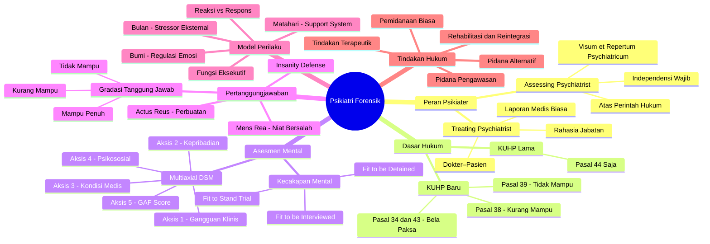
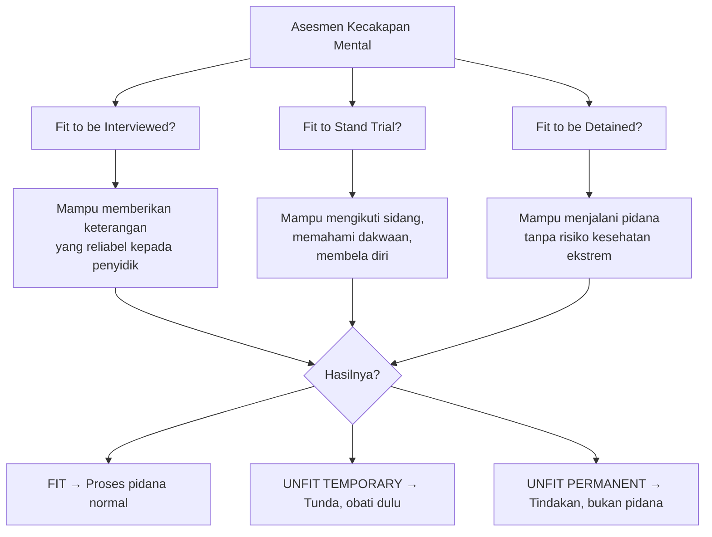
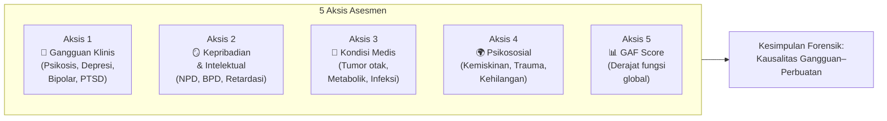
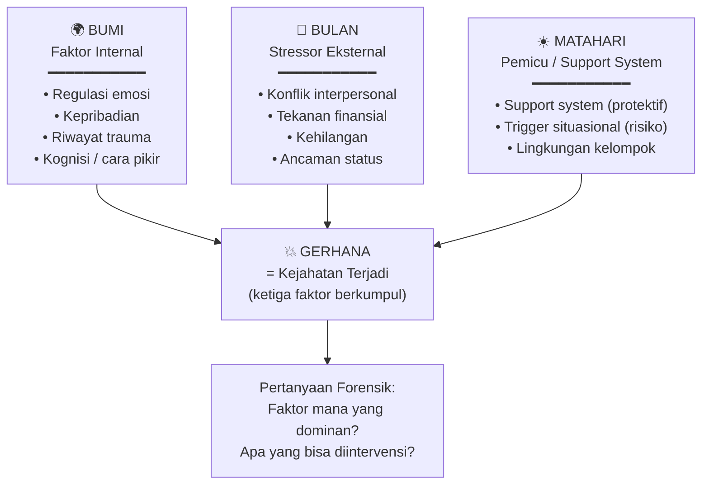
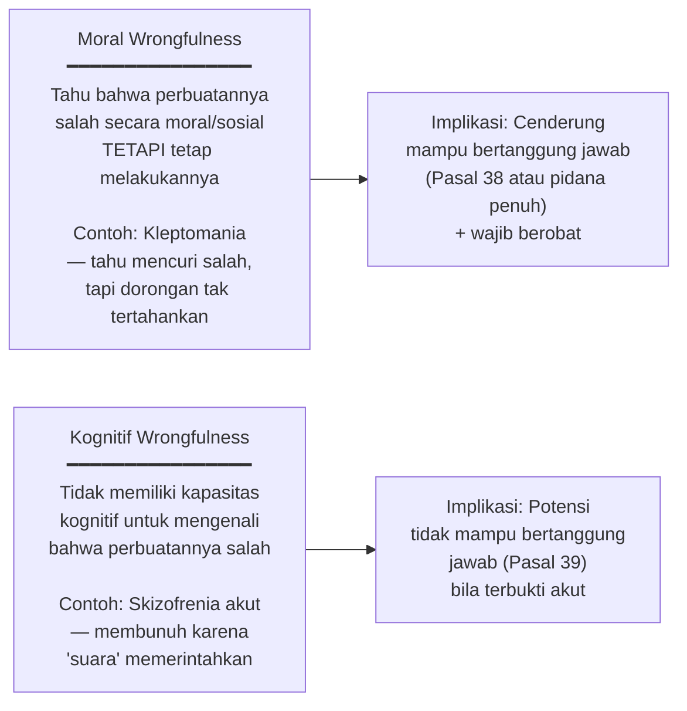
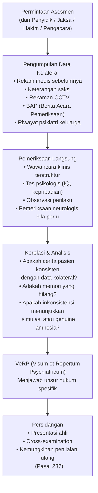
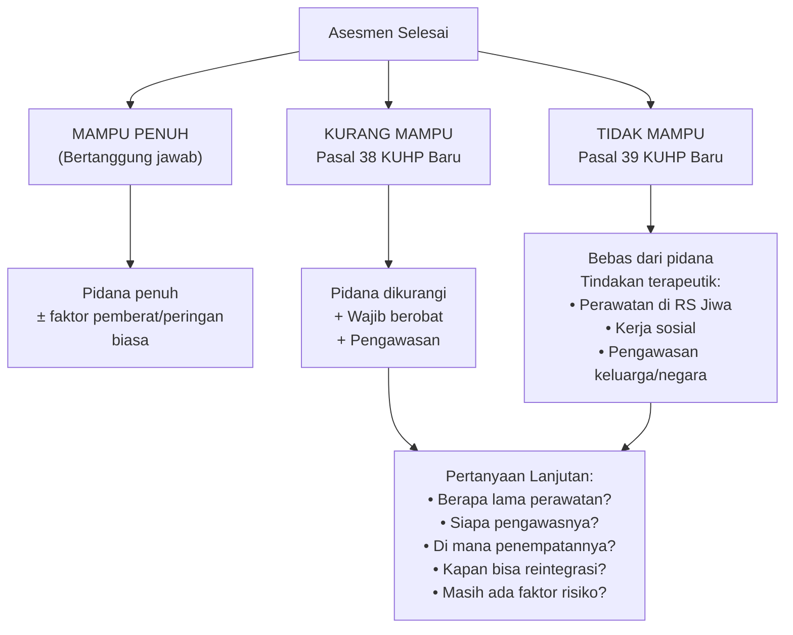
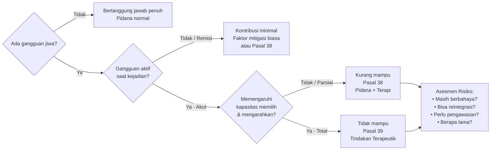

<style>
  /* ── Base Reset ───────────────────────────────────────────── */
  body { font-family: 'Segoe UI', sans-serif; line-height: 1.7; color: #1e1e2e; background: #f8f8fc; }
  h1 { color: #1a1a2e; border-bottom: 3px solid #6c63ff; padding-bottom: 10px; }
  h2 { color: #16213e; border-left: 5px solid #6c63ff; padding-left: 12px; margin-top: 2.5rem; }
  h3 { color: #0f3460; }
  code { background: #eff0f7; padding: 2px 6px; border-radius: 4px; }

  /* ── Callout Base ─────────────────────────────────────────── */
  .callout {
    border-radius: 10px;
    padding: 16px 20px;
    margin: 20px 0;
    border-left: 5px solid;
    position: relative;
  }
  .callout-title {
    font-weight: 700;
    font-size: 0.95em;
    text-transform: uppercase;
    letter-spacing: 0.05em;
    margin-bottom: 8px;
  }
  .callout-body p:last-child { margin-bottom: 0; }

  /* ── Callout Variants ─────────────────────────────────────── */
  .callout-deepdive   { background: #f0ecff; border-color: #6c63ff; }
  .callout-deepdive   .callout-title { color: #6c63ff; }

  .callout-legal      { background: #e8f4fd; border-color: #2980b9; }
  .callout-legal      .callout-title { color: #2980b9; }

  .callout-case       { background: #eafaf1; border-color: #27ae60; }
  .callout-case       .callout-title { color: #27ae60; }

  .callout-warning    { background: #fef9e7; border-color: #f39c12; }
  .callout-warning    .callout-title { color: #f39c12; }

  .callout-danger     { background: #fdedec; border-color: #e74c3c; }
  .callout-danger     .callout-title { color: #e74c3c; }

  .callout-concept    { background: #f4f6f7; border-color: #7f8c8d; }
  .callout-concept    .callout-title { color: #555; }

  /* ── Mindmap Wrapper ─────────────────────────────────────── */
  .mindmap-wrap { background: #fff; border-radius: 14px; padding: 20px; box-shadow: 0 2px 12px rgba(0,0,0,0.08); margin: 24px 0; overflow-x: auto; }
  .mindmap-wrap p { font-size: 0.8em; color: #888; text-align: right; margin: 0; }

  /* ── Table Polish ─────────────────────────────────────────── */
  table { width: 100%; border-collapse: collapse; margin: 16px 0; }
  th { background: #6c63ff; color: white; padding: 10px 14px; }
  td { padding: 9px 14px; border-bottom: 1px solid #e0e0ef; }
  tr:nth-child(even) td { background: #f5f5ff; }
</style>

# 🧠 Psikiatri Forensik — Materi Kuliah Hukum
> **Konteks:** Kuliah kolaborasi Kedokteran–Hukum. Topik utama: peran psikiater dalam sistem peradilan pidana, dasar hukum KUHP baru, asesmen kapasitas mental, dan pertanggungjawaban pidana.

---

## 🗺️ Peta Konsep Besar (Mindmap)

<div class="mindmap-wrap">



</div>

---

## 1. Dua Peran Psikiater di Sistem Hukum

Ini adalah **pembeda paling fundamental** yang harus dipahami sejak awal:

| Aspek | Treating Psychiatrist | Assessing Psychiatrist |
|---|---|---|
| **Hubungan** | Dokter–Pasien | Ahli–Pengadilan |
| **Tujuan** | Mengobati | Menilai kapasitas mental |
| **Kerahasiaan** | Rahasia jabatan berlaku | Dibuka atas perintah hukum |
| **Produk** | Resume/rekam medis | Visum et Repertum Psychiatricum |
| **Bias risiko** | Pro-pasien | Harus independen |

<div class="callout callout-deepdive">
<div class="callout-title">🔬 Deep Dive — Visum et Repertum Psychiatricum (VeRP)</div>
<div class="callout-body">

VeRP bukan sekadar rekam medis. Strukturnya menjawab **unsur hukum spesifik**:
1. **Ada/tidaknya gangguan jiwa** saat kejadian perkara
2. **Bagaimana gangguan itu memengaruhi** kemampuan memilih dan mengarahkan tindakan
3. **Derajat disabilitas** — apakah *fit*, *unfit temporary*, atau *unfit permanent*
4. **Prosedur asesmen** yang digunakan (harus tertulis agar dapat diuji)

Laporan ini menjadi **bukti petunjuk** bagi hakim — bukan vonis, tetapi pertimbangan.

</div>
</div>

<div class="callout callout-warning">
<div class="callout-title">⚠️ Jebakan Umum — Treating ≠ Assessing</div>
<div class="callout-body">

Resume medis dari treating psychiatrist **tidak cukup** untuk keperluan forensik. Ia hanya membuktikan seseorang *pernah sakit*, bukan bahwa gangguan tersebut *memengaruhi kapasitas hukumnya saat kejadian*. Dua hal ini harus selalu dibedakan di persidangan.

</div>
</div>

---

## 2. Dasar Hukum — KUHP Lama vs KUHP Baru

### 2.1 Evolusi Pasal

```
KUHP LAMA              KUHP BARU (Berlaku)
─────────────          ──────────────────────────────────
Pasal 44               Pasal 38 → Kurang mampu bertanggung jawab
(satu pasal,           Pasal 39 → Tidak mampu bertanggung jawab
hanya: mampu           Pasal 34 → Pembelaan terpaksa (noodweer)
atau tidak mampu)      Pasal 43 → Daya paksa / duress defense
```

<div class="callout callout-legal">
<div class="callout-title">⚖️ Legal — Perbedaan Pasal 38 dan 39 KUHP Baru</div>
<div class="callout-body">

| | **Pasal 38 — Kurang Mampu** | **Pasal 39 — Tidak Mampu** |
|---|---|---|
| **Kondisi** | Disabilitas intelektual **sedang** atau gangguan jiwa dengan remisi parsial | Psikotik **akut** atau disabilitas intelektual **berat** |
| **Pidana** | Tetap dipidana, namun diringankan | Bebas dari pidana |
| **Tindakan** | Wajib berobat + pengawasan | Tindakan terapeutik penuh |
| **Syarat Kritis** | Harus dibuktikan kausalitas gangguan–perbuatan | Sama — *plus* harus dalam kondisi akut saat kejadian |

> **Kunci:** Tidak ada orang yang otomatis bebas hanya karena punya kartu kuning (diagnosis psikiatri). Harus dibuktikan bahwa gangguan jiwa tersebut **secara kausal memengaruhi** kemampuan dia saat kejadian perkara.

</div>
</div>

### 2.2 Pasal Bela Paksa (34 & 43 KUHP Baru)

<div class="callout callout-deepdive">
<div class="callout-title">🔬 Deep Dive — "Keguncangan Jiwa yang Hebat" (Pasal 34)</div>
<div class="callout-body">

Pembelaan terpaksa dengan keguncangan jiwa (*noodweer exces*) mensyaratkan psikiater forensik membuktikan:
- Ada **kondisi afektif yang ekstrem** saat kejadian (bukan simulasi)
- Ada **proporsionalitas** antara ancaman dan respons
- Keguncangan bersumber dari **trauma atau tekanan nyata**, bukan kepribadian semata

Ini berbeda dari insanity defense — pelaku *tahu* perbuatannya salah, tetapi kapasitasnya untuk memilih tindakan alternatif terganggu oleh tekanan emosional yang luar biasa.

</div>
</div>

---

## 3. Kecakapan Mental (Mental Capacity) — Tiga Lapis

<div class="mindmap-wrap">



</div>

<div class="callout callout-deepdive">
<div class="callout-title">🔬 Deep Dive — Menilai Fit/Unfit: Apa yang Diukur?</div>
<div class="callout-body">

Psikiater tidak hanya bertanya "apakah orang ini sakit?" melainkan menguji **tiga kemampuan spesifik**:

1. **Understanding** — Apakah ia *memahami* perbuatannya dan konsekuensi hukumnya?
2. **Appreciation of Risk** — Apakah ia bisa *menilai risiko* positif dan negatif dari pilihannya?
3. **Volition** — Apakah ia *mampu memilih dan mengarahkan* tindakannya sesuai konteks?

**Contoh konkret:** Seseorang dengan bipolar yang memperkosa muridnya saat fase manik — *tetap bisa dipidana* jika terbukti ia menggunakan kondom. Penggunaan kondom membuktikan fungsi eksekutif masih aktif: ia tahu konsekuensi tindakannya, artinya *volition* tidak sepenuhnya terganggu.

</div>
</div>

---

## 4. Asesmen Multiaksial dalam Konteks Forensik

Psikiater forensik menggunakan pendekatan **multiaksial** untuk melihat gambaran utuh pelaku:

<div class="mindmap-wrap">



</div>

<div class="callout callout-deepdive">
<div class="callout-title">🔬 Deep Dive — Aksis 3: Kondisi Medis Sebagai Mimikri Psikiatri</div>
<div class="callout-body">

Kondisi medis non-psikiatri bisa **menyerupai psikosis** dan memengaruhi pertanggungjawaban:

- **Ensefalitis/infeksi SSP** → halusinasi dan agitasi akut (onset tiba-tiba ≠ onset psikosis primer)
- **Gagal hati/ensefalopati metabolik** → confusional state dengan perilaku agresif
- **Efek samping obat** (misalnya obat antimalaria, kortikosteroid) → psikosis iatrogenik

**Implikasi hukum:** Jika psikosis disebabkan kondisi medis yang tidak diobati/tidak terdeteksi, peran *mens rea* jauh lebih lemah — bahkan bisa mengarah ke Pasal 39.

</div>
</div>

<div class="callout callout-warning">
<div class="callout-title">⚠️ Jebakan — Jangan Langsung Labeli "Psikiatri"</div>
<div class="callout-body">

Ketika seseorang datang ke IGD dengan bicara ngaco dan agitasi, jangan langsung kirim ke psikiatri tanpa skrining medis. Tanyakan dulu: **onset**-nya seperti apa? Onset psikotik primer biasanya gradual — bukan tiba-tiba dalam 4 hari. Periksa riwayat obat-obatan, kondisi metabolik, dan kemungkinan lesi organik terlebih dahulu.

</div>
</div>

---

## 5. Model Bumi–Bulan–Matahari 🌍🌙☀️

Model ini menjelaskan mengapa seseorang melakukan kejahatan — tidak ada faktor tunggal:

<div class="mindmap-wrap">



</div>

<div class="callout callout-concept">
<div class="callout-title">💡 Konsep — Stres Akut vs Kapasitas</div>
<div class="callout-body">

**Stres akut** terjadi ketika **ekspektasi > kapasitas yang tersedia saat itu**. Ini bukan semata-mata lemahnya karakter — melainkan fungsi eksekutif (prefrontal cortex) yang *terlampaui* oleh aktivasi amigdala.

Secara neurosains: saat stres akut, amigdala (respons emosional primitif) mendominasi dan menghambat fungsi prefrontal cortex (pengambilan keputusan rasional). Ini berkaitan langsung dengan **kemampuan *volition*** yang dinilai dalam forensik.

</div>
</div>

---

## 6. Reaksi vs Respons — Dikotomi Kunci

<div class="callout callout-deepdive">
<div class="callout-title">🔬 Deep Dive — Reaksi vs Respons dalam Konteks Hukum</div>
<div class="callout-body">

| | **Reaksi** | **Respons** |
|---|---|---|
| **Mekanisme** | Otomatis, simpleks, impulsif | Disengaja, reflektif, terencana |
| **Waktu proses** | Milisecond (amigdala) | Detik-menit (korteks prefrontal) |
| **Kesadaran** | Minimal/tidak ada | Ada pertimbangan |
| **Contoh** | Memukul saat disentuh tiba-tiba | Merencanakan serangan |
| **Implikasi hukum** | Potensi mitigasi mens rea | Mens rea penuh |

**Pola respons terhadap ancaman (4F):**
- **Fight** — Melawan
- **Flight** — Melarikan diri
- **Freeze** — Membeku, tidak bereaksi
- **Fawn** — Menyesuaikan diri/mengikuti untuk bertahan

Pola 4F ini dibentuk oleh riwayat trauma dan pola asuh — bukan pilihan sadar. Psikiater forensik perlu memetakan *pola mana yang dominan* pada pelaku dan *mengapa*.

</div>
</div>

---

## 7. Moral Wrongfulness vs Kognitif Wrongfulness

Ini adalah dikotomi penting dalam menentukan *mens rea*:

<div class="mindmap-wrap">



</div>

<div class="callout callout-case">
<div class="callout-title">📋 Kasus — Kleptomania (Referensi: Selebriti Hollywood)</div>
<div class="callout-body">

Seorang figur publik didiagnosis kleptomania: ia *tahu* bahwa mencuri adalah salah (moral wrongfulness ada), tetapi kompulsinya tidak dapat dia kendalikan sepenuhnya. Keputusan pengadilan: **tidak masuk penjara, tetapi kerja sosial** (membersihkan area publik sebagai bentuk malu publik) **+ wajib berobat**. Ini contoh sempurna pemidanaan yang bersifat terapeutik, bukan semata punitif.

</div>
</div>

---

## 8. Gangguan Jiwa Spesifik & Implikasi Hukumnya

### 8.1 Skizofrenia

<div class="callout callout-deepdive">
<div class="callout-title">🔬 Deep Dive — Skizofrenia: Halusinasi Bukan Bohong</div>
<div class="callout-body">

Halusinasi pada skizofrenia adalah **pengalaman persepsi nyata bagi penderitanya** — bukan kebohongan atau manipulasi. Implikasi forensik:

- Tindak pidana akibat perintah halusinasi audioitorik → potensi Pasal 39 (tidak mampu)
- **Kunci:** Apakah saat terjadi kejahatan pasien sedang dalam kondisi **akut** (tidak diobati/putus obat) atau **remisi**?
- Pasien yang *sudah sembuh* dapat menjawab pertanyaan pengadilan, tetapi ini tidak berarti ia *bertanggung jawab* atas tindakan yang dilakukan saat akut

**Faktor prognosis penting untuk hakim:**
- Skizofrenia yang responsif terhadap obat → kemungkinan reintegrasi lebih tinggi
- Setiap relaps → penurunan fungsi kumulatif (deteriorasi)

</div>
</div>

### 8.2 Bipolar

<div class="callout callout-deepdive">
<div class="callout-title">🔬 Deep Dive — Bipolar & Tanggung Jawab Hukum</div>
<div class="callout-body">

Bipolar bersifat **temporer dan episodik** — berbeda dari demensia yang permanen. Kesalahan umum: menggunakan alat ukur dimensia (permanen) untuk menilai bipolar.

**Saat episode manik:**
- Hyperseksualitas → risiko pelecehan seksual
- Impulsivitas tinggi → pengeluaran besar, tindakan ceroboh
- *Grandiosity* → merasa kebal hukum

**Uji pertanggungjawaban saat manik:** Apakah ada *tanda-tanda perencanaan*? (Misal: menggunakan kondom, memilih waktu, menutup jejak) → Ini menunjukkan fungsi eksekutif **masih ada**, artinya pertanggungjawaban tidak hilang sepenuhnya.

</div>
</div>

### 8.3 Gangguan Kepribadian

<div class="callout callout-concept">
<div class="callout-title">💡 Konsep — Gangguan Kepribadian ≠ Bebas Hukum</div>
<div class="callout-body">

Gangguan kepribadian (Narcissistic PD, Antisocial PD, Borderline PD) **jarang memenuhi syarat** untuk Pasal 39. Ini karena:

- Pelaku biasanya *tahu* tindakannya salah (moral wrongfulness ada)
- Gangguan terletak pada *cara beradaptasi*, bukan pada kapasitas kognitif dasar
- Namun, dapat menjadi **faktor mitigasi** (pasal 38) jika terbukti regulasi emosi sangat terganggu

**NPD dalam konteks hukum:** Pelaku dengan NPD cenderung memanfaatkan sistem — pura-pura tidak mengerti. Psikiater harus mengkorelasikan data kolateral (CCTV, saksi) dengan perilaku saat pemeriksaan.

</div>
</div>

---

## 9. Proses Asesmen Forensik

<div class="mindmap-wrap">



</div>

<div class="callout callout-danger">
<div class="callout-title">🚨 Bahaya — False Memory & Hipnosis</div>
<div class="callout-body">

Penggunaan hipnosis dalam pemeriksaan forensik **sangat berisiko**. Hipnosis tidak mengekstrak "kebenaran murni" — ia mengekstrak campuran memori asli, harapan, dan narasi yang terbentuk dari konteks emosional. Hasilnya bisa berupa **false memory** yang sangat meyakinkan.

Lie detector (poligraf) boleh digunakan sebagai *alat bantu*, tetapi **tidak dapat dijadikan dalil** langsung — hanya sebagai data pendukung dalam analisis yang lebih luas.

</div>
</div>

<div class="callout callout-deepdive">
<div class="callout-title">🔬 Deep Dive — Inkonsistensi ≠ Kebohongan</div>
<div class="callout-body">

Saksi atau terdakwa yang inkonsisten dalam keterangannya belum tentu berbohong. Inkonsistensi bisa disebabkan oleh:

- **Amnesia disosiatif** — memori kejadian terputus karena stres ekstrem (trauma)
- **Kondisi psikotik saat kejadian** — memori terfragmentasi
- **Kelelahan kognitif** — diperiksa berkali-kali tanpa pendamping

**Standar forensik:** Berikan waktu, berikan keleluasaan, dan minta *bukti dukung objektif* — jika bisa memberikannya, maka inkonsistensinya tidak menandakan ketidakcakapan.

</div>
</div>

---

## 10. Gradasi Pertanggungjawaban & Tindakan Hukum

<div class="mindmap-wrap">



</div>

<div class="callout callout-legal">
<div class="callout-title">⚖️ Legal — Paradigma Baru: Dari Punitif ke Terapeutik</div>
<div class="callout-body">

KUHP baru secara eksplisit mengakui bahwa tidak semua pelaku harus dipenjara. Opsi yang tersedia:

| Mekanisme | Deskripsi |
|---|---|
| **Pidana Alternatif** | Kerja sosial, denda, pengawasan — menggantikan penjara |
| **Pidana Pengawasan** | Bebas bersyarat dengan supervisi intensif |
| **Komutasi** | Pengurangan hukuman berdasarkan perkembangan kondisi |
| **Amnesti** | Pengampunan (mempertimbangkan kondisi kesehatan) |
| **Restriksi** | Pembatasan aktivitas tanpa pemenjaraan |

**Catatan kritis:** Tindakan terapeutik hanya efektif jika sistemnya mendukung — Indonesia memiliki keterbatasan serius: rasio psikiater:narapidana sangat rendah (misal: 2 psikiater untuk 2.789 narapidana di satu lapas), anggaran makan narapidana sekitar Rp 21.000/hari.

</div>
</div>

---

## 11. Motif & Guilty Mind — Apa yang Dicari Psikiater

<div class="callout callout-deepdive">
<div class="callout-title">🔬 Deep Dive — Peta Motif Pelaku</div>
<div class="callout-body">

Meskipun hukum formal sering tidak menuntut pembuktian motif, psikiater forensik perlu memahaminya untuk:
- Menentukan apakah tindakan itu **terencana vs impulsif**
- Menilai **risiko residivisme** (potensi pengulangan)
- Merekomendasikan **intervensi yang tepat sasaran**

**Tipologi reward yang dicari pelaku:**
1. **Release expression** — melampiaskan emosi (marah, takut dipermalukan)
2. **Status/esteem** — pengakuan dari kelompok tertentu
3. **Gain profit** — keuntungan material
4. **Thrilling/novelty seeking** — sensasi, kebosanan (terkait antisocial PD)
5. **Compliance to internal command** — mematuhi halusinasi/waham (psikotik)
6. **Survival** — respons terhadap ancaman nyata atau persepsi terancam

</div>
</div>

---

## 12. Independensi Ahli & Etika Forensik

<div class="callout callout-warning">
<div class="callout-title">⚠️ Konflik — Treating vs Assessing di Daerah Terpencil</div>
<div class="callout-body">

Idealnya, treating psychiatrist **tidak boleh sekaligus** menjadi assessing psychiatrist karena:
- Hubungan terapeutik menciptakan bias pro-pasien
- Kerahasiaan jabatan bertentangan dengan kewajiban membuka informasi ke pengadilan

**Pengecualian:** Jika psikiater hanya satu di wilayah tersebut, ia *terpaksa* melakukan keduanya — **dengan wajib mencantumkan disclaimer** dalam VeRP dan mendokumentasikan upaya menjaga independensinya.

</div>
</div>

<div class="callout callout-concept">
<div class="callout-title">💡 Konsep — Cross-Examination & Kompetensi Ahli</div>
<div class="callout-body">

Psikiater forensik harus siap untuk:
1. **Mempertahankan temuan dengan data** — bukan hanya otoritas gelar
2. **Menggunakan bahasa teknis sekaligus bahasa awam** — hakim bukan dokter
3. **Mengakui batas kompetensi** — "Saya hanya bisa menilai aspek X; aspek Y di luar kewenangan saya"
4. **Menghadapi repetisi ulang** — Pasal 237 KUHP baru memungkinkan hakim meminta penilaian ulang dari ahli lain jika ada keberatan beralasan

</div>
</div>

---

## 13. Ringkasan — Alur Berpikir Psikiater Forensik

<div class="mindmap-wrap">



</div>

---

## 📚 Referensi Kasus yang Dibahas dalam Kuliah

| Nama Kasus | Isu Forensik Utama | Pasal Relevan |
|---|---|---|
| Anak bunuh bapak & nenek | Psikotik akut, riwayat pola asuh | 39 KUHP Baru |
| Guru les bipolar | Manik → pelecehan seksual, pakai kondom | 38 (masih mampu parsial) |
| Kasus "Bakpao" | Amnesia vs demensia vs simulasi | Fit to stand trial |
| Gubernur Papua (almarhum) | Fit to be interviewed dengan kondisi medis | Fit to be interviewed |
| Kasus Sambo | Ada tekanan / duress defense | 34/43 KUHP Baru |
| Kasus Mahalina | Gangguan jiwa + peran psikiater forensik | 38/39 KUHP Baru |
| Britney Spears | Alat ukur salah (bipolar diukur dgn tes demensia) | Pengampuan / kompetensi |
| Kleptomania (Hollywood) | Moral wrongfulness ada, kontrol terganggu | Pidana alternatif |

---

> **Catatan Studi:** Materi ini direkonstruksi dari kuliah dan dapat mengandung penyederhanaan. Untuk referensi hukum formal, selalu rujuk ke teks KUHP terbaru dan literatur psikiatri forensik (misalnya *Textbook of Forensic Psychiatry* — Simon & Gold, atau panduan PERDOSSI/PDSKJI).
