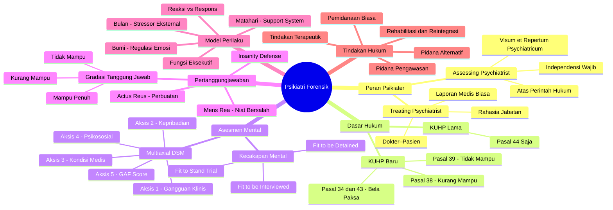
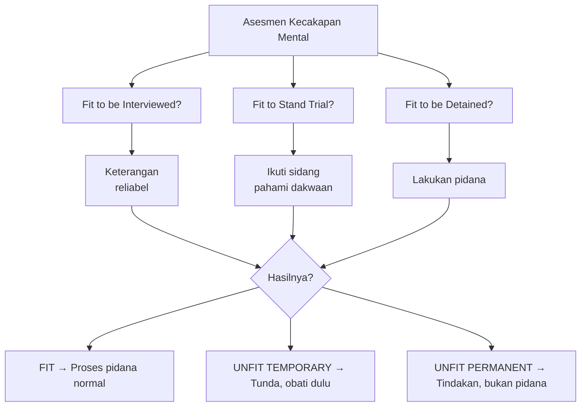
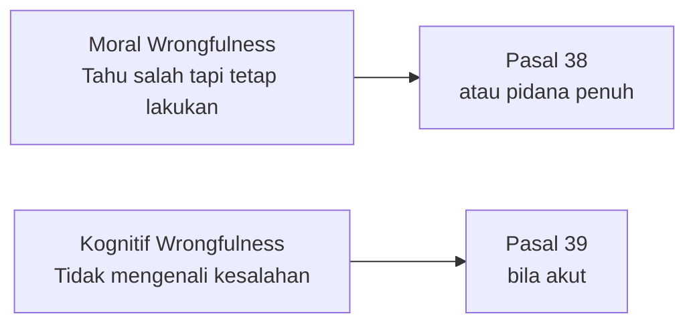
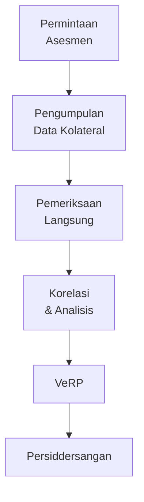
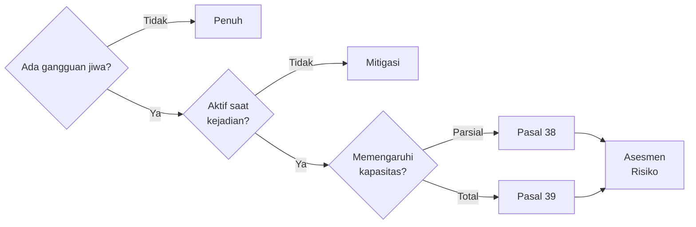

# 🧠 Psikiatri Forensik — Materi Kuliah Hukum
> **Konteks:** Kuliah kolaborasi Kedokteran–Hukum. Topik utama: peran psikiater dalam sistem peradilan pidana, dasar hukum KUHP baru, asesmen kapasitas mental, dan pertanggungjawaban pidana.

---

## 🗺️ Peta Konsep Besar

---

## 1. Dua Peran Psikiater

Ini adalah **pembeda paling fundamental** yang harus dipahami sejak awal:

| Aspek | Treating Psychiatrist | Assessing Psychiatrist |
|---|---|---|
| **Hubungan** | Dokter–Pasien | Ahli–Pengadilan |
| **Tujuan** | Mengobati | Menilai kapasitas mental |
| **Kerahasiaan** | Rahasia jabatan berlaku | Dibuka atas perintah hukum |
| **Produk** | Resume/rekam medis | Visum et Repertum Psychiatricum |
| **Bias risiko** | Pro-pasien | Harus independen |

> [!deepdive] Deep Dive — Visum et Repertum Psychiatricum (VeRP)
> VeRP bukan sekadar rekam medis. Strukturnya menjawab **unsur hukum spesifik**:
> 1. **Ada/tidaknya gangguan jiwa** saat kejadian perkara
> 2. **Bagaimana gangguan itu memengaruhi** kemampuan memilih dan mengarahkan tindakan
> 3. **Derajat disabilitas** — apakah *fit*, *unfit temporary*, atau *unfit permanent*
> 4. **Prosedur asesmen** yang digunakan (harus tertulis agar dapat diuji)
> Laporan ini menjadi **bukti petunjuk** bagi hakim — bukan vonis, tetapi pertimbangan.

> [!warning] Jebakan Umum — Treating ≠ Assessing
> Resume medis dari treating psychiatrist **tidak cukup** untuk keperluan forensik. Ia hanya membuktikan seseorang *pernah sakit*, bukan bahwa gangguan tersebut *memengaruhi kapasitas hukumnya saat kejadian*. Dua hal ini harus selalu dibedakan di persidangan.

---

## 2. Dasar Hukum — KUHP Lama vs KUHP Baru

### 2.1 Evolusi Pasal

> [!legal] Legal — Perbedaan Pasal 38 dan 39 KUHP Baru
> | | **Pasal 38 — Kurang Mampu** | **Pasal 39 — Tidak Mampu** |
> |---|---|---|
> | **Kondisi** | Disabilitas intelektual **sedang** atau gangguan jiwa dengan remisi parsial | Psikotik **akut** atau disabilitas intelektual **berat** |
> | **Pidana** | Tetap dipidana, namun diringankan | Bebas dari pidana |
> | **Tindakan** | Wajib berobat + pengawasan | Tindakan terapeutik penuh |
> | **Syarat Kritis** | Harus dibuktikan kausalitas gangguan–perbuatan | Sama — *plus* harus dalam kondisi akut saat kejadian |
> **Kunci:** Tidak ada orang yang otomatis bebas hanya karena punya kartu kuning (diagnosis psikiatri). Harus dibuktikan bahwa gangguan jiwa tersebut **secara kausal memengaruhi** kemampuan dia saat kejadian perkara.

---

## 3. Kecakapan Mental (Mental Capacity) — Tiga Lapis

> [!deepdive] Deep Dive — Menilai Fit/Unfit: Apa yang Diukur?
> Psikiater tidak hanya bertanya "apakah orang ini sakit?" melainkan menguji **tiga kemampuan spesifik**:
> 1. **Understanding** — Apakah ia *memahami* perbuatannya dan konsekuensi hukumnya?
> 2. **Appreciation of Risk** — Apakah ia bisa *menilai risiko* positif dan negatif dari pilihannya?
> 3. **Volition** — Apakah ia *mampu memilih dan mengarahkan* tindakannya sesuai konteks?
> **Contoh konkret:** Seseorang dengan bipolar yang memperkosa muridnya saat fase manik — *tetap bisa dipidana* jika terbukti ia menggunakan kondom. Penggunaan kondom membuktikan fungsi eksekutif masih aktif: ia tahu konsekuensi tindakannya, artinya *volition* tidak sepenuhnya terganggu.

> [!deepdive] Deep Dive — Aksis 3: Kondisi Medis Sebagai Mimikri Psikiatri
> Kondisi medis non-psikiatri bisa **menyerupai psikosis** dan memengaruhi pertanggungjawaban:
> - **Ensefalitis/infeksi SSP** → halusinasi dan agitasi akut (onset tiba-tiba ≠ onset psikosis primer)
> - **Gagal hati/ensefalopati metabolik** → confusional state dengan perilaku agresif
> - **Efek samping obat** → psikosis iatrogenik
> **Implikasi hukum:** Jika psikosis disebabkan kondisi medis yang tidak diobati/tidak terdeteksi, peran *mens rea* jauh lebih lemah — bahkan bisa mengarah ke Pasal 39.

> [!warning] Jebakan — Jangan Langsung Labeli "Psikiatri"
> Ketika seseorang datang ke IGD dengan bicara ngaco dan agitasi, jangan langsung kirim ke psikiatri tanpa skrining medis. Tanyakan dulu: **onset**-nya seperti apa? Onset psikotik primer biasanya gradual — bukan tiba-tiba dalam 4 hari. Periksa riwayat obat-obatan, kondisi metabolik, dan kemungkinan lesi organik terlebih dahulu.

---

## 5. Model Bumi-Bulan-Matahari

| | **Reaksi** | **Respons** |
|---|---|---|
| **Mekanisme** | Otomatis, simpleks, impulsif | Disengaja, reflektif, terencana |
| **Waktu proses** | Milisecond (amigdala) | Detik-menit (korteks prefrontal) |
| **Kesadaran** | Minimal/tidak ada | Ada pertimbangan |
| **Contoh** | Memukul saat disentuh tiba-tiba | Merencanakan serangan |
| **Implikasi hukum** | Potensi mitigasi mens rea | Mens rea penuh |

**Pola respons terhadap ancaman (4F):**
- **Fight** — Melawan
- **Flight** — Melarikan diri
- **Freeze** — Membeku, tidak bereaksi
- **Fawn** — Menyesuaikan diri/mengikuti untuk bertahan

Pola 4F ini dibentuk oleh riwayat trauma dan pola asuh — bukan pilihan sadar. Psikiater forensik perlu memetakan *pola mana yang dominan* pada pelaku dan *mengapa*.

---

## 7. Moral Wrongfulness vs Kognitif Wrongfulness

Ini adalah dikotomi penting dalam menentukan *mens rea*:

### 📋 Kasus — Kleptomania

Seorang figur publik didiagnosis kleptomania: ia *tahu* bahwa mencuri adalah salah (moral wrongfulness ada), tetapi kompulsinya tidak dapat dia kendalikan sepenuhnya. Keputusan pengadilan: **tidak masuk penjara, tetapi kerja sosial** (membersihkan area publik sebagai bentuk malu publik) **+ wajib berobat**. Ini contoh sempurna pemidanaan yang bersifat terapeutik, bukan semata punitif.

---

## 8. Gangguan Jiwa Spesifik & Implikasi Hukumnya

### 8.1 Skizofrenia

Halusinasi pada skizofrenia adalah **pengalaman persepsi nyata bagi penderitanya** — bukan kebohongan atau manipulasi. Implikasi forensik:

- Tindak pidana akibat perintah halusinasi audioitorik → potensi Pasal 39 (tidak mampu)
- **Kunci:** Apakah saat terjadi kejahatan pasien sedang dalam kondisi **akut** (tidak diobati/putus obat) atau **remisi**?
- Pasien yang *sudah sembuh* dapat menjawab pertanyaan pengadilan, tetapi ini tidak berarti ia *bertanggung jawab* atas tindakan yang dilakukan saat akut

**Faktor prognosis penting untuk hakim:**
- Skizofrenia yang responsif terhadap obat → kemungkinan reintegrasi lebih tinggi
- Setiap relaps → penurunan fungsi kumulatif (deteriorasi)

### 8.2 Bipolar

Bipolar bersifat **temporer dan episodik** — berbeda dari demensia yang permanen. Kesalahan umum: menggunakan alat ukur dimensia (permanen) untuk menilai bipolar.

**Saat episode manik:**
- Hyperseksualitas → risiko pelecehan seksual
- Impulsivitas tinggi → pengeluaran besar, tindakan ceroboh
- *Grandiosity* → merasa kebal hukum

**Uji pertanggungjawaban saat manik:** Apakah ada *tanda-tanda perencanaan*? (Misal: menggunakan kondom, memilih waktu, menutup jejak) → Ini menunjukkan fungsi eksekutif **masih ada**, artinya pertanggungjawaban tidak hilang sepenuhnya.

### 8.3 Gangguan Kepribadian

> [!concept] Konsep — Gangguan Kepribadian ≠ Bebas Hukum
> Gangguan kepribadian (Narcissistic PD, Antisocial PD, Borderline PD) **jarang memenuhi syarat** untuk Pasal 39. Ini karena:
> - Pelaku biasanya *tahu* tindakannya salah (moral wrongfulness ada)
> - Gangguan terletak pada *cara beradaptasi*, bukan pada kapasitas kognitif dasar
> - Namun, dapat menjadi **faktor mitigasi** (pasal 38) jika terbukti regulasi emosi sangat terganggu
> **NPD dalam konteks hukum:** Pelaku dengan NPD cenderung memanfaatkan sistem — pura-pura tidak mengerti. Psikiater harus mengkorelasikan data kolateral (CCTV, saksi) dengan perilaku saat pemeriksaan.

---

## 9. Proses Asesmen Forensik

> [!danger] Bahaya — False Memory & Hipnosis
> Penggunaan hipnosis dalam pemeriksaan forensik **sangat berisiko**. Hipnosis tidak mengekstrak "kebenaran murni" — ia mengekstrak campuran memori asli, harapan, dan narasi yang terbentuk dari konteks emosional. Hasilnya bisa berupa **false memory** yang sangat meyakinkan.
> Lie detector (poligraf) boleh digunakan sebagai *alat bantu*, tetapi **tidak dapat dijadikan dalil** langsung — hanya sebagai data pendukung dalam analisis yang lebih luas.

> [!legal] Legal — Paradigma Baru: Dari Punitif ke Terapeutik
> KUHP baru secara eksplisit mengakui bahwa tidak semua pelaku harus dipenjara. Opsi yang tersedia:
> | Mekanisme | Deskripsi |
> |---|---|
> | **Pidana Alternatif** | Kerja sosial, denda, pengawasan — menggantikan penjara |
> | **Pidana Pengawasan** | Bebas bersyarat dengan supervisi intensif |
> | **Komutasi** | Pengurangan hukuman berdasarkan perkembangan kondisi |
> | **Amnesti** | Pengampunan (mempertimbangkan kondisi kesehatan) |
> | **Restriksi** | Pembatasan aktivitas tanpa pemenjaraan |
> **Catatan kritis:** Tindakan terapeutik hanya efektif jika sistemnya mendukung — Indonesia memiliki keterbatasan serius: rasio psikiater:narapidana sangat rendah (misal: 2 psikiater untuk 2.789 narapidana di satu lapas), anggaran makan narapidana sekitar Rp 21.000/hari.

---

## 12. Independensi Ahli & Etika Forensik

> [!warning] Konflik — Treating vs Assessing di Daerah Terpencil
> Idealnya, treating psychiatrist **tidak boleh sekaligus** menjadi assessing psychiatrist karena:
> - Hubungan terapeutik menciptakan bias pro-pasien
> - Kerahasiaan jabatan bertentangan dengan kewajiban membuka informasi ke pengadilan
> **Pengecualian:** Jika psikiater hanya satu di wilayah tersebut, ia *terpaksa* melakukan keduanya — **dengan wajib mencantumkan disclaimer** dalam VeRP dan mendokumentasikan upaya menjaga independensinya.

> [!concept] Konsep — Cross-Examination & Kompetensi Ahli
> Psikiater forensik harus siap untuk:
> 1. **Mempertahankan temuan dengan data** — bukan hanya otoritas gelar
> 2. **Menggunakan bahasa teknis sekaligus bahasa awam** — hakim bukan dokter
> 3. **Mengakui batas kompetensi** — "Saya hanya bisa menilai aspek X; aspek Y di luar kewenangan saya"
> 4. **Menghadapi repetisi ulang** — Pasal 237 KUHP baru memungkinkan hakim meminta penilaian ulang dari ahli lain jika ada keberatan beralasan

---

## 13. Ringkasan — Alur Berpikir Psikiater Forensik

---

## 📚 Referensi Kasus

| Nama Kasus | Isu Forensik Utama | Pasal Relevan |
|---|---|---|
| Anak bunuh bapak & nenek | Psikotik akut, riwayat pola asuh | 39 KUHP Baru |
| Guru les bipolar | Manik → pelecehan seksual, pakai kondom | 38 (masih mampu parsial) |
| Kasus "Bakpao" | Amnesia vs demensia vs simulasi | Fit to stand trial |
| Gubernur Papua (almarhum) | Fit to be interviewed dengan kondisi medis | Fit to be interviewed |
| Kasus Sambo | Ada tekanan / duress defense | 34/43 KUHP Baru |
| Kasus Mahalina | Gangguan jiwa + peran psikiater forensik | 38/39 KUHP Baru |
| Britney Spears | Alat ukur salah (bipolar diukur dgn tes demensia) | Pengampuan / kompetensi |
| Kleptomania (Hollywood) | Moral wrongfulness ada, kontrol terganggu | Pidana alternatif |

---

> **Catatan Studi:** Materi ini direkonstruksi dari kuliah dan dapat mengandung penyederhanaan. Untuk referensi hukum formal, selalu rujuk ke teks KUHP terbaru dan literatur psikiatri forensik (misalnya *Textbook of Forensic Psychiatry* — Simon & Gold, atau panduan PERDOSSI/PDSKJI).
