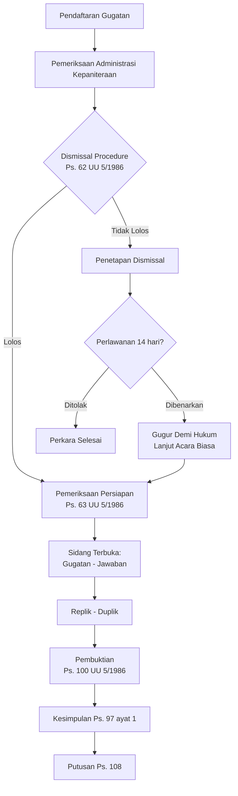
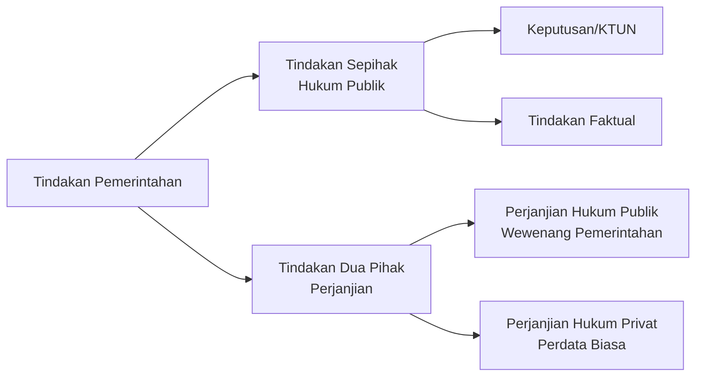
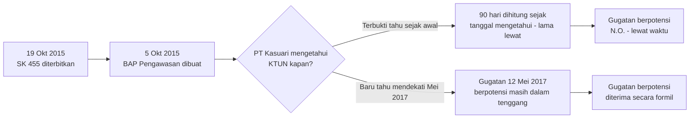
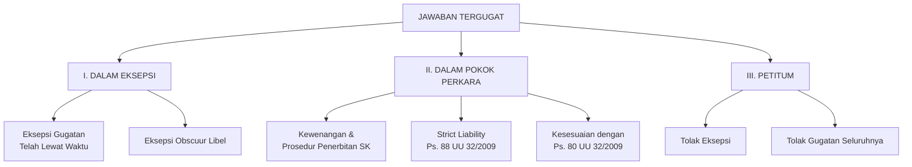

> [!ABSTRACT] Ringkasan
> Catatan ini merangkum tiga pilar Hukum Acara Peradilan Tata Usaha Negara (PTUN): **(1) asas-asas hukum acara** (point d'intérêt point d'action, dominus litis, erga omnes, presumptio iustae causa), **(2) karakteristik hukum acara** (tenggang waktu 90 hari, dismissal procedure, pembuktian, acara cepat, ex-tunc, peran Pengadilan Tinggi TUN, larangan ultra petita), dan **(3) instrumen hukum publik-privat pemerintah** (KTUN, perluasan makna KTUN pasca UU 30/2014, dan Tindakan Administrasi Negara dalam ranah hukum privat). Bagian penutup berisi **analisis soal UTS mengenai kasus PT Kasuari** — sengketa sanksi administratif paksaan pemerintah dari Menteri LHK terkait kebakaran lahan. Dasar hukum utama: UU No. 5/1986 jo. UU No. 9/2004 jo. UU No. 51/2009 tentang PTUN, UU No. 30/2014 tentang Administrasi Pemerintahan, UU No. 32/2009 tentang PPLH, Permen LH No. 02/2013, serta SEMA/Perma terkait.

### Asas-Asas Hukum Acara PTUN

#### 1. Point d'intérêt, Point d'action

Asas ini berasal dari hukum acara perdata Prancis yang secara harfiah berarti "tidak ada kepentingan, tidak ada gugatan" — seseorang hanya dapat menjadi pihak dalam suatu perkara sepanjang ia memiliki kepentingan hukum atas perkara tersebut.

Dalam konteks PTUN, asas ini menegaskan bahwa setiap gugatan yang diajukan ke pengadilan harus didasarkan pada kepentingan hukum penggugat. Kepentingan tersebut bukan kepentingan sembarangan, melainkan kepentingan hukum yang **langsung dan pribadi** — dilandasi hubungan hukum antara penggugat dan tergugat, dan dialami sendiri secara konkret oleh penggugat. Seseorang tidak boleh menggugat atas namanya sendiri padahal yang menjadi objek gugatan sesungguhnya menyangkut kepentingan pihak lain.

Dengan kata lain, *legal standing* (kedudukan hukum) penggugat harus benar-benar ada dan bersifat pribadi sebelum ia dapat mengajukan gugatan ke PTUN. Asas ini juga menjadi dasar dari doktrin *rechtstreeks belang* (kepentingan langsung) yang lazim diuji hakim pada tahap *dismissal procedure* maupun pemeriksaan persiapan.

> [!NOTE] Kaitan dengan legal standing pihak ketiga
> Untuk pihak yang **tidak dituju langsung** oleh suatu KTUN namun merasa kepentingannya dirugikan, kepentingan hukum tetap harus dibuktikan secara kasuistis — sebagaimana kelak juga memengaruhi cara menghitung tenggang waktu gugatan bagi pihak ketiga (lihat bagian Tenggang Waktu Gugatan di bawah).

#### 2. Dominus Litis (Asas Keaktifan Hakim)

Hakim dalam PTUN diberikan kebebasan untuk aktif dalam proses persidangan (*rechter dominus litis* atau *actieve rechter*). Keaktifan hakim ini dimaksudkan untuk mengimbangi kedudukan para pihak yang secara faktual tidak seimbang: tergugat adalah pejabat/badan tata usaha negara yang memiliki kekuasaan dan sumber daya lebih besar, sedangkan penggugat umumnya adalah orang perseorangan atau badan hukum perdata.

Penerapan asas keaktifan hakim yang dilandasi pemahaman filosofis yang benar akan membantu hakim menemukan **kebenaran materiil** suatu sengketa, bukan sekadar kebenaran formil sebagaimana lazim dalam hukum acara perdata.

Berdasarkan ketentuan Pasal 58, Pasal 63, Pasal 80, dan Pasal 85 UU No. 5/1986, hakim aktif berwenang untuk:

- Menentukan apa yang harus dibuktikan;
- Menentukan beban pembuktian;
- Menentukan alat bukti mana yang akan digunakan lebih dahulu;
- Memberikan petunjuk kepada para pihak mengenai upaya hukum dan alat bukti yang dapat digunakan;
- Memerintahkan pemeriksaan setempat maupun mendatangkan saksi/ahli atas inisiatif sendiri.

Konsekuensi paling jauh dari asas ini adalah dimungkinkannya putusan yang bersifat *ultra petita* dan *reformatio in peius* — dibahas lebih lanjut pada bagian Karakteristik Hukum Acara PTUN.

#### 3. Erga Omnes

Karena sengketa Tata Usaha Negara berada di ranah hukum publik, putusan PTUN tidak hanya mengikat para pihak yang berperkara, melainkan **berlaku dan dapat disampaikan kepada publik secara umum** (*erga omnes*, lawan dari *inter partes* dalam hukum perdata).

Beberapa konsekuensi teknis dari asas ini dalam praktik beracara:

- Diktum putusan hakim **tidak perlu** secara khusus menyatakan agar pihak-pihak lain di luar yang berperkara turut menaati putusan — putusan dengan sendirinya mengikat siapa pun yang berkepentingan dengan objek sengketa;
- Intervensi pihak ketiga dalam suatu perkara TUN **tidak bersifat mutlak**; pihak ketiga yang berkepentingan cukup didengar keterangannya sebagai saksi;
- Sejalan dengan asas ini, Pasal 118 UU No. 5/1986 (mengenai pemberitahuan putusan kepada pihak ketiga tertentu) pada praktiknya telah dianggap tidak relevan lagi karena sifat mengikat publik putusan PTUN sudah otomatis berlaku umum.

Perluasan makna KTUN dalam Pasal 87 UU No. 30/2014 — yang menambahkan frasa "keputusan yang berlaku bagi warga masyarakat" tanpa lagi mensyaratkan sifat "individual" secara ketat — dinilai semakin menegaskan relevansi asas *erga omnes* ini terhadap objek sengketa yang berdampak luas kepada masyarakat, bukan hanya kepada penggugat perseorangan.

#### 4. Presumptio Iustae Causa

*Presumptio iustae causa* (atau *vermoeden van rechtmatigheid*) berarti "praduga keabsahan" atau "anggapan sah menurut hukum". Asas ini mengandung makna bahwa setiap Keputusan Tata Usaha Negara (KTUN) yang dikeluarkan oleh pejabat pemerintahan harus selalu **dianggap sah secara hukum** selama belum dibuktikan sebaliknya dan belum dibatalkan oleh hakim.

Konsekuensi dari asas ini adalah:

- Gugatan **tidak menunda** pelaksanaan KTUN — keputusan tetap dapat dilaksanakan meskipun sedang digugat, kecuali ada penetapan penundaan (*schorsing*) dari pengadilan berdasarkan Pasal 67 UU No. 5/1986;
- KTUN dianggap sah sampai ada putusan pengadilan yang menyatakan pembatalannya (*vernietigbaar*, bukan *van rechtswege nietig* atau batal demi hukum sejak semula);
- Tidak dikenal adanya *provisionele vonnis* (putusan sela yang dapat dijalankan lebih dahulu/*uitvoerbaar bij voorraad*) sebagaimana dalam hukum acara perdata;
- Hakim Peradilan Tata Usaha Negara adalah pihak yang berwenang menyatakan sah tidaknya atau membatalkan suatu KTUN — bukan instansi pemerintahan itu sendiri, bukan pula peradilan umum.

> [!TIP] Mengapa asas ini penting bagi pemerintahan
> Asas ini menjamin **kesinambungan penyelenggaraan pemerintahan** (*continuïteit van bestuur*) agar roda administrasi negara tidak lumpuh setiap kali ada pihak yang mengajukan gugatan. Namun asas ini juga menjadi argumen mengapa tenggang waktu gugatan dan kepastian hukum atas berlakunya suatu KTUN menjadi sangat krusial — lihat bagian berikutnya.

### Karakteristik Hukum Acara PTUN

#### 1. Tenggang Waktu 90 Hari untuk Menggugat

Dasar hukum: **Pasal 55 UU No. 5 Tahun 1986** tentang Peradilan Tata Usaha Negara — gugatan hanya dapat diajukan dalam tenggang waktu sembilan puluh hari terhitung sejak diterimanya atau diumumkannya KTUN.

**Cara menghitung (kaidah dasar):**

- Dihitung sebagai **hari kalender** (seluruh hari termasuk hari libur), bukan hari kerja;
- Apabila hari terakhir jatuh pada hari libur, maka batas akhir bergeser ke hari kerja berikutnya;
- Bagi pihak yang **namanya tercantum langsung** dalam KTUN (adresat), tenggang waktu dihitung sejak hari diterimanya keputusan tersebut;
- Apabila peraturan dasar mewajibkan KTUN diumumkan, tenggang waktu dihitung sejak tanggal pengumuman.

**Perkembangan penghitungan tenggang waktu bagi pihak yang tidak dituju langsung (pihak ketiga):**

Pasal 55 pada mulanya hanya mengatur secara eksplisit tenggang waktu bagi pihak yang menjadi adresat langsung KTUN. Untuk pihak ketiga yang tidak dituju namun merasa dirugikan, ketentuan ini diperluas melalui yurisprudensi dan Surat Edaran Mahkamah Agung (SEMA):

| Sumber Hukum | Kaidah Penghitungan Tenggang Waktu |
|---|---|
| **SEMA No. 2 Tahun 1991** angka V.3 | Bagi pihak yang tidak dituju KTUN namun merasa dirugikan, tenggang waktu dihitung **secara kasuistis** sejak ia merasa kepentingannya dirugikan **dan** mengetahui adanya keputusan tersebut |
| **Putusan MA No. 5 K/TUN/1992** ("kasus Sabang") | Menegaskan tenggang waktu gugatan dihitung sejak **penggugat mengetahui** adanya keputusan yang merugikannya — menjadi yurisprudensi tetap |
| **SEMA No. 3 Tahun 2015** | Menyempurnakan kaidah di atas: tenggang waktu 90 hari bagi pihak yang tidak dituju KTUN dihitung sejak yang bersangkutan **pertama kali mengetahui** keputusan yang merugikan kepentingannya |
| **Pasal 5 Perma No. 6 Tahun 2018** | Untuk sengketa yang mensyaratkan upaya administratif lebih dahulu, tenggang waktu 90 hari dihitung sejak diterima/diumumkannya **keputusan atas upaya administratif**, sehingga penghitungan tenggang waktu Pasal 55 "dibantarkan" selama proses upaya administratif berjalan |

> [!WARNING] Perkara lewat waktu tetap diperiksa sampai selesai
> Sekalipun tampak jelas telah lewat 90 hari, hakim **tidak serta-merta** menyatakan gugatan tidak dapat diterima pada tahap *dismissal*. Menilai kapan penggugat "mengetahui" KTUN adalah **fakta yang harus dibuktikan** dalam persidangan (bukan pada tahap administratif/*dismissal*), kecuali keterlambatannya sudah nyata-nyata pasti sejak awal.

Karena keterlambatan mengajukan gugatan bersifat fatal — KTUN yang cacat sekalipun tidak lagi dapat diganggu-gugat — Mahkamah Agung dalam praktiknya juga menegaskan bahwa hakim TUN dapat lebih mengutamakan **kebenaran materiil** dibanding formalitas tenggang waktu apabila ditemukan pelanggaran hukum atau AAUPB yang nyata pada KTUN yang digugat, meski hal ini tetap kasuistis dan bukan kaidah baku.

#### 2. Kedudukan Penggugat dan Tergugat yang Tidak Seimbang

Dalam sengketa tata usaha negara terdapat dua pihak yang berperkara:

- **Penggugat**: orang atau badan hukum perdata yang merasa kepentingannya dirugikan oleh suatu KTUN;
- **Tergugat**: badan atau pejabat tata usaha negara yang mengeluarkan keputusan berdasarkan wewenang yang ada padanya atau yang dilimpahkan kepadanya (atribusi, delegasi, atau mandat).

Kedudukan para pihak dalam PTUN bersifat **tidak seimbang secara faktual** — tergugat adalah aparat pemerintah dengan kewenangan publik dan sumber daya kelembagaan, sementara penggugat adalah warga negara atau badan hukum privat perorangan. Ketidakseimbangan inilah yang melatarbelakangi diterapkannya asas *dominus litis* (hakim aktif) guna menciptakan keseimbangan riil dalam proses peradilan — bukan sekadar keseimbangan formal seperti dalam hukum acara perdata yang menempatkan kedua pihak setara.

#### 3. Penelitian Administrasi, Dismissal Procedure, dan Pemeriksaan Persiapan

Dasar hukum: **Pasal 62 dan Pasal 63 UU No. 5/1986**.

Proses beracara di PTUN pada tahap pendahuluan melalui tiga lapis penyaringan:

1. **Pemeriksaan administrasi** oleh Kepaniteraan — memeriksa kelengkapan syarat formal gugatan sesuai Pasal 56 UU No. 5/1986 (identitas, dasar gugatan, tanda tangan/kuasa, KTUN objek sengketa).
2. **Dismissal procedure** (Pasal 62) oleh Ketua Pengadilan — dilakukan dalam rapat permusyawaratan (bukan sidang terbuka), untuk menyaring gugatan yang:
   - Bukan wewenang PTUN, atau syarat gugatan tidak dipenuhi meski telah diperingatkan;
   - Tidak berdasarkan alasan yang layak;
   - Yang dituntut sudah terpenuhi oleh KTUN yang digugat;
   - Diajukan sebelum waktunya atau telah lewat tenggang waktu.
   Terhadap penetapan dismissal, penggugat dapat mengajukan **perlawanan** dalam 14 hari, diperiksa dengan **acara singkat**; bila perlawanan dibenarkan, penetapan dismissal gugur demi hukum dan pokok gugatan diperiksa dengan acara biasa.
3. **Pemeriksaan persiapan** (Pasal 63) — dilakukan oleh Majelis Hakim sebelum sidang terbuka, di mana hakim **wajib memberi nasihat** kepada penggugat untuk memperbaiki dan melengkapi gugatannya (dalam praktik: 30 hari sejak pemeriksaan persiapan pertama). Pada tahap ini hakim juga menilai kemungkinan munculnya pihak ketiga yang berkepentingan (untuk *intervensi* atau menjadi *tergugat II Intervensi*), sehingga memberi arahan (*advice*) kepada para pihak mengenai hal tersebut.

> [!NOTE] Siapa yang memeriksa?
> Pemeriksaan persiapan lazimnya ditangani oleh **hakim yang relatif junior** dalam susunan majelis, karena sifatnya administratif-teknis (bukan sidang terbuka untuk umum dan tidak menggunakan toga), sebagaimana ditegaskan dalam Buku II Pedoman Teknis Administrasi dan Teknis Peradilan TUN Mahkamah Agung serta SEMA No. 2 Tahun 1991.

Diagram alur pemeriksaan perkara secara keseluruhan:

#### 4. Pembuktian Bebas tapi Terbatas

Dasar hukum: **Pasal 100 UU No. 5/1986**.

- **Terbatas**, karena hanya mengenal lima jenis alat bukti yang ditentukan secara limitatif:
  1. Surat atau tulisan;
  2. Keterangan ahli;
  3. Keterangan saksi;
  4. Pengakuan para pihak;
  5. Pengetahuan hakim.
- **Bebas**, karena hakim memiliki kewenangan menentukan alat bukti mana yang diprioritaskan, menentukan beban pembuktian, dan dapat menilai berdasarkan pengetahuannya sendiri (*ambtshalve*) — konsekuensi langsung dari asas *dominus litis*.

Pembuktian ini juga dibatasi oleh asas bahwa objek yang diuji hakim hanyalah **keabsahan KTUN pada saat diterbitkan** (lihat bagian ex-tunc di bawah), sehingga fakta-fakta yang relevan adalah fakta yang tersedia bagi pejabat TUN pada saat KTUN diterbitkan.

#### 5. Acara Cepat

Dasar hukum: **Pasal 98 jo. Pasal 99 UU No. 5/1986**.

Syarat dan tahapan acara cepat:

- Diajukan karena **kepentingan penggugat yang cukup mendesak**, yang harus dapat disimpulkan dari alasan-alasan permohonan (bukan untuk perkara *sumir*/ringan biasa);
- Diperiksa oleh **hakim tunggal**, bukan majelis;
- Terdapat tiga tenggang waktu 14 hari yang berbeda dalam proses ini ("14 hari × 3"):
  1. Ketua Pengadilan mengeluarkan penetapan dikabulkan/tidaknya permohonan acara cepat dalam **14 hari** sejak permohonan diterima (Pasal 98 ayat 2);
  2. Jika dikabulkan, Ketua Pengadilan menentukan hari, tempat, dan waktu sidang dalam **7 hari** tanpa melalui pemeriksaan persiapan;
  3. Tenggang waktu **jawaban** dan **pembuktian** bagi masing-masing pihak ditentukan tidak melebihi **14 hari** (Pasal 99 ayat 2) — sehingga total ada dua periode 14 hari (penetapan + jawaban/pembuktian) di luar periode 7 hari penjadwalan sidang.
- Terhadap penetapan dikabulkan/ditolaknya permohonan acara cepat, **tidak dapat diajukan upaya hukum**.

#### 6. Pengujian Hakim Bersifat Ex-Tunc

Pengujian *ex tunc* berarti hakim, dalam menilai keabsahan suatu KTUN, memperhitungkan **seluruh fakta dan keadaan hukum pada saat KTUN diterbitkan** — bukan keadaan pada saat perkara diperiksa/disidangkan. Konsekuensinya, apabila KTUN dinyatakan batal, akibat hukum pembatalan itu dianggap berlaku surut sejak (setidaknya) tanggal KTUN diterbitkan — berbeda dari sifat *ex nunc* yang hanya berlaku ke depan sejak putusan dijatuhkan.

> [!WARNING] Membedakan dua konsep "ex-tunc/ex-nunc" yang berbeda
> Perlu hati-hati membedakan dua hal yang sering tertukar:
> 1. **Ex-tunc/ex-nunc sebagai sifat *pengujian hakim* atas KTUN** — inilah yang dimaksud dalam konteks hukum acara PTUN: hakim menguji keabsahan KTUN berdasarkan fakta pada *saat diterbitkan*, dan pembatalannya berlaku surut.
> 2. **Ex-tunc/ex-nunc sebagai sifat *mulai berlakunya suatu peraturan perundang-undangan*** — ini adalah konsep hukum tata negara yang berbeda, mengenai apakah suatu undang-undang berlaku surut atau berlaku sejak diundangkan/diberlakukan ke depan.
>
> Contoh "UU PTUN baru berlaku 5 tahun setelah diundangkan (1986→1991) sehingga bersifat *ex-nunc*" merujuk pada **konsep kedua** (penundaan mulai berlakunya undang-undang), bukan pada sifat pengujian hakim atas KTUN. Kedua konsep ini sebaiknya tidak dicampuradukkan dalam menjawab soal ujian.

Penting pula dicatat bahwa KTUN yang dibatalkan bersifat **dapat dibatalkan** (*vernietigbaar*) — bukan **batal demi hukum** (*van rechtswege nietig*) — sejalan dengan asas *presumptio iustae causa* di atas: KTUN tetap dianggap sah dan mengikat sampai ada putusan pengadilan yang menyatakan sebaliknya.

#### 7. Peran Pengadilan Tinggi Tata Usaha Negara

Dasar hukum: **Pasal 51 UU No. 5/1986**, **UU No. 30/2014 tentang Administrasi Pemerintahan**, dan **SEMA No. 2 Tahun 2019**.

Pengadilan Tinggi TUN (PT TUN) memiliki dua peran berbeda dalam sistem peradilan TUN:

1. **Sebagai pengadilan tingkat banding** — memeriksa ulang putusan PTUN tingkat pertama atas permohonan banding para pihak (Pasal 51 ayat 1-2);
2. **Sebagai pengadilan tingkat pertama** — dalam hal peraturan dasar suatu sengketa TUN mensyaratkan penyelesaian melalui **upaya administratif berupa banding administratif** terlebih dahulu (Pasal 51 ayat 3 jo. Pasal 48 UU No. 5/1986; serta Pasal 75-78 UU No. 30/2014 tentang upaya administratif berupa keberatan dan banding).

Sebelum SEMA No. 2 Tahun 2019, timbul *antinomi* (ketidaksesuaian) antara Pasal 51 ayat (3) UU No. 5/1986 dan Pasal 1 angka 18 jo. Pasal 76 ayat (3) UU No. 30/2014 mengenai forum manakah yang berwenang mengadili sengketa pasca-upaya administratif. SEMA No. 2 Tahun 2019 kemudian merumuskan kaidah penyelesaiannya secara lebih jelas:

| Situasi | Pengadilan Berwenang Tingkat Pertama |
|---|---|
| Peraturan dasar sengketa mengatur upaya administratif berupa **banding administratif** secara eksplisit menunjuk PT TUN | **Pengadilan Tinggi TUN** |
| Tidak ada peraturan dasar khusus mengenai upaya administratif, atau hanya memberlakukan upaya **keberatan** biasa | **Pengadilan TUN (tingkat pertama biasa)** |
| Peraturan dasar secara eksplisit menyatakan PTUN (bukan PT TUN) berwenang mengadili meski telah ditempuh banding administratif | **Pengadilan TUN** |

Contoh sengketa yang lazim menempuh forum PT TUN sebagai tingkat pertama adalah sengketa kepegawaian yang telah melalui upaya banding administratif ke **Badan Pertimbangan ASN (BPASN)** sebagaimana kini diatur pula dalam Perma No. 2 Tahun 2023.

#### 8. Putusan Tidak Boleh Ultra Petita, tetapi Dimungkinkan Reformatio in Peius

- ***Ultra petita***: putusan hakim yang melebihi atau di luar dari apa yang dituntut (petitum) oleh penggugat. Dalam hukum acara perdata, asas larangan *ultra petita* dipegang ketat (Pasal 178 ayat 3 HIR/Pasal 189 ayat 3 Rbg). Namun di PTUN, sebagai konsekuensi dari asas *dominus litis*, larangan ini **tidak berlaku mutlak** — hakim TUN dapat mempertimbangkan hal-hal yang secara materiil terkait objek sengketa meski tidak dimintakan secara eksplisit oleh penggugat, demi tercapainya kebenaran materiil dan perlindungan hukum publik. Yurisprudensi **Putusan MA No. 5 K/TUN/1992** dikenal luas sebagai rujukan yang membuka ruang bagi putusan yang bersifat *ultra petita* di PTUN.
- ***Reformatio in peius***: putusan hakim yang justru membawa penggugat pada keadaan yang **lebih buruk/merugikan** dibandingkan sebelum ia mengajukan gugatan. Contoh klasik: seorang pegawai diberhentikan secara hormat lalu menggugat pemberhentiannya, namun hakim menilai bahwa yang tepat justru pemberhentian **tidak dengan hormat** — sehingga putusan menolak petitum penggugat namun sekaligus memperburuk posisinya. Hal ini **hanya diperbolehkan sepanjang diatur secara khusus** dalam peraturan perundang-undangan tertentu (misalnya dalam sengketa kepegawaian yang mengatur skema pemberhentian secara berjenjang).

| Aspek | Ultra Petita | Reformatio in Peius |
|---|---|---|
| Arah putusan | Melebihi tuntutan, cenderung **menguntungkan** penggugat/pihak yang memohon | Putusan yang **merugikan** posisi penggugat dibanding semula |
| Dasar pembenaran di PTUN | Konsekuensi asas *dominus litis* & tujuan kebenaran materiil | Hanya sah bila **diatur secara tegas** dalam peraturan perundang-undangan |
| Sikap doktrin | Diperdebatkan; sebagian ahli (mis. Philipus M. Hadjon) tetap menganggapnya perlu kehati-hatian ekstra | Dianggap sebagai bentuk ekstrem dari kewenangan hakim aktif, harus berbasis kepastian hukum yang jelas |

### Tindakan Pemerintah dalam Hukum Publik dan Hukum Privat

> [!QUOTE]
> "Pemerintah dalam pelelangan pada saat *open tender* itu sedang berada dalam ranah hukum publik" — meskipun objek yang diperjanjikan bersifat keperdataan (misalnya pengadaan barang/jasa), *proses* penentuan pemenang tender tunduk pada hukum administrasi negara dan dapat menjadi objek sengketa TUN (mis. melalui mekanisme sanggah dan sanggah banding).

#### Instrumen Tindakan Administrasi Negara (TAN)

Pemerintah dalam menjalankan fungsinya dapat bertindak dalam dua kualitas hukum yang berbeda:

- **Hukum Publik** — untuk menjalankan kekuasaan publik (*bestuursbevoegdheid*), pemerintah menjelma dalam kualitas **pejabat/badan Tata Usaha Negara**, tunduk pada UU PTUN, UU Administrasi Pemerintahan, dan AAUPB;
- **Hukum Privat** — untuk melakukan perbuatan hukum keperdataan (*privaatrechtelijke handeling*), pemerintah menjelma dalam kualitas **badan hukum perdata** (mis. melalui BUMN/BUMD, atau negara sebagai subjek hukum perdata biasa), tunduk pada KUH Perdata.

#### Bentuk Tindakan Pemerintahan

Tindakan pemerintahan (*bestuurshandelingen*) secara umum dapat dibedakan menjadi:

- **Tindakan sepihak** (*eenzijdige rechtshandeling*) — kehendak pemerintah yang berdiri sendiri tanpa memerlukan persetujuan pihak lain untuk menimbulkan akibat hukum, misalnya penerbitan izin atau sanksi administratif;
- **Tindakan dua pihak** (*meerzijdige rechtshandeling*) — memerlukan kesepakatan dua pihak atau lebih, misalnya kontrak/perjanjian pemerintah dengan warga masyarakat atau badan hukum lain.

#### Unsur-Unsur Keputusan (KTUN)

Berdasarkan **Pasal 1 angka 9 UU No. 51/2009**, unsur-unsur KTUN meliputi:

- Merupakan **pernyataan kehendak sepihak** dari organ pemerintahan;
- Dikeluarkan oleh **organ/badan atau pejabat pemerintahan**;
- Didasarkan pada **kewenangan hukum yang bersifat publik**;
- Berisi tindakan hukum tata usaha negara berdasarkan peraturan perundang-undangan yang berlaku;
- Bersifat **konkret** (objeknya nyata, tidak abstrak), **individual** (ditujukan pada subjek/pihak tertentu, bukan umum), dan **final** (sudah definitif, tidak lagi memerlukan persetujuan instansi lain);
- Ditujukan untuk hal khusus, yaitu menentukan, mengubah, menghapuskan, atau menciptakan suatu hubungan hukum yang sudah ada atau hubungan hukum yang baru;
- **Menimbulkan akibat hukum** bagi seseorang atau badan hukum perdata tertentu.

#### Perluasan Pengertian Keputusan (Pasal 87 UU No. 30/2014)

Pasal 87 UU No. 30/2014 tentang Administrasi Pemerintahan memperluas makna KTUN sebagaimana diatur dalam UU No. 5/1986, sehingga KTUN kini harus dimaknai mencakup:

1. **Penetapan tertulis yang juga mencakup tindakan faktual** — tindakan pemerintahan berupa perbuatan nyata (melakukan atau tidak melakukan) dalam penyelenggaraan pemerintahan, bukan hanya dokumen tertulis;
2. **Keputusan Badan dan/atau Pejabat TUN di lingkungan eksekutif, legislatif, yudikatif, dan penyelenggara negara lainnya** — memperluas cakupan dari yang semula hanya eksekutif;
3. Keputusan yang didasarkan pada **ketentuan perundang-undangan dan AAUPB** — bukan hanya peraturan tertulis;
4. Bersifat **final dalam arti yang lebih luas** — termasuk keputusan yang telah diambil alih oleh atasan pejabat yang berwenang;
5. Keputusan yang **berpotensi menimbulkan akibat hukum** — sehingga kerugian tidak perlu sudah nyata terjadi, cukup berpotensi menimbulkan akibat hukum bagi legal standing penggugat;
6. Keputusan yang **berlaku bagi warga masyarakat** — memperluas unsur "individual" menjadi bisa juga bersifat kolektif/berlaku umum bagi kelompok masyarakat tertentu.

> [!NOTE] Kehati-hatian dalam penerapan
> Mahkamah Agung mengingatkan agar hakim berhati-hati menafsirkan frasa "final dalam arti luas" dan "berpotensi menimbulkan akibat hukum" agar tidak menimbulkan ketidakpastian mengenai batas kompetensi absolut PTUN, sekaligus tidak menghambat jalannya administrasi pemerintahan sehari-hari.

#### Keputusan Konstitutif dan Deklaratif

Dilihat dari akibat hukumnya, KTUN dapat dibedakan menjadi:

- **Keputusan Konstitutif** — keputusan yang **menciptakan, mengubah, atau menghapuskan** suatu hubungan hukum atau status hukum baru yang sebelumnya belum ada. Contoh: penerbitan izin usaha, SK pengangkatan pegawai, SK pemberian hak atas tanah.
- **Keputusan Deklaratif** — keputusan yang sekadar **menegaskan atau menyatakan** suatu keadaan hukum yang **sudah ada** sebelumnya, tanpa menciptakan hubungan hukum baru. Contoh: surat keterangan status kewarganegaraan, penetapan yang menegaskan kepemilikan berdasarkan alas hak yang telah ada.

Pembedaan ini relevan untuk menentukan sejak kapan suatu hak/kewajiban sesungguhnya lahir — pada keputusan konstitutif, hak/kewajiban lahir **sejak keputusan diterbitkan**; pada keputusan deklaratif, hak/kewajiban pada dasarnya telah ada sebelumnya dan keputusan hanya bersifat konfirmatif.

#### Syarat Sahnya Keputusan

Dasar hukum: **Pasal 52 ayat (1) dan (2) UU No. 30/2014**.

Suatu keputusan dinyatakan sah apabila memenuhi:

- Ditetapkan oleh **pejabat/badan yang berwenang** (baik atribusi, delegasi, maupun mandat);
- Dibuat sesuai **prosedur** yang ditentukan peraturan perundang-undangan;
- Substansi yang sesuai dengan **objek keputusan** yang ditetapkan/dilakukan;
- Didasarkan pada **ketentuan peraturan perundang-undangan**; dan
- Sesuai dengan **Asas-Asas Umum Pemerintahan yang Baik (AUPB)**.

Ketidakterpenuhan salah satu syarat sah tersebut membuat keputusan berpotensi dinyatakan **tidak sah** (Pasal 70) atau **batal** (Pasal 71) sesuai kualifikasi cacat yang bersangkutan.

#### Berlaku dan Mengikatnya Keputusan

- Keputusan berlaku pada **tanggal ditetapkan**, kecuali ditentukan lain dalam keputusan itu sendiri atau dalam peraturan perundang-undangan yang menjadi dasarnya;
- Keputusan **harus mencantumkan** batas waktu mulai dan berakhirnya keberlakuan, kecuali ditentukan lain dalam peraturan perundang-undangan;
- Batas waktu keberlakuan **dapat diperpanjang** sesuai ketentuan peraturan perundang-undangan yang berlaku;
- Keputusan pada prinsipnya **tidak dapat berlaku surut**, kecuali untuk:
  - Menghindari kerugian yang lebih besar bagi kepentingan umum; atau
  - Mencegah terabaikannya hak warga masyarakat.

> [!EXAMPLE] Contoh penerapan "ditentukan lain"
> UU PTUN sendiri merupakan salah satu contoh "ditentukan lain", karena baru berlaku efektif lima tahun setelah diundangkan (diundangkan 1986, berlaku efektif 1991) — sebuah bentuk penundaan berlakunya undang-undang (bukan pembatalan retroaktif KTUN sebagaimana dibahas pada bagian ex-tunc/ex-nunc di atas).

#### Keuntungan Pemanfaatan TAN Hukum Privat

Pemerintah dapat memilih memanfaatkan instrumen hukum privat (bukan hukum publik) dengan sejumlah pertimbangan keuntungan:

- Ketegangan yang disebabkan oleh tindakan sepihak pemerintah (yang khas hukum publik) dapat **dikurangi**, karena hubungan hukum privat bersifat konsensual;
- Instrumen perdata **hampir selalu dapat memberikan jaminan kebendaan** (agunan, hak tanggungan, jaminan fidusia, dan sebagainya) yang tidak dikenal dalam hukum publik;
- Saat jalur hukum publik mengalami kebuntuan (misalnya karena keterbatasan kewenangan atau prosedur yang kaku), jalur perdata dapat memberikan jalan keluar yang lebih fleksibel;
- Lembaga hukum perdata bersifat **fleksibel** dan selalu dapat diterapkan untuk berbagai keperluan;
- Para pihak pada dasarnya **bebas menentukan isi perjanjian** (asas kebebasan berkontrak), meskipun tetap dibatasi oleh undang-undang untuk bentuk-bentuk perjanjian tertentu yang bersifat memaksa (*dwingend recht*);
- Pemerintah, karena kedudukannya yang khusus dalam menjaga kepentingan umum, tetap dapat memiliki kedudukan istimewa (*publiekrechtelijke voorbehoud*) dalam hubungan keperdataan, termasuk kemungkinan **memutus sepihak** suatu perjanjian yang telah diadakan dengan warga apabila kepentingan umum menuntut demikian.

> [!DANGER] Risiko *Détournement de Procédure*
> Pemanfaatan instrumen hukum privat oleh pemerintah juga rentan disalahgunakan menjadi ***détournement de procédure*** (penyalahgunaan prosedur) — yaitu ketika pemerintah sengaja **"melarikan diri" ke jalur hukum perdata** (*vlucht in het privaatrecht*) untuk **menghindari kewajiban prosedural, kontrol, dan pengawasan publik** (termasuk AAUPB dan mekanisme uji keabsahan di PTUN) yang seharusnya berlaku apabila tindakan tersebut dilakukan dalam ranah hukum publik. Praktik semacam ini dianggap bertentangan dengan asas kepastian hukum dan larangan penyalahgunaan wewenang.

#### Macam Tindakan Administrasi Negara dalam Ranah Hukum Privat

##### Perjanjian Perdata Biasa

Harta kekayaan negara yang dipertanggungkan pada lembaga hukum publik yang menguasainya menjadi organisasi negara yang memiliki kemandirian bertindak. Perjanjian jenis ini **selalu didahului oleh suatu KTUN** (misalnya penetapan anggaran atau izin/persetujuan tertentu) sebagai landasan kewenangan bertindak. Bentuk ini adalah bentuk **paling sering digunakan**. Contoh: jual-beli alat-alat kantor, sewa-menyewa gedung, pemborongan pekerjaan/kontrak konstruksi.

##### Perjanjian Mengenai Wewenang Pemerintahan

- Perjanjian antara pemerintah dengan warga negara mengenai **cara pemerintah menggunakan wewenangnya**;
- Sering disebut sebagai perjanjian yang tunduk pada hukum publik, sehingga pemerintah **tidak dapat selamanya terikat mutlak** pada isi perjanjian tersebut;
- Pemerintah dimungkinkan **menyimpangi** isi perjanjian apabila terjadi perubahan keadaan masyarakat/kepentingan umum yang mendesak (asas *rebus sic stantibus* dalam ranah hukum publik).

##### Perjanjian Mengenai Kebijakan yang Akan Dilaksanakan

Objek perjanjian adalah hak kebendaan (harta kekayaan) pemerintah yang dijadikan sarana untuk mencapai tujuan kebijakan tertentu. Kelompok perjanjian yang penting dalam kategori ini umumnya menyangkut **transaksi harta tidak bergerak** (tanah dan bangunan milik negara) yang digunakan sebagai instrumen kebijakan (misalnya penyediaan lahan untuk proyek strategis nasional).

##### Perjanjian Jual-Beli Barang dan Jasa (Pengadaan Pemerintah)

Merupakan bentuk perjanjian keperdataan yang tunduk pada rezim pengadaan barang/jasa pemerintah (kini diatur dalam Perpres No. 16 Tahun 2018 beserta perubahannya). Karakteristik khasnya:

- Proses **pemilihan penyedia** (tender/seleksi) tetap tunduk pada hukum administrasi negara dan dapat menjadi objek sengketa administratif melalui mekanisme **sanggah** dan **sanggah banding**, bahkan berpotensi menjadi objek gugatan TUN dalam hal keputusan penetapan pemenang dianggap KTUN;
- Setelah kontrak ditandatangani, hubungan hukum antara pemerintah dan penyedia barang/jasa **beralih menjadi murni keperdataan**, tunduk pada KUH Perdata dan ketentuan kontrak, sehingga sengketa pelaksanaan kontrak umumnya diselesaikan melalui arbitrase atau Pengadilan Negeri, bukan PTUN.

### Analisis UTS — Soal 3: Kasus PT Kasuari

#### Duduk Perkara Singkat

Menteri LHK menerbitkan SK No. 455/Menlhk-PHLHK/PPSA/2015 tertanggal 19 Oktober 2015 yang menjatuhkan sanksi administratif **paksaan pemerintah** kepada PT Kasuari atas lima pelanggaran (kebakaran lahan, tidak lengkapnya sarana penanggulangan kebakaran, TPS Limbah B3 tidak sesuai standar, tidak memiliki izin penyimpanan sementara limbah B3, dan tidak memelihara fungsi lingkungan hidup). Sanksi berupa lima kewajiban dengan tenggat berbeda-beda, termasuk kewajiban permintaan maaf publik melalui media nasional. Gugatan baru diajukan ke PTUN pada 12 Mei 2017 — PT Kasuari mendalilkan tidak pernah menerima SK tersebut secara resmi. BAP Pengawasan tertanggal 5 Oktober 2015 menunjukkan sumber titik api sesungguhnya berasal dari areal PT Cucak Rowo yang menjalar akibat tiupan angin ke areal kerja PT Kasuari.

#### Jawaban 1 — Menghitung Tenggang Waktu Gugatan

PT Kasuari adalah **adresat langsung** SK 455/2015 (bukan pihak ketiga), sehingga kaidah dasar Pasal 55 UU No. 5/1986 berlaku: tenggang waktu 90 hari dihitung sejak **diterimanya** atau **diumumkannya** KTUN.

Karena PT Kasuari mendalilkan **tidak pernah menerima secara resmi**, titik pijak "diterimanya" tidak dapat ditentukan begitu saja dari tanggal penerbitan SK (19 Oktober 2015). Ada dua kemungkinan pendekatan yang relevan dipakai hakim:

1. **Jika terbukti ada pengumuman resmi** sesuai prosedur (mis. dipublikasikan di situs resmi Ditjen Gakkum KLHK atau disampaikan melalui pengumuman publik sebagaimana lazim dipraktikkan untuk sanksi administratif lingkungan) — tenggang waktu 90 hari dihitung sejak **tanggal pengumuman** tersebut, bukan sejak tanggal penerbitan SK.
2. **Jika tidak terbukti ada pengumuman maupun penerimaan resmi** — merujuk pada prinsip yang dibangun SEMA No. 2/1991, Putusan MA No. 5 K/TUN/1992, dan SEMA No. 3/2015 (meski prinsip ini semula ditujukan bagi pihak ketiga, esensinya — bahwa tenggang waktu dihitung sejak **pihak yang bersangkutan benar-benar mengetahui** keberadaan keputusan yang merugikannya — relevan dianalogikan di sini), maka hakim akan menelusuri secara kasuistis **kapan sebenarnya PT Kasuari mengetahui** adanya SK tersebut.

Fakta bahwa **BAP Pengawasan tertanggal 5 Oktober 2015** dibuat sebelum penerbitan SK, dan lazimnya proses pengawasan lapangan melibatkan/memberi tahu pihak yang diawasi (dalam hal ini PT Kasuari, karena BAP mencatat lokasi spesifik di areal kerjanya), membuka kemungkinan besar bahwa PT Kasuari **sesungguhnya telah mengetahui** proses yang mengarah pada penjatuhan sanksi ini jauh sebelum Mei 2017. Ini menjadi fakta yang **harus diuji dan dibuktikan dalam persidangan** (bukan cukup diasumsikan begitu saja pada tahap dismissal), sesuai prinsip bahwa penilaian lewat-tidaknya tenggang waktu memerlukan pembuktian materiil.

Dengan rentang faktual dari 19 Oktober 2015 sampai 12 Mei 2017 (± 570 hari, jauh melampaui 90 hari), beban pembuktian secara praktis akan berat bagi PT Kasuari untuk menunjukkan bahwa ia baru mengetahui keberadaan SK tersebut dalam kurun 90 hari terakhir sebelum pendaftaran gugatan (kira-kira sejak pertengahan Februari 2017). Selama hal itu tidak terbukti, gugatan berisiko besar dinyatakan **tidak dapat diterima** (*niet ontvankelijke verklaard*) karena telah lewat tenggang waktu.

#### Jawaban 2 — Kemungkinan Gugatan ke Pengadilan Negeri, Definisi Sanksi Administratif, dan Ketepatan Penerapannya

**a. Kemungkinan gugatan ke Pengadilan Negeri**

Sengketa mengenai **sah atau tidaknya SK 455/2015** (sebagai KTUN) merupakan kompetensi absolut PTUN (Pasal 47 jo. Pasal 1 angka 10 UU No. 51/2009) — sehingga gugatan untuk membatalkan/menyatakan tidak sah SK tersebut **tidak dapat** diajukan ke Pengadilan Negeri (PN). Namun demikian, terdapat ruang gugatan ke PN dalam konteks yang **berbeda objek dan berbeda para pihak**:

- **PT Kasuari dapat menggugat PT Cucak Rowo** secara perdata ke PN berdasarkan **Pasal 1365 KUH Perdata** (perbuatan melawan hukum) dan/atau prinsip **tanggung jawab mutlak** (*strict liability*, Pasal 88 UU No. 32/2009), karena BAP Pengawasan menunjukkan sumber titik api berasal dari areal kerja PT Cucak Rowo. Ini murni sengketa keperdataan antarbadan hukum privat — kompetensi PN, bukan PTUN.
- **Pemerintah (KLHK) juga dapat mengajukan gugatan perdata** ganti rugi dan/atau tindakan pemulihan lingkungan ke PN terhadap penanggung jawab usaha/kegiatan berdasarkan **Pasal 90 UU No. 32/2009** dengan prinsip *strict liability* Pasal 88 — sebagaimana preseden dalam **Putusan PN Jakarta Pusat No. 12/Pdt.G-LH/2016/PN.Jkt.Pst** (KLHK melawan perusahaan perkebunan sawit terkait kebakaran lahan) yang menegaskan bahwa penanggung jawab usaha bertanggung jawab mutlak atas kebakaran di areal kerjanya tanpa perlu membuktikan unsur kesalahan.
- Namun gugatan terhadap **keabsahan SK sanksi administratif itu sendiri** tetap murni kompetensi PTUN, sehingga tidak dapat "dialihkan" ke PN sekalipun terdapat pertimbangan strategi litigasi tertentu.

| Objek Sengketa | Para Pihak | Forum |
|---|---|---|
| Keabsahan SK 455/2015 (KTUN) | PT Kasuari vs. Menteri LHK | **PTUN** (kompetensi absolut) |
| Ganti rugi akibat kebakaran yang menjalar dari areal PT Cucak Rowo | PT Kasuari vs. PT Cucak Rowo | **Pengadilan Negeri** (Pasal 1365 KUH Perdata / Pasal 88 UU 32/2009) |
| Ganti rugi dan pemulihan lingkungan hidup akibat kebakaran | KLHK/Pemerintah vs. PT Kasuari dan/atau PT Cucak Rowo | **Pengadilan Negeri** (Pasal 90 jo. Pasal 88 UU 32/2009) |

**b. Definisi sanksi administratif menurut UU No. 32/2009 jo. Permen LH No. 02/2013**

Berdasarkan **Pasal 76 UU No. 32/2009**, sanksi administratif di bidang lingkungan hidup terdiri atas empat jenis, yang diterapkan secara berjenjang dari yang paling ringan ke yang paling berat:

1. Teguran tertulis;
2. Paksaan pemerintah;
3. Pembekuan izin lingkungan;
4. Pencabutan izin lingkungan.

**Permen LH No. 02/2013** Pasal 4 dan Pasal 5 mengatur pedoman teknis penerapan keempat jenis sanksi tersebut, termasuk dasar penyusunannya (Berita Acara verifikasi pengaduan/pengawasan, dokumentasi peta dan foto, hasil uji laboratorium, dan data pendukung lain).

**Paksaan pemerintah** secara spesifik diatur dalam **Pasal 80 UU No. 32/2009**, yang membatasi bentuknya **secara limitatif** menjadi:

- (a) penghentian sementara kegiatan produksi;
- (b) pemindahan sarana produksi;
- (c) penutupan saluran pembuangan air limbah atau emisi;
- (d) pembongkaran;
- (e) penyitaan terhadap barang/alat yang berpotensi menimbulkan pelanggaran;
- (f) penghentian sementara seluruh kegiatan; atau
- (g) tindakan lain yang bertujuan **menghentikan pelanggaran** dan melakukan **tindakan pemulihan fungsi lingkungan hidup**.

Paksaan pemerintah dapat dijatuhkan **tanpa didahului teguran** apabila pelanggaran menimbulkan: ancaman sangat serius bagi manusia dan lingkungan hidup; dampak yang lebih besar/luas jika tidak segera dihentikan; dan/atau kerugian yang lebih besar bagi lingkungan hidup jika tidak segera ditangani (Pasal 80 ayat 2).

**c. Ketepatan penerapan dalam kasus ini**

| Butir Sanksi dalam SK 455/2015 | Kesesuaian dengan Pasal 80 UU 32/2009 |
|---|---|
| 1. Mengembalikan lahan eks kebakaran kepada negara | Sesuai — termasuk kategori huruf (g), tindakan pemulihan fungsi lingkungan hidup |
| 2. Melengkapi sarana-prasarana penanggulangan kebakaran | Sesuai — termasuk kategori huruf (g), menghentikan pelanggaran |
| 3. Melengkapi TPS limbah B3 sesuai standar teknis | Sesuai — huruf (g) |
| 4. Memiliki izin penyimpanan sementara limbah B3 | Sesuai — huruf (g) |
| 5. **Permintaan maaf publik melalui media nasional** | **Tidak secara jelas termasuk** dalam bentuk paksaan pemerintah yang diatur limitatif Pasal 80 ayat (1) — bersifat punitif/reputasional-simbolik, bukan tindakan menghentikan pelanggaran teknis atau memulihkan fungsi lingkungan hidup secara fisik |

Dengan demikian, penerapan sanksi administratif dalam kasus ini **secara umum telah sesuai** kerangka hukum karena didahului proses pengawasan resmi (BAP tertanggal 5 Oktober 2015) sebagaimana disyaratkan Permen LH No. 02/2013. Namun, sanksi butir ke-5 (permintaan maaf publik) **berpotensi melampaui cakupan kewenangan** yang diatur dalam rezim paksaan pemerintah — sebuah temuan yang relevan pula pada analisis AAUPB berikut.

#### Jawaban 3 — Pelanggaran Asas-Asas Umum Pemerintahan yang Baik (AAUPB)

Berdasarkan **Pasal 10 ayat (1) UU No. 30/2014**, terdapat delapan AAUPB yang wajib dipedomani setiap pejabat pemerintahan:

| No. | Asas | Makna Ringkas |
|---|---|---|
| 1 | Kepastian Hukum | Mengutamakan landasan peraturan, kepatutan, keajekan, dan keadilan dalam setiap kebijakan |
| 2 | Kemanfaatan | Keputusan/tindakan harus memberi manfaat sebesar-besarnya bagi kepentingan umum secara proporsional |
| 3 | Ketidakberpihakan | Wewenang tidak digunakan secara diskriminatif |
| 4 | Kecermatan | Keputusan/tindakan didasarkan pada informasi dan dokumen yang lengkap dan akurat |
| 5 | Tidak Menyalahgunakan Kewenangan | Wewenang tidak digunakan di luar tujuan pemberiannya, di luar cakupan bidang, atau mencampuradukkan wewenang |
| 6 | Keterbukaan | Masyarakat berhak memperoleh akses dan informasi yang benar mengenai penyelenggaraan pemerintahan |
| 7 | Kepentingan Umum | Mendahulukan kesejahteraan umum dengan cara yang aspiratif, akomodatif, dan selektif |
| 8 | Pelayanan yang Baik | Pelayanan tepat waktu, prosedur jelas, dan biaya terjangkau |

Berdasarkan fakta kasus PT Kasuari, terdapat beberapa asas yang **berpotensi dilanggar**:

1. **Asas Kepastian Hukum** — dua indikasi: *(i)* SK tidak disampaikan/diumumkan secara memadai kepada PT Kasuari, sehingga menimbulkan ketidakpastian mengenai kapan KTUN mulai mengikat dan kapan tenggang waktu upaya hukum mulai berjalan; *(ii)* sanksi permintaan maaf publik tidak memiliki basis hukum yang jelas dalam rezim paksaan pemerintah, sehingga bertentangan dengan asas legalitas yang menjadi bagian inti dari kepastian hukum.
2. **Asas Kecermatan** — BAP Pengawasan sendiri menyatakan sumber titik api berasal dari areal PT Cucak Rowo, bukan dari dalam areal kerja PT Kasuari, namun considerans SK tampaknya tidak menguraikan fakta ini secara proporsional dalam menetapkan jenis dan bobot sanksi. Meskipun prinsip tanggung jawab mutlak lingkungan hidup dapat membenarkan pembebanan kewajiban pemulihan kepada pemegang izin yang wilayahnya terdampak, asas kecermatan tetap menuntut agar fakta relevan diuraikan secara lengkap dan akurat dalam pertimbangan hukum SK.
3. **Asas Kemanfaatan/Proporsionalitas** — sanksi permintaan maaf publik melalui media nasional tidak memberikan manfaat langsung bagi pemulihan fungsi lingkungan hidup dan tidak proporsional dengan sifat pelanggaran yang bersifat teknis-administratif (kelengkapan sarana, izin, dsb.), sehingga menyimpang dari tujuan sanksi administratif lingkungan yang seharusnya represif-preventif secara teknis, bukan punitif-simbolik.
4. **Asas Tidak Menyalahgunakan Kewenangan** — menjatuhkan sanksi di luar bentuk yang diatur secara limitatif dalam Pasal 80 UU No. 32/2009 berpotensi dikategorikan sebagai pencampuradukan wewenang (*détournement de pouvoir* dalam arti mencampurkan tujuan penegakan hukum lingkungan hidup dengan tujuan pemulihan nama baik/reputasi publik yang bukan domain kewenangan pengaturan lingkungan hidup).

> [!TIP] Catatan akademis
> Keempat asas di atas bersifat **berpotensi dilanggar**, bukan otomatis terbukti dilanggar — pembuktian akhir tetap bergantung pada uraian pertimbangan hukum lengkap dalam SK 455/2015 dan alat bukti yang diajukan para pihak di persidangan.

#### Jawaban 4 — Jawaban Tergugat (Sebagai Kuasa Hukum Tergugat)

> [!QUOTE] Kerangka umum Jawaban Tergugat
> Jawaban Tergugat dalam hukum acara PTUN lazim disusun dalam tiga bagian: **(I) Dalam Eksepsi**, **(II) Dalam Pokok Perkara**, dan **(III) Petitum** — mengikuti struktur jawaban perkara perdata sepanjang tidak diatur lain secara khusus oleh UU PTUN.

---

**I. DALAM EKSEPSI**

1. **Eksepsi Gugatan Telah Lewat Waktu (Daluwarsa)**

   Bahwa objek sengketa a quo, yaitu SK Menteri LHK No. 455/Menlhk-PHLHK/PPSA/2015, diterbitkan pada tanggal 19 Oktober 2015, sedangkan gugatan baru didaftarkan pada tanggal 12 Mei 2017 — suatu rentang waktu lebih dari 570 (lima ratus tujuh puluh) hari kalender, jauh melampaui tenggang waktu 90 (sembilan puluh) hari sebagaimana diatur dalam Pasal 55 UU No. 5 Tahun 1986 tentang Peradilan Tata Usaha Negara.

   Bahwa dalil Penggugat yang menyatakan tidak pernah menerima SK a quo secara resmi harus dibuktikan oleh Penggugat sendiri, sedangkan fakta bahwa Berita Acara Pemeriksaan (BAP) Pengawasan Penaatan Lingkungan Hidup telah dibuat oleh Kementerian Lingkungan Hidup bersama Balai Konservasi Sumber Daya Alam Jambi pada tanggal 5 Oktober 2015 — yang secara spesifik menguraikan lokasi kebakaran di areal kerja Penggugat — menunjukkan bahwa proses pengawasan yang menjadi dasar penerbitan SK a quo telah melibatkan pihak yang berkaitan dengan Penggugat sejak sebelum SK diterbitkan. Dengan demikian, sepatutnya Penggugat telah mengetahui adanya proses penjatuhan sanksi tersebut jauh sebelum jangka waktu 90 hari terakhir sebelum pendaftaran gugatan a quo.

   Bahwa berdasarkan yurisprudensi tetap (vide Putusan Mahkamah Agung No. 5 K/TUN/1992) serta SEMA No. 2 Tahun 1991 dan SEMA No. 3 Tahun 2015, tenggang waktu pengajuan gugatan dihitung sejak pihak yang bersangkutan mengetahui adanya keputusan yang merugikan kepentingannya — bukan semata-mata sejak tanggal penerimaan dokumen resmi secara administratif. Oleh karenanya, gugatan a quo yang diajukan jauh melampaui tenggang waktu sepatutnya dinyatakan **tidak dapat diterima** (*niet ontvankelijke verklaard*).

2. **Eksepsi Gugatan Kabur (*Obscuur Libel*)**

   Bahwa gugatan Penggugat tidak menguraikan secara jelas dan spesifik sejak kapan dan melalui cara bagaimana Penggugat sesungguhnya mengetahui keberadaan objek sengketa, padahal uraian tersebut merupakan unsur pokok untuk menentukan keabsahan formil pengajuan gugatan a quo dari segi tenggang waktu.

**II. DALAM POKOK PERKARA**

*(Tanpa mengurangi maksud dan tujuan eksepsi di atas, mohon dianggap termuat dan menjadi bagian tidak terpisahkan dalam bagian pokok perkara ini.)*

1. Bahwa SK Menteri LHK No. 455/Menlhk-PHLHK/PPSA/2015 diterbitkan berdasarkan kewenangan yang sah, yaitu kewenangan Menteri Lingkungan Hidup dan Kehutanan untuk menerapkan sanksi administratif kepada penanggung jawab usaha/kegiatan yang melanggar ketentuan lingkungan hidup sebagaimana diatur dalam Pasal 76 ayat (1) UU No. 32 Tahun 2009, dan didahului proses pengawasan resmi yang dituangkan dalam BAP Pengawasan Penaatan Lingkungan Hidup tertanggal 5 Oktober 2015, sesuai pedoman dalam Permen LH No. 02 Tahun 2013.

2. Bahwa berdasarkan prinsip **tanggung jawab mutlak** (*strict liability*, Pasal 88 UU No. 32 Tahun 2009), Penggugat selaku pemegang izin usaha perkebunan bertanggung jawab atas segala kejadian pencemaran/kerusakan lingkungan hidup yang terjadi di dalam areal kerjanya — termasuk kejadian kebakaran — tanpa perlu dibuktikan unsur kesalahan Penggugat, sepanjang kejadian tersebut menimbulkan ancaman serius terhadap lingkungan hidup. Dalil Penggugat bahwa sumber titik api berasal dari areal PT Cucak Rowo **tidak menghapuskan** kewajiban hukum Penggugat untuk menyediakan sarana dan prasarana pencegahan serta penanggulangan kebakaran lahan di areal kerjanya sendiri — suatu kewajiban yang justru terbukti tidak dipenuhi oleh Penggugat sebagaimana diuraikan dalam pelanggaran angka 2 SK a quo.

3. Bahwa pelanggaran-pelanggaran lain yang didalilkan dalam SK a quo (tidak melengkapi TPS Limbah B3 sesuai standar teknis, tidak memiliki izin penyimpanan sementara limbah B3, dan tidak memelihara kelestarian fungsi lingkungan hidup) merupakan pelanggaran yang berdiri sendiri, terlepas dari persoalan asal-usul sumber titik api kebakaran, sehingga tetap sah dan cukup menjadi dasar hukum bagi penjatuhan sanksi administratif a quo.

4. Bahwa sanksi administratif paksaan pemerintah berupa kewajiban angka 1 sampai dengan 4 dalam SK a quo (pengembalian lahan, kelengkapan sarana penanggulangan kebakaran, kelengkapan TPS limbah B3, dan kepemilikan izin penyimpanan limbah B3) merupakan bentuk tindakan yang bertujuan menghentikan pelanggaran dan memulihkan fungsi lingkungan hidup sebagaimana dimaksud Pasal 80 ayat (1) huruf g UU No. 32 Tahun 2009, sehingga sah menurut hukum.

5. Bahwa sanksi angka 5 (permintaan maaf kepada publik melalui media nasional) merupakan bagian dari kebijakan (diskresi) Tergugat dalam rangka memulihkan kepercayaan publik atas fungsi lingkungan hidup yang terdampak pelanggaran Penggugat, dan termasuk dalam cakupan "tindakan lain" sebagaimana dimaksud Pasal 80 ayat (1) huruf g UU No. 32 Tahun 2009, sehingga tidak melampaui kewenangan Tergugat.

6. Bahwa penerbitan SK a quo telah sesuai dengan Asas-Asas Umum Pemerintahan yang Baik, khususnya asas kecermatan, karena didasarkan pada BAP Pengawasan yang disusun secara resmi oleh instansi yang berwenang di bidang lingkungan hidup dan kehutanan.

**III. PETITUM**

Berdasarkan uraian di atas, Tergugat memohon kepada Majelis Hakim Pengadilan Tata Usaha Negara yang memeriksa perkara a quo agar berkenan memutuskan:

**Dalam Eksepsi:**

1. Menerima dan mengabulkan eksepsi Tergugat untuk seluruhnya;
2. Menyatakan gugatan Penggugat **tidak dapat diterima** (*niet ontvankelijke verklaard*).

**Dalam Pokok Perkara** *(apabila eksepsi ditolak)*:

1. Menolak gugatan Penggugat untuk seluruhnya;
2. Menyatakan sah menurut hukum SK Menteri LHK No. 455/Menlhk-PHLHK/PPSA/2015;
3. Menghukum Penggugat untuk membayar biaya perkara yang timbul.

> [!NOTE] Catatan pembelajaran
> Butir II.5 di atas (pembelaan atas sanksi permintaan maaf publik) disusun sebagai **argumen advokasi** dari sudut pandang kuasa hukum Tergugat yang wajib membela kliennya semaksimal mungkin. Namun sebagaimana diuraikan pada Jawaban 2 dan 3, argumen ini **secara akademis tergolong lemah**, karena bentuk "tindakan lain" dalam Pasal 80 ayat (1) huruf g tetap harus ditafsirkan dalam kerangka *menghentikan pelanggaran* dan *memulihkan fungsi lingkungan hidup* secara teknis — bukan sanksi yang bersifat punitif-simbolik terhadap reputasi. Ini adalah celah hukum yang paling mungkin dimanfaatkan pihak Penggugat untuk memperkuat dalil pelanggaran AAUPB dan *ultra vires* (bertindak di luar kewenangan).

## Referensi

**Sumber Primer (Peraturan Perundang-undangan):**

- Undang-Undang No. 5 Tahun 1986 tentang Peradilan Tata Usaha Negara, jo. Undang-Undang No. 9 Tahun 2004, jo. Undang-Undang No. 51 Tahun 2009
- Undang-Undang No. 30 Tahun 2014 tentang Administrasi Pemerintahan
- Undang-Undang No. 32 Tahun 2009 tentang Perlindungan dan Pengelolaan Lingkungan Hidup
- Peraturan Menteri Lingkungan Hidup No. 02 Tahun 2013 tentang Pedoman Penerapan Sanksi Administratif di Bidang Perlindungan dan Pengelolaan Lingkungan Hidup
- Peraturan Pemerintah No. 48 Tahun 2016 tentang Tata Cara Pengenaan Sanksi Administratif Kepada Pejabat Pemerintahan
- Peraturan Mahkamah Agung (Perma) No. 6 Tahun 2018 tentang Pedoman Penyelesaian Sengketa Administrasi Pemerintahan Setelah Menempuh Upaya Administratif
- Peraturan Mahkamah Agung (Perma) No. 2 Tahun 2023 tentang Tata Cara Penyelesaian Sengketa Aparatur Sipil Negara di Pengadilan
- Surat Edaran Mahkamah Agung (SEMA) No. 2 Tahun 1991 tentang Petunjuk Pelaksanaan Beberapa Ketentuan dalam UU No. 5 Tahun 1986
- Surat Edaran Mahkamah Agung (SEMA) No. 3 Tahun 2015
- Surat Edaran Mahkamah Agung (SEMA) No. 2 Tahun 2019 tentang Pemberlakuan Rumusan Hasil Rapat Pleno Kamar Mahkamah Agung Tahun 2019
- Putusan Mahkamah Agung No. 5 K/TUN/1992 ("Kasus Sabang")

**Sumber Sekunder (Artikel, Jurnal, dan Bahan Ajar):**

- Marinews Mahkamah Agung, "Apakah Tenggang Waktu Pengajuan Gugatan 90 Hari ke PTUN Masih Menakutkan"
- Hukumonline, "Beberapa Variabel Penghitungan Tenggang Waktu Pengajuan Gugatan di PTUN"
- Komisi Yudisial RI, "Karakterisasi Putusan Hakim: Tenggang Waktu Gugatan PTUN"
- PDB Law Firm, "Tenggang Waktu Pengajuan Gugatan Bagi Pihak Ketiga dalam Sengketa Tata Usaha Negara"
- PTUN Mataram, "Isu-Isu Hukum Acara untuk Perubahan Undang-Undang tentang Peradilan Tata Usaha Negara"
- Kinilegal, "Keputusan Tata Usaha Negara" dan "Upaya Administratif Sengketa Tata Usaha Negara"
- Literasi Hukum Indonesia, "Pengaturan Keputusan Tata Usaha Negara berdasarkan UU No. 30 Tahun 2014"
- Lex Administratum (Jurnal Fakultas Hukum Unsrat), berbagai edisi mengenai paksaan pemerintah, ultra petita, dan reformatio in peius
- Ardians & Co Law Firm, "Implementation of Sanctions Against Companies that Pollute the Environment Based on Law No. 32 of 2009"
- Leks Blawg / Hukum Properti, "Penerapan Tanggung Jawab Mutlak dalam Perkara Lingkungan Hidup"
- CRPG, "Environmental Court Litigation in Indonesia: Strict Liability, Class Actions, and NGO Standing Under UU 32/2009"
- Asep Nursobah, "Kaidah Hukum Rumusan Kamar yang Diubah", Kepaniteraan Mahkamah Agung RI
- Rechtsvinding BPHN, "Prinsip Non-Ultra Petita dalam Konteks Putusan PTUN"

> [!INFO] Disclaimer akademis
> Analisis kasus PT Kasuari di atas disusun untuk keperluan latihan/ujian mata kuliah Hukum Acara PTUN dan bersifat **hipotetis** (nama pihak dalam soal tidak merujuk pada entitas nyata yang teridentifikasi). Argumentasi dalam bagian Jawaban Tergugat disusun dari sudut pandang advokasi satu pihak sebagaimana lazim dalam latihan penyusunan dokumen litigasi, dan tidak mencerminkan opini hukum final atas suatu perkara.
