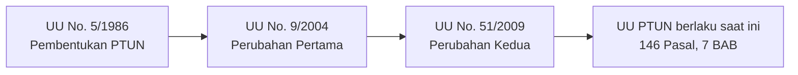
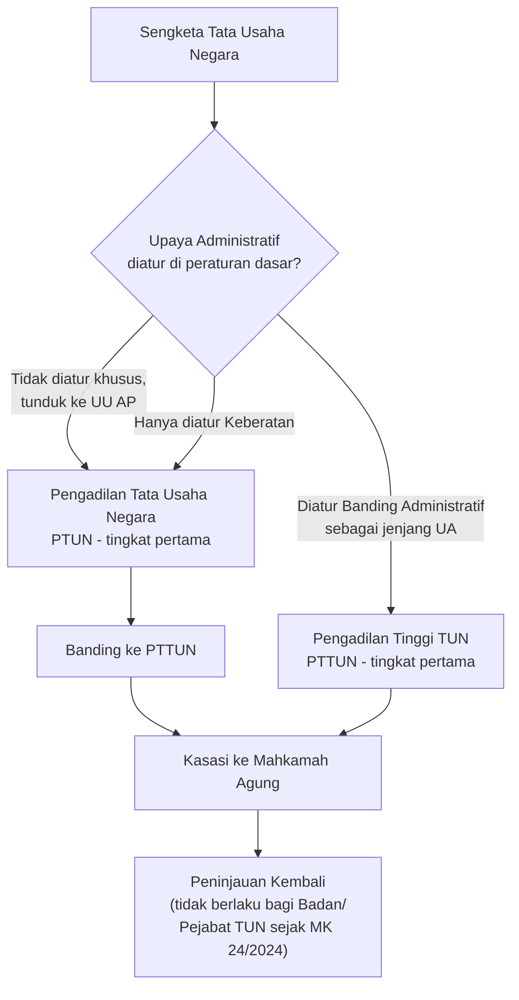
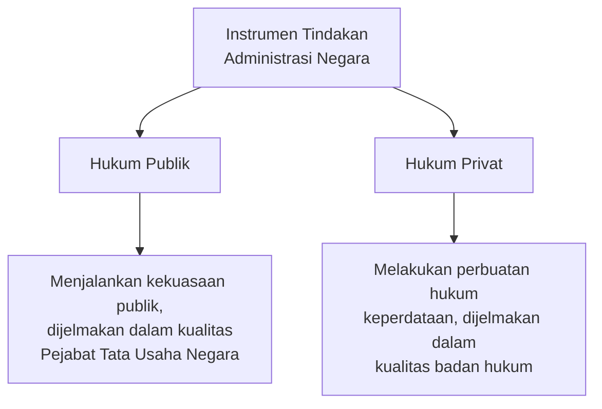
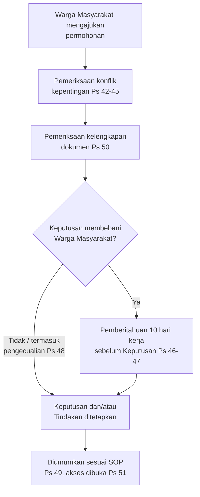
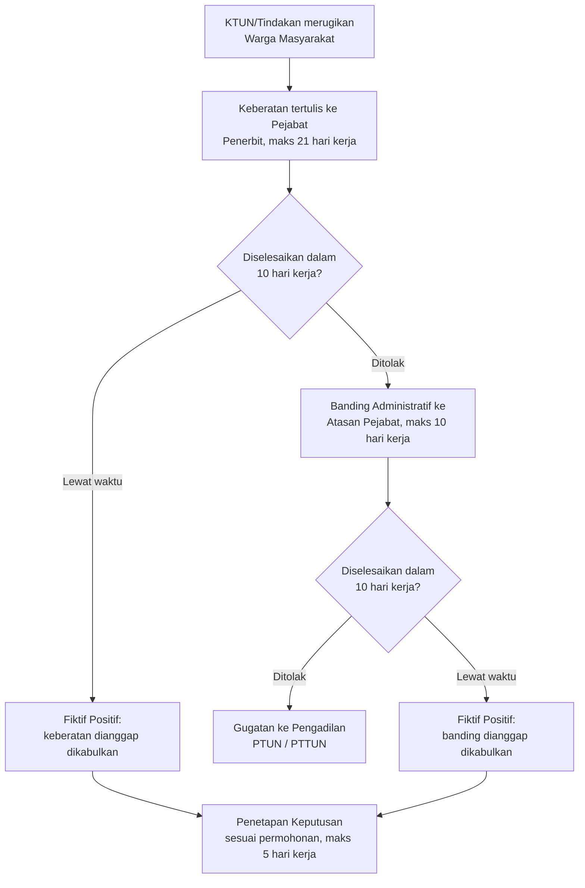
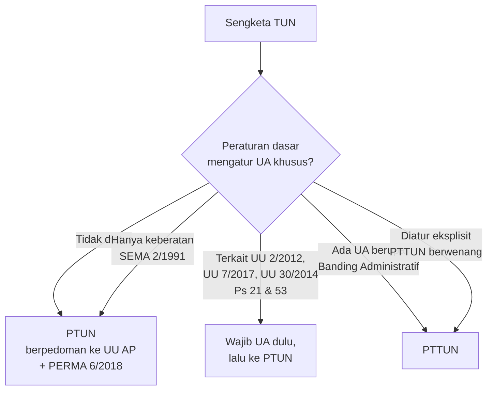
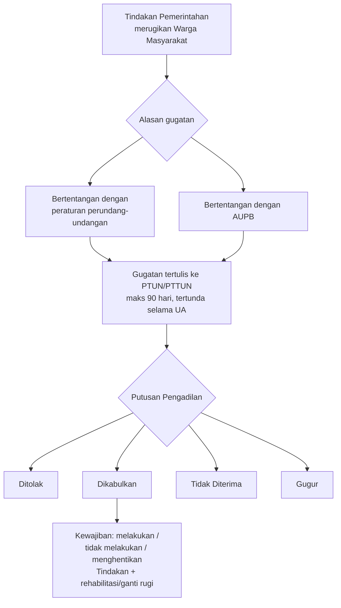
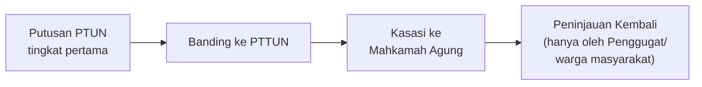
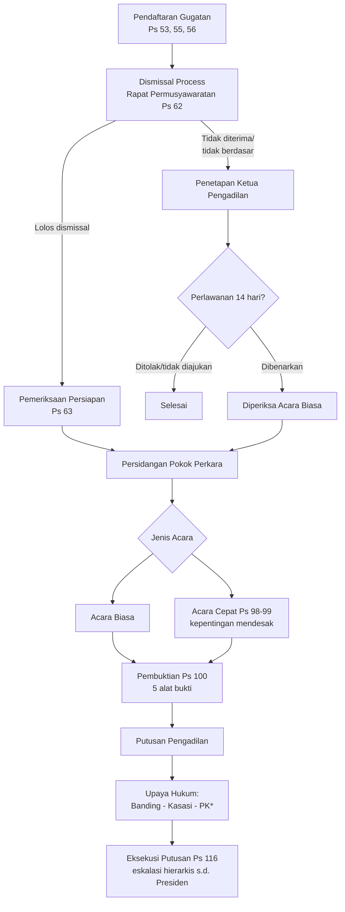

# Hukum Acara Peradilan Tata Usaha Negara (HAPTUN)

> [!abstract] Tentang Catatan Ini
> Dokumen ini adalah sintesis dari **catatan kuliah pribadi** ("SP Haptun") dan **materi presentasi dosen** ("Upaya Administrasi — Pasal 48 UU PTUN") untuk mata kuliah Hukum Acara Peradilan Tata Usaha Negara. Materi telah diperluas dan dimutakhirkan berdasarkan penelusuran peraturan perundang-undangan primer (basis data Pasal.id, situs resmi peraturan.go.id, dan Putusan Mahkamah Konstitusi) per **2 Agustus 2026**. Setiap pemutakhiran regulasi ditandai dengan callout `[!warning] Pemutakhiran`.

> [!info] Status Berlaku Peraturan Utama (per Agustus 2026)
> | Peraturan | Status |
> |---|---|
> | UU No. 5/1986 jo UU No. 9/2004 jo UU No. 51/2009 (UU PTUN) | **Berlaku** — diuji berkali-kali di MK, sebagian besar permohonan *ditolak*; satu putusan (MK 24/2024) mengabulkan sebagian terkait PK |
> | UU No. 30/2014 (UU Administrasi Pemerintahan) | **Berlaku** — diubah oleh UU No. 6/2023 (penetapan Perpu Cipta Kerja) |
> | PERMA No. 6/2018 (Pedoman UA) | **Berlaku** |
> | PERMA No. 2/2019 (Pedoman OOD) | **Berlaku** |
> | SEMA No. 2/1991, No. 1/2017, No. 2/2019, No. 2/2024 | **Berlaku sebagai pedoman internal MA**, saling melengkapi/merevisi |

---

## Daftar Isi

1. [[#1 Pengertian Dasar UU PTUN]]
2. [[#2 Asas-Asas Hukum Acara PTUN]]
3. [[#3 Karakteristik Hukum Acara PTUN]]
4. [[#4 Tindakan Pemerintah dalam Ranah Hukum Publik dan Privat]]
5. [[#5 Prosedur Administrasi Pemerintahan]]
6. [[#6 Upaya Administrasi]]
7. [[#7 Onrechtmatige Overheidsdaad OOD]]
8. [[#8 Proses Beracara di PTUN]]
9. [[#Referensi]]

---

## 1. Pengertian Dasar UU PTUN

### 1.1 Landasan Yuridis

Peradilan Tata Usaha Negara (PTUN) diatur pertama kali melalui **UU No. 5 Tahun 1986 tentang Peradilan Tata Usaha Negara**, yang kemudian diubah dua kali:



> [!note] Struktur UU PTUN (146 Pasal)
> - **BAB I** — Ketentuan Umum (Ps. 1–7)
> - **BAB II** — Susunan Pengadilan (Ps. 8–46)
> - **BAB III** — Kekuasaan Pengadilan (Ps. 47–52)
> - **BAB IV** — Hukum Acara (Ps. 53–132)
> - **BAB V** — Ketentuan Lain (Ps. 133–141)
> - **BAB VI–VII** — Ketentuan Peralihan & Penutup (Ps. 142–145)

### 1.2 Definisi-Definisi Kunci (Pasal 1 UU PTUN)

| Istilah | Definisi Normatif |
|---|---|
| **Tata Usaha Negara** | Administrasi Negara yang melaksanakan fungsi untuk menyelenggarakan urusan pemerintahan baik di pusat maupun di daerah |
| **Badan/Pejabat TUN** | Badan atau Pejabat yang melaksanakan urusan pemerintahan berdasarkan peraturan perundang-undangan yang berlaku |
| **Keputusan TUN (KTUN)** | Penetapan tertulis yang dikeluarkan oleh Badan/Pejabat TUN, berisi tindakan hukum TUN berdasarkan peraturan perundang-undangan, bersifat **konkret, individual, dan final**, yang menimbulkan akibat hukum bagi seseorang atau badan hukum perdata |
| **Sengketa TUN** | Sengketa yang timbul akibat dikeluarkannya KTUN, antara orang/badan hukum perdata dengan Badan/Pejabat TUN, termasuk sengketa kepegawaian |
| **Gugatan** | Permohonan berisi tuntutan terhadap Badan/Pejabat TUN yang diajukan ke Pengadilan untuk memperoleh putusan |
| **Tergugat** | Badan/Pejabat TUN yang mengeluarkan keputusan berdasarkan wewenang yang ada padanya atau yang dilimpahkan kepadanya |
| **Pengadilan** | PTUN dan/atau Pengadilan Tinggi Tata Usaha Negara (PTTUN) |

> [!quote] Pasal 1 angka 3 UU PTUN
> "Keputusan Tata Usaha Negara adalah suatu penetapan tertulis yang dikeluarkan oleh Badan atau Pejabat Tata Usaha Negara yang berisi tindakan hukum Tata Usaha Negara yang berdasarkan peraturan perundang-undangan yang berlaku, yang bersifat konkret, individual, dan final, yang menimbulkan akibat hukum bagi seseorang atau badan hukum perdata."

### 1.3 Unsur-Unsur KTUN (Definisi Klasik)

1. **Penetapan tertulis** — berbentuk dokumen resmi, bukan sekadar ucapan lisan;
2. **Dikeluarkan oleh Badan/Pejabat TUN** — organ yang menjalankan fungsi pemerintahan;
3. **Berisi tindakan hukum TUN** — menciptakan akibat hukum di ranah hukum publik;
4. **Berdasarkan peraturan perundang-undangan** — memiliki dasar kewenangan;
5. **Konkret** — objeknya tidak abstrak, dapat ditentukan/berwujud;
6. **Individual** — ditujukan pada subjek hukum tertentu, bukan berlaku umum;
7. **Final** — sudah definitif, tidak memerlukan persetujuan instansi lain;
8. **Menimbulkan akibat hukum** — bagi seseorang atau badan hukum perdata.

### 1.4 Objek yang Dikecualikan dari Pengertian KTUN (Pasal 2 UU PTUN)

> [!quote] Pasal 2 UU PTUN
> Tidak termasuk dalam pengertian Keputusan Tata Usaha Negara menurut Undang-Undang ini:
> a. KTUN yang merupakan perbuatan hukum perdata;
> b. KTUN yang merupakan pengaturan yang bersifat umum;
> c. KTUN yang masih memerlukan persetujuan;
> d. KTUN berdasarkan KUHP/KUHAP atau peraturan yang bersifat hukum pidana;
> e. KTUN atas dasar hasil pemeriksaan badan peradilan;
> f. KTUN mengenai tata usaha Angkatan Bersenjata RI (TNI);
> g. Keputusan Panitia Pemilihan mengenai hasil pemilihan umum.

> [!warning] Pemutakhiran — Perluasan Melalui UU AP
> Sejak berlakunya UU No. 30 Tahun 2014, definisi KTUN di atas **diperluas** melalui Pasal 87 UU AP (dibahas rinci di [[#4.4 Perluasan Pengertian Keputusan Pasal 87 UU AP]]). Pengecualian Pasal 2 huruf a–g di atas tetap berlaku sepanjang tidak bertentangan dengan perluasan tersebut.

### 1.5 KTUN Fiktif — Fiktif Negatif (Pasal 3 UU PTUN)

> [!quote] Pasal 3 UU PTUN
> (1) Apabila Badan atau Pejabat TUN tidak mengeluarkan keputusan, sedangkan hal itu menjadi kewajibannya, maka hal tersebut disamakan dengan Keputusan Tata Usaha Negara.
> (2) Jika Badan atau Pejabat TUN tidak mengeluarkan keputusan yang dimohon, sedangkan jangka waktu telah lewat, maka Badan atau Pejabat TUN dianggap telah **menolak** mengeluarkan keputusan dimaksud.
> (3) Jika peraturan tidak menentukan jangka waktu, maka setelah lewat **4 (empat) bulan** sejak diterimanya permohonan, Badan atau Pejabat TUN dianggap telah mengeluarkan keputusan penolakan.

Ini adalah rezim **fiktif negatif**: sikap diam pejabat dianggap sebagai *penolakan* yang dapat digugat. Rezim ini kontras dengan "fiktif positif" yang lahir dari UU AP 2014 (lihat bagian [[#4.5 Rezim Fiktif Positif vs Fiktif Negatif]]).

### 1.6 Kompetensi Absolut dan Struktur Peradilan

> [!quote] Pasal 47 UU PTUN
> "Pengadilan bertugas dan berwenang memeriksa, memutus, dan menyelesaikan sengketa Tata Usaha Negara."



> [!important] Pasal 48 & 51 UU PTUN — cikal-bakal Upaya Administratif
> Pasal 48 dan 51 adalah jantung persoalan **Upaya Administratif** yang dibahas mendalam pada [[#6 Upaya Administrasi]]. Secara ringkas: bila Badan/Pejabat TUN diberi wewenang menyelesaikan sengketa secara administratif, maka **Pengadilan baru berwenang** memeriksa perkara setelah **seluruh upaya administratif digunakan** (asas *exhaustion of administrative remedies*).

---

## 2. Asas-Asas Hukum Acara PTUN

> [!summary] Empat Asas Fundamental
> Hukum Acara PTUN dibangun di atas empat asas Latin/asing yang saling melengkapi dan mencerminkan karakter publik dari sengketa TUN.

### 2.1 *Point d'Intérêt, Point d'Action*

Berasal dari hukum acara perdata Prancis, bermakna **"tidak ada kepentingan, tidak ada gugatan"**. Seseorang hanya dapat menjadi pihak dalam perkara sepanjang ia memiliki kepentingan.

Dalam konteks PTUN, asas ini menegaskan bahwa gugatan harus didasarkan pada **kepentingan hukum** penggugat yang bersifat:

- **Langsung** — dilandasi hubungan hukum antara Penggugat dan Tergugat;
- **Konkret dan dialami sendiri** — bukan kepentingan pihak lain yang "dipinjam";
- **Pribadi** — *legal standing* penggugat harus benar-benar ada sebelum gugatan diajukan.

> [!example] Ilustrasi
> Seseorang tidak boleh menggugat KTUN atas namanya sendiri padahal objek yang disengketakan sesungguhnya menyangkut kepentingan orang lain yang tidak ikut menggugat.

### 2.2 *Dominus Litis* (Asas Hakim Aktif)

Hakim PTUN diberi kebebasan untuk **aktif** dalam persidangan — mengimbangi ketidaksetaraan kedudukan para pihak, karena Tergugat adalah pejabat pemerintah dengan kekuasaan dan sumber daya lebih besar, sedangkan Penggugat umumnya orang perorangan atau badan hukum perdata.

Penerapan asas keaktifan hakim yang berlandaskan pemahaman filosofis yang benar membantu hakim menemukan **kebenaran materiil** suatu sengketa. Hakim aktif berwenang untuk:

- Menentukan apa yang harus dibuktikan;
- Menentukan beban pembuktian;
- Memberi petunjuk kepada para pihak mengenai upaya hukum dan alat bukti yang dapat digunakan.

### 2.3 *Erga Omnes*

Karena sengketa TUN berada di ranah hukum publik, putusan PTUN dapat disampaikan kepada dan berdampak terhadap publik luas — bukan semata-mata *inter partes* seperti perkara perdata.

### 2.4 *Presumptio Iustae Causa* (Praduga Keabsahan)

Setiap KTUN yang dikeluarkan oleh pejabat pemerintahan **selalu dianggap sah secara hukum** selama belum dibuktikan sebaliknya dan belum dibatalkan oleh hakim.

> [!important] Konsekuensi Presumptio Iustae Causa
> - Gugatan **tidak menunda** pelaksanaan KTUN — keputusan tetap dapat dilaksanakan meski sedang digugat;
> - KTUN dianggap sah sampai ada putusan pengadilan yang menyatakan pembatalannya;
> - **Hanya** hakim PTUN yang berwenang menyatakan sah/tidaknya atau membatalkan suatu KTUN.

### Ringkasan Asas

| Asas | Fokus | Fungsi Utama |
|---|---|---|
| *Point d'intérêt, point d'action* | Legal standing Penggugat | Menyaring gugatan yang tidak berkepentingan langsung |
| *Dominus litis* | Peran Hakim | Mengimbangi ketidaksetaraan Penggugat vs Tergugat |
| *Erga omnes* | Sifat Putusan | Menegaskan dimensi publik sengketa TUN |
| *Presumptio iustae causa* | Status Hukum KTUN | Menjaga stabilitas administrasi negara selama proses berjalan |

---

## 3. Karakteristik Hukum Acara PTUN

### 3.1 Tenggang Waktu 90 Hari untuk Menggugat

> [!quote] Pasal 55 UU PTUN
> "Gugatan dapat diajukan hanya dalam tenggang waktu sembilan puluh hari terhitung sejak saat diterimanya atau diumumkannya Keputusan Badan atau Pejabat Tata Usaha Negara."

Cara menghitung: seluruh hari dihitung berturut-turut (hari kalender, bukan hari kerja); apabila hari terakhir jatuh pada hari libur, maka batas waktu bergeser ke hari kerja berikutnya.

> [!note] Catatan Penting — Pihak Ketiga
> Untuk pihak ketiga yang tidak dituju langsung oleh KTUN, Mahkamah Konstitusi (Putusan **MK No. 149/PUU-XXI/2023**) menegaskan penafsiran tenggang waktu tetap konstitusional sepanjang dimaknai sejak pihak ketiga **mengetahui** adanya KTUN yang merugikan kepentingannya — bukan sejak KTUN diterbitkan/diumumkan kepada pihak yang dituju.

### 3.2 Kedudukan Penggugat ≠ Tergugat secara Faktual

| | Penggugat | Tergugat |
|---|---|---|
| Subjek | Orang/badan hukum perdata | Badan/Pejabat TUN |
| Posisi | Warga negara/pencari keadilan | Aparat pemerintah dengan kewenangan publik |
| Sumber daya | Terbatas | Besar (didukung struktur negara) |

Ketidakseimbangan faktual inilah yang melatarbelakangi penerapan **asas *dominus litis*** (hakim aktif) untuk menciptakan keseimbangan proses peradilan.

### 3.3 Dismissal Procedure, Rapat Permusyawaratan & Pemeriksaan Persiapan (Pasal 62 & 63)

Sebelum sidang pokok perkara dimulai, terdapat **dua tahap penyaringan** perkara:

**a. Dismissal Process (Pasal 62)** — dilakukan Ketua Pengadilan dalam Rapat Permusyawaratan, dapat menyatakan gugatan tidak diterima/tidak berdasar bila:

> [!quote] Pasal 62 ayat (1) UU PTUN — Alasan Dismissal
> a. pokok gugatan nyata-nyata bukan wewenang Pengadilan;
> b. syarat gugatan (Ps. 56) tidak dipenuhi meski sudah diperingatkan;
> c. gugatan tidak didasarkan pada alasan yang layak;
> d. tuntutan sebenarnya sudah terpenuhi oleh KTUN yang digugat;
> e. gugatan diajukan sebelum waktunya atau telah lewat waktunya.

Terhadap penetapan dismissal, dapat diajukan **perlawanan** dalam 14 hari, diperiksa dengan **acara singkat**; bila perlawanan dibenarkan, penetapan gugur demi hukum dan perkara diperiksa dengan acara biasa.

**b. Pemeriksaan Persiapan (Pasal 63)** — dilakukan oleh hakim (secara praktik ditugaskan kepada **hakim paling junior**) untuk melengkapi gugatan yang kurang jelas: hakim wajib memberi nasihat kepada Penggugat untuk memperbaiki/melengkapi gugatan dalam **30 hari**, serta dapat meminta penjelasan dari Tergugat. Dalam tahap ini hakim juga menilai kemungkinan munculnya **pihak ketiga** yang berkepentingan, sehingga dapat memberi arahan kepada para pihak.

### 3.4 Pembuktian Bebas tapi Terbatas

| Sifat | Penjelasan |
|---|---|
| **Terbatas** | Jenis alat bukti dibatasi pada 5 jenis yang diatur Pasal 100 |
| **Bebas** | Penilaian bukti bisa berdasarkan pengetahuan Hakim (bukan sekadar formalitas surat) |

> [!quote] Pasal 100 UU PTUN — Alat Bukti
> (1) Alat bukti ialah: a. surat/tulisan; b. keterangan ahli; c. keterangan saksi; d. pengakuan para pihak; e. pengetahuan Hakim.
> (2) Keadaan yang telah diketahui umum tidak perlu dibuktikan.

### 3.5 Acara Cepat

> [!quote] Pasal 98–99 UU PTUN
> Apabila terdapat kepentingan Penggugat yang **cukup mendesak**, Penggugat dapat memohon pemeriksaan dipercepat. Ketua Pengadilan memutus permohonan dalam 14 hari; pemeriksaan dilakukan dengan **Hakim Tunggal** (bukan untuk perkara sumir/dismissal); tenggang waktu jawaban & pembuktian masing-masing pihak maksimal 14 hari.

### 3.6 Pengujian Hakim Bersifat *Ex-Tunc*

Hakim menilai KTUN berdasarkan **seluruh fakta dan keadaan pada saat KTUN diterbitkan**. Konsekuensinya, KTUN yang dibatalkan dianggap tidak pernah sah sejak diterbitkan (bukan hanya sejak putusan dijatuhkan/*ex-nunc*). KTUN yang dibatalkan bersifat *vernietigbaar* (dapat dibatalkan), bukan *van rechtswege nietig* (batal demi hukum otomatis).

> [!tip] Membedakan Ex-Tunc vs Ex-Nunc pada Berlakunya Peraturan
> Berlakunya UU PTUN sendiri bersifat *ex-nunc* — baru berlaku efektif lima tahun setelah diundangkan (1986→1991) — berbeda dengan pengujian hakim terhadap KTUN yang bersifat *ex-tunc*. Jangan tertukar: *ex-tunc/ex-nunc* di sini merujuk pada **dua konteks berbeda** (berlakunya norma vs akibat pembatalan KTUN).

### 3.7 Peran Pengadilan Tinggi TUN

Diatur silang dalam UU PTUN (Ps. 48, 51), SEMA No. 2/2019, dan UU AP — dibahas mendalam pada [[#6 Upaya Administrasi]] karena kompetensi PTTUN sebagai pengadilan **tingkat pertama** (bukan hanya banding) bergantung sepenuhnya pada desain Upaya Administratif dalam peraturan dasar sengketa yang bersangkutan.

### 3.8 Larangan *Ultra Petita*, tetapi *Reformatio in Peius* Dimungkinkan

| Prinsip | Makna |
|---|---|
| ***Ultra petita*** dilarang | Putusan tidak boleh melebihi *petitum* Penggugat |
| ***Reformatio in peius*** diperbolehkan bersyarat | Putusan dapat membawa Penggugat ke keadaan yang **lebih dirugikan**, sepanjang diatur secara khusus dalam peraturan perundang-undangan |

> [!example] Ilustrasi Reformatio in Peius
> Penggugat diberhentikan secara hormat lalu mengajukan gugatan; namun hakim menilai justru semestinya diberhentikan secara **tidak hormat**. Putusan menolak *petitum* Penggugat, tetapi membawa keadaan Penggugat ke posisi lebih buruk. Ini sah **hanya** sepanjang diatur khusus dalam peraturan perundang-undangan sektoral (mis. UU Kepegawaian).

> [!warning] Pemutakhiran — Peninjauan Kembali Tidak Lagi Tersedia bagi Instansi Pemerintah
> **Putusan MK No. 24/PUU-XXII/2024** (dikabulkan sebagian, 20 Maret 2024) menyatakan Pasal 132 ayat (1) UU PTUN inkonstitusional bersyarat sepanjang tidak dimaknai mengecualikan Badan/Pejabat TUN dari hak mengajukan **Peninjauan Kembali (PK)**. Sejak putusan ini, PK terhadap putusan PTUN yang berkekuatan hukum tetap **hanya dapat diajukan oleh Penggugat (warga masyarakat)**, bukan oleh Badan/Pejabat TUN selaku Tergugat. Ini memperkuat asas *dominus litis* dan perlindungan warga negara sebagai pihak yang secara faktual lebih lemah. Karakteristik ini penting ditambahkan sebagai pembaruan atas materi upaya hukum yang belum tercakup dalam catatan kuliah maupun materi presentasi.

---

## 4. Tindakan Pemerintah dalam Ranah Hukum Publik dan Privat

> [!quote] Konteks Praktik
> "Kita harus paham bahwa pemerintah dalam pelelangan pada saat *open tender* itu sedang berada dalam ranah hukum publik" — meskipun tender terlihat seperti transaksi perdata biasa, proses pemilihan penyedia oleh instansi pemerintah tunduk pada hukum administrasi (Perpres Pengadaan Barang/Jasa), bukan murni hukum perdata.

### 4.1 Instrumen Tindakan Administrasi Negara (TAN)

Pemerintah dapat bertindak melalui dua ranah hukum:



Tindakan itu sendiri dapat bersifat **sepihak** (menimbulkan hak/kewajiban tanpa persetujuan pihak lain) atau **dua pihak** (memerlukan kesepakatan, seperti kontrak).

### 4.2 Unsur-Unsur Keputusan (KTUN)

- Pernyataan kehendak **sepihak**;
- Dikeluarkan oleh **organ pemerintahan**;
- Didasarkan pada **kewenangan hukum yang bersifat publik**;
- Ditujukan untuk **hal yang khusus/konkret** (bukan pengaturan umum);
- Menimbulkan **akibat hukum**.

### 4.3 Keputusan Konstitutif dan Deklaratif

> [!note] Melengkapi Materi — Definisi Konstitutif vs Deklaratif
> Materi presentasi hanya menyebut judul tanpa penjelasan; berikut penjabarannya sesuai doktrin hukum administrasi negara:
>
> - **Keputusan Konstitutif** — keputusan yang **menciptakan, mengubah, atau menghapuskan** suatu hubungan hukum/hak yang sebelumnya belum ada. *Contoh:* izin usaha, izin mendirikan bangunan, keputusan pengangkatan PNS.
> - **Keputusan Deklaratif** — keputusan yang **menegaskan/menyatakan** suatu hak atau status yang **sudah ada** sebelumnya berdasarkan peraturan perundang-undangan, tanpa menciptakan hak baru. *Contoh:* Kartu Tanda Penduduk (menegaskan status kewarganegaraan yang sudah ada by law), akta kelahiran, surat keterangan.

### 4.4 Perluasan Pengertian Keputusan (Pasal 87 UU AP)

> [!quote] Pasal 87 UU No. 30/2014
> "Dengan berlakunya Undang-Undang ini, Keputusan Tata Usaha Negara sebagaimana dimaksud dalam UU No. 5/1986 tentang Peradilan Tata Usaha Negara sebagaimana telah diubah dengan UU No. 9/2004 dan UU No. 51/2009 harus dimaknai sebagai:
> a. penetapan tertulis yang juga mencakup **tindakan faktual**;
> b. Keputusan Badan dan/atau Pejabat TUN di lingkungan **eksekutif, legislatif, yudikatif, dan penyelenggara negara lainnya**;
> c. berdasarkan ketentuan perundang-undangan dan **AUPB**;
> d. bersifat **final dalam arti lebih luas**;
> e. Keputusan yang **berpotensi menimbulkan akibat hukum**; dan/atau
> f. Keputusan yang **berlaku bagi Warga Masyarakat**."

> [!important] Dampak Pasal 87
> Rumusan ini secara dramatis memperluas objek sengketa TUN — dari sekadar KTUN yang final-konkret-individual (definisi klasik Pasal 1 angka 3 UU PTUN) menjadi mencakup **tindakan faktual** dan keputusan dari **seluruh cabang kekuasaan negara**, bukan hanya eksekutif. Perluasan ini pula yang menjadi basis normatif kompetensi PTUN mengadili gugatan **Tindakan Pemerintahan** dan **OOD** (lihat Bab 7).

### 4.5 Syarat Sahnya Keputusan

> [!quote] Pasal 52 UU AP
> (1) Syarat sahnya Keputusan meliputi: a. ditetapkan oleh pejabat yang berwenang; b. dibuat sesuai prosedur; dan c. substansi yang sesuai dengan objek Keputusan.
> (2) Sahnya Keputusan didasarkan pada ketentuan peraturan perundang-undangan dan **AUPB**.

| Syarat | Aspek yang Diuji |
|---|---|
| Kewenangan | Apakah pejabat berwenang menerbitkannya? |
| Prosedur | Apakah tata cara penerbitan sesuai ketentuan? |
| Substansi | Apakah materi keputusan sesuai objek dan tujuan pemberian wewenang? |

### 4.6 Berlaku dan Mengikatnya Keputusan

- Berlaku sejak **tanggal ditetapkan**, kecuali ditentukan lain dalam keputusan itu sendiri atau peraturan dasarnya;
- Wajib mencantumkan **batas waktu mulai dan berakhirnya**, kecuali ditentukan lain;
- Batas waktu dapat **diperpanjang** sesuai peraturan;
- **Tidak berlaku surut**, kecuali: (a) untuk menghindari kerugian yang lebih besar; atau (b) mencegah terabaikannya hak Warga Masyarakat.

> [!tip] Contoh "Ditentukan Lain" dalam Peraturan
> UU PTUN sendiri adalah contoh "ditentukan lain" karena baru mulai berlaku efektif **5 tahun** setelah diundangkan (1986 → efektif 1991) — bersifat *ex-nunc*.

### 4.7 Tindakan Administrasi Negara dalam Ranah Hukum Privat

**Keuntungan pemanfaatan TAN Privat oleh pemerintah:**

- Mengurangi ketegangan akibat tindakan sepihak pemerintah;
- Hampir selalu dapat memberikan jaminan kebendaan;
- Ketika jalur hukum publik menemui kebuntuan, jalur perdata dapat menjadi jalan keluar;
- Lembaga perdata bersifat fleksibel, dapat diterapkan untuk berbagai keperluan;
- Para pihak relatif bebas menentukan isi perjanjian (meski tetap dibatasi UU);

> [!warning] Risiko: *Détournement de Procédure*
> Penggunaan jalur perdata oleh pemerintah **mudah menjurus** pada *détournement de procédure* — yaitu penyelewengan prosedur dengan sengaja menempuh jalur hukum privat untuk **menghindari** kewajiban prosedural dan pengawasan hukum publik (mis. AUPB, kewajiban keterbukaan) yang seharusnya berlaku bila tindakan dilakukan lewat jalur KTUN.
>
> Pemerintah, karena kedudukan khususnya (menjaga kepentingan umum), tetap menuntut posisi khusus dalam hubungan keperdataan — misalnya berpotensi memutuskan perjanjian secara sepihak demi kepentingan umum, sesuatu yang tidak lazim dalam relasi perdata murni antarwarga.

**Macam TAN Hukum Privat:**

| Jenis | Karakteristik | Contoh |
|---|---|---|
| **Perjanjian perdata biasa** | Paling sering digunakan; harta kekayaan negara dipertanggungkan lembaga hukum publik yang menguasainya menjadi organisasi negara mandiri; perjanjian selalu didahului KTUN internal | Jual beli alat kantor, sewa-menyewa, pemborongan pekerjaan |
| **Perjanjian mengenai wewenang pemerintahan** | Antara pemerintah dan warga negara mengenai *cara* pemerintah menggunakan wewenangnya; pemerintah tidak selamanya terikat, boleh menyimpangi bila terjadi perubahan keadaan masyarakat | Perjanjian kerja sama pemanfaatan aset publik |
| **Perjanjian mengenai kebijakan yang akan dilaksanakan** | Objeknya hak kebendaan (harta kekayaan) pemerintah sebagai sarana mencapai tujuan kebijakan; kelompok penting: transaksi harta tidak bergerak | Pembebasan lahan untuk proyek strategis |
| **Perjanjian jual beli barang dan jasa** | Transaksi pengadaan rutin pemerintah | Kontrak pengadaan barang/jasa pemerintah |

### 4.8 Fiktif Positif vs Fiktif Negatif — Dua Rezim yang Berkembang

> [!note] Alur Sejarah Singkat
> - **Rezim lama (Pasal 3 UU PTUN 1986):** sikap diam pejabat = **fiktif negatif** (dianggap menolak) → dapat digugat ke PTUN sebagai KTUN.
> - **Rezim baru (Pasal 53 UU AP 2014):** sikap diam pejabat atas permohonan = **fiktif positif** (dianggap **dikabulkan** secara hukum) → warga mengajukan **permohonan** (bukan gugatan) ke PTUN untuk memperoleh **putusan** yang menjadi dasar terbitnya Keputusan/Tindakan yang dianggap dikabulkan tersebut.

> [!quote] Pasal 53 UU AP (diubah UU 6/2023 Ps. 175)
> (2) batas waktu default dipersingkat jadi **5 hari kerja** (sebelumnya 10).
> (4): permohonan tetap **dianggap dikabulkan secara hukum** bila lewat batas waktu — fiktif positif tidak dicabut.
> (5) [baru, menggantikan ayat 5–6 lama]: *"Ketentuan lebih lanjut mengenai bentuk penetapan Keputusan dan/atau Tindakan yang dianggap dikabulkan secara hukum sebagaimana dimaksud pada ayat (4) diatur dalam Peraturan Presiden."* — **Perpres ini belum ada** per Agustus 2026.

> [!warning] Pemutakhiran — Bukan Penghapusan, tapi Kekosongan Mekanisme
> UU No. 6/2023 (Cipta Kerja) **tidak menghapus** fiktif positif. Yang diubah hanya Pasal 53 ayat (2) UU AP (10→5 hari kerja) dan penggantian mekanisme lama (Pengadilan memutus 21 hari) dengan pendelegasian pengaturan "bentuk penetapan" kepada **Peraturan Presiden** — yang **belum diterbitkan** hingga Agustus 2026. Akibatnya terjadi kekosongan hukum praktis: hak fiktif positif secara normatif tetap berlaku, tapi mekanisme formal untuk mengonfirmasinya tidak (lagi) jelas.
>
> Terpisah dari itu, **SEMA No. 2/2024** (merevisi SEMA 1/2017 Rumusan Kamar TUN angka 4) **hanya berlaku untuk sengketa pendaftaran MODI (Minerba One Data Indonesia) di Kementerian ESDM** — menyatakan sikap diam pejabat atas permohonan pendaftaran MODI bukan tindakan faktual omisi, melainkan penolakan KTUN menurut Pasal 3 UU PTUN (fiktif negatif). Ini **rumusan sektoral**, bukan pembalikan rezim fiktif secara umum.

---

## 5. Prosedur Administrasi Pemerintahan

> [!info] Dasar Hukum
> Diatur dalam **BAB VIII UU AP (Pasal 40–51)**. Bab ini tidak eksplisit dibahas dalam catatan kuliah maupun materi presentasi dosen, namun merupakan fondasi normatif sebelum suatu Keputusan/Tindakan sah diterbitkan — sehingga penting dilengkapi untuk pemahaman utuh Hukum Administrasi Negara.

### 5.1 Para Pihak dalam Prosedur Administrasi (Pasal 40–41)

Pihak-pihak terdiri atas **Badan/Pejabat Pemerintahan** dan **Warga Masyarakat** (sebagai pemohon/pihak terkait). Warga Masyarakat dapat memberi kuasa tertulis kepada **satu** penerima kuasa; jika badan pemerintah menerima lebih dari satu surat kuasa untuk prosedur yang sama, surat kuasa dikembalikan agar pemberi kuasa menentukan satu penerima kuasa yang sah.

### 5.2 Larangan Konflik Kepentingan (Pasal 42–45)

> [!quote] Pasal 42 ayat (1) UU AP
> "Pejabat Pemerintahan yang berpotensi memiliki Konflik Kepentingan dilarang menetapkan dan/atau melakukan Keputusan dan/atau Tindakan."

Konflik Kepentingan terjadi bila keputusan dilatarbelakangi (Pasal 43): kepentingan pribadi/bisnis; hubungan kerabat/keluarga; hubungan dengan wakil pihak terlibat; hubungan dengan pihak yang digaji pihak terlibat; hubungan dengan pemberi rekomendasi; atau hubungan lain yang dilarang peraturan.

Warga Masyarakat berhak melaporkan dugaan konflik kepentingan kepada Atasan Pejabat, yang wajib memeriksa dan menetapkan keputusan atas laporan tersebut paling lama **5 hari kerja** (Pasal 44). Keputusan yang lahir dari konflik kepentingan **dapat dibatalkan** (Pasal 45).

### 5.3 Kewajiban Sosialisasi & Pemberitahuan Sebelum Keputusan yang Membebani (Pasal 46–48)

Badan/Pejabat wajib memberikan sosialisasi mengenai dasar hukum, persyaratan, dan fakta terkait **sebelum** menetapkan Keputusan/Tindakan yang menimbulkan pembebanan bagi Warga Masyarakat, serta memberitahukan pihak bersangkutan paling lambat **10 hari kerja** sebelumnya.

> [!note] Pengecualian (Pasal 48)
> Kewajiban pemberitahuan tidak berlaku apabila: (a) keputusan bersifat mendesak untuk melindungi kepentingan umum; (b) keputusan tidak mengubah beban yang dipikul Warga Masyarakat; dan/atau (c) keputusan menyangkut penegakan hukum.

### 5.4 SOP, Pemeriksaan Dokumen & Akses Informasi (Pasal 49–51)

- **Pasal 49** — Pejabat wajib menyusun & mengumumkan **SOP** pembuatan Keputusan kepada publik.
- **Pasal 50** — sebelum menetapkan Keputusan/Tindakan, Badan/Pejabat harus memeriksa kelengkapan dokumen pemohon; dalam **5 hari kerja** wajib memberitahukan bahwa permohonan diterima (jika lengkap).
- **Pasal 51** — Badan/Pejabat wajib membuka **akses dokumen** administrasi kepada Warga Masyarakat, kecuali dokumen rahasia negara/kerahasiaan pihak ketiga.



---

## 6. Upaya Administrasi

> [!abstract] Fokus Utama Materi
> Bagian ini adalah inti dari materi presentasi dosen ("Pasal 48 & Penjelasannya"), disintesiskan bersama catatan kuliah dan dimutakhirkan dengan teks resmi peraturan hingga Agustus 2026.

### 6.1 Pengertian

> [!note] Definisi Klasik
> **Upaya Administrasi** adalah prosedur yang dapat ditempuh oleh seseorang atau badan hukum perdata apabila ia **tidak puas** terhadap suatu KTUN, dilaksanakan **di lingkungan (internal) pemerintahan itu sendiri** — sebelum sengketa dibawa ke ranah peradilan.

> [!quote] Pasal 1 angka 16 UU AP
> "Upaya Administratif adalah proses penyelesaian sengketa yang dilakukan dalam lingkungan Administrasi Pemerintahan sebagai akibat dikeluarkannya Keputusan dan/atau Tindakan yang merugikan."

> [!quote] Pasal 1 angka 18 UU AP
> "Pengadilan adalah Pengadilan Tata Usaha Negara."

> [!important] "Inilah Perubahan Mendasar Upaya Administrasi"
> Penguncian istilah **"Pengadilan"** sebagai **PTUN** (bukan lagi berpotensi PTTUN sebagai forum utama) dalam Pasal 1 angka 18 UU AP adalah **nyawa perubahan** dari rezim UU PTUN 1986 — sebagaimana ditegaskan SEMA No. 1/2017 huruf f di bawah.

### 6.2 Penilaian oleh Instansi Pemutus Perselisihan

Instansi pemutus melakukan penilaian **lengkap** terhadap KTUN yang disengketakan dari dua segi, yang diterapkan sesuai konteks instansi yang menerbitkan KTUN bersangkutan:

| Segi | Aspek yang Dinilai |
|---|---|
| **Legalitas** *(penerapan hukum)* | • Kewenangan pejabat — apakah tidak berwenang/menyalahgunakan/sewenang-wenang;<br>• Prosedur penerbitan;<br>• Substansi — adakah materi muatan yang menyimpangi peraturan;<br>• Substansi dari perspektif **AAUPB** (Asas-Asas Umum Pemerintahan yang Baik). |
| **Opportunitas** *(kebijaksanaan)* | • Tujuan awal KTUN — adakah penyalahgunaan wewenang;<br>• Keseimbangan *cost-benefit* — kerugian vs manfaat;<br>• Dampak KTUN — apakah menimbulkan inefisiensi. |

### 6.3 Macam Upaya Administratif

| Jenis | Definisi | Diselesaikan Oleh |
|---|---|---|
| **Keberatan** | Penyelesaian sengketa TUN yang dilakukan **sendiri** oleh Badan/Pejabat TUN yang mengeluarkan KTUN | Pejabat penerbit KTUN itu sendiri |
| **Banding Administratif** | Penyelesaian sengketa TUN yang dilakukan oleh **instansi atasan langsung** atau instansi lain yang berwenang | Atasan Pejabat penerbit |

> [!tip] Konsistensi Historis
> Dua macam Upaya Administratif ini **tidak pernah berubah** sejak UU PTUN 1986 hingga kini. Yang terus berubah adalah **hubungan/relasi** antara keduanya, dan hubungan keduanya dengan kompetensi PTUN/PTTUN.

### 6.4 Evolusi Historis Pengaturan Upaya Administratif

```mermaid
graph LR
    A["UU No. 5/1986</br>Ps 48 & 51"] --> B["SEMA No. 2/1991</br>3 varian kompetensi"]
    B --> C["UU No. 30/2014</br>Ps 75-78 UU AP"]
    C --> D["SEMA No. 1/2017</br>UA jadi pilihan hukum"]
    D --> E["PERMA No. 6/2018</br>tata cara beracara"]
    E --> F["SEMA No. 2/2019</br>revisi kompetensi</br>PTUN/PTTUN"]
    F --> G[SEMA No. 2/2024</br>fiktif negatif khusus MODI ESDM"]
```

#### 6.4.1 Fase 1 — UU PTUN 1986 (Pasal 48 & 51) dan SEMA No. 2/1991

Inilah **awal mula** pengaturan Upaya Administratif — diatur pertama kali di UU No. 5/1986, dengan aturan teknis pelaksanaannya di **SEMA No. 2 Tahun 1991**.

> [!quote] Pasal 48 UU PTUN
> (1) Dalam hal suatu Badan atau Pejabat TUN diberi wewenang oleh atau berdasarkan peraturan perundang-undangan untuk menyelesaikan secara administratif sengketa TUN tertentu, maka [gugatan mengenai] batal atau tidak sah, dengan atau tanpa disertai tuntutan ganti rugi dan/atau administratif yang tersedia [ditempuh melalui upaya administratif tersebut lebih dahulu].
> (2) Pengadilan baru berwenang memeriksa, memutus, dan menyelesaikan sengketa TUN sebagaimana dimaksud ayat (1) jika **seluruh upaya administratif** yang bersangkutan telah digunakan.

> [!quote] Pasal 51 ayat (3) UU PTUN
> "Pengadilan Tinggi Tata Usaha Negara bertugas dan berwenang memeriksa, memutus, dan menyelesaikan **di tingkat pertama** sengketa Tata Usaha Negara sebagaimana dimaksud dalam Pasal 48."

**SEMA No. 2/1991** memberikan tiga varian penerapan:

| Varian | Kondisi Peraturan Dasar | Kompetensi Mengadili |
|---|---|---|
| 1 | Hanya mengatur UA berupa **Keberatan** | **PTUN** (tingkat pertama biasa) |
| 2 | Mengatur UA **Keberatan + Banding Administratif** | **PTTUN** (tingkat pertama, atas keputusan hasil banding) |
| 3 | Hanya mengatur UA **Banding Administratif** | **PTTUN** (tingkat pertama) |

#### 6.4.2 Fase 2 — UU AP No. 30/2014 (Pasal 75–78)

> [!quote] Pasal 75 UU AP
> (1) Warga Masyarakat yang dirugikan terhadap Keputusan dan/atau Tindakan **dapat** mengajukan Upaya Administratif kepada Pejabat Pemerintahan atau Atasan Pejabat.
> (2) Upaya Administratif terdiri atas: a. keberatan; dan b. banding.
> (3) Upaya Administratif **tidak menunda** pelaksanaan Keputusan/Tindakan, kecuali: a. ditentukan lain dalam undang-undang; dan b. menimbulkan kerugian yang lebih besar.
> (4) Badan/Pejabat wajib segera menyelesaikan UA yang berpotensi membebani keuangan negara.
> (5) Pengajuan UA **tidak dibebani biaya**.

> [!quote] Penjelasan Pasal 75 ayat (2) huruf b
> "Banding" adalah banding administratif yang dilakukan pada Atasan Pejabat yang menetapkan Keputusan konstitutif.

**Tabel Perbandingan Keberatan vs Banding (Pasal 76–78 UU AP):**

| Aspek | Keberatan (Ps. 77) | Banding Administratif (Ps. 78) |
|---|---|---|
| Diajukan kepada | Badan/Pejabat penerbit Keputusan | Atasan Pejabat penerbit Keputusan |
| Bentuk | Tertulis | Tertulis |
| Tenggang waktu pengajuan | Maks. **21 hari kerja** sejak Keputusan diumumkan | Maks. **10 hari kerja** sejak keputusan keberatan diterima |
| Jangka waktu penyelesaian | Maks. **10 hari kerja** | Maks. **10 hari kerja** |
| Akibat lewat waktu penyelesaian | Keberatan **dianggap dikabulkan** (fiktif positif) | Banding **dianggap dikabulkan** (fiktif positif) |
| Tindak lanjut bila dikabulkan | Penetapan Keputusan sesuai permohonan, maks. **5 hari kerja** setelah tenggang lewat | Penetapan Keputusan sesuai permohonan, maks. **5 hari kerja** setelah tenggang lewat |
| Bila tidak puas | Lanjut ke Banding Administratif | Gugatan ke **Pengadilan** (PTUN) |

> [!quote] Pasal 76 ayat (3) UU AP
> "Dalam hal Warga Masyarakat tidak menerima atas penyelesaian banding oleh Atasan Pejabat, Warga Masyarakat dapat mengajukan gugatan ke **Pengadilan**."

> [!important] Simplifikasi Rezim UU AP
> Berbeda dari rezim UU PTUN 1986 yang memiliki **3 varian** kompetensi (PTUN atau PTTUN, tergantung susunan UA), rezim UU AP pada dasarnya menyederhanakan: **semua UA bermuara ke PTUN**, karena "Pengadilan" dikunci sebagai PTUN oleh Pasal 1 angka 18. Namun sebagaimana dibahas di 6.4.5, penyederhanaan ini kemudian **direvisi kembali** oleh SEMA No. 2/2019.



#### 6.4.3 Fase 3 — SEMA No. 1 Tahun 2017 (Rumusan Kamar TUN)

Merespons berlakunya UU AP, khususnya Pasal 1 angka 18, Pasal 75, dan Pasal 76, SEMA ini merumuskan:

> [!quote] Poin-Poin Kunci SEMA No. 1/2017
> a. Berdasarkan Pasal 75 ayat (1) UU AP, warga masyarakat yang dirugikan dapat mengajukan UA berupa keberatan dan banding.
> b. Keberatan diajukan kepada pejabat penerbit keputusan/tindakan.
> c. Banding diajukan kepada atasan pejabat penerbit.
> d. UA berbentuk **keberatan/banding** menurut Pasal 75 ayat (1) adalah **pilihan hukum** (fakultatif), karena UU AP memakai terminologi kata **"DAPAT"**.
> e. Bila warga tidak menerima penyelesaian banding, dapat mengajukan gugatan ke **PTUN** sesuai Pasal 1 angka 18 & Pasal 76 ayat (3) UU AP.
> f. Ketentuan **Pasal 48 & 51 UU PTUN** mengenai kompetensi PTTUN sebagai pengadilan tingkat pertama **tidak dapat diterapkan lagi**, karena persoalan hukum UA telah diatur berbeda oleh UU AP (Pasal 1 angka 18, Pasal 75 ayat 1, Pasal 76), sesuai asas ***lex posteriori derogat legi priori*** (hukum yang baru mengesampingkan hukum yang lama).

#### 6.4.4 Fase 4 — PERMA No. 6 Tahun 2018

PERMA ini menjadi pedoman teknis beracara bagi sengketa yang telah menempuh Upaya Administratif.

> [!quote] Pasal 2 PERMA No. 6/2018
> (1) Pengadilan berwenang menerima, memeriksa, memutus dan menyelesaikan sengketa administrasi pemerintahan **setelah menempuh upaya administratif**.
> (2) Pengadilan memeriksa, memutus, dan menyelesaikan gugatan menurut hukum acara yang berlaku di Pengadilan, kecuali ditentukan lain dalam peraturan perundang-undangan.

> [!quote] Pasal 3 PERMA No. 6/2018
> (1) Pengadilan dalam memeriksa gugatan menggunakan **peraturan dasar** yang mengatur UA tersebut.
> (2) Dalam hal peraturan dasar **tidak mengatur** UA, Pengadilan menggunakan ketentuan **UU No. 30 Tahun 2014**.

> [!quote] Pasal 4 & 5 PERMA No. 6/2018 — Pihak Ketiga & Tenggang Waktu
> - Pihak ketiga yang dirugikan oleh keputusan hasil UA dapat menggugat keputusan tersebut, **kecuali** terhadap putusan pengadilan yang telah berkekuatan hukum tetap.
> - Tenggang waktu gugatan ke Pengadilan: **90 hari** sejak keputusan UA diterima/diumumkan; bagi pihak ketiga yang tidak dituju, dihitung sejak yang bersangkutan **pertama kali mengetahui** KTUN yang merugikannya.

#### 6.4.5 Fase 5 — SEMA No. 2 Tahun 2019 (Revisi Kompetensi PTUN vs PTTUN)

SEMA ini merevisi Hasil Pleno Kamar TUN Tahun 2017 angka 3 tentang Upaya Administratif.

> [!quote] Rumusan Inti SEMA No. 2/2019
> "Dalam hal peraturan dasarnya **tidak mengatur** upaya administratif secara khusus maka Pengadilan harus mempedomani ketentuan dalam **UU AP**."

Setelah berlakunya UU AP dan **PERMA No. 6/2018**, kompetensi terbagi kembali menjadi dua skema:

**PTTUN tetap berwenang mengadili sebagai pengadilan tingkat pertama, dalam hal:**
1. Peraturan dasar mengatur UA berupa **banding administratif**;
2. Peraturan dasar secara **eksplisit** menetapkan PTTUN berwenang mengadili.

**PTUN tetap berwenang mengadili, dalam hal:**
1. **Tidak ada** peraturan dasar khusus mengenai UA — sehingga UA didasarkan pada Pasal 75–78 UU AP dan PERMA No. 6/2018;
2. Hanya terdapat UA **keberatan** berdasarkan **SEMA No. 2/1991**;
3. Perkara yang berkaitan dengan **UU No. 2/2012** (Pengadaan Tanah bagi Pembangunan untuk Kepentingan Umum), **UU No. 7/2017** (Pemilihan Umum), dan **UU No. 30/2014 Pasal 21 & 53** — wajib menempuh UA lebih dahulu sebelum menggugat ke PTUN.



> [!important] Rangkuman Prinsip SEMA No. 2/2019
> 1. **PTUN**: bila peraturan dasar **tidak mengatur** UA secara khusus → berlaku ketentuan **UU AP**.
> 2. **PTTUN**: bila peraturan dasar menetapkan secara **eksplisit** PTTUN berwenang mengadili (biasanya karena UA berjenjang termasuk banding administratif).

#### 6.4.6 Fase 6 — Pemutakhiran 2024–2026

> [!warning] Pemutakhiran — SEMA No. 2/2024
> Sebagaimana dibahas pada [[#4.8 Fiktif Positif vs Fiktif Negatif — Dua Rezim yang Berkembang]], SEMA No. 2 Tahun 2024 mengalihkan penanganan **sengketa pendaftaran MODI di Kementerian ESDM** ke rezim fiktif negatif (Pasal 3 UU PTUN 1986); di luar konteks MODI, fiktif positif (Pasal 53 UU AP) tetap berlaku secara normatif meski mekanisme formalisasinya menunggu Perpres yang belum terbit.

> [!note] Stabilitas Konstitusional
> Dua permohonan uji materiil terbaru terhadap UU PTUN dan UU AP — **Putusan MK No. 109/PUU-XXIII/2025** (14 Agustus 2025, terkait frasa "cacat") dan **Putusan MK No. 59/PUU-XXIV/2026** (16 April 2026, terkait pengecualian dalam KTUN) — **keduanya ditolak**. Artinya kerangka normatif Upaya Administratif sebagaimana diuraikan di atas **tetap berlaku tanpa perubahan substantif** hingga Agustus 2026.

### 6.5 Sarana Perlindungan Hukum

Lembaga Upaya Administratif memungkinkan **pemulihan keserasian hubungan** antara pemerintah dan rakyat sehingga tercipta kembali kerukunan. Bila tujuan ini tercapai, Upaya Administratif dirasakan sebagai kebutuhan penyelesaian sengketa karena mampu berfungsi sebagai **sarana perlindungan hukum**, sebagaimana halnya peradilan administrasi — namun dengan proses yang lebih cepat, murah (tanpa biaya, Pasal 75 ayat 5 UU AP), dan tetap berada dalam lingkungan pemerintahan yang menerbitkan keputusan.

---

## 7. Onrechtmatige Overheidsdaad (OOD)

> [!abstract] Perbuatan Melawan Hukum oleh Penguasa
> OOD adalah konsep hukum administrasi yang mengadopsi doktrin *tort* (perbuatan melawan hukum) dari hukum perdata Belanda ke ranah tindakan pemerintah, kini menjadi kompetensi **PTUN** sejak PERMA No. 2/2019.

### 7.1 OOD dalam Lintasan Sejarah Hukum

| Arrest | Tanggal | Inti Kaidah Hukum |
|---|---|---|
| **Ferwerderadeel-arrest** *(Fewerderadeel)* | HR 9 Januari 1942, NJ 1942, 295 | Meletakkan dasar **zorgvuldigheidsplicht** (kewajiban kehati-hatian) pemerintah daerah bahkan tanpa kewajiban tertulis eksplisit |
| **Zandvoortse Woonruimte-arrest** | HR 14 Januari 1949, NJ 1949, 557 | Pertama kali Hoge Raad menggunakan kriteria ***détournement de pouvoir*** untuk menilai keabsahan tindakan pemerintah — Walikota Zandvoort menyalahgunakan kewenangan pemesanan rumah untuk tujuan di luar maksud pemberian wewenang |
| **Doetinchemse Woonruimte-arrest** | HR 25 Februari 1949, NJ 1949, 558 | Menegaskan prinsip **proporsionalitas** dalam penilaian wewenang bebas (*vrije beoordeling*) administrasi — tindakan tetap dapat melawan hukum meski secara formal sesuai tujuan UU, bila terjadi ketidakseimbangan kepentingan yang ekstrem |

> [!tip] Membedakan Sewenang-Wenang vs Menyalahgunakan Kewenangan
> - **Sewenang-wenang (*willekeur*)** — kesalahan terletak pada **prosesnya**, misalnya tidak mendengar masukan ahli/warga terdampak (melanggar prosedur/asas kecermatan).
> - **Menyalahgunakan wewenang (*détournement de pouvoir*)** — dinilai dari **tujuannya**. *Contoh:* pemerintah menerbitkan izin pendirian mal di jalur hijau, lalu berdalih tujuannya meningkatkan APBD — ini menyimpang dari tujuan yang seharusnya melekat pada kewenangan pemberian izin tata ruang.

### 7.2 Pengertian Perbuatan/Tindakan (Cakupan Luas)

Terminologi yang dipakai dalam literatur mencakup: perbuatan (aktif maupun pasif), sikap tindak, perbuatan pemerintah, perbuatan administrasi negara, perbuatan alat administrasi negara, dan tindak pemerintahan. Pengertian "perbuatan" di sini **sangat luas**.

> [!important] Kompetensi Absolut Pasca-SEMA/PERMA Terbaru
> Berdasarkan aturan SEMA/PERMA terkini, **seluruh** perbuatan melawan hukum oleh pemerintah digugat ke **PTUN**, bukan lagi ke **Pengadilan Negeri (PN)** — pergeseran signifikan dari doktrin lama yang menempatkan OOD sebagai ranah hukum perdata murni (Pasal 1365 KUH Perdata).

### 7.3 Perbuatan Hukum vs Perbuatan Faktual

| Jenis | Karakteristik | Contoh |
|---|---|---|
| **Perbuatan Hukum** (*Rechtshandeling*) | Sepihak (langsung menimbulkan hak/kewajiban) atau bersegi dua (berkontrak — meski wanprestasi kontrak tetap kewenangan PN) | Penerbitan KTUN; kontrak pemerintah |
| **Perbuatan Faktual** | Perbuatan yang dilakukan secara **fisik** oleh pemerintah, tanpa mendahului suatu keputusan hukum tertulis | Pembangunan jalan yang kualitasnya buruk; penebangan pohon tua yang menimpa rumah warga |

> [!example] Kasus Nyata — Pemadaman Internet
> Pemerintah daerah Papua pernah mematikan akses internet dengan alasan keadaan darurat; namun karena keadaan darurat tersebut tidak dapat dibuktikan, pemerintah diwajibkan membayar ganti rugi. Kasus ini mengilustrasikan bahwa perbuatan faktual pemerintah (bukan KTUN tertulis) tetap dapat digugat sebagai OOD/Tindakan Pemerintahan.

### 7.4 Terminologi "Overheid" / Pemerintah / Penguasa

OOD tidak dapat secara serta-merta atau mutlak disamakan dengan perbuatan melanggar hukum oleh Badan/Pejabat Pemerintahan pada umumnya — meskipun OOD merupakan pengembangan dari konsep PMH (perbuatan melawan hukum), pengertiannya tetap memiliki nuansa berbeda.

- **Pemerintah** memiliki pengertian luas maupun sempit;
- **"Penguasa"** dapat dimasukkan dalam pengertian pemerintah arti luas, dan tindakan hukumnya **tidak selalu** berupa perbuatan hukum publik/administrasi negara;
- Putusan MA No. 66/1952 menyebut *Overheid* sebagai "pemerintah", namun ada pula putusan lain yang menyebutnya sebagai "penguasa".

> [!quote] Pasal 1 angka 2 UU PTUN
> "Badan atau Pejabat Tata Usaha Negara adalah Badan atau Pejabat yang melaksanakan urusan pemerintahan berdasarkan peraturan perundang-undangan yang berlaku."

Pengertian ini **tidak hanya** meliputi instansi resmi di lingkungan eksekutif di bawah Presiden, tetapi mencakup pula Badan/Pejabat lain yang melaksanakan urusan pemerintahan (BUMN, lembaga independen, dsb.) — diperkuat lagi oleh Pasal 87 huruf b UU AP yang menyebut "lingkungan eksekutif, legislatif, yudikatif, dan penyelenggara negara lainnya."

### 7.5 OOD vs Penyalahgunaan Wewenang: Perbedaan Unsur

| Aspek | OOD | Penyalahgunaan Wewenang |
|---|---|---|
| Unsur kesalahan | **Ada** — kesalahan (sengaja atau lalai) | Bisa **tanpa** unsur kesalahan |
| Pihak yang dirugikan | Orang pribadi atau badan hukum (privat) | Bisa terhadap badan administrasi itu sendiri atau bahkan **negara** |

> [!note] Atribusi vs Implementasi Kewenangan
> Kewenangan **umum** biasanya diberikan secara **atributif** (langsung dari UU), bersifat luas. Kewenangan yang lebih **sempit dan implementatif** biasanya diturunkan dari kewenangan umum tersebut. *Contoh:* UU Kesehatan memberi wewenang kepada Kementerian Kesehatan mengatur bidang kesehatan; kewenangan itu kemudian diterjemahkan ke peraturan turunan yang memberi wewenang spesifik kepada, misalnya, Direktur Jenderal tertentu.

### 7.6 Tiga Ranah Terjadinya Penyalahgunaan Wewenang

Penyalahgunaan wewenang umumnya berkisar pada tiga hal:

1. **Asal kewenangan** — atribusi, delegasi, atau mandat (apakah sumber kewenangannya sah);
2. **Substansi kewenangan** — bersinggungan atau berhimpit dengan kewenangan pejabat/lembaga lain;
3. **Kebebasan bertindak** (*freies ermessen* / diskresi) — di antara ketiga hal ini, kebebasan bertindak **paling rawan** bermasalah karena paling sering dipakai pemerintah dalam menjalankan roda pemerintahan, khususnya dalam bentuk penerbitan **peraturan kebijakan** (*beleidsregel*). Bila tidak berhati-hati, penggunaan diskresi mudah terjebak pada penyalahgunaan wewenang.

### 7.7 Payung Hukum Terkini: PERMA No. 2 Tahun 2019

PERMA ini mengatur secara komprehensif kewenangan mengadili **Tindakan Pemerintahan** dan **OOD** oleh PTUN.

> [!quote] Pasal 2 PERMA No. 2/2019
> (1) Perkara PMH oleh Badan/Pejabat Pemerintahan (OOD) merupakan **kewenangan peradilan tata usaha negara**.
> (2) PTUN berwenang mengadili Sengketa Tindakan Pemerintahan **setelah menempuh upaya administratif** sebagaimana dimaksud UU AP dan PERMA No. 6/2018.
> (3) Dalam hal peraturan perundang-undangan mengatur secara khusus UA, maka yang berwenang mengadili adalah **PTTUN** sebagai Pengadilan tingkat pertama.

> [!quote] Pasal 3 PERMA No. 2/2019 — Alasan Gugatan
> Warga Masyarakat dapat mengajukan Gugatan Tindakan Pemerintahan secara tertulis dengan alasan:
> a. bertentangan dengan peraturan perundang-undangan; dan
> b. bertentangan dengan **asas-asas umum pemerintahan yang baik (AUPB)**.

> [!quote] Pasal 4 PERMA No. 2/2019 — Tenggang Waktu
> (1) Gugatan diajukan paling lama **90 hari** sejak Tindakan Pemerintahan dilakukan.
> (2) Selama Warga Masyarakat menempuh Upaya Administratif, tenggang waktu tersebut **terbantar** (tertunda) sampai keputusan UA terakhir diterima.

> [!quote] Pasal 5 PERMA No. 2/2019 — Jenis Putusan
> (1) Putusan Pengadilan dapat berupa: gugatan **ditolak**, **dikabulkan**, **tidak diterima**, atau **gugur**.
> (2) Bila gugatan dikabulkan, Pengadilan dapat mewajibkan Pejabat untuk: a. melakukan Tindakan Pemerintahan; b. tidak melakukan Tindakan Pemerintahan; atau c. menghentikan Tindakan Pemerintahan.
> (3)–(4) Kewajiban tersebut dapat disertai **rehabilitasi** dan/atau **ganti rugi** — rehabilitasi adalah pemulihan hak Penggugat pada keadaan semula sebelum Tindakan Pemerintahan dilakukan.



Terhadap putusan yang berkekuatan hukum tetap, mekanisme eksekusinya mengikuti pola Pasal 116 UU PTUN — bila Tergugat tidak melaksanakan kewajiban dalam **90 hari**, Penggugat dapat memohon Ketua Pengadilan memerintahkan pelaksanaan putusan (Pasal 6 PERMA No. 2/2019).

---

## 8. Proses Beracara di PTUN

> [!abstract] Menyatukan Seluruh Tahapan
> Bagian ini merangkum hukum acara PTUN secara end-to-end, menggabungkan ketentuan yang telah disinggung di Bab 3 (Karakteristik) dengan detail teknis tambahan.

### 8.1 Syarat dan Isi Gugatan

> [!quote] Pasal 53 UU PTUN — Dasar Gugatan
> (1) Seseorang atau badan hukum perdata yang merasa kepentingannya dirugikan oleh KTUN dapat mengajukan gugatan tertulis ke Pengadilan yang berwenang, berisi tuntutan agar KTUN dinyatakan **batal atau tidak sah**, dengan atau tanpa disertai tuntutan ganti rugi dan/atau rehabilitasi.
> (2) Alasan-alasan gugatan:
> a. KTUN bertentangan dengan peraturan perundang-undangan yang berlaku;
> b. Badan/Pejabat TUN menggunakan wewenangnya untuk **tujuan lain** dari maksud diberikannya wewenang tersebut (*détournement de pouvoir*);
> c. Badan/Pejabat TUN, setelah mempertimbangkan semua kepentingan terkait, **seharusnya tidak sampai** pada pengambilan/tidak-pengambilan keputusan tersebut (pelanggaran AAUPB/asas kecermatan).

> [!quote] Pasal 56 UU PTUN — Isi Gugatan
> Gugatan harus memuat: (a) identitas Penggugat/kuasanya; (b) nama, jabatan, tempat kedudukan Tergugat; (c) dasar gugatan dan hal yang diminta diputuskan — disertai surat kuasa (jika diwakili) dan sedapat mungkin disertai KTUN yang disengketakan.

### 8.2 Tahap Dismissal Procedure (Rapat Permusyawaratan)

Lihat detail lengkap pada [[#3.3 Dismissal Procedure Rapat Permusyawaratan & Pemeriksaan Persiapan Pasal 62 & 63]]. Ringkasnya: Ketua Pengadilan dapat menyatakan gugatan tidak diterima/tidak berdasar dalam rapat permusyawaratan tertutup sebelum persidangan, dengan lima alasan formal (Pasal 62), dan pihak berhak mengajukan **perlawanan 14 hari**.

### 8.3 Pemeriksaan Persiapan

Bila lolos dismissal, hakim (biasanya hakim junior) melakukan pemeriksaan persiapan untuk melengkapi gugatan (Pasal 63) — memberi kesempatan 30 hari untuk perbaikan, sekaligus menilai kemungkinan pihak ketiga.

### 8.4 Jenis-Jenis Acara Persidangan

| Jenis Acara | Kapan Digunakan | Karakteristik |
|---|---|---|
| **Acara Biasa** | Default, sengketa tanpa kondisi khusus | Hakim majelis (3 hakim), pemeriksaan penuh |
| **Acara Cepat** (Ps. 98–99) | Kepentingan Penggugat **mendesak** | Hakim Tunggal; jawaban & pembuktian maks. 14 hari per pihak |
| **Acara Singkat** | Pemeriksaan **perlawanan** terhadap penetapan dismissal (Ps. 62 ayat 4) | Pemeriksaan cepat atas keberatan formal, bukan pokok perkara |

### 8.5 Pembuktian

Lihat [[#3.4 Pembuktian Bebas tapi Terbatas]] — lima alat bukti sesuai Pasal 100: surat/tulisan, keterangan ahli, keterangan saksi, pengakuan para pihak, dan pengetahuan Hakim.

### 8.6 Putusan

Putusan tunduk pada larangan *ultra petita* namun memungkinkan *reformatio in peius* bersyarat (lihat [[#3.8 Larangan Ultra Petita tetapi Reformatio in Peius Dimungkinkan]]), serta wajib menerapkan pengujian **ex-tunc** terhadap keabsahan KTUN (lihat [[#3.6 Pengujian Hakim Bersifat Ex-Tunc]]).

### 8.7 Upaya Hukum



> [!warning] Pemutakhiran — PK Tidak Lagi Tersedia bagi Instansi Pemerintah
> Sesuai **Putusan MK No. 24/PUU-XXII/2024**, Pasal 132 ayat (1) UU PTUN kini dimaknai bersyarat: "Terhadap putusan Pengadilan yang telah memperoleh kekuatan hukum tetap dapat diajukan permohonan peninjauan kembali kepada Mahkamah Agung, **kecuali oleh Badan atau Pejabat Tata Usaha Negara**." Hak PK di sengketa TUN kini bersifat **asimetris** — hanya dapat digunakan warga masyarakat/badan hukum perdata sebagai Penggugat, sejalan dengan asas *dominus litis* yang melindungi pihak yang secara struktural lebih lemah.

### 8.8 Eksekusi Putusan

> [!quote] Pasal 116 UU PTUN — Mekanisme Eksekusi Berjenjang
> 1. Salinan putusan berkekuatan hukum tetap dikirim ke para pihak maks. **14 hari**.
> 2. Bila dalam **4 bulan** Tergugat tidak melaksanakan kewajiban (mencabut KTUN), maka KTUN yang disengketakan **kehilangan kekuatan hukum** dengan sendirinya.
> 3. Bila Tergugat wajib menerbitkan/mengubah KTUN dan dalam **3 bulan** tidak dilaksanakan, Penggugat memohon Ketua Pengadilan memerintahkan pelaksanaan.
> 4. Bila tetap tidak dilaksanakan, Ketua Pengadilan mengajukan hal ini kepada **instansi atasan** menurut jenjang jabatan.
> 5. Instansi atasan, dalam **2 bulan**, harus memerintahkan pejabat bersangkutan melaksanakan putusan.
> 6. Bila instansi atasan tetap tidak mengindahkan, Ketua Pengadilan mengajukan hal ini kepada **Presiden** sebagai pemegang kekuasaan pemerintahan tertinggi.

Mekanisme "eskalasi hierarkis" ini adalah ciri khas eksekusi putusan PTUN — berbeda dari eksekusi perdata biasa (sita eksekusi) karena objek putusan berupa **kewajiban administratif** pejabat negara yang tidak dapat "disita" secara fisik.



---

## Penutup

Hukum Acara PTUN dibangun di atas paradoks yang khas: ia harus melindungi warga negara yang secara struktural lebih lemah (melalui *dominus litis*, larangan *ultra petita*, dan kini pembatasan PK bagi instansi pemerintah), sembari tetap menjaga stabilitas administrasi negara (melalui *presumptio iustae causa* dan tenggang waktu ketat 90 hari). **Upaya Administratif** — meski konsepnya (Keberatan & Banding) tidak pernah berubah sejak 1986 — telah mengalami **evolusi kompetensi** yang rumit, berpindah dari rezim UU PTUN/SEMA 2/1991 ke rezim UU AP/SEMA 2019, dan terus dimutakhirkan (SEMA 2/2024) mengikuti perkembangan kebijakan seperti UU Cipta Kerja. Sementara itu, **OOD** menandai pergeseran fundamental: perbuatan melawan hukum oleh penguasa yang dahulu ranah Pengadilan Negeri kini sepenuhnya menjadi kompetensi PTUN (PERMA No. 2/2019) — menegaskan PTUN sebagai **satu pintu** *sarana perlindungan hukum* warga negara terhadap negara, baik atas KTUN, Tindakan Pemerintahan, maupun kelalaian bertindak (fiktif) sekaligus.

---

## Referensi

### Peraturan Perundang-Undangan (Sumber Primer)

1. Undang-Undang Nomor 5 Tahun 1986 tentang Peradilan Tata Usaha Negara.
2. Undang-Undang Nomor 9 Tahun 2004 tentang Perubahan Atas UU No. 5 Tahun 1986.
3. Undang-Undang Nomor 51 Tahun 2009 tentang Perubahan Kedua Atas UU No. 5 Tahun 1986.
4. Undang-Undang Nomor 30 Tahun 2014 tentang Administrasi Pemerintahan.
5. Undang-Undang Nomor 6 Tahun 2023 tentang Penetapan Peraturan Pemerintah Pengganti Undang-Undang Nomor 2 Tahun 2022 tentang Cipta Kerja Menjadi Undang-Undang.
6. Peraturan Mahkamah Agung Nomor 6 Tahun 2018 tentang Pedoman Penyelesaian Sengketa Administrasi Pemerintahan Setelah Menempuh Upaya Administratif.
7. Peraturan Mahkamah Agung Nomor 2 Tahun 2019 tentang Pedoman Penyelesaian Sengketa Tindakan Pemerintahan dan Kewenangan Mengadili Perbuatan Melawan Hukum oleh Badan dan/atau Pejabat Pemerintahan (Onrechtmatige Overheidsdaad).
8. Peraturan Mahkamah Agung Nomor 8 Tahun 2017 tentang Pedoman Beracara untuk Memperoleh Putusan atas Penerimaan Permohonan guna Mendapatkan Keputusan dan/atau Tindakan Badan atau Pejabat Pemerintahan.
9. Surat Edaran Mahkamah Agung Nomor 2 Tahun 1991 tentang Petunjuk Pelaksanaan Beberapa Ketentuan dalam UU No. 5 Tahun 1986 tentang PTUN.
10. Surat Edaran Mahkamah Agung Nomor 1 Tahun 2017 (Rumusan Kamar TUN — Hukum Acara TUN, Kompetensi PTTUN, dan Upaya Administratif).
11. Surat Edaran Mahkamah Agung Nomor 2 Tahun 2019 tentang Pemberlakuan Rumusan Hasil Rapat Pleno Kamar MA Tahun 2019.
12. Surat Edaran Mahkamah Agung Nomor 2 Tahun 2024 (Rumusan Kamar TUN, Pleno Kamar 2024 — Keputusan Fiktif).
13. Putusan Mahkamah Konstitusi Nomor 24/PUU-XXII/2024 (dikabulkan sebagian — pengecualian PK bagi Badan/Pejabat TUN).
14. Putusan Mahkamah Konstitusi Nomor 109/PUU-XXIII/2025 (ditolak — frasa "cacat" UU AP jo. UU PTUN).
15. Putusan Mahkamah Konstitusi Nomor 59/PUU-XXIV/2026 (ditolak — pengecualian dalam KTUN).

### Sumber Sekunder

16. Arafat, "Penafsiran Upaya Administratif terhadap Keputusan Fiktif Negatif", Artikel Pimpinan Redaksi, PTUN Samarinda, dimutakhirkan 12 Mei 2026.
17. Kepaniteraan Mahkamah Agung RI, "Sah! MA Berlakukan 24 Rumusan Kamar Hasil Pleno Kamar 2025 sebagai Pedoman Pelaksanaan Tugas Pengadilan".
18. Kepaniteraan Mahkamah Agung RI, "Inilah Rumusan Hukum Hasil Pleno Kamar 2024, 6 Diantaranya Menyempurnakan Hasil Pleno Kamar Sebelumnya".
19. Basis data hukum Pasal.id (peraturan.go.id, mkri.id) — diakses 2 Agustus 2026.
20. Materi kuliah "SP Haptun" (catatan pribadi mahasiswa) dan presentasi dosen "Upaya Administrasi — Pasal 48 & Penjelasannya" (sumber dokumen asal sintesis ini).

> [!info] Disclaimer
> Dokumen ini disusun untuk **tujuan pembelajaran** dan bukan merupakan nasihat hukum. Untuk kepentingan praktik (litigasi, penyusunan gugatan, atau pendapat hukum formal), selalu verifikasi teks resmi peraturan terkini pada peraturan.go.id, mkri.id, dan mahkamahagung.go.id.
