> [!ABSTRACT]
> Grand Materi ini disusun secara komprehensif berdasarkan 14 file catatan kuliah, soal UAS, PPT, dan exercise Hukum Pasar Modal yang mencakup regulasi dari UU No. 8/1995 tentang Pasar Modal (UU PM) sebagaimana diubah oleh UU No. 4/2023 tentang Pengembangan dan Penguatan Sektor Keuangan (UU P2SK), serta peraturan pelaksanaan OJK. Materi ini mencakup 20 topik wajib dengan integrasi prioritas terkini termasuk UU P2SK 2023, POJK 45/2024 tentang Going Private, Fintech & Securities Crowdfunding, Sustainable Finance, Perlindungan Data Pribadi (UU PDP 2022), dan APU-PPT untuk pelaku pasar modal.

---

### 1. Pengertian & Ruang Lingkup Pasar Modal

#### 1.1 Definisi Pasar Modal menurut UU PM dan UU PPSK

Pasar Modal merupakan bagian integral dari sistem keuangan nasional yang berfungsi sebagai sarana **penghimpunan dana jangka panjang** dari masyarakat untuk kegiatan produktif. Definisi pasar modal mengalami perluasan signifikan dengan berlakunya UU P2SK 2023.

> [!IMPORTANT]
> **Perluasan Definisi UU P2SK 2023**: Pasal 1 angka 12 UU P2SK memperluas ruang lingkup Pasar Modal dari yang semula hanya mencakup penawaran umum dan transaksi efek, menjadi juga mencakup **pengelolaan investasi**, emiten dan perusahaan publik, serta lembaga dan profesi yang berkaitan dengan efek.

| Aspek | UU PM (No. 8/1995) | UU P2SK (No. 4/2023) |
|-------|-------------------|---------------------|
| **Definisi** | Kegiatan bersangkutan dengan Penawaran Umum dan perdagangan Efek | Bagian dari Sistem Keuangan yang berkaitan dengan kegiatan penawaran umum, transaksi efek, **pengelolaan investasi**, emiten, dan lembaga/profesi |
| **Efek Digital** | Tidak diatur eksplisit | Diakomodasi melalui redefinisi efek yang lebih luas |
| **Demutualisasi BEI** | Tidak diatur | Diatur sebagai emiten potensial |

#### 1.2 Efek sebagai Instrumen Surat Berharga

**Efek** (*securities*) adalah instrumen surat berharga yang sah diperdagangkan di pasar modal tertentu atas otoritas OJK. Menurut Pasal 1 angka 5 UU P2SK, pengertian efek telah diperluas untuk mengantisipasi perkembangan digital:

> [!NOTE]
> Efek di Indonesia **belum tentu** berlaku pula di negara lain (AS, Inggris, Australia, Singapura) karena harus terlebih dahulu mendapat pengesahan oleh OJK. Setiap negara memiliki otoritas yang menetapkan instrumen apa yang diakui sebagai efek.

**Jenis-jenis Efek:**
- Saham (*equity securities*)
- Obligasi dan surat utang (*debt securities*)
- Sukuk
- Reksadana (unit penyertaan)
- Efek derivatif dan kontrak berjangka
- Efek digital (termasuk dalam redefinisi UU P2SK)

#### 1.3 Perbedaan Pasar Modal vs Pasar Uang

| Perbedaan | Pasar Modal | Pasar Uang |
|-----------|-------------|------------|
| **Jangka Waktu** | Jangka panjang (>1 tahun) | Jangka pendek (≤1 tahun) |
| **Instrumen** | Saham, obligasi, reksadana, sukuk, efek derivatif | SBI, SBPU, sertifikat deposito, surat berharga pemerintah |
| **Hasil** | Capital gain, dividen, suku bunga | Bunga |
| **Peranan** | Alternatif pendanaan perusahaan dan investasi | Operasi pasar terbuka oleh BI |
| **Pelaksana** | Perusahaan efek, BEI, lembaga penunjang | Bank Indonesia |
| **Risiko** | Lebih tinggi (fluktuatif) | Lebih rendah |

#### 1.4 Struktur Pasar Modal Indonesia

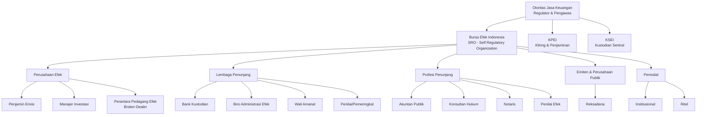

> [!WARNING]
> **Demutualisasi BEI (UU P2SK)**: BEI kini dapat menjadi emiten sendiri, sehingga masyarakat umum dapat membeli saham perusahaan bursa. Hal ini memerlukan pemisahan yang tegas antara fungsi regulasi/pengawasan BEI dengan fungsi komersialnya untuk menghindari *conflict of interest*.

---

### 2. Struktur & Pihak-Pihak dalam Pasar Modal

#### 2.1 Lembaga Utama

| Lembaga | Fungsi Utama | Dasar Hukum |
|---------|-------------|-------------|
| **OJK** | Pengaturan, pengawasan, pemeriksaan, penyidikan | UU No. 21/2011 jo. UU P2SK |
| **BEI** | Fasilitator pasar, SRO, penyediaan infrastruktur perdagangan | UU PM, Peraturan BEI |
| **KPEI** | Penyelesaian transaksi (*clearing & settlement*), penjaminan | UU PM |
| **KSEI** | Penyimpanan efek secara sentral, pemindahbukuan | UU PM |

#### 2.2 Perusahaan Efek

| Jenis | Fungsi | Karakteristik |
|-------|--------|---------------|
| **Penjamin Emisi** | Mengawal IPO, menjamin penyerapan saham | Memerlukan izin OJK; dapat berupa *full commitment, best effort, standby, all or none* |
| **Manajer Investasi** | Mengelola portofolio reksadana | Fiduciary duty (Pasal 27 UU PM) |
| **Perantara Pedagang Efek** | Melakukan jual beli efek untuk nasabah | License perorangan bagi broker; bentuknya perusahaan |

#### 2.3 Lembaga & Profesi Penunjang

| Pihak | Peran | Kewenangan/Tanggung Jawab |
|-------|-------|--------------------------|
| **Kustodian** | Menyimpan dan mengadministrasikan efek | Turunan KSEI; mengurus administrasi dan keamanan aset |
| **BAE** | Pencatatan pemilikan efek dan pembagian hak | Berdasarkan kontrak dengan emiten |
| **Wali Amanat** | Perwakilan pemegang obligasi | Melindungi kepentingan pemegang obligasi |
| **Akuntan Publik** | Audit laporan keuangan | Opini Wajar Tanpa Modifikasi (WTM) untuk IPO |
| **Konsultan Hukum** | Legal audit, legal opinion | Anggota HKHPM; independen (POJK 66/2017) |
| **Notaris** | Pembuatan akta perusahaan | Akta pendirian, perubahan AD |
| **Penilai Efek** | Penentuan nilai wajar | Independen; wajib dalam transaksi afiliasi/material |

> [!NOTE]
> **BAPMI** (Badan Arbitrase Pasar Modal Indonesia) merupakan lembaga penyelesaian sengketa alternatif yang dapat digunakan investor untuk menyelesaikan perselisihan tanpa melalui pengadilan umum.

#### 2.4 Emiten, Perusahaan Publik, Reksadana, dan Pemodal

**Emiten** adalah pihak yang melakukan penawaran umum. **Perusahaan Publik** adalah Perseroan Terbuka yang sahamnya dimiliki oleh minimal 300 pemegang saham. 

> [!IMPORTANT]
> **Emiten sudah pasti Perusahaan Publik, tetapi Perusahaan Publik belum tentu Emiten** — karena Perusahaan Publik bisa saja tidak listed di BEI atau tidak memenuhi syarat emiten.

---

### 3. Prinsip-Prinsip Pasar Modal

#### 3.1 Disclosure (Keterbukaan Informasi)

Prinsip keterbukaan merupakan **azas fundamental** dalam pasar modal. Menurut catatan kuliah Dr. Arman Nefi:

> [!QUOTE]
> "Istilah yang lebih tepat adalah **Fair Disclosure**, bukan Full Disclosure. Karena tidak semua informasi perlu dibuka — misalnya resep makanan bagi perusahaan F&B tidak perlu diumbar ke publik. Yang perlu diungkap adalah informasi yang sewajarnya diketahui publik untuk menimbulkan kenyamanan bertransaksi."

| Aspek | Penjelasan |
|-------|------------|
| **Full Disclosure** | Semua informasi terbuka tanpa pengecualian |
| **Fair Disclosure** | Hanya informasi material yang wajib diungkap; ada pengecualian untuk rahasia dagang |

#### 3.2 Fairness (Kewajaran)

Transaksi harus berlangsung **tanpa pemihakan** (*netral*) dan atas dasar penyebaran informasi yang **merata** (*equal information*).

#### 3.3 Investor Protection (Perlindungan Investor)

Mencakup:
- Perlindungan dari informasi menyesatkan
- Hak mengajukan gugatan ganti rugi (Pasal 111 UU PM, Pasal 1365 KUHPerdata)
- Mekanisme disgorgement (POJK 65/2020)
- Indonesia SIPF (Securities Investor Protection Fund)

#### 3.4 Efficiency, Liquidity, Transparency

| Prinsip | Tolok Ukur |
|---------|-----------|
| **Efisiensi** | Kemampuan mengakomodasi transaksi sebanyak mungkin dalam waktu singkat |
| **Likuiditas** | Kemampuan pasar menampung kebutuhan penjual dan pembeli setiap saat |
| **Transparansi** | Penyediaan informasi realtime kepada semua pelaku pasar |

---

### 4. Keterbukaan Informasi (Disclosure)

#### 4.1 Informasi/Fakta Material

Menurut **Pasal 1 angka 7 UU P2SK**:

> [!IMPORTANT]
> Informasi atau Fakta Material adalah informasi atau fakta penting dan relevan mengenai peristiwa, kejadian, atau fakta yang dapat memengaruhi: (a) penilaian atas harga Efek; (b) penilaian atas harga Efek oleh pemodal; dan/atau (c) keputusan pemodal atau investor.

**Contoh Informasi Material** (merujuk POJK 31/2015):
- Penggabungan/peleburan/pemisahan usaha
- Perubahan pengendalian
- Perubahan direksi/komisaris
- Tuntutan hukum material
- Pembagian dividen interim
- Delisting/relisting
- Restrukturisasi utang

#### 4.2 Tiga Tahapan Keterbukaan

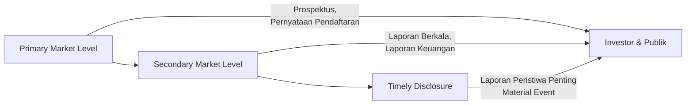

| Tahapan | Kewajiban | Waktu |
|---------|-----------|-------|
| **Primary Market** | Prospektus, Pernyataan Pendaftaran | Sebelum penawaran umum |
| **Secondary Market** | Laporan tahunan, laporan keuangan | Berkala (tahunan/semi-tahunan) |
| **Timely Disclosure** | Laporan peristiwa material | Sesegera mungkin (minimal 2x24 jam) |

#### 4.3 Larangan Informasi Menyesatkan

**Pasal 78-79 UU PM** (diperkuat UU P2SK):
- Dilarang memuat keterangan tidak benar tentang fakta material dalam prospektus
- Dilarang memuat pengumuman media massa yang menyesatkan terkait penawaran umum

#### 4.4 Pengecualian Keterbukaan

Menurut **PJOK No. 37/2020**, pengecualian dapat diberikan kepada **Lembaga Jasa Keuangan** yang memiliki izin OJK untuk menghimpun/mengelola dana masyarakat, dalam kondisi:
- Permasalahan yang membahayakan Stabilitas Sistem Keuangan; atau
- Perintah tertulis OJK untuk transaksi terkait penanganan krisis

> [!WARNING]
> **Kelemahan UU P2SK**: Aturan pengecualian tidak diatur secara rinci dalam UU P2SK, melainkan hanya di PJOK No. 37/2020. Menurut Dr. Arman Nefi, hal ini merupakan kelemahan karena pengecualian seharusnya tidak lagi diterapkan pasca-pandemi COVID-19, mengingat tidak pernah dikeluarkan SEMA OJK mengenai hal tersebut.

#### 4.5 Tanggung Jawab atas Informasi Tidak Benar

**Pasal 80-81 UU PM**:
- Pihak-pihak yang menandatangani Pernyataan Pendaftaran, direksi, komisaris, penjamin emisi, dan profesi penunjang **bertanggung jawab bersama-sama dan sendiri-sendiri**
- Jangka waktu: **5 tahun** sejak pernyataan efektif
- Gugatan ganti rugi dapat diajukan oleh investor yang dirugikan

---

### 5. Penawaran Umum (IPO)

#### 5.1 Definisi dan Manfaat Go Public

**IPO** (*Initial Public Offering*) adalah penjualan saham perdana suatu perusahaan kepada masyarakat melalui pasar modal.

**Manfaat Go Public:**
- Memperoleh dana besar sekaligus untuk ekspansi
- Biaya relatif murah dibanding pinjaman bank
- Meningkatkan citra dan profesionalisme perusahaan
- Memberikan kesempatan karyawan memiliki saham (ESOP/MSOP)
- Media promosi perusahaan

**Konsekuensi Go Public:**
- Kewajiban keterbukaan (disclosure)
- Kewajiban pelaporan berkala
- Gaya manajemen berubah dari informal ke formal
- Kewajiban membayar dividen (moral obligation)
- Tekanan untuk pertumbuhan berkelanjutan

#### 5.2 Tahapan IPO

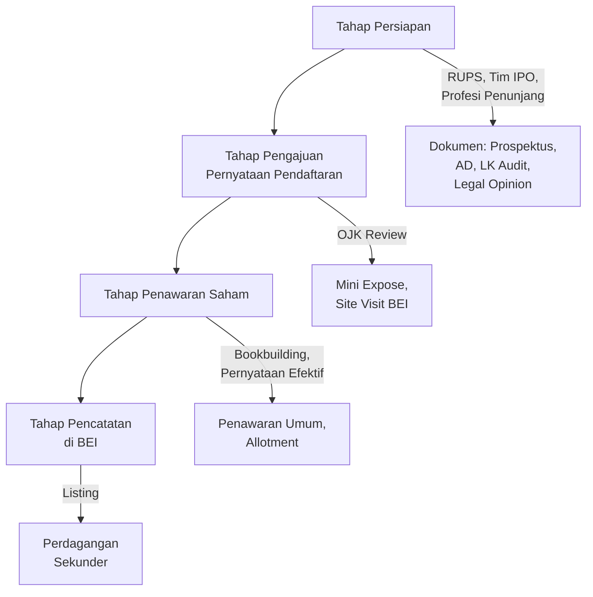

#### 5.3 Dokumen IPO

| Dokumen | Keterangan |
|---------|------------|
| **Prospektus Awal** | Disampaikan ke OJK; tanpa info harga final |
| **Prospektus Ringkas** | Untuk penawaran ke publik; informatif & komunikatif |
| **Prospektus Final** | Setelah efektif; berisi harga & jumlah final |
| **Anggaran Dasar** | Telah disetujui Menteri Hukum & HAM |
| **Laporan Keuangan Audit** | Min. 3 tahun (Papan Utama) atau 1 tahun (Papan Pengembangan) |
| **Legal Opinion** | Pendapat hukum dari Konsultan Hukum |
| **Perjanjian Penjamin Emisi** | Jika menggunakan underwriter |

#### 5.4 Komitmen Penjamin Emisi

| Jenis | Karakteristik | Risiko untuk Penjamin |
|-------|--------------|----------------------|
| **Full Commitment** | Menjamin seluruh saham akan diserap; sisa wajib dibeli | Tinggi — penjamin menanggung risiko unsold shares |
| **Best Effort** | Upaya terbaik; tidak ada jaminan penyerapan | Rendah — tidak wajib membeli sisa |
| **Standby Commitment** | Upaya terbaik; sisa **dapat** dibeli dengan harga diskon | Sedang — opsi beli, bukan kewajiban |
| **All or None** | 100% terjual atau batal sama sekali | Sangat tinggi untuk emiten |

> [!NOTE]
> Dalam praktik Indonesia, **Full Commitment dan Best Effort** paling banyak diterapkan. **All or None** belum pernah ditemukan dalam praktik menurut pengamatan Dr. Arman Nefi.

#### 5.5 Green Shoe Option (Stabilisasi Harga)

> [!IMPORTANT]
> **Green Shoe Option** adalah keringanan kepada emiten untuk menambah 30-40% saham dari portepel jika terjadi *oversubscribe* yang tidak wajar (5-7x lipat). Tujuannya: mendinginkan pasar agar harga di pasar sekunder tidak terlalu terbang.

**Syarat (Pasal 94 UU PM):**
- Hanya untuk stabilisasi harga saat IPO
- Dilakukan oleh penjamin emisi sebagai market maker
- Wajib diungkap dalam prospektus
- Tidak boleh diperpanjang setelah proses IPO selesai

#### 5.6 IPO BUMN/Privatisasi

**Dasar Hukum:** PP No. 33/2005, PP No. 59/2009, PER-01/MBU/2010

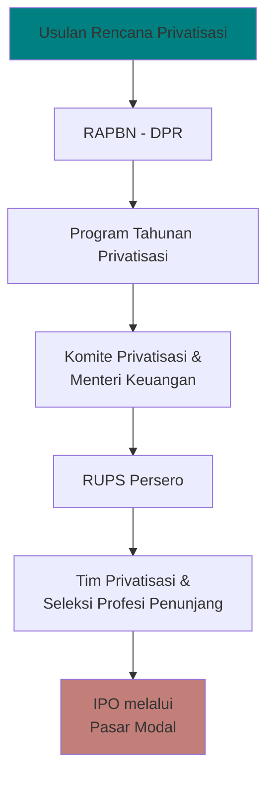

**Metode Privatisasi BUMN:**
1. Penjualan saham melalui pasar modal
2. Penjualan saham secara langsung kepada investor
3. Penjualan saham kepada manajemen/karyawan (ESOP/MSOP)

#### 5.7 E-IPO

Diatur dalam **POJK 41/2020** dan **SEOJK 15/2020**. Mekanisme elektronik yang memungkinkan calon emiten melakukan IPO secara digital, menghemat dokumen administrasi.

---

### 6. Aksi Korporasi

#### 6.1 Definisi dan Klasifikasi

Aksi Korporasi adalah tindakan emiten/perusahaan publik atau peristiwa tertentu yang berpengaruh **secara material** terhadap saham dan pemegang saham. Seluruh aksi korporasi wajib diputuskan melalui **RUPS**.

| Klasifikasi | Karakteristik | Contoh |
|-------------|--------------|--------|
| **Mandatory** | Wajib dilaksanakan oleh pemegang saham tanpa pilihan | Stock split, merger, liquidation, dividend |
| **Mandatory with Options** | Wajib dilaksanakan dengan pilihan tertentu | Merger with elections, spin-off with elections |
| **Voluntary** | Opsional, pemegang saham dapat memilih | Tender offer, buyback, rights issue, DRIP |

#### 6.2 Right Issue / HMETD

**Hak Memesan Efek Terlebih Dahulu (HMETD)** adalah hak istimewa bagi pemegang saham lama untuk membeli saham baru sebelum ditawarkan ke pihak lain.

> [!IMPORTANT]
> **Dasar Hukum:** UU PT Pasal 43 ayat (1) jo. **POJK 32/2015** sebagaimana diubah **POJK 14/2019**.

**Ketentuan HMETD:**
- Saham baru harus ditawarkan secara proporsional sesuai kepemilikan
- Harga biasanya lebih rendah dari harga pasar
- Jangka waktu: 14 hari sejak penawaran untuk subscription
- Jika tidak digunakan, dapat ditawarkan ke pihak ketiga

**Pengecualian HMETD (Pasal 43 ayat (3) UU PT):**
Pengesampingan HMETD berarti saham baru yang diterbitkan oleh perseroan tidak wajib terlebih dahulu ditawarkan secara proporsional kepada seluruh pemegang saham yang sudah ada. Dengan kata lain, perseroan dapat langsung menerbitkan saham kepada pihak tertentu tanpa memberikan kesempatan kepada pemegang saham eksisting untuk membeli saham tersebut terlebih dahulu.

>[!NOTE]
>Dalam kondisi normal, ketika perseroan melakukan penambahan modal melalui penerbitan saham baru, setiap pemegang saham memiliki Hak Memesan Efek Terlebih Dahulu (HMETD) untuk mempertahankan persentase kepemilikannya. Misalnya, jika seorang pemegang saham memiliki 10% saham perusahaan, ia berhak membeli sebagian saham baru agar porsi kepemilikannya tetap sekitar 10%.

Tujuannya adalah:
1. Ditujukan kepada karyawan perseroan (**ESOP:** *Employee Stock Ownership Program*) / **MSOP:** *Management Stock Option Program*)
2. Ditujukan kepada pemegang obligasi/efek konversi (dengan persetujuan RUPS)
3. Dalam rangka reorganisasi/restrukturisasi (dengan persetujuan RUPS)

**Penambahan Modal Tanpa HMETD (PMTHMETD) / *Private Placement* - (POJK 14/2019):**
Private placement adalah metode penghimpunan modal di mana suatu perusahaan menerbitkan saham baru dan menjualnya secara langsung kepada pihak atau kelompok investor tertentu, tanpa melakukan penawaran kepada seluruh pemegang saham yang ada atau kepada publik secara luas. Berbeda dengan rights issue yang memberikan hak kepada seluruh pemegang saham eksisting untuk membeli saham baru, dalam private placement perusahaan dapat memilih investor yang akan menerima saham tersebut.

Private placement memerlukan persetujuan pemegang saham melalui RUPS, keterbukaan informasi, serta ketentuan mengenai harga penerbitan saham agar transaksi tidak merugikan pemegang saham yang sudah ada.

Tujuannya adalah:
- Untuk perbaikan posisi keuangan (modal kerja bersih negatif, liabilitas >80% aset)
- Untuk selain perbaikan keuangan (maksimal 10% dari saham ditempatkan)
- Penerbitan saham bonus

#### 6.3 Tender Offer

##### 6.3.1 Mandatory Tender Offer (MTO)
Mandatory Tender Offer adalah tender offer yang wajib dilakukan oleh pihak yang memperoleh pengendalian atas perusahaan terbuka. Prinsip dasarnya adalah perlindungan terhadap pemegang saham minoritas. Ketika terjadi perubahan pengendali, pemegang saham publik harus diberi kesempatan untuk menjual sahamnya kepada pengendali baru apabila mereka tidak ingin tetap menjadi pemegang saham di bawah pengendalian yang baru.

>[!NOTE]Contoh:
>Jika Perusahaan A membeli 60% saham Perusahaan B dari pemegang saham pengendali lama sehingga menjadi pengendali baru, maka Perusahaan A wajib melakukan tender offer kepada pemegang saham publik yang tersisa. Dengan demikian, pemegang saham minoritas memperoleh kesempatan untuk keluar (exit opportunity) dengan syarat yang sama sebagaimana ditentukan dalam regulasi.

##### 6.3.2 Voluntary Tender Offer (VTO)
Voluntary Tender Offer adalah tender offer yang dilakukan atas kehendak sendiri oleh pihak penawar dan bukan karena kewajiban hukum akibat memperoleh pengendalian. Tujuannya bisa beragam, misalnya meningkatkan kepemilikan saham, memperkuat posisi dalam perusahaan, mempersiapkan delisting, atau mengakumulasi saham dalam jumlah tertentu.

>[!NOTE]Contoh:
>Seorang investor telah memiliki 20% saham suatu emiten dan ingin meningkatkan kepemilikannya menjadi 40%. Investor tersebut dapat menawarkan kepada seluruh pemegang saham untuk membeli saham mereka pada harga tertentu melalui voluntary tender offer, meskipun ia belum menjadi pengendali dan tidak diwajibkan oleh peraturan untuk melakukannya.

| Aspek | Voluntary Tender Offer (POJK 54/2015) | Mandatory Tender Offer (POJK 9/2018) |
|-------|--------------------------------------|--------------------------------------|
| **Pemicu** | Sukarela oleh pihak yang ingin mengakuisisi | Wajib setelah terjadi pengambilalihan/pengendali baru |
| **Tujuan** | Mengubah status perusahaan terbuka menjadi tertutup (go private) | Mengendalikan perusahaan publik |
| **Harga** | Lebih tinggi dari: harga penawaran tertinggi 180 hari terakhir / rata-rata 90 hari / harga wajar penilai | Lebih tinggi dari harga tertinggi 90 hari terakhir sebelum pengumuman |
| **Masa Penawaran** | Min. 30 hari, dapat diperpanjang max. 90 hari | 30 hari |
| **Refloating** | Tidak ada | Wajib jika kepemilikan >80% → dilepas kembali min. 20% dalam 2 tahun |
| **Pengecualian** | - | Saham pengendali lama, pemegang saham utama, pihak dengan penawaran serentak |

> [!NOTE]
> **Refloating (Pasal 21 POJK 9/2018)**: Jika setelah MTO pengendali baru memiliki >80% saham, wajib mengalihkan kembali ke publik min. 20% dalam 2 tahun. Ini untuk menjaga likuiditas saham dan mencegah mudahnya go private.

#### 6.4 Merger, Akuisisi, Konsolidasi

**Dasar Hukum:** PP 27/1998 jo. POJK 74/2016

| Jenis | Definisi | Akibat Hukum |
|-------|----------|-------------|
| **Merger** | Penggabungan dua/lebih perusahaan menjadi satu perusahaan baru | Perusahaan lama bubar, yang baru berdiri |
| **Akuisisi** | Pengambilalihan perusahaan lain | Perusahaan target tetap berdiri, berubah pengendali |
| **Konsolidasi** | Penggabungan menjadi perusahaan baru | Semua perusahaan lama bubar |

**Perlindungan Pemegang Saham Minoritas (Pasal 55 UU PT):**
Pemegang saham yang tidak menyetujui merger/konsolidasi berhak meminta perusahaan membeli sahamnya dengan **harga wajar**.

#### 6.5 Stock Split & Reverse Stock Split

**POJK 15/2022** mengatur:

| Jenis | Mekanisme | Tujuan |
|-------|-----------|--------|
| **Stock Split** | Memecah 1 saham menjadi beberapa saham (misal 1:5) | Menurunkan harga saham agar lebih terjangkau, meningkatkan likuiditas |
| **Reverse Stock Split** | Menggabungkan beberapa saham menjadi 1 saham (misal 5:1) | Meningkatkan harga saham, memenuhi syarat harga minimum BEI |

#### 6.6 Buy Back (Pembelian Kembali Saham)

**Dasar Hukum:** POJK 2/2013 jo. POJK 29/2023

| Tujuan Buy Back | Keterangan |
|-----------------|------------|
| **Delisting / Going Private** | Membeli seluruh saham publik |
| **Stabilisasi harga** | Mencegah penurunan harga saham yang tidak wajar |
| **Program kepemilikan saham karyawan** | ESOP/MSOP |
| **Konversi obligasi/saham** | Menyediakan saham untuk konversi |

> [!WARNING]
> Buy back untuk delisting wajib mendapat persetujuan RUPS dan mengikuti mekanisme tender offer sesuai POJK 45/2024 (menggantikan POJK 3/2021).

#### 6.7 Delisting, Relisting, Going Private

| Jenis | Definisi | Pemicu |
|-------|----------|--------|
| **Voluntary Delisting** | Penghapusan pencatatan atas permohonan emiten | Rencana strategis, bangkrut, merger |
| **Forced Delisting** | Penghapusan paksa oleh BEI | Pelanggaran aturan, keuangan buruk, tidak menyampaikan laporan 24 bulan |
| **Relisting** | Pencatatan kembali setelah delisting | Perbaikan kondisi keuangan/tata kelola |
| **Going Private** | Perubahan dari terbuka ke tertutup | Voluntary tender offer, buy back seluruh saham publik |

#### 6.8 Dividen

| Jenis | Karakteristik |
|-------|--------------|
| **Cash Dividend** | Pembayaran tunai kepada pemegang saham |
| **Stock Dividend** | Pembagian saham bonus dari saldo laba/agio |
| **Scrip Dividend** | Pembayaran dalam bentuk surat berharga/promissory note |
| **Dividen Interim** | Dividen di tengah tahun (memerlukan persetujuan khusus) |

#### 6.9 Spin-off, De-merger, dan Lainnya

| Aksi | Penjelasan |
|------|------------|
| **Spin-off** | Pemisahan unit usaha menjadi perusahaan independen dengan saham baru |
| **De-merger** | Pembagian perusahaan menjadi beberapa entitas terpisah |
| **Return of Capital** | Pengembalian modal kepada pemegang saham |
| **Scheme of Arrangement** | Restrukturisasi melalui kesepakatan dengan kreditur |

---

### 7. Transaksi Afiliasi & Benturan Kepentingan

#### 7.1 Definisi

**Transaksi Afiliasi** (Pasal 1 angka 3 POJK 42/2020):
> Setiap aktivitas dan/atau transaksi yang dilakukan oleh perusahaan terbuka dengan Afiliasi dari perusahaan terbuka atau Afiliasi dari anggota direksi, anggota dewan komisaris, pemegang saham utama, atau Pengendali.

**Benturan Kepentingan** (Pasal 1 angka 4 POJK 42/2020):
> Perbedaan antara kepentingan ekonomis perusahaan terbuka dengan kepentingan ekonomis pribadi anggota direksi, anggota dewan komisaris, pemegang saham utama, atau Pengendali yang **dapat merugikan** perusahaan terbuka.

> [!IMPORTANT]
> **Transaksi afiliasi TIDAK DILARANG. Benturan kepentingan juga TIDAK DILARANG.** Yang wajib adalah **transparansi dan persetujuan** melalui mekanisme yang diatur.

#### 7.2 Unsur-unsur Afiliasi (Pasal 1 angka 1 POJK 42/2020)

Afiliasi meliputi hubungan:
- Keluarga (istri/suami, anak, orang tua)
- Kepemilikan saham >50%
- Jabatan (satu atau lebih anggota direksi/komisaris yang sama)
- Pengendali bersama

#### 7.3 Persyaratan Transaksi Afiliasi (Pasal 4 POJK 42/2020)

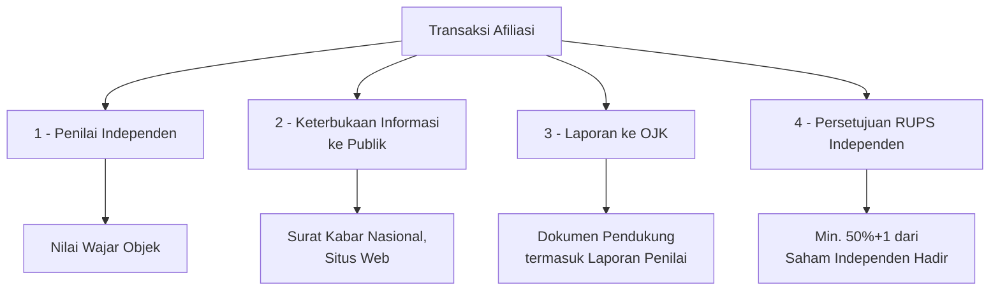

#### 7.4 Transaksi Material (POJK 17/2020)

Transaksi material adalah transaksi yang nilainya ≥ **20% dari ekuitas perusahaan** atau ≥ **Rp 5 miliar**.

| Syarat | Keterangan |
|--------|------------|
| **Penilai Saham** | Wajib menggunakan penilai independen |
| **RUPS** | Wajib persetujuan RUPS |
| **Keterbukaan** | Wajib diumumkan ke publik |

#### 7.5 Perlindungan Pemegang Saham Minoritas/Independen

**Pemegang Saham Independen** (Pasal 1 angka 9 POJK 42/2020):
> Pemegang saham yang tidak memiliki kepentingan ekonomis pribadi sehubungan dengan transaksi tertentu dan bukan anggota direksi, komisaris, pemegang saham utama, pengendali, atau afiliasi dari mereka.

**Mekanisme Perlindungan:**
- Hak untuk tidak menyetujui transaksi afiliasi/benturan kepentingan
- Hak untuk meminta perusahaan membeli saham dengan harga wajar (appraisal right)
- Jika transaksi dilakukan tanpa persetujuan: **sanksi administratif** (Pasal 27 POJK 42/2020)

#### 7.6 Kasus: PT AMJA Tbk (Transaksi Afiliasi + Right Issue + Debt-to-Equity Swap)

> [!QUOTE]
> **Fakta:** Tn. JD (Dirut PT AMJA Tbk) juga menjabat VP Director di British Airways. PT AMJA berencana membeli 8 pesawat dari British Airways melalui right issue, padahal 85,65% aset telah dijaminkan.

**Analisis Hukum:**
1. **Transaksi Afiliasi:** Terpenuhi (satu anggota direksi yang sama — Pasal 1 angka 1 huruf c POJK 42/2020)
2. **Benturan Kepentingan:** Perlu bukti ada/m tidaknya keuntungan pribadi Tn. JD; jika terbukti merugikan PT AMJA, maka terjadi benturan kepentingan
3. **Persyaratan yang harus dipenuhi:**
   - Penilai independen ✓ (sudah ada pernyataan penilai)
   - Keterbukaan informasi ke publik ✗
   - Laporan ke OJK ✗
   - Persetujuan RUPS Independen ✗
4. **Debt-to-Equity Swap:** Memungkinkan berdasarkan Pasal 43 ayat (3) huruf c UU PT, dengan persetujuan RUPS dan kreditur

---

### 8. Good Corporate Governance (GCG)

#### 8.1 Status GCG dalam Kerangka Hukum Indonesia

GCG di Indonesia memiliki **tiga status sekaligus**:

| Status | Argumen |
|--------|---------|
| **Code of Ethics** | Menjadi landasan tingkah laku berkesadaran etis, berpikir etis, berperilaku etis |
| **Principles** | 8 prinsip SEOJK 32/2015 sebagai pedoman tata kelola |
| **Norm** | Wajib diterapkan oleh perusahaan terbuka (Pasal 2 POJK 21/2015); pelanggaran dapat dikenai sanksi administratif |

> [!IMPORTANT]
> **UU PM menganut GCG sebagai norma yang mengikat.** Pasal 2 POJK 21/2015 menyatakan perusahaan terbuka **wajib** menerapkan pedoman tata kelola OJK. SEOJK 32/2015 menetapkan 8 prinsip GCG yang harus diterapkan.

#### 8.2 8 Prinsip GCG menurut SEOJK 32/2015

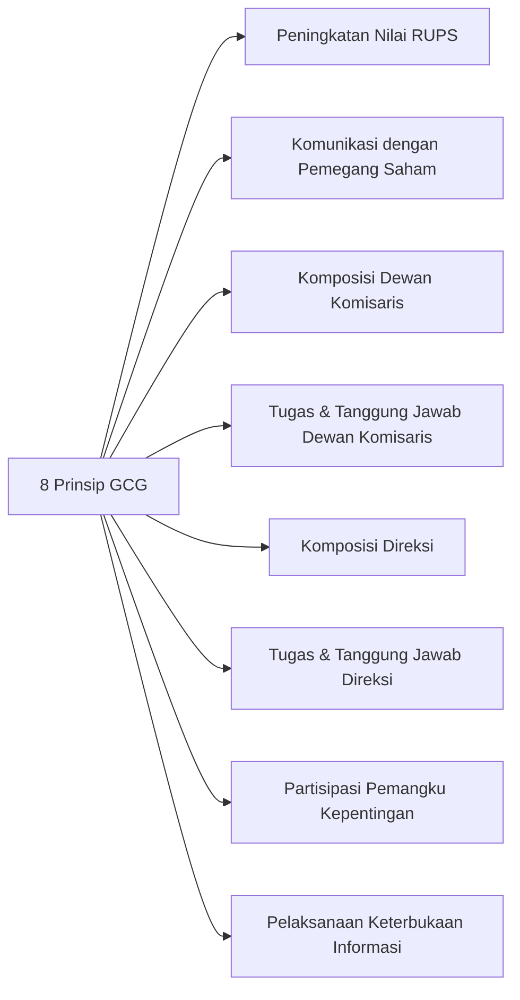

#### 8.3 Peran Organ GCG

| Organ | Peran | Persyaratan |
|-------|-------|-------------|
| **Komisaris Independen** | Mengawasi direksi, mencegah benturan kepentingan | Min. 30% dari jumlah komisaris |
| **Komite Audit** | Mengawasi laporan keuangan, audit internal | Wajib ada di Papan Utama & Pengembangan |
| **Sekretaris Perusahaan** | Menjalin komunikasi dengan publik & OJK | Wajib ada di perusahaan terbuka |
| **Unit Audit Internal** | Audit operasional dan kepatuhan | Wajib ada di Papan Utama & Pengembangan |

#### 8.4 Agency Theory sebagai Dasar GCG

*Agency Theory* merupakan salah satu landasan teoritis utama dari konsep Good Corporate Governance (GCG) dalam pasar modal. Teori ini pertama kali dikembangkan secara sistematis oleh Michael C. Jensen dan William H. Meckling melalui artikel Theory of the Firm: Managerial Behavior, Agency Costs and Ownership Structure (1976).

##### 8.4.1 Konsep Dasar Agency Theory
Agency Theory berangkat dari hubungan antara:

- **Principal** → pihak yang memiliki perusahaan atau modal (pemegang saham/investor).
- **Agent** → pihak yang diberi kewenangan untuk mengelola perusahaan (direksi dan manajemen).

Dalam perusahaan terbuka (go public), pemegang saham tidak mengelola perusahaan secara langsung. Mereka menyerahkan pengelolaan kepada manajemen profesional.

Masalah muncul karena:

- Kepentingan principal dan agent tidak selalu sama.
- Agent memiliki informasi lebih banyak daripada principal (information asymmetry).
- Agent dapat bertindak demi kepentingannya sendiri (self-interest).

>[!NOTE]
>Contoh:
>Pemegang saham ingin laba dan nilai perusahaan meningkat. Direksi mungkin lebih fokus pada bonus, fasilitas, atau mempertahankan jabatannya.
> Kondisi inilah yang disebut *agency problem*.

##### 8.4.2 Type II Agency Problem
Banyak perusahaan publik di Indonesia memiliki struktur kepemilikan terkonsentrasi. Risikonya adalah:
- Pemegang saham pengendali mengambil keuntungan pribadi (*private benefits of control*).
- Transaksi afiliasi yang merugikan pemegang saham minoritas.
- Pengalihan aset perusahaan kepada pihak terafiliasi.

##### 8.4.3 Agency Cost
Menurut Jensen dan Meckling, konflik principal-agent menimbulkan agency costs, yaitu biaya yang harus dikeluarkan untuk memastikan agent bertindak sesuai kepentingan principal.

Agency cost terdiri dari:
- **Monitoring Cost:** Biaya pengawasan yang dikeluarkan principal (audit eksternal, komite audit, komisaris independen, dan kewajiban keterbukaan informasi).
- **Bonding Cost:** Biaya yang dikeluarkan agent untuk meyakinkan principal (penyusunan laporan berkala, sertifikasi kepatuhan, sistem pengendalian internal).
- **Residual Loss:** Kerugian yang tetap ada meskipun pengawasan telah dilakukan (keputusan bisnis yang tidak optimal, inefisiensi manajemen).

**Mekanisme mengurangi agency problem:**
- Pengawasan oleh komisaris independen
- Insentif berbasis kinerja (performance-based compensation)
- Keterbukaan informasi
- Sanksi hukum bagi pelanggaran

---

### 9. Kejahatan Pasar Modal (White Collar Crime)

#### 9.1 Karakteristik

Kejahatan pasar modal termasuk **white collar crime** — dilakukan oleh pihak dengan kedudukan, keahlian, atau akses khusus. Merujuk pada Isma Yani & Zetrla Erma (Marwah Hukum, 2024):

> [!QUOTE]
> "Kejahatan dalam pasar modal merupakan perbuatan yang melanggar ketentuan hukum pasar modal dan dilakukan dalam kegiatan perdagangan efek sehingga dapat merugikan investor, emiten, maupun pasar modal secara keseluruhan."

#### 9.2 Penipuan (Fraud) — Pasal 90 UU P2SK

**Unsur-unsur:**
1. Mengelabui dengan nama palsu, martabat palsu, tipu muslihat, rangkaian kebohongan
2. Membuat pernyataan tidak benar mengenai informasi/fakta material
3. Tidak mengungkapkan fakta material yang diperlukan

**Perbedaan dengan KUHP:** UU PM mengancam pidana lebih berat (10 tahun penjara + Rp 15 miliar denda) dibanding Pasal 378 KUHP (4 tahun penjara).

#### 9.3 Manipulasi Pasar — Pasal 91-93 UU P2SK

| Jenis | Definisi | Contoh |
|-------|----------|--------|
| **Marking the Close** | Rekayasa harga saat/mendekati penutupan perdagangan | Membeli saham besar-besaran di menit terakhir untuk menaikkan harga pembukaan besok |
| **Painting the Tape** | Perdagangan antar rekening dalam penguasaan satu pihak untuk menciptakan perdagangan semu | JD & SS bertransaksi saham BBCA antar rekening untuk menaikkan harga |
| **Wash Sales** | Order beli dan jual pada saat bersamaan tanpa perubahan kepemilikan manfaat | Penjual pertama = pembeli terakhir |
| **Cornering the Market** | Membeli efek dalam jumlah besar untuk menguasai pasar | Akumulasi saham hingga menyudutkan pasar |
| **Pools** | Penghimpunan dana oleh kelompok investor untuk memanipulasi harga | Sekelompok broker mengelola dana untuk membeli saham tertentu |
| **Pump and Dump** | Menyebar informasi positif palsu untuk menaikkan harga, lalu menjual | Influencer mempromosikan saham palsu, lalu menjual saat harga naik |
| **Spreading False Information** | Membuat pernyataan tidak benar yang memengaruhi harga | Hoax merger untuk menaikkan harga saham |

> [!WARNING]
> **Perbedaan Manipulasi Pasar vs Penipuan:**
> - **Manipulasi pasar**: Fokus pada **rekayasa kondisi pasar/harga** (kebohongan tentang keadaan pasar)
> - **Penipuan**: Fokus pada **misleading information** dalam transaksi (kebohongan tentang fakta perusahaan)

#### 9.4 Insider Trading — Pasal 95-97 UU PM

**Orang Dalam (Insider):**
- Komisaris, direksi, pegawai emiten
- Pemegang saham utama
- Pihak yang karena jabatan/profesi memperoleh informasi orang dalam (notaris, akuntan, konsultan hukum)
- Pihak yang dalam 6 bulan terakhir pernah menjadi pihak di atas

**Fiduciary Duty vs Fiduciary Obligation:**

| Konsep | Cakupan |
|--------|---------|
| **Fiduciary Duty** | Pihak yang mengemban kepercayaan langsung dari emiten (direksi, komisaris, pegawai) |
| **Fiduciary Obligation** | Stakeholder dengan akses informasi karena hubungan profesional (notaris, akuntan, konsultan hukum, penerjemah, penasihat keuangan, pegawai OJK) |

**Tippee:**
> Pihak yang menerima informasi orang dalam dari pihak pertama (insider) secara melawan hukum untuk membeli saham demi kepentingan pribadi.

**Unsur-unsur Insider Trading (kumulatif):**
1. Ada fiduciary duty/obligation
2. Ada transaksi efek
3. Ada informasi material yang belum dipublikasikan

**Contoh Kasus:**
> A (Direktur Keuangan PT X) mengetahui PT X akan merger dengan PT Y. A memberitahu B (teman). B memborong saham PT X. **B adalah tippee** — namun jika B hanya mendengar di restoran tanpa hubungan dengan A, B adalah **"TiPi"** (tipe orang yang kebetulan) dan **tidak dapat dijerat** insider trading.

#### 9.5 Sanksi Pidana

**Pasal 104 jo. Pasal 107 UU P2SK:**

| Pelanggaran | Sanksi |
|-------------|--------|
| Penipuan, Manipulasi Pasar, Insider Trading | Pidana penjara **maksimal 10 tahun** + denda **maksimal Rp 15 miliar** |
| Korporasi | Pidana denda + tindakan tata tertib + pembekuan kegiatan usaha |

> [!IMPORTANT]
> **UU P2SK 2023 memperberat sanksi:** Denda maksimal naik dari Rp 15 miliar menjadi potensi **Rp 20 miliar** dalam konteks sanksi pidana baru. Selain itu, KUHP Baru menegaskan pertanggungjawaban pidana korporasi secara eksplisit.

---

### 10. Pelanggaran Administratif & Sanksi

#### 10.1 Perbedaan Pelanggaran Administratif vs Tindak Pidana

| Aspek | Kejahatan Pasar Modal | Pelanggaran Administratif |
|-------|----------------------|---------------------------|
| **Sifat** | Pidana (criminal) | Administratif/teknis |
| **Bentuk** | Penipuan, manipulasi, insider trading | Keterlambatan laporan, tidak keterbukaan, kesalahan prosedural |
| **Dampak** | Merugikan investor & pasar secara luas | Dampak relatif lebih ringan |
| **Pelaku** | Pihak yang menyalahgunakan informasi/jabatan | Pihak yang tidak memenuhi kewajiban administratif |
| **Sanksi** | Penjara + denda pidana | Peringatan, denda administratif, pembekuan izin |

#### 10.2 Sanksi Administratif

**Pasal 102 UU PM jo. POJK 3/2021:**

| Jenis Sanksi | Keterangan |
|--------------|------------|
| **Peringatan tertulis** | Teguran pertama |
| **Denda** | Kewajiban membayar uang tertentu (max Rp 5 miliar perorangan, Rp 25 miliar korporasi) |
| **Pembatasan kegiatan usaha** | Pembatasan operasional tertentu |
| **Pembekuan kegiatan usaha** | Penghentian sementara seluruh kegiatan |
| **Pencabutan izin usaha** | Penarikan izin permanen |
| **Pembatalan persetujuan** | Pembatalan keputusan OJK sebelumnya |
| **Pembatalan pendaftaran** | Penghapusan status pendaftaran |

**Tindakan Tertentu (Pasal 94 POJK 3/2021):**
- Pengembalian keuntungan tidak sah (disgorgement)
- Pembayaran ganti kerugian
- Pembekuan/pembatalan hak dan manfaat
- Pembatasan kegiatan tertentu

#### 10.3 Sanksi Pidana

| Pasal | Tindak Pidana | Ancaman |
|-------|--------------|---------|
| Pasal 104 | Penipuan, manipulasi, insider trading | Penjara max 10 tahun + denda max Rp 15 miliar |
| Pasal 107 | Korporasi sebagai pelaku | Pidana denda + tindakan tata tertib |
| Pasal 108 | Pemengaruh pelanggaran | Pidana penjara |

#### 10.4 Sanksi Perdata

**Pasal 111 UU PM jo. Pasal 1365 KUHPerdata:**
> Setiap pihak yang menderita kerugian akibat pelanggaran UU PM dapat menuntut ganti rugi, baik sendiri-sendiri maupun bersama-sama dengan pihak lain yang memiliki tuntutan serupa.

**Pasal 5C UU PM (diubah UU P2SK):**
> Direksi, komisaris, pemegang saham, dan pihak terafiliasi bertanggung jawab secara pribadi (tanggung renteng atau sendiri-sendiri) atas kerugian akibat: pemanfaatan pihak untuk kepentingan pribadi, kelalaian menjalankan tugas.

#### 10.5 Disgorgement (POJK 65/2020)

> [!IMPORTANT]
> **Disgorgement** adalah perintah tertulis OJK untuk mengembalikan keuntungan yang diperoleh secara tidak sah. Tujuannya: menghilangkan *unjust enrichment* dan mengembalikan *market efficiency*.

**Mekanisme:**
1. OJK memberikan perintah tertulis
2. Pemblokiran rekening / pembekuan aset
3. Pemindahbukuan ke rekening escrow (Disgorgement Fund)
4. Distribusi proporsional kepada investor korban yang terverifikasi

#### 10.6 Una Via Principle (Pasal 100A UU PM)

> [!QUOTE]
> "Terhadap satu dugaan tindak pidana, penegakan hukum tidak berjalan secara paralel, melainkan melalui **satu jalur** yang dipilih oleh otoritas."

**Kriteria Penilaian OJK:**
- Nilai transaksi / dampak pelanggaran
- Ada/tidaknya pemulihan kerugian
- Dampak terhadap pasar secara keseluruhan
- Dampak sistemik & kerugian investor

| Jalur | Kapan Dipilih |
|-------|--------------|
| **Pidana** | Dampak besar, tidak ada pemulihan kerugian, merusak integritas pasar |
| **Administratif** | Dampak terbatas, ada pemulihan kerugian, pelaku kooperatif |

---

### 11. Pemeriksaan, Penyidikan & Penegakan Hukum

#### 11.1 Pemeriksaan oleh OJK

**Definisi (POJK tentang Pemeriksaan):**
> Serangkaian kegiatan mencari, mengumpulkan, dan mengolah data untuk membuktikan ada atau tidak adanya pelanggaran atas ketentuan peraturan perundang-undangan di sektor pasar modal.

**Tujuan Pemeriksaan:**
- Membuktikan ada/tidak adanya pelanggaran
- Mengumpulkan bukti untuk tindak lanjut sanksi administratif atau penyidikan

**Kapan Pemeriksaan Dilakukan:**
1. Adanya laporan/pengaduan dari pihak ketiga
2. Tidak dipenuhinya kewajiban pelaporan oleh pihak berizin
3. Terdapat indikasi/petunjuk pelanggaran

**Tata Cara Pemeriksaan:**

| Aspek | Ketentuan |
|-------|-----------|
| **Pemeriksa** | Pegawai OJK yang diangkat oleh Kepala Eksekutif Pengawas Pasar Modal |
| **Jumlah** | Lebih dari 1 (satu) orang |
| **Tempat** | Kantor OJK, kantor pihak yang diperiksa, tempat usaha, atau tempat terkait pelanggaran |
| **Waktu** | Jam dan hari kerja; dapat dilanjutkan di luar jam kerja jika diperlukan |
| **Tanda Pengenal** | Wajib memiliki tanda pengenal pemeriksa dan surat perintah pemeriksaan |
| **Larangan** | Dilarang memberitahukan informasi rahasia kepada pihak tidak berhak |

**Hasil Pemeriksaan:**
- Laporan hasil pemeriksaan
- Berita acara (jika disetujui pihak yang diperiksa)

#### 11.2 Penyidikan Tindak Pidana Pasar Modal

**Dasar Hukum:** POJK 16/2023 tentang Penyidikan Tindak Pidana di Sektor Jasa Keuangan

**Definisi:**
> Serangkaian tindakan Penyidik OJK untuk mencari serta mengumpulkan bukti yang membuat terang tentang Tindak Pidana di Sektor Jasa Keuangan dan menemukan tersangkanya.

**Wewenang OJK sebagai Penyidik (Pasal 49 UU OJK):**
> Selain Pejabat Penyidik Kepolisian, Pejabat Pegawai Negeri Sipil tertentu di lingkungan OJK diberi wewenang khusus sebagai penyidik sebagaimana dimaksud dalam KUHAP.

**Perbedaan Pemeriksaan vs Penyidikan:**

| Aspek | Pemeriksaan | Penyidikan |
|-------|-------------|------------|
| **Sifat** | Administratif | Pidana |
| **Tujuan** | Membuktikan pelanggaran administratif | Membuktikan tindak pidana & menemukan tersangka |
| **Hasil** | Laporan pemeriksaan | Berita acara penyidikan, penyerahan ke kejaksaan |
| **Kewenangan** | Sanksi administratif | Penahanan, penyitaan, penggeledahan |

#### 11.3 Wewenang OJK (UU No. 21/2011 jo. UU P2SK)

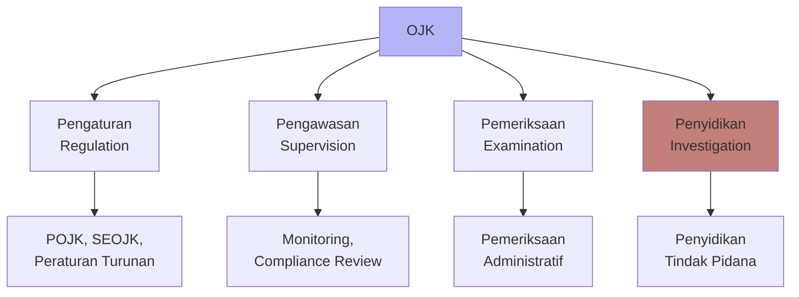

#### 11.4 Prinsip Una Via dalam Praktik

> [!IMPORTANT]
> OJK memiliki **diskresi** untuk memilih jalur penegakan hukum. Tidak boleh berjalan paralel (tidak boleh dihukum pidana sekaligus administratif untuk perbuatan yang sama).

**Alur Keputusan OJK:**

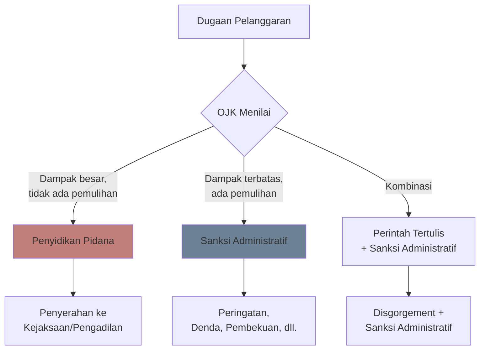

---

### 12. Profesi Penunjang Pasar Modal

#### 12.1 Konsultan Hukum

**Syarat Menjadi Konsultan Hukum Pasar Modal (Pasal 3 POJK 66/2017):**

| No | Persyaratan | Keterangan |
|----|-------------|------------|
| 1 | WNI | Wajib warga negara Indonesia |
| 2 | S1 Hukum | Gelar sarjana hukum |
| 3 | Berakhlak & bermoral baik | Tidak pernah dihukum tindak pidana jasa keuangan |
| 4 | Rekan KKH | Berkedudukan sebagai rekan Kantor Konsultan Hukum |
| 5 | Anggota HKHPM | Tergabung dalam Himpunan Konsultan Hukum Pasar Modal |
| 6 | Tidak pernah disanksi OJK | Tidak pernah mendapat sanksi administratif pembatalan STTD |
| 7 | Keahlian pasar modal | Minimal **30 SKP** (Satuan Kredit Profesi) |
| 8 | Tidak rangkap jabatan | Tidak di KKH lain atau profesi penunjang lain terdaftar OJK |

**Standar Profesi HKHPM (Keputusan HKHPM No. Kep.03/HKHPM/XI/2021):**

> [!QUOTE]
> "Konsultan Hukum wajib menjalankan profesinya secara independen dan objektif. Dalam hal terjadi benturan kepentingan, wajib memberitahukan kepada pengguna jasa dan memutuskan hubungan kerja."

**Conflict of Interest (Lampiran VI HKHPM):**
- Wajib memberitahukan kepada pengguna jasa
- Wajib memutuskan hubungan kerja
- Dapat meminta pertimbangan HKHPM jika ragu

#### 12.2 Akuntan Publik

| Aspek | Keterangan |
|-------|------------|
| **Peran** | Audit laporan keuangan emiten |
| **Persyaratan IPO** | Opini Wajar Tanpa Modifikasi (WTM) min. 3 tahun (Papan Utama) atau 1 tahun (Papan Pengembangan) |
| **Tanggung Jawab** | Bertanggung jawab atas opini audit; dapat dikenai sanksi jika audit gagal |

#### 12.3 Notaris

| Aspek | Keterangan |
|-------|------------|
| **Peran** | Pembuatan akta pendirian, perubahan AD, akta RUPS |
| **Relevansi Pasar Modal** | Akta perubahan status go public, akta penambahan modal, akta merger |
| **Tanggung Jawab** | Keabsahan akta, kepatuhan terhadap UU PT |

#### 12.4 Penilai Efek

| Aspek | Keterangan |
|-------|------------|
| **Peran** | Menentukan nilai wajar aset/efek |
| **Kewajiban** | Independen; wajib dalam transaksi afiliasi dan transaksi material |
| **Tanggung Jawab** | Bertanggung jawab atas nilai wajar yang ditetapkan |

---

### 13. Reksadana & Manajer Investasi

#### 13.1 Pembentukan Reksadana

**Definisi (Pasal 1 angka 27 UU PM):**
> Wadah yang dipergunakan untuk menghimpun dana dari masyarakat pemodal untuk selanjutnya diinvestasikan dalam Portofolio Efek oleh Manajer Investasi.

**Tiga Unsur Utama Reksadana:**
1. Kumpulan dana investasi dari masyarakat
2. Investasi tertuang dalam portofolio efek terdiversifikasi
3. Manajer investasi yang dipercaya mengelola dana

**Proses Pembentukan:**

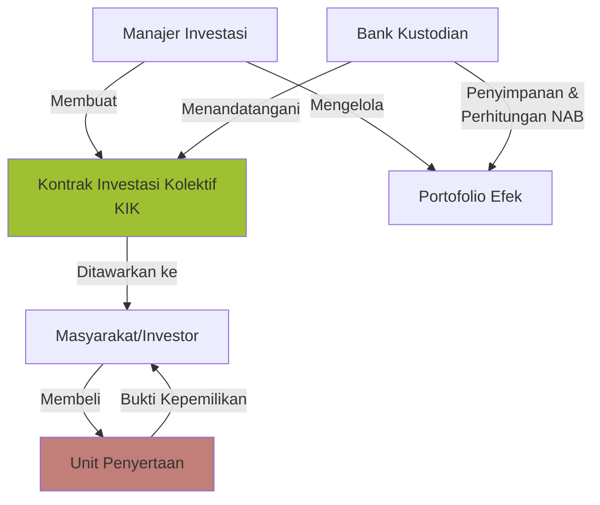

**Peran Bank Kustodian:**
- Penyelesaian transaksi
- Penyimpanan surat berharga
- Perhitungan Nilai Aktiva Bersih (NAB)
- Unit registrasi investor

#### 13.2 Peran Manajer Investasi & Bank Kustodian

| Pihak | Fungsi | Dasar Hukum |
|-------|--------|-------------|
| **Manajer Investasi** | Mengelola dana, mengambil keputusan investasi | Pasal 1 angka 11 UU PM |
| **Bank Kustodian** | Menyimpan aset, mengawasi MI, menghitung NAB | POJK Kontrak Investasi Kolektif |

#### 13.3 Fiduciary Duty Manajer Investasi

**Pasal 27 UU PM:**
> Manajer Investasi wajib bertanggung jawab atas segala kerugian yang timbul karena tindakannya, apabila dilakukan tidak dengan itikad baik, penuh tanggung jawab, dan untuk kepentingan Reksa Dana.

**Pedoman Perilaku MI (POJK 43/2015):**
- Bertindak dengan itikad baik dan penuh tanggung jawab
- Mengutamakan kepentingan nasabah
- Tidak menerima imbalan dari pihak ketiga untuk mempengaruhi keputusan
- Menghindari benturan kepentingan

#### 13.4 Bentuk Jasa & Imbalan MI

| Jenis Imbalan | Keterangan |
|---------------|------------|
| **Management Fee** | Persentase dari AUM (Assets Under Management), kisaran 0,10% - 2%+ |
| **Subscription Fee** | Biaya pembelian unit penyertaan |
| **Redemption Fee** | Biaya penjualan kembali unit penyertaan |

> [!NOTE]
> Besaran management fee bervariasi berdasarkan metode investasi dan kompleksitas pengelolaan dana.

---

### 14. Repurchase Agreement (REPO)

#### 14.1 Definisi dan Mekanisme

**Definisi (Pasal 1 angka 1 POJK 9/2015):**
> Kontrak jual atau beli efek dengan janji beli atau jual kembali pada waktu dan harga yang telah ditentukan sebelumnya.

**Mekanisme REPO:**

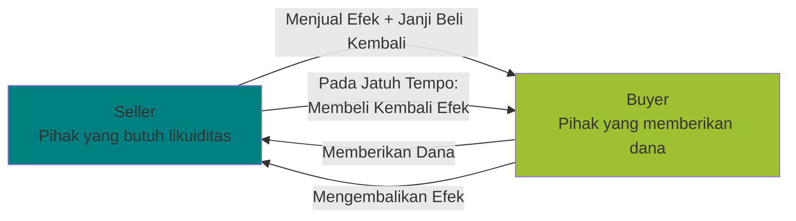

#### 14.2 GMRA Indonesia

**Global Master Repurchase Agreement (GMRA)** adalah standar perjanjian internasional yang diadopsi Indonesia. POJK 9/2015 mewajibkan penerapan GMRA Indonesia dalam setiap transaksi REPO.

**Ketentuan Wajib dalam Perjanjian REPO (Pasal 4 ayat 2):**
- Identitas para pihak
- Jenis dan jumlah efek
- Harga jual dan harga beli kembali
- Jangka waktu
- Tata cara penyelesaian
- Ketentuan event of default

#### 14.3 Risiko REPO

| Risiko | Penjelasan | Mitigasi |
|--------|-----------|----------|
| **Re-repo** | Buyer menjual kembali efek ke pihak ketiga | Klausul lock-up dalam perjanjian |
| **Lock-up** | Efek tidak dapat ditransaksikan selama perjanjian berlangsung | Pencantuman eksplisit dalam kontrak |
| **Event of Default** | Pihak tidak memenuhi kewajiban | Penyelesaian sesuai GMRA; sanksi OJK |
| **Penurunan Nilai Efek** | Harga saham turun drastis, seller tidak mau menebus | Margin call; collateral adjustment |

#### 14.4 Tri-Party Repo oleh KPEI

> [!IMPORTANT]
> **Tri-party repo** disediakan oleh KPEI sebagai solusi untuk memberikan perlindungan hukum dan standarisasi transaksi REPO.

**Keunggulan Tri-Party Repo:**
- Standarisasi hak dan kewajiban para pihak
- KPEI sebagai pihak ketiga yang mengelola collateral
- Mengurangi risiko counterparty default
- Sistematis dan efisien

**Perlindungan Hukum:**
- Pengalihan kepemilikan efek harus dijelaskan secara eksplisit
- Keterbukaan informasi untuk menghindari masalah transaksi
- Sistem pendukung transaksi REPO yang terintegrasi

---

### 15. Pasar Modal Syariah

#### 15.1 Kedudukan Fatwa Dewan Syariah Nasional-MUI

> [!QUOTE]
> "Fatwa DSN-MUI merupakan hukum positif yang berlaku dan bersifat mengikat dalam pasar modal syariah Indonesia, karena menjadi pedoman pelaksanaan kegiatan pasar modal syariah, diserap ke dalam peraturan perundang-undangan, dan menjadi landasan hukum bagi lembaga keuangan syariah." — Penjelasan POJK 15/2015

**Pola Transformasi Fatwa ke POJK:**

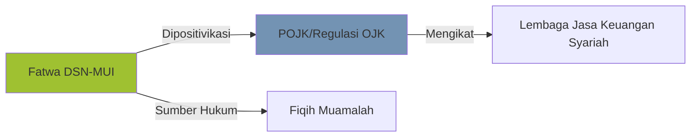

**Karakteristik Fatwa DSN-MUI:**
- Berdasarkan Al-Quran dan Hadits
- Menggunakan ilmu fiqih muamalah
- Dapat diberlakukan ke seluruh sektor jasa keuangan syariah
- Tidak semua fatwa dipositivikasi menjadi POJK, tetapi tetap menjadi rujukan

#### 15.2 Kriteria Emiten Syariah

**POJK 17/2015 jo. Fatwa DSN 40/2003:**

| Kriteria | Penjelasan |
|----------|------------|
| **Jenis Usaha** | Kegiatan usaha, produk, jasa, dan cara pengelolaan tidak bertentangan dengan prinsip syariah |
| **Anggaran Dasar** | Wajib menyatakan kegiatan usaha berdasarkan prinsip syariah (Pasal 2 POJK 17/2015) |
| **Dewan Pengawas Syariah** | Wajib memiliki DPS (Pasal 3 POJK 17/2015) |
| **Shariah Compliance Officer** | Wajib ada untuk memastikan kepatuhan syariah |

**Jenis Usaha yang Dilarang (Fatwa DSN 40/2003):**
1. Perjudian dan permainan yang tergolong judi
2. Lembaga keuangan konvensional (ribawi) — perbankan & asuransi konvensional
3. Produsen, distributor, pedagang makanan/minuman haram
4. Produsen, distributor barang/jasa yang merusak moral dan bersifat mudarat
5. Investasi pada emiten dengan tingkat hutang ke lembaga keuangan ribawi lebih dominan dari modalnya

#### 15.3 Prinsip Syariah dalam Pasar Modal

| Prinsip | Penerapan |
|---------|-----------|
| **Tanpa Riba** | Tidak ada bunga; menggunakan margin, fee, atau bagi hasil |
| **Tanpa Gharar (Ketidakjelasan)** | Transaksi jelas objek, harga, dan waktu penyerahan |
| **Tanpa Maysir (Perjudian)** | Tidak spekulatif; berbasis nilai riil |
| **Tanpa Haram** | Tidak berkaitan dengan barang/jasa terlarang |
| **Akad yang Sah** | Menggunakan akad Islami: murabahah, musyarakah, mudharabah, ijarah, dll. |

#### 15.4 Peran Shariah Compliance Officer (SCO)

| Aspek | Keterangan |
|-------|------------|
| **Tugas** | Memastikan seluruh kegiatan emiten sesuai prinsip syariah |
| **Laporan** | Melaporkan kepatuhan syariah kepada DPS dan OJK |
| **Konsekuensi** | Jika emiten tidak lagi memenuhi kriteria syariah, efeknya otomatis bukan lagi efek syariah |

---

### 16. IOSCO Principles

#### 16.1 Objectives and Principles of Securities Regulation

IOSCO (International Organization of Securities Commissions) adalah organisasi internasional para regulator pasar modal dunia. IOSCO Principles merupakan pedoman global untuk terciptanya pasar modal yang efektif, efisien, dan aman.

**Tiga Tujuan Utama IOSCO:**
1. Melindungi investor
2. Menjamin pasar yang adil, efisien, dan transparan
3. Mengurangi risiko sistemik

#### 16.2 Prinsip-Prinsip yang Diadopsi Indonesia

| Prinsip IOSCO | Adopsi di Indonesia |
|---------------|---------------------|
| **Prinsip tentang Regulator** | OJK sebagai lembaga independen (UU No. 21/2011) |
| **Prinsip Self-Regulation** | BEI, KSEI, KPEI sebagai SRO dengan kewenangan membuat peraturan |
| **Prinsip Enforcement** | Pasal 90-99 UU PM tentang kejahatan pasar modal |
| **Prinsip Pasar Sekunder** | Bab X UU PM; Peraturan BEI tentang perdagangan efek |
| **Prinsip Perantara Pasar** | Regulasi perusahaan efek, manajer investasi, kustodian |
| **Prinsip Kliring & Penyelesaian** | KPEI sebagai lembaga kliring dan penjaminan |

> [!IMPORTANT]
> Indonesia mengadopsi IOSCO Principles melalui harmonisasi ke dalam UU PM, UU OJK, dan peraturan turunan OJK. Hal ini memastikan pasar modal Indonesia sejalan dengan standar internasional.

#### 16.3 Manifestasi IOSCO Principles dalam Regulasi Indonesia

**Prinsip tentang Regulator:**
OJK memiliki kewenangan pengaturan, pengawasan, pemeriksaan, dan penyidikan (Pasal 5 UU OJK). OJK independen dan bebas dari campur tangan pihak lain.

**Prinsip Self-Regulation:**
BEI membuat Peraturan Bursa yang mengikat seluruh pelaku pasar modal. KSEI dan KPEI juga memiliki kewenangan self-regulation di bidangnya masing-masing.

**Prinsip Deteksi Kecurangan:**
Pasal 90-99 UU PM mengatur tindak pidana penipuan, manipulasi pasar, dan insider trading — sejalan dengan prinsip IOSCO untuk mendeteksi dan menentukan tindakan kecurangan.

---

### 17. Delisting, Relisting & Going Private

#### 17.1 Voluntary Delisting (Going Private)

Voluntary delisting adalah penghapusan pencatatan saham atas permohonan emiten sendiri. Dalam konteks ini, perusahaan berubah status dari terbuka menjadi tertutup — inilah yang disebut **going private**.

> [!IMPORTANT]
> **POJK 45/2024** menggantikan POJK 3/2021 sebagai regulasi terbaru tentang going private. Regulasi ini menyempurnakan perlindungan pemegang saham minoritas dalam proses voluntary delisting.

**Persyaratan Going Private:**
- Persetujuan RUPS
- Buyback seluruh saham publik atau voluntary tender offer
- Keterbukaan informasi alasan dan tujuan delisting
- Opini konsultan hukum independen
- Pembayaran biaya delisting (2x biaya pencatatan tahunan terakhir)

**Proses Going Private:**

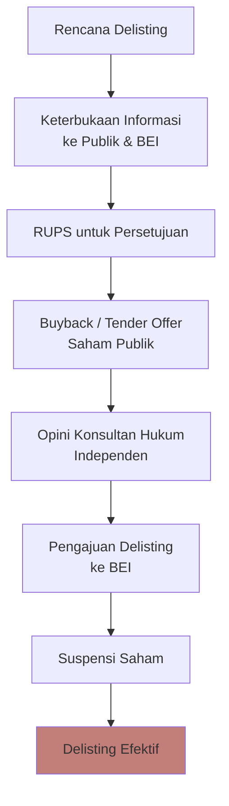

**Perlindungan Investor Minoritas:**
- Hak menjual saham melalui tender offer dengan harga wajar
- Harga tender offer harus lebih tinggi dari rata-rata harga tertinggi 90 hari terakhir
- RUPS independen untuk menyetujui transaksi (jika ada benturan kepentingan)

#### 17.2 Forced Delisting

Forced delisting adalah penghapusan pencatatan yang dilakukan secara paksa oleh BEI karena emiten tidak lagi memenuhi persyaratan.

**Pemicu Forced Delisting:**
- Tidak menyampaikan laporan keuangan selama 24 bulan
- Kelangsungan usaha dipertanyakan (financial atau hukum)
- Tidak ada indikasi pemulihan yang memadai
- Pelanggaran aturan BEI yang berulang

**Proses Forced Delisting:**
BEI memberikan peringatan ketidakpatuhan terlebih dahulu. Jika berlanjut, BEI mengeluarkan keputusan delisting dengan jadwal pelaksanaan. Saham disuspensi selama 5 hari bursa, kemudian diperdagangkan di pasar negosiasi selama 20 hari bursa sebelum delisting efektif.

> [!WARNING]
> Perusahaan yang di-delisting secara paksa **tidak otomatis** menjadi perusahaan tertutup. Statusnya tetap terbuka sampai ada perubahan anggaran dasar melalui RUPS. Investor tidak kehilangan status pemegang saham — mereka masih dapat memperdagangkan saham di pasar negosiasi.

#### 17.3 Relisting

Relisting adalah pencatatan kembali saham ke BEI setelah sebelumnya di-delisting. Proses ini memungkinkan perusahaan untuk kembali mengakses pasar modal setelah memperbaiki kondisinya.

**Syarat Relisting:**
- Memperbaiki permasalahan yang menyebabkan delisting
- Memenuhi persyaratan pencatatan sesuai papan yang dituju (Papan Utama atau Papan Pengembangan)
- Tidak perlu melalui IPO ulang jika delisting bukan karena forced delisting akibat pelanggaran berat

**Papan Pencatatan:**
- **Papan Utama:** Persyaratan lebih ketat (modal besar, profit, jumlah pemegang saham)
- **Papan Pengembangan:** Persyaratan lebih ringan untuk perusahaan dengan pertumbuhan tinggi

#### 17.4 Kasus: PT Davomas Abadi Tbk (Forced Delisting)

PT Davomas Abadi Tbk (DAVO) mengalami forced delisting yang efektif pada 21 Januari 2015. Kasus ini bermula dari kegagalan pembayaran bunga obligasi senilai USD 238 juta pada tahun 2009. Kreditur mengajukan PKPU, dan Pengadilan Niaga mengeluarkan putusan PKPU.

Meskipun telah melakukan restrukturisasi utang, Davomas kembali gagal bayar pada Maret 2012. BEI kemudian mengeluarkan pengumuman suspensi. Yang menjadi kontroversial adalah putusan PKPU mengakibatkan konversi utang menjadi saham yang mendilusi drastis saham investor lama — namun putusan ini tidak diumumkan secara memadai kepada publik.

Analisis hukum menunjukkan bahwa DAVO memenuhi kriteria forced delisting berdasarkan Keputusan Direksi PT BEJ No. Kep-308/BEJ/07-2004: terdapat kondisi yang berpengaruh negatif signifikan terhadap kelangsungan usaha secara finansial dan hukum, serta tidak ada indikasi pemulihan memadai karena sengketa berkepanjangan.

#### 17.5 Kasus: Golden Aqua Mississippi (Voluntary Delisting/Going Private)

Golden Aqua Mississippi merupakan perusahaan sehat nam tidak likuid — banyak yang ingin membeli sahamnya tetapi hampir tidak ada yang menjual. Danone (perusahaan Prancis) mengakuisisi dan melakukan buyback hingga saham publik tersisa sekitar 7%. Karena jual beli stuck, Danone meminta going private.

Prosesnya tidak mulus. Pemegang saham independen tidak hadir dalam RUPS pertama. Pada RUPS kedua, harga saham yang ditawarkan naik dari Rp 60.000 menjadi Rp 125.000, namun pemegang saham independen menuntut Rp 1 juta per lembar. Akhirnya pada RUPS ketiga disepakati harga Rp 500.000 per lembar dan going private terealisasi.

Kasus ini mengilustrasikan kompleksitas penentuan harga wajar dalam going private dan pentingnya perlindungan pemegang saham minoritas melalui mekanisme RUPS independen.

#### 17.6 Kasus: HITS (Tommy Soeharto) — Going Private 2025

PT Humpuss Intermoda Transportasi (HITS), milik Hutomo Mandala Putra (Tommy Soeharto), mengumumkan rencana going private pada April 2025. Tommy Soeharto memegang 10,4% saham secara langsung dan 45,54% melalui PT Humpuss.

Rencana ini menggunakan mekanisme voluntary tender offer oleh PT Joyo Agung Permata (JAP) dengan harga berdasarkan formula Pasal 36 POJK 45/2024 — harus melebihi rata-rata harga tertinggi harian selama 90 hari perdagangan terakhir. HITS juga mengalami suspensi perdagangan setelah BEI mengeluarkan UMA (Unusual Market Activity) akibat penurunan harga saham yang tajam.

Menariknya, alasan going private yang disampaikan adalah cash flow perusahaan tidak lagi memungkinkan untuk distribusi dividen, serta keinginan untuk fleksibilitas operasional tanpa tekanan pasar publik. Ini menjadi contoh going private yang didorong oleh faktor fundamental perusahaan.

---

### 18. RUPS Perusahaan Terbuka

#### 18.1 Jenis-Jenis RUPS

| Jenis | Kewenangan | Frekuensi |
|-------|-----------|-----------|
| **RUPS Biasa** | Menyetujui laporan tahunan, laporan keuangan, penggunaan laba, pengangkatan direksi/komisaris | Tahunan |
| **RUPS Luar Biasa** | Mengubah AD, merger, akuisisi, pembubaran | Sesuai kebutuhan |
| **RUPS Independen** | Menyetujui transaksi afiliasi, benturan kepentingan, transaksi material | Sesuai kebutuhan |

#### 18.2 Kuorum dan Syarat Pengambilan Keputusan

**RUPS Biasa:**
- Kuorum pertama: lebih dari ½ bagian dari seluruh saham dengan hak suara
- Jika kuorum tidak tercapai: RUPS kedua dengan kuorum yang sama
- Keputusan: disetujui lebih dari ½ bagian dari seluruh saham dengan hak suara yang hadir

**RUPS Independen:**
- Dihadiri oleh pemegang saham independen (tidak memiliki afiliasi dengan direksi, komisaris, pengendali)
- Kuorum: lebih dari ½ bagian dari seluruh saham independen dengan hak suara
- Keputusan: disetujui lebih dari ½ bagian dari saham independen yang hadir

> [!IMPORTANT]
> Mengapa menggunakan istilah **RUPS Independen** dan bukan RUPS Minoritas? Karena RUPS Independen tidak memiliki hubungan afiliasi dengan organ perusahaan, sedangkan pemegang saham minoritas bisa jadi masih memiliki hubungan afiliasi.

#### 18.3 RUPS Online/Hybrid (POJK 15/2020)

POJK 15/2020 mengatur kemungkinan penyelenggaraan RUPS secara elektronik (online) atau hybrid (kombinasi fisik dan online). Hal ini menjadi relevan dalam konteks digitalisasi dan kondisi pasca-pandemi.

Persyaratan RUPS online:
- Anggaran dasar memperbolehkan penyelenggaraan secara elektronik
- Sistem yang digunakan memastikan keamanan, kerahasiaan, dan integritas data
- Verifikasi identitas peserta RUPS
- Dokumentasi dan rekaman penyelenggaraan

#### 18.4 Hak Pemegang Saham

**Pasal 52 UU PT:**
- Hak menghadiri dan mengeluarkan suara dalam RUPS
- Hak menerima pembayaran dividen dan sisa kekayaan hasil likuidasi
- Hak menjalankan hak lainnya berdasarkan UU PT

**Pasal 84 UU PT:**
Setiap lembar saham biasa memiliki satu hak suara, kecuali anggaran dasar menentukan lain.

---

### 19. Pemulihan Korban & Perlindungan Investor

#### 19.1 Disgorgement & Disgorgement Fund

POJK 65/2020 mengatur mekanisme pengembalian keuntungan tidak sah sebagai bentuk pemulihan kerugian investor.

**Mekanisme Disgorgement:**
OJK mengeluarkan perintah tertulis kepada pelaku untuk mengembalikan keuntungan tidak sah. Jika pelaku tidak mematuhi, OJK dapat:
- Memblokir rekening atau membekukan aset
- Memindahbukukan dana/efek ke rekening yang ditetapkan OJK
- Mengalihkan aset kepada pihak yang ditetapkan
- Mencairkan aset dalam rekening efek untuk pemenuhan kewajiban

Dana yang dikumpulkan dimasukkan ke **Disgorgement Fund** — rekening escrow yang didistribusikan secara proporsional kepada investor korban yang terverifikasi.

#### 19.2 Indonesia SIPF (Securities Investor Protection Fund)

Indonesia SIPF menjamin pengembalian aset nasabah ritel jika terjadi kegagalan operasional ekstrem, seperti penggelapan atau kebangkrutan pialang. Ini merupakan jaring pengaman tambahan bagi investor ritel.

#### 19.3 Gugatan Perdata

**Pasal 111 UU PM:**
Investor yang menderita kerugian dapat menuntut ganti rugi kepada pihak yang bertanggung jawab, baik sendiri-sendiri maupun bersama-sama dengan investor lain yang memiliki tuntutan serupa.

**Pasal 5C UU PM (diubah UU P2SK):**
Direksi, komisaris, pemegang saham, dan pihak terafiliasi bertanggung jawab secara pribadi atas kerugian akibat:
- Pemanfaatan pihak untuk kepentingan pribadi
- Penggunaan kekayaan pihak sehingga tidak cukup membayar kewajiban
- Kelalaian dalam menjalankan tugas

**Pasal 80-81 UU PM:**
Pihak-pihak terkait dalam pernyataan pendaftaran yang memuat informasi tidak benar bertanggung jawab atas kerugian investor dalam jangka waktu 5 tahun sejak efektif.

#### 19.4 Badan Arbitrase Pasar Modal Indonesia (BAPMI)

BAPMI menyediakan alternatif penyelesaian sengketa di luar pengadilan umum. Keunggulan arbitrase:
- Lebih cepat dan efisien
- Panel arbitter yang memahami pasar modal
- Putusan arbitrase final dan mengikat

---

### 20. Studi Kasus & Analisis

#### 20.1 Kasus PT AMJA Tbk: Transaksi Afiliasi, Right Issue, dan Debt-to-Equity Swap

**Latar Belakang.** Tuan Johanes Diantoro (JD) menjabat sebagai Direktur Utama PT Andalan Muda Jelajah Angkasa (AMJA) Tbk sekaligus Vice President Director di British Airways Ltd. PT AMJA berencana membeli delapan pesawat Boeing 737 dari British Airways dengan dana dari right issue. Kondisi keuangan AMJA sangat tertekan — 85,65% aset telah dijaminkan kepada kreditur.

**Analisis Transaksi Afiliasi.** Kedudukan JD di kedua perusahaan memenuhi definisi afiliasi menurut Pasal 1 angka 1 huruf c POJK 42/2020: terdapat satu atau lebih anggota direksi yang sama antara dua perusahaan. Oleh karena itu, pembelian pesawat ini merupakan transaksi afiliasi yang wajib memenuhi empat persyaratan: menggunakan penilai independen, mengumumkan keterbukaan informasi ke publik, menyampaikan dokumen ke OJK, dan mendapat persetujuan RUPS independen.

Dari dokumen yang diserahkan, baru satu persyaratan yang terpenuhi — pernyataan penilai independen. Tiga persyaratan lainnya belum dilaksanakan. Ini berarti transaksi belum dapat dilakukan secara sah.

**Analisis Benturan Kepentingan.** Untuk menentukan ada tidaknya benturan kepentingan, perlu dibuktikan adanya perbedaan kepentingan ekonomis AMJA dengan kepentingan pribadi JD yang dapat merugikan AMJA. Fakta bahwa AMJA dalam kondisi keuangan sulit namun tetap dipaksakan membeli pesawat dalam jumlah besar mengindikasikan potensi benturan kepentingan. JD sebagai VP Director British Airways dapat diperkirakan memiliki kepentingan agar transaksi pesawat ini terealisasi demi keuntungan British Airways, meskipun belum tentu optimal bagi AMJA.

**Strategi Penambahan Modal.** Right issue merupakan pilihan yang logis karena tidak memerlukan jasa penjamin emisi sehingga menghemat biaya. Namun mekanisme right issue dengan HMETD mengharuskan penawaran terlebih dahulu ke pemegang saham lama. Jika mereka tidak subscribe, baru dapat ditawarkan ke pihak ketiga. Alternatif lain adalah debt-to-equity swap — mengkonversi utang kreditur menjadi saham. Ini diperbolehkan Pasal 43 ayat 3 huruf c UU PT dengan syarat persetujuan RUPS dan kreditur. Untuk AMJA yang liabilitasnya sangat tinggi, debt-to-equity swap justru lebih tepat karena langsung memperbaiki struktur permodalan tanpa menambah beban hutang baru.

**Status Pemegang Saham Lama.** Dalam right issue, pemegang saham lama memiliki hak suara, hak dividen, dan hak atas sisa kekayaan yang tetap terjaga sesuai klasifikasi sahamnya. Namun jika mereka tidak menggunakan HMETD, persentase kepemilikan mereka akan terdilusi oleh masuknya pemegang saham baru.

**Perlindungan Pemegang Saham Independen.** Jika transaksi ini merupakan transaksi material (nilai ≥20% ekuitas atau ≥Rp 5 miliar), wajib mendapat persetujuan RUPS independen. Jika tidak disetujui, transaksi tidak dapat dilanjutkan. RUPS dapat diajukan kembali paling cepat 12 bulan setelahnya. Pelanggaran terhadap persyaratan ini dapat dikenai sanksi administratif berupa peringatan tertulis hingga pencabutan izin usaha.

#### 20.2 Kasus PT Maju: Manipulasi Pasar dan Insider Trading

**Latar Belakang.** PT Makmur Jaya Utama Tbk (MAJU) melakukan right issue besar-besaran sebesar Rp 4,7 triliun untuk mengakuisisi perusahaan tambang batu bara. Harga saham MAJU melonjak dari Rp 130-140 menjadi Rp 280-300 dalam dua minggu, lalu turun drastis ke Rp 83. Mr. Sampoerno, Komisaris MAJU sekaligus Direktur PT Indosurya Coal, meminjam dana dari Natura Coal Ltd. dan memerintahkan lima perusahaan untuk membeli dan menjual saham MAJU melalui PT Brights Securities guna meningkatkan perdagangan saham.

**Analisis Transaksi Afiliasi.** Mr. Sampoerno menjabat Komisaris di MAJU sekaligus Direktur di PT Indosurya Coal dan PT Indosurya Mining Coal. Akuisisi MAJU terhadap Omega Venture Ltd. (pemegang saham utama kedua perusahaan tambang) merupakan transaksi afiliasi yang wajib memenuhi persyaratan POJK 42/2020. Jika tidak dilaporkan dan tidak mendapat persetujuan RUPS independen, maka terjadi pelanggaran administratif.

**Analisis Manipulasi Pasar.** Lima perusahaan yang diperintahkan Mr. Sampoerno untuk saling membeli dan menjual saham MAJU melalui PT Brights Securities merupakan praktik **painting the tape** — menciptakan perdagangan semu untuk memberikan kesan aktivitas pasar yang tinggi. Ini melanggar Pasal 92 UU PM yang melarang dua atau lebih transaksi efek yang menyebabkan harga efek naik, turun, atau tetap secara semu dengan tujuan mempengaruhi pihak lain.

**Analisis Insider Trading.** Mr. Sampoerno memiliki fiduciary duty sebagai Komisaris MAJU. Ia memanfaatkan informasi internal tentang rencana akuisisi dan pinjaman untuk menggerakkan lima perusahaan memanipulasi harga saham. Lima perusahaan tersebut menerima informasi dari Mr. Sampoerno dan bertindak berdasarkan informasi tersebut — memenuhi definisi **tippee** menurut Pasal 97 UU PM. Meskipun mereka bukan orang dalam secara langsung, mereka menerima informasi orang dalam dan menggunakannya untuk transaksi.

**Tindak Lanjut OJK.** Sebagai regulator, OJK berwenang menjatuhkan sanksi administratif jika MAJU tidak memenuhi kewajiban keterbukaan informasi. Untuk manipulasi pasar dan insider trading, OJK dapat memulai penyidikan pidana atau menerapkan prinsip Una Via. Mengingat dampak yang luas dan kerugian investor yang signifikan, jalur pidana lebih tepat dengan ancaman penjara maksimal 10 tahun dan denda Rp 15 miliar.

#### 20.3 Kasus PT Davomas Abadi Tbk: Forced Delisting

Analisis lengkap telah disampaikan pada bagian 17.4. Poin krusial dari kasus ini adalah bahwa forced delisting tidak serta-merta mengubah status perusahaan menjadi tertutup. Investor tidak kehilangan status pemegang saham — mereka masih dapat bertransaksi di pasar negosiasi meskipun tidak lagi di bursa reguler. Perlindungan hukum bagi investor dalam forced delisting lebih terbatas dibanding voluntary delisting karena tidak ada mekanisme buyback wajib dari perusahaan.

#### 20.4 Kasus HITS: Going Private dan Voluntary Tender Offer

Analisis lengkap telah disampaikan pada bagian 17.6. Kasus ini menunjukkan penerapan POJK 45/2024 dalam praktik. Formula harga tender offer berdasarkan rata-rata 90 hari terakhir memberikan objektivitas dalam penentuan harga wajar. Namun dalam kondisi di mana saham sudah mengalami penurunan tajam sebelum pengumuman (seperti kasus HITS yang mendapat UMA), formula ini mungkin tidak sepenuhnya mencerminkan nilai intrinsik perusahaan. Ini menjadi tantangan dalam melindungi pemegang saham minoritas yang membeli saham pada harga lebih tinggi sebelum penurunan.

#### 20.5 Kasus Bre-X Minerals: Penipuan

Bre-X Minerals Ltd. adalah perusahaan pertambangan Kanada yang melaporkan cadangan emas 71 juta ounce senilai USD 20 miliar di Busang, Kalimantan. Laporan ini dibuat oleh Manajer Eksplorasi Michael de Guzman. Saham Bre-X melonjak dari USD 10 menjadi USD 28,65 di Bursa Toronto.

Beberapa hari kemudian diketahui laporan tersebut tidak benar — contoh bijih emas telah dicontek (salting). Saham Bre-X langsung jatuh hingga hampir nol. Michael de Guzman diduga melompat dari helikopter dan ditemukan tewas.

Kasus ini menjadi contoh klasik **penipuan (fraud)** menurut Pasal 90 UU PM: membuat pernyataan tidak benar mengenai fakta material untuk mempengaruhi keputusan investor. Perbedaannya dengan manipulasi pasar adalah bahwa Bre-X tidak melakukan rekayasa transaksi di bursa, melainkan rekayasa informasi fundamental perusahaan. Informasi palsu tentang cadangan emas merupakan fakta material yang menyesatkan investor dalam mengambil keputusan.

#### 20.6 Kasus Jababeka: Hostile Takeover

PT Jababeka Tbk (KIJA) mengalami indikasi hostile takeover pada RUPST 2019. Dua pemegang saham — PT Imakotama Investindo (6,387%) dan Islamic Development Bank (10,841%) — mengusulkan agenda tambahan untuk pergantian Dirut dan Komisaris. Usulan disetujui dengan suara 52,117%.

Hostile takeover berbeda dengan akuisisi biasa karena dilakukan tanpa persetujuan manajemen atau pengendali existing. Dalam konteks pasar modal Indonesia, hostile takeover dilakukan melalui pembelian saham di pasar terbuka dan penggunaan hak suara di RUPS untuk mengganti pengurus.

Mekanisme perlindungan dalam UU PT adalah adanya **persetujuan RUPS** untuk perubahan direksi dan komisaris. Namun jika pengambilalih berhasil mengumpulkan suara mayoritas, maka perubahan dapat dilakukan meskipun pengendali lama menolak. Ini menjadi risiko inheren dalam struktur perusahaan terbuka dengan kepemilikan saham yang tersebar.

#### 20.7 Kasus Danone: Voluntary Delisting

Danone merupakan contoh voluntary delisting yang terjadi karena perusahaan induk global (Grup Danone) memutuskan untuk menarik seluruh investasinya di pasar modal Indonesia. Proses ini melibatkan buyback seluruh saham publik dengan harga yang dinegosiasikan.

Kasus Danone menjadi perdebatan karena pada saat itu regulasi going private masih sangat minimal — sebelum POJK 3/2021. Celah hukum ini memungkinkan perusahaan dengan performa baik untuk keluar dari pasar modal, yang bertentangan dengan filosofi pasar modal untuk mendorong sebanyak mungkin perusahaan sehat go public. Pengalaman ini menjadi salah satu pemicu penyusunan regulasi going private yang lebih komprehensif.

#### 20.8 Kasus BBCA: Painting the Tape

Tuan JD berkesimpulan harga saham BBCA (Rp 25.500) undervalue. Ia memerintahkan Suranto Sujono membuka rekening di PT Dwiwindu Kencana Sekuritas dengan dana Rp 10 miliar atas nama SS. Dari 11 Mei hingga 18 Mei 2020, JD dan SS melakukan perdagangan saham BBCA berulang kali untuk menaikkan harga menjadi Rp 30.000.

Praktik ini jelas merupakan **painting the tape** — perdagangan antar rekening dalam penguasaan satu pihak untuk menciptakan kesan aktivitas pasar yang tinggi. Meskipun dalam kasus ini tidak disebutkan apakah harga benar-benar naik karena pengaruh pasar, niat untuk mempengaruhi pihak lain sudah terbukti dari pernyataan JD bahwa ia ingin "membuat harga saham BBCA naik."

Sanksi yang dapat dijatuhkan berdasarkan Pasal 92 UU PM adalah pidana penjara maksimal 10 tahun dan denda maksimal Rp 15 miliar. Selain itu, investor yang dirugikan dapat mengajukan gugatan ganti rugi perdata berdasarkan Pasal 111 UU PM.

---

## Referensi

### Regulasi Primer (Undang-Undang)

1. Undang-Undang Nomor 8 Tahun 1995 tentang Pasar Modal (UU PM) sebagaimana telah diubah dengan Undang-Undang Nomor 4 Tahun 2023 tentang Pengembangan dan Penguatan Sektor Keuangan (UU P2SK)

2. Undang-Undang Nomor 21 Tahun 2011 tentang Otoritas Jasa Keuangan (UU OJK)

3. Undang-Undang Nomor 40 Tahun 2007 tentang Perseroan Terbatas (UU PT) sebagaimana telah diubah dengan Undang-Undang Nomor 11 Tahun 2020 tentang Cipta Kerja (UU CK)

4. Undang-Undang Nomor 19 Tahun 2023 tentang Kitab Undang-Undang Hukum Perdata

5. Undang-Undang Nomor 1 Tahun 2023 tentang Kitab Undang-Undang Hukum Pidana (KUHP Baru)

### Peraturan Pemerintah

6. Peraturan Pemerintah Nomor 33 Tahun 2005 tentang Tata Cara Privatisasi Perusahaan Perseroan (Persero)

7. Peraturan Pemerintah Nomor 59 Tahun 2009 tentang Perubahan atas PP No. 33/2005

### Peraturan Otoritas Jasa Keuangan (POJK)

8. POJK No. 3/POJK.04/2021 tentang Penyelenggaraan Kegiatan di Bidang Pasar Modal

9. POJK No. 45/POJK.04/2024 tentang Penghapusan Pencatatan Efek Bersifat Ekuitas yang Dilakukan oleh Perusahaan Terbuka (Going Private)

10. POJK No. 42/POJK.04/2020 tentang Transaksi Afiliasi dan Transaksi Benturan Kepentingan

11. POJK No. 32/POJK.04/2015 jo. POJK No. 14/POJK.04/2019 tentang Penambahan Modal Perusahaan Terbuka dengan Memberikan Hak Memesan Efek Terlebih Dahulu

12. POJK No. 9/POJK.04/2018 tentang Pengambilalihan Perusahaan Terbuka

13. POJK No. 54/POJK.04/2015 tentang Penawaran Tender Sukarela

14. POJK No. 17/POJK.04/2020 tentang Transaksi Material dan Perubahan Kegiatan Usaha Utama

15. POJK No. 15/POJK.04/2022 tentang Pemecahan Saham dan Penggabungan Saham oleh Perusahaan Terbuka

16. POJK No. 2/POJK.04/2013 jo. POJK No. 29/POJK.04/2023 tentang Pembelian Kembali Saham yang Dikeluarkan oleh Emiten atau Perusahaan Publik

17. POJK No. 21/POJK.04/2015 tentang Penerapan Pedoman Tata Kelola Perusahaan Terbuka

18. POJK No. 66/POJK.04/2017 tentang Konsultan Hukum yang Melakukan Kegiatan di Pasar Modal

19. POJK No. 9/POJK.04/2015 tentang Pedoman Transaksi Repurchase Agreement

20. POJK No. 17/POJK.04/2015 tentang Penerbitan dan Persyaratan Efek Syariah Berupa Saham

21. POJK No. 15/POJK.04/2015 tentang Penerapan Prinsip Syariah di Pasar Modal

22. POJK No. 65/POJK.04/2020 tentang Pengembalian Keuntungan Tidak Sah dan Dana Kompensasi Kerugian Investor

23. POJK No. 7/POJK.04/2017 jo. POJK No. 9/POJK.04/2017 tentang Dokumen dan Bentuk Prospektus dalam Rangka Penawaran Umum

24. POJK No. 41/POJK.04/2020 tentang Penawaran Umum Berbasis Teknologi Informasi (E-IPO)

25. POJK No. 15/POJK.04/2020 tentang Rapat Umum Pemegang Saham Perusahaan Terbuka yang Diselenggarakan secara Elektronik

26. POJK No. 16/POJK.04/2023 tentang Penyidikan Tindak Pidana di Sektor Jasa Keuangan

27. POJK No. 57/POJK.04/2020 tentang Securities Crowdfunding

28. POJK No. 60/POJK.04/2017 jo. POJK No. 51/POJK.04/2017 tentang Sustainable Finance

29. POJK No. 14/POJK.04/2019 tentang Program Kepemilikan Saham oleh Karyawan dan/atau Manajemen (ESOP/MSOP)

### Surat Edaran OJK (SEOJK)

30. SEOJK No. 32/SEOJK.04/2015 tentang Pedoman Tata Kelola Perusahaan Terbuka

### Peraturan Bursa Efek Indonesia

31. Keputusan Direksi PT Bursa Efek Jakarta Nomor Kep-308/BEJ/07-2004 tentang Penghapusan Pencatatan (Delisting) dan Pencatatan Kembali (Relisting) Saham di Bursa

32. Peraturan Bursa Efek Indonesia No. I-A tentang Pencatatan Saham dan Efek Bersifat Ekuitas

### Peraturan Menteri

33. Peraturan Menteri BUMN No. PER-01/MBU/2010 tentang Cara Privatisasi, Penyusunan Program Tahunan Privatisasi, dan Penunjukan Lembaga dan/atau Profesi Penunjang

34. Peraturan Menteri BUMN No. PER-2/MBU/03/2023 tentang Pedoman Holding BUMN

### Fatwa dan Standar Profesi

35. Fatwa Dewan Syariah Nasional-MUI No. 40/DSN-MUI/X/2003 tentang Pasar Modal dan Pedoman Umum Penerapan Prinsip Syariah di Bidang Pasar Modal

36. Keputusan HKHPM No. Kep.03/HKHPM/XI/2021 tentang Standar Profesi Konsultan Hukum Pasar Modal

### Jurnal dan Pustaka Ilmiah

37. Isma Yani dan Zetrla Erma, "Bentuk Kejahatan Dan Pelanggaran Yang Terjadi Di Bidang Pasar Modal Dalam Investasi", *Marwah Hukum* Vol. 2, No. 2 (2024), hlm. 10-23

38. Juli Asril, "Insider Trading Di Pasar Modal Sebagai Kejahatan Bisnis", *Jurnal Manajemen, Ekonomi dan Akuntansi* Vol. 3, No. 2 (2019), hlm. 225-231

39. Richard A. Posner, *An Analysis of Law*, New York: Aspen Law & Business, 1998

### Materi Kuliah dan Dokumen Internal

40. Catatan Kuliah Hukum Pasar Modal — Dr. Arman Nefi, S.H., M.M. (Fakultas Hukum Universitas Indonesia, 2019-2023)

41. Soal UAS Hukum Pasar Modal S1-REG (2022) dan KKI (2025)

42. PPT Penawaran Umum (IPO) — Wenny Setiawati

43. PPT Aksi Korporasi — Wenny Setiawati

44. PPT Kejahatan & Pelanggaran Pasar Modal — Kelompok 16 (2024)

45. Exercise Hukum Pasar Modal Reguler 2018, 2019, 2020

46. Exercise Hukum Pasar Modal PAR 2019